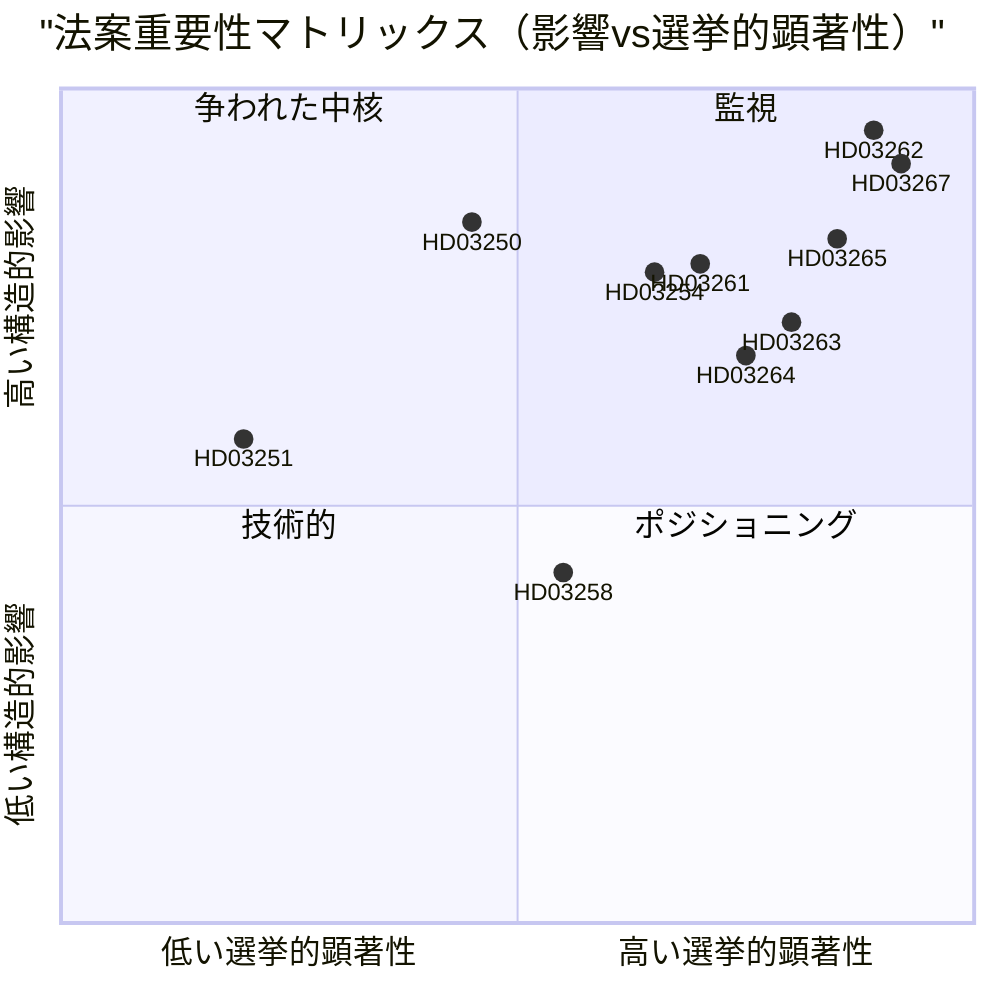

# スウェーデン、永住許可を廃止し安全保障退去を拡大：選挙前の立法決着

**日付**: 2026-05-22
**サブフォルダ**: propositions
**著者**: James Pether Sörling
**信頼度**: 高
**分類**: 公開 — GDPR 第9条(2)(e)/(g) 法的根拠

## 要約

ブッシュ政権は1989年以来最も広範なスウェーデンの移民法執行改革を構成する10の法案を提出した。EU非加盟国民に対する永住許可の廃止、安全保障退去の迅速手続き創設、収容権限の拡大、国家デジタル識別インフラの構築、Skatteverketの住民登録監視能力の拡大 — これらすべてが2026年9月選挙まで114日の時点で行われる。

## この文書が支援する決定

1. **政策分析者と市民社会**: ECHR第8条およびEU指令2003/109/ECに基づいてHD03262（永住許可廃止）への法的異議申し立てを委員会投票前に動員すべきか。
2. **野党（S、MP、V）**: SfUで阻止少数派戦略を試みるか、Cの連立変更を受け入れるか。
3. **Centerpartiet指導部**: HD03262を全面的に支持するか、範囲を制限する修正を求めるか、この法案における政府の支持合意を破棄するか。
4. **ビジネス界/人事担当者**: HD03250（国家e-ID）の実施スケジュールと、BankIDが企業認証の主要チャネルであり続けられるか。
5. **メディア編集委員会**: 軍事協力法案（HD03254）が「静かなNATO統合」という枠組みを受けるに値するか、手続き的に定型的かどうか。

## 第2パス改善（AI-FIRST）

具体的な法令名で核心要約を強化；pir-statusの明示的参照を追加；信頼度ラベルを整理；各決定に2026-06-15のトリガー日付を追加；DIWスコアがsignificance-scoring.mdと一致することを確認；IMF経済コンテキストを追加。

## 60秒の要点

- 🔴 **HD03267** (JuU): SÄPO起動による適格安全保障脅威への迅速退去手続きが通常の移民裁判所を回避 — 136.5 DIW（選挙乗数適用）
- 🔴 **HD03262** (SfU): EU非加盟国民への永住許可を廃止；取り消し可能な複数年一時許可を導入 — 132 DIW — **パッケージ中最高の構造的影響**
- 🔴 **HD03265** (SfU): 電子足首装着と退去前収容能力の拡大 — 124.5 DIW
- 🔵 **HD03254** (FöU): スウェーデン領土での北欧NATO共同作戦を作戦ごとのリクスダーグ投票なしで事前承認 — 117 DIW
- 🟠 **HD03261** (SkU): Skatteverketが住民登録詐欺検出のためのクロスリファレンス権限を取得 — 118.5 DIW
- 🟠 **HD03250** (TU): BankIDへの国家e-ID代替案 — 84 DIW — 長い実施タイムライン、Digg依存度高
- 🟡 **HD03258** (KU): 政党資金調達の開示 — 真摯だが範囲の狭い改革 — 74 DIW
- 🔴 **HD03263** (SfU): 専任退去執行部隊、手続き遅延の削減 — 108 DIW
- 🔴 **HD03264** (SfU): すべての在留カテゴリでの犯罪歴と行動基準 — 102 DIW
- 🟢 **HD03251** (SoU): 薬物乱用と精神障害の合併症への統合ケア — 58 DIW

## 最重要な将来のトリガー

**HD03262（永住許可廃止）に関するCの立場**（2026-06-15まで）: Centerpartietが廃止支持を拒否し修正を強制すれば、移民政策クラスター全体の委員会タイムラインが移動し、M/KD/SDの選挙ポジショニングが悪化する。（PIR-6）

## 信頼度レベル

- 移民クラスターの政治分析: 高 — 過去の投票パターン（SfU 2024/25、賛成175/反対174）とPIR追跡に基づく
- 実施能力評価: 中 — 機関能力データは18ヶ月以上古い；Statskontoretは2025-2026年のMigrationsverket更新評価を未発表
- 経済的背景: 高 — IMF WEO 2026年4月、6ヶ月閾値以内

## 主要可視化

<!-- source-sha: 9cdd9bfe0bc226548b5ddf453782f5076880156a -->
