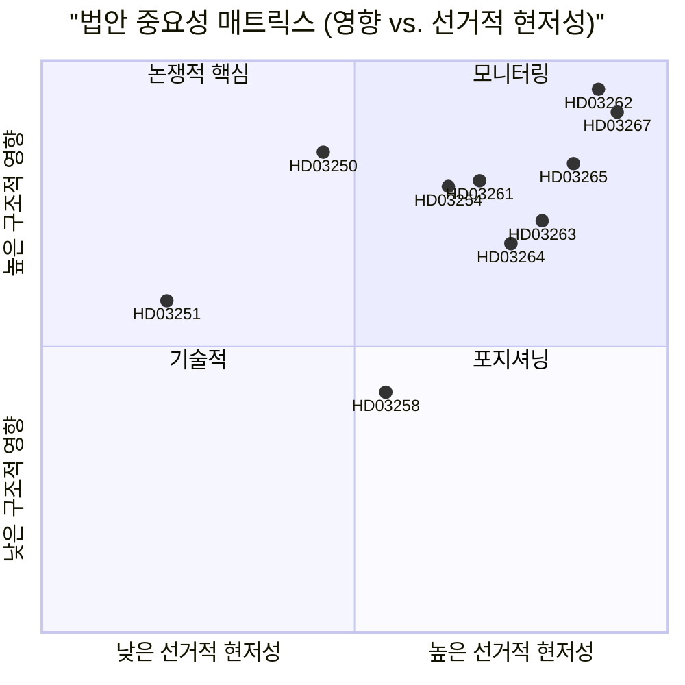

# 스웨덴, 영주권 폐지 및 안보 추방 확대: 선거 전 입법적 결산

**날짜**: 2026-05-22
**하위 폴더**: propositions
**저자**: James Pether Sörling
**신뢰도**: 높음
**분류**: 공개 — GDPR 제9조(2)(e)/(g) 법적 근거

## 핵심 요약

Busch 정부는 1989년 이후 스웨덴 최대 규모의 이민 집행 개혁을 구성하는 10개 법안을 제출하였다: EU 비회원국 국민에 대한 영주권 폐지, 안보 추방 신속 절차 도입, 구금 권한 확대, 국가 디지털 신원 인프라 구축 및 Skatteverket의 인구등록 감시 역량 확장 — 이 모든 것이 2026년 9월 선거까지 114일을 앞두고 이루어진다.

## 이 문서가 지원하는 결정

1. **정책 분석가 및 시민사회**: ECHR 제8조와 EU 지침 2003/109/EC에 근거하여 HD03262(영주권 폐지)에 대한 법적 이의 제기를 위원회 투표 전에 동원해야 하는지.
2. **야당(S, MP, V)**: SfU에서 방해 소수 전략을 시도할지, C의 연립 변화를 수용할지.
3. **Centerpartiet 지도부**: HD03262를 전면 지지할지, 범위를 제한하는 수정안을 추구할지, 이 법안에 관한 정부와의 지지 합의를 파기할지.
4. **기업 및 HR 관리자**: HD03250(국가 전자 신원) 구현 일정과 BankID가 기업 인증의 주요 채널로 남을 수 있는지.
5. **언론 편집위원회**: 군사 협력 법안(HD03254)이 "조용한 NATO 통합"이라는 틀을 받을 가치가 있는지, 절차적으로 일상적인지.

## 2차 개선 (AI-FIRST)

구체적인 법령명으로 핵심 요약 강화; 명시적 pir-status 참조 추가; 신뢰도 레이블 정리; 각 결정에 2026-06-15 트리거 날짜 추가; DIW 점수가 significance-scoring.md와 일치하는지 확인; IMF 경제 맥락 추가.

## 60초 요약

- 🔴 **HD03267** (JuU): SÄPO가 발동하는 적격 안보 위협 신속 추방이 일반 이민 법원을 우회 — 136.5 DIW (선거 승수 적용)
- 🔴 **HD03262** (SfU): EU 비회원국 국민 영주권 폐지; 취소 가능한 다년간 임시 허가 도입 — 132 DIW — **패키지에서 가장 높은 구조적 영향**
- 🔴 **HD03265** (SfU): 전자 발목 밴드와 추방 전 구금 역량 확대 — 124.5 DIW
- 🔵 **HD03254** (FöU): 스웨덴 영토에서의 북유럽-NATO 공동 작전 작전별 의회 투표 없이 사전 승인 — 117 DIW
- 🟠 **HD03261** (SkU): Skatteverket이 인구등록 사기 탐지를 위한 교차 참조 권한 획득 — 118.5 DIW
- 🟠 **HD03250** (TU): BankID에 대한 국가 전자 신원 대안 — 84 DIW — 긴 구현 일정, 높은 Digg 의존도
- 🟡 **HD03258** (KU): 정당 정치 자금 공개 — 진지하지만 범위 좁은 개혁 — 74 DIW
- 🔴 **HD03263** (SfU): 전담 추방 집행 부대, 절차 지연 감소 — 108 DIW
- 🔴 **HD03264** (SfU): 모든 거주 범주에 대한 범죄 이력 및 행동 기준 — 102 DIW
- 🟢 **HD03251** (SoU): 약물 남용 및 정신 장애 병발에 대한 통합 치료 — 58 DIW

## 가장 중요한 미래 촉발 요인

**HD03262(영주권 폐지)에 관한 C의 입장**(2026-06-15까지): Centerpartiet이 폐지 지지를 거부하고 수정안을 강제하면, 이민 정책 전체 클러스터의 위원회 일정이 이동하고 M/KD/SD의 선거 포지셔닝이 악화된다. (PIR-6)

## 신뢰도 수준

- 이민 클러스터 정치 분석: 높음 — 이전 투표 패턴(SfU 2024/25, 찬성 175/반대 174) 및 PIR 추적에 기반
- 구현 역량 평가: 중간 — 기관 역량 데이터가 18개월 이상 오래되었음; Statskontoret이 2025-2026년 Migrationsverket 업데이트 평가를 미게시
- 경제적 맥락: 높음 — IMF WEO 2026년 4월, 6개월 임계값 이내

## 핵심 시각화

<!-- source-sha: 9cdd9bfe0bc226548b5ddf453782f5076880156a -->
