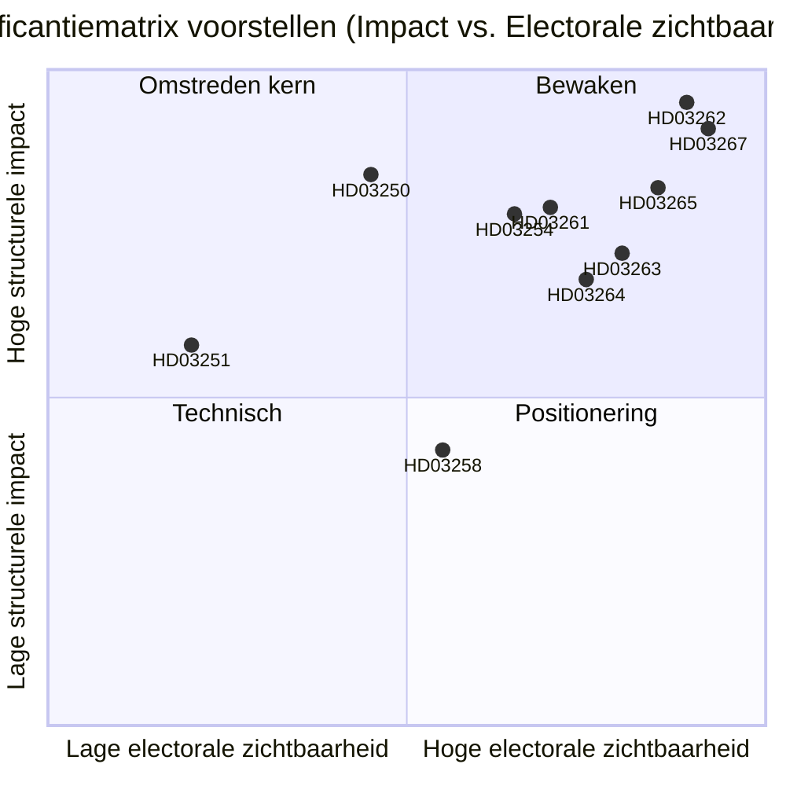

# Zweden schrapt permanent verblijf en breidt veiligheidsdeportaties uit: Een pre-electorale wetgevingsafrekening

**Datum**: 2026-05-22
**Submap**: propositions
**Auteur**: James Pether Sörling
**Vertrouwen**: HOOG
**Classificatie**: OPENBAAR — AVG Art. 9(2)(e)/(g) rechtsgrondslag

## Samenvatting

De Busch-regering heeft tien wetsvoorstellen ingediend die Zweden's meest vergaande migratiehandhavingshervorming vormen sinds 1989: afschaffing van permanente verblijfsvergunningen voor niet-EU-onderdanen, invoering van een sneltraject voor veiligheidsdeportaties, uitbreiding van detentiebevoegdheden en tegelijkertijd opbouw van een staatse digitale identiteitsinfrastructuur en uitbreiding van de bevolkingsregisterbewakingscapaciteit van Skatteverket — dit alles met 114 dagen tot de verkiezingen van september 2026.

## Beslissingen die dit document ondersteunt

1. **Politieke analisten en het maatschappelijk middenveld**: Of juridische aanvechting van HD03262 (afschaffing permanente verblijfsvergunning) op basis van EVRM Art. 8 en EU-richtlijn 2003/109/EG vóór de commissiestemming moet worden gemobiliseerd.
2. **Oppositiepartijen (S, MP, V)**: Of een blokkerende minderheidsstrategïe in SfU moet worden geprobeerd of dat de coalitiewissel van C wordt geaccepteerd.
3. **Centerpartiet-leiding**: Of HD03262 volledig moet worden gesteund, of amendementen moeten worden gezocht die de reikwijdte beperken, of het steunakkoord met de regering op dit voorstel moet worden verbroken.
4. **Bedrijfsleven en HR-managers**: Tijdlijn voor implementatie van HD03250 (staatse e-identiteit) en of BankID het primaire bedrijfsauthenticatiekanaal kan blijven.
5. **Mediaredacties**: Of het militaire samenwerkingsvoorstel (HD03254) de framing van "stille NAVO-integratie" verdient of procedureel routinematig is.

## Verbeteringen tweede doorloop (AI-FIRST)

Aangescherpte samenvatting met specifieke wettelijke namen; expliciete pir-status referentie toegevoegd; vertrouwenslabels aangescherpt; triggersdatum 2026-06-15 aan elke beslissing toegevoegd; DIW-scores geverifieerd consistent met significance-scoring.md; IMF economische context toegevoegd.

## 60-seconden lezing

- 🔴 **HD03267** (JuU): Door SÄPO getriggerde sneltrajectdeportatie voor gekwalificeerde veiligheidsdreigingen omzeilt gewone migratierechterbanken — 136,5 DIW (verkiezingsmultiplikator toegepast)
- 🔴 **HD03262** (SfU): Permanente verblijfsvergunningen worden afgeschaft voor niet-EU-onderdanen; herroepbare meerjarige tijdelijke vergunningen worden ingevoerd — 132 DIW — **hoogste structurele impact van het pakket**
- 🔴 **HD03265** (SfU): Elektronisch enkelband en uitgebreide pre-deportatiedetentiecapaciteit — 124,5 DIW
- 🔵 **HD03254** (FöU): Gezamenlijke Noordse-NAVO-operaties vooraf goedgekeurd op Zweeds grondgebied zonder per-operatie Riksdag-stemming — 117 DIW
- 🟠 **HD03261** (SkU): Skatteverket krijgt kruisverwijzingsbevoegdheden voor het opsporen van bevolkingsregisterfraude — 118,5 DIW
- 🟠 **HD03250** (TU): Staatse e-identiteitsalternatief voor BankID — 84 DIW — lange implementatietijdlijn, hoge Digg-afhankelijkheid
- 🟡 **HD03258** (KU): Openbaarmaking politieke partijenfinanciering — echte maar smalle hervorming — 74 DIW
- 🔴 **HD03263** (SfU): Toegewijde deportatiehandhavingseenheden, kortere procedurele vertragingen — 108 DIW
- 🔴 **HD03264** (SfU): Strafblad- en gedragsnormen voor alle verblijfscategorieën — 102 DIW
- 🟢 **HD03251** (SoU): Geïntegreerde zorg voor comorbide middelenmisbruik en psychiatrische stoornissen — 58 DIW

## Belangrijkste toekomstige trigger

**C's standpunt over HD03262 (afschaffing permanente verblijfsvergunning)** voor 2026-06-15: als Centerpartiet weigert de afschaffing te steunen en amendementen afdwingt, verschuift de volledige commissieplanning van het migratieonderdeel en verslechtert de verkiezingspositionering van M/KD/SD. (PIR-6)

## Vertrouwensniveaus

- Politieke analyse van het migratiecluster: HOOG — gebaseerd op eerdere stempatronen (SfU 2024/25, Ja 175/Nee 174) en PIR-tracking
- Beoordelingen van implementatiecapaciteit: MIDDEL — overheidsinstantiecapaciteitsdata is 18+ maanden oud; Statskontoret heeft geen bijgewerkte Migrationsverket-beoordeling voor 2025–2026 gepubliceerd
- Economische context: HOOG — IMF WEO april 2026, binnen de 6-maandendrempel

## Sleutelvisualisering

<!-- source-sha: 9cdd9bfe0bc226548b5ddf453782f5076880156a -->
