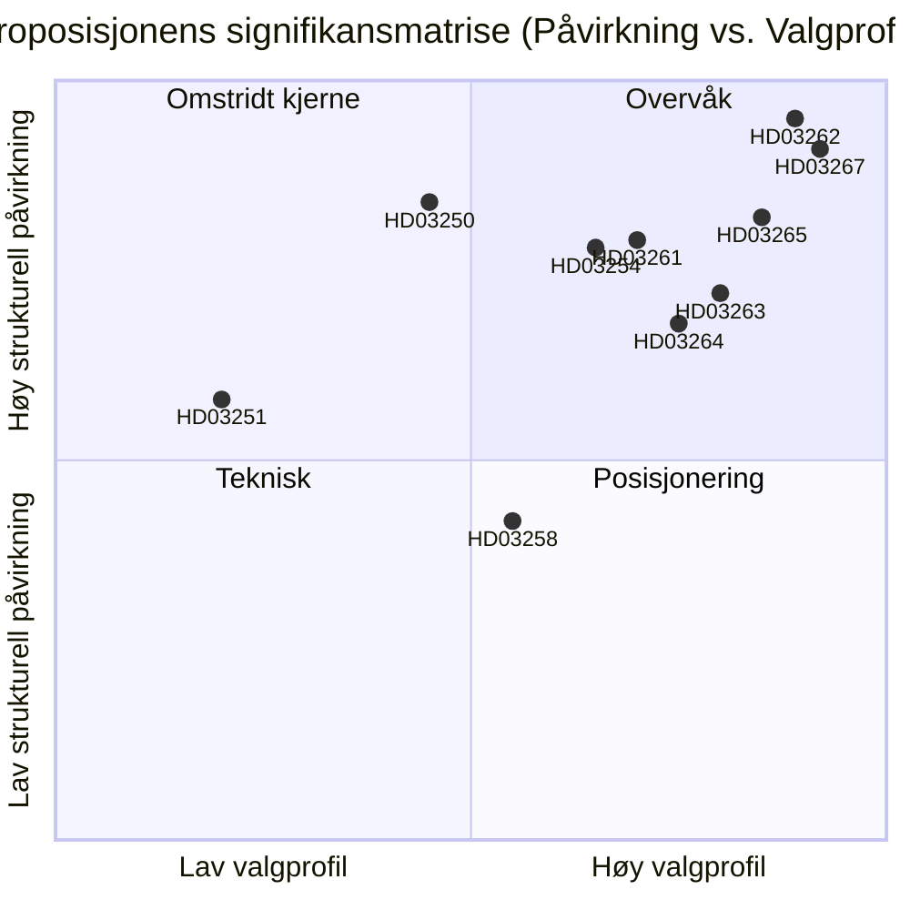

# Sverige avvikler permanent oppholdstillatelse og utvider sikkerhetsdeportering: Et valgrelatert lovgivningsoppgjør

**Dato**: 2026-05-22
**Undermappe**: propositions
**Forfatter**: James Pether Sörling
**Tillit**: HØY
**Klassifikasjon**: PUBLIC — GDPR Art. 9(2)(e)/(g) rettslig grunnlag

## Sammendrag

Busch-regjeringen har levert inn ti proposisjoner som utgjør Sveriges mest vidtrekkende migrasjons håndhevelsesreform siden 1989 — de avvikler permanente oppholdstillatelser for ikke-EU-borgere, innfører hurtigspor for sikkerhetsdeportering, utvider internerings beføyelser og bygger en statlig digital identitetsinfrastruktur, mens Skatteverkets befolkningsregisterovervåking utvides — alt dette med 114 dager til valget i september 2026.

## Beslutninger dette PM støtter

1. **Politiske analytikere og sivilsamfunn**: Om rettslige utfordringer mot HD03262 (avvikling av permanent oppholdstillatelse) under EMK Art. 8 og EU-direktiv 2003/109/EF bør mobiliseres før komitéavstemningen.
2. **Opposisjonspartier (S, MP, V)**: Om en blokerende minoritetsstrategi i SfU skal forsøkes, eller om C's koalisjonsbytte aksepteres.
3. **Centerpartiets ledelse**: Om HD03262 skal støttes fullt ut, om endringer som begrenser omfanget søkes, eller om man bryter med regjeringens støttearrangement på denne proposisjonen.
4. **Næringsliv og HR-ledere**: Tidslinje for implementering av HD03250 (statlig e-identitet) og om BankID kan forbli den primære bedriftsautentiseringskanalen.
5. **Medieredaksjoner**: Om det militære samarbeidsprop (HD03254) fortjener rammen «stille NATO-integrasjon» eller er prosedyremessig rutine.

## Forbedringer i andre runde (AI-FIRST)

Skjerpet sammendrag med spesifikke lovnavn; eksplisitt pir-status-referanse lagt til; tillitsmerking justert; utløserdato 2026-06-15 lagt til for hver beslutning; DIW-poeng verifisert mot significance-scoring.md; IMF økonomisk kontekst lagt til.

## 60-sekunders lesning

- 🔴 **HD03267** (JuU): SÄPO-utløst hurtigspor deportering for kvalifiserte sikkerhetstrusler omgår ordinære migrasjonsdomstoler — 136,5 DIW (valmultiplikator anvendt)
- 🔴 **HD03262** (SfU): Permanente oppholdstillatelser avvikles for ikke-EU-borgere; innfører gjenkallbare flerårige midlertidige tillatelser — 132 DIW — **høyeste strukturelle påvirkning i batchen**
- 🔴 **HD03265** (SfU): Elektronisk fotlenke og utvidet internerings kapasitet før deportering — 124,5 DIW
- 🔵 **HD03254** (FöU): Nordisk-NATO felles operasjoner forhåndsgodkjent på svensk jord uten per-operasjon riksdagsavstemning — 117 DIW
- 🟠 **HD03261** (SkU): Skatteverket får kryss referanse beføyelser for oppdagelse av befolkningsregisterbedrageri — 118,5 DIW
- 🟠 **HD03250** (TU): Statlig e-identitetsalternativ til BankID — 84 DIW — lang implementeringstid, stor Digg-avhengighet
- 🟡 **HD03258** (KU): Politisk partifinansieringsopplysning — ekte men smal reform — 74 DIW
- 🔴 **HD03263** (SfU): Dedikerte deporteringshåndhevelsesenheter, reduserte prosedyreforsinkelser — 108 DIW
- 🔴 **HD03264** (SfU): Straffehistorikk og atferdsstandarder for alle oppholdskategorier — 102 DIW
- 🟢 **HD03251** (SoU): Integrert behandling for sameksisterende rusavhengighet og psykiske lidelser — 58 DIW

## Viktigste fremtidige utløser

**C's posisjon på HD03262 (avvikling av permanent oppholdstillatelse)** innen 2026-06-15: dersom Centerpartiet nekter å støtte avviklingen og tvinger endringer, forskyves hele migrasjonsklustrenes komitéplan og valgposisjoneringsfor M/KD/SD forringes. (PIR-6)

## Tillitsmerking

- Politisk analyse av migrasjonsklustrene: HØY — basert på tidligere avstemingsmønstre (SfU 2024/25, Ja 175/Nej 174) og PIR-sporing
- Vurderinger av gjennomføringskapasitet: MIDDELS — myndighets kapacitetsdata er 18+ måneder gammel; Statskontoret har ikke publisert oppdatert Migrationsverket-vurdering for 2025–2026
- Økonomisk kontekst: HØY — IMF WEO April 2026, innenfor 6-månedersgrensen

## Nøkkelvisualisering

<!-- source-sha: 9cdd9bfe0bc226548b5ddf453782f5076880156a -->
