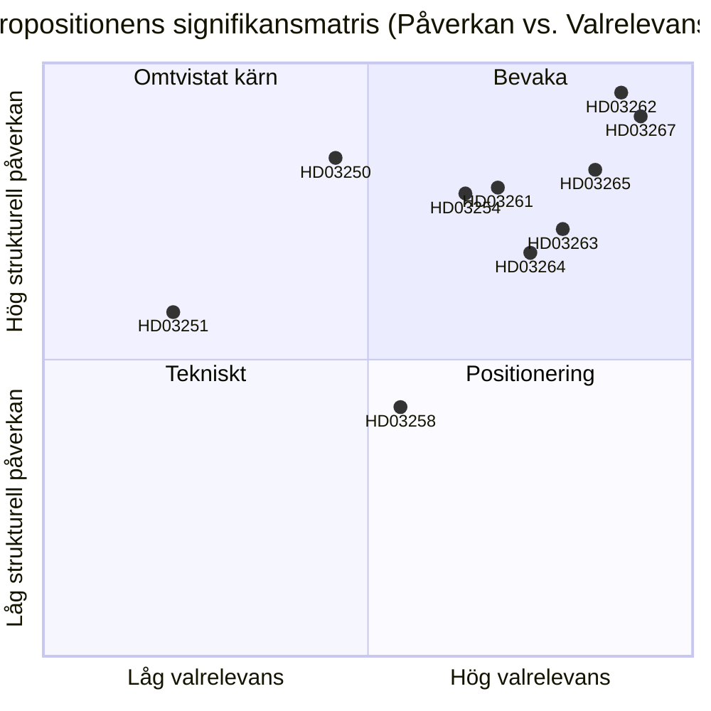

# Sverige avskaffar permanent uppehållstillstånd och utvidgar säkerhetsdeportering: En förvalsrättslig uppgörelse

**Datum**: 2026-05-22
**Undermapp**: propositioner
**Författare**: James Pether Sörling
**Tillförlitlighet**: HÖG
**Klassificering**: PUBLIC — GDPR Art. 9(2)(e)/(g) rättslig grund

## Sammanfattning i korthet

Buschregeringen har lämnat in tio propositioner som utgör den mest långtgående migrationsreformen i Sverige sedan 1989: avskaffande av permanenta uppehållstillstånd för medborgare utanför EU, inrättande av snabbspår för säkerhetsdeportering, utvidgade förvarsregler och samtidigt uppbyggnad av en statlig digital identitetsinfrastruktur och utökning av Skatteverkets befolkningsregisterövervakning — allt detta med 114 dagar kvar till riksdagsvalet i september 2026.

## Beslut som detta PM stöder

1. **Politiska analytiker och civilsamhälle**: Om rättsliga utmaningar mot HD03262 (avskaffande av permanent uppehållstillstånd) enligt EKMR Art. 8 och EU-direktiv 2003/109/EG bör mobiliseras innan utskottsomröstning.
2. **Oppositionspartier (S, MP, V)**: Om en blockeringsminoritetsstrategi i SfU bör försökas eller om C:s koalitionsbyte accepteras.
3. **Centerpartiets ledning**: Om HD03262 ska stödjas fullt ut, om ändringar som begränsar räckvidden ska sökas, eller om man ska bryta med regeringens stödöverenskommelse på denna proposition.
4. **Näringsliv och HR-chefer**: Tidslinje för genomförande av HD03250 (statlig e-identitet) och om BankID kan förbli primär autentiseringskanal.
5. **Medieredaktioner**: Om militärt samarbetsprop (HD03254) förtjänar ramen "tyst NATO-integration" eller är procedurellt rutinmässig.

## Förbättringar i andra omgången (AI-FIRST)

Skärpt sammanfattning med specifika lagnamn; explicit pir-status-referens tillagd; tillförlitlighetsetiketter justerade; utlösardatum 2026-06-15 tillagt för varje beslut; DIW-poäng verifierade mot significance-scoring.md; IMF ekonomisk kontext tillagd.

## 60-sekunders läsning

- 🔴 **HD03267** (JuU): SÄPO-utlöst snabbspårdeportering för kvalificerade säkerhetshot kringgår ordinarie migrationsdomstolar — 136,5 DIW (valmultiplikator tillämpad)
- 🔴 **HD03262** (SfU): Permanenta uppehållstillstånd avskaffas för medborgare utanför EU; inför återkallningsbara fleråriga tillfälliga tillstånd — 132 DIW — **högst strukturell påverkan i batchen**
- 🔴 **HD03265** (SfU): Elektronisk fotboja och utökad förvarskapacitet inför deportering — 124,5 DIW
- 🔵 **HD03254** (FöU): Nordisk-NATO gemensamma operationer förauktoriserade på svensk mark utan per-operation riksdagsomröstning — 117 DIW
- 🟠 **HD03261** (SkU): Skatteverket får korsreferenseringsrättigheter för att bekämpa folkbokföringsbedrägeri — 118,5 DIW
- 🟠 **HD03250** (TU): Statligt e-identitetsalternativ till BankID — 84 DIW — lång genomförandetid, stort beroende av Digg
- 🟡 **HD03258** (KU): Redovisning av partifinansiering — genuin men smal reform — 74 DIW
- 🔴 **HD03263** (SfU): Dedikerade deporteringsverkställighetsenheter, kortare handläggningstider — 108 DIW
- 🔴 **HD03264** (SfU): Straffrättsliga och uppförandestandarder för alla uppehållstillståndskategorier — 102 DIW
- 🟢 **HD03251** (SoU): Integrerad vård för samsjuklighet med substansbruk och psykiska störningar — 58 DIW

## Viktigaste framtida utlösare

**C:s position på HD03262 (avskaffande av permanent uppehållstillstånd)** senast 2026-06-15: om Centerpartiet vägrar stödja avskaffandet och tvingar fram ändringar, förskjuts hela migrationsklustrets utskottstidslinje och positioneringen inför valet för M/KD/SD försämras. (PIR-6)

## Tillförlitlighetsmärkning

- Politisk analys av migrationsklustret: HÖG — baserad på tidigare röstmönster (SfU 2024/25, Ja 175/Nej 174) och PIR-uppföljning
- Bedömningar av genomförandekapacitet: MEDEL — myndighetskapacitetsdata är 18+ månader gammal; Statskontoret har inte publicerat en uppdaterad Migrationsverket-bedömning för 2025–2026
- Ekonomisk kontext: HÖG — IMF WEO April 2026, inom 6-månadersgränsen

## Nyckelvisualisering

<!-- source-sha: 9cdd9bfe0bc226548b5ddf453782f5076880156a -->
