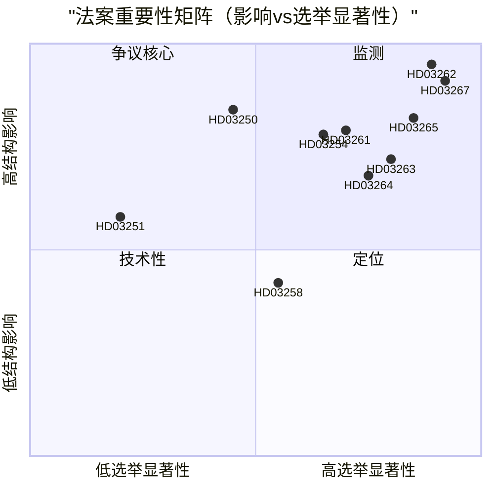

# 瑞典废除永久居留权并扩大安全驱逐：选举前的立法清算

**日期**: 2026-05-22
**子文件夹**: propositions
**作者**: James Pether Sörling
**可信度**: 高
**分类**: 公开 — GDPR 第9条(2)(e)/(g) 法律依据

## 核心摘要

布什政府提交了10项法案，构成自1989年以来最广泛的瑞典移民执法改革：废除非欧盟国民永久居留权、建立安全驱逐快速程序、扩大拘留权力、构建国家数字身份基础设施，以及扩大Skatteverket的人口登记监控能力——所有这些都在距2026年9月大选114天的时间节点上完成。

## 本文件支持的决策

1. **政策分析师与公民社会**: 是否应在委员会投票前，基于《欧洲人权公约》第8条和欧盟指令2003/109/EC对HD03262（废除永居）提出法律质疑并动员支持。
2. **反对党（S、MP、V）**: 是在SfU尝试阻止少数派策略，还是接受Centerpartiet的联合变化。
3. **Centerpartiet领导层**: 是全面支持HD03262、寻求限制范围的修正案，还是放弃与政府就该法案达成的支持协议。
4. **企业界/人力资源管理者**: HD03250（国家电子身份）的实施时间表，以及BankID能否继续作为企业认证的主要渠道。
5. **媒体编辑委员会**: 军事合作法案（HD03254）是否值得被定性为"低调的北约整合"，还是程序上的例行事务。

## 第二轮改进（AI-FIRST）

用具体法规名称强化核心摘要；添加明确的pir-status引用；收紧可信度标签；为每项决策添加2026-06-15触发日期；验证DIW评分与significance-scoring.md一致；添加IMF经济背景说明。

## 60秒要点

- 🔴 **HD03267** (JuU): 绕过普通移民法院的SÄPO触发合格安全威胁快速驱逐 — 136.5 DIW（适用选举乘数）
- 🔴 **HD03262** (SfU): 废除非欧盟国民永久居留权；引入可撤销的多年临时许可 — 132 DIW — **一揽子计划中结构影响最大**
- 🔴 **HD03265** (SfU): 扩大电子脚踝带和驱逐前拘留能力 — 124.5 DIW
- 🔵 **HD03254** (FöU): 预先批准在瑞典领土进行北欧-北约联合作战，无需逐次议会投票 — 117 DIW
- 🟠 **HD03261** (SkU): Skatteverket获得交叉引用权限以检测人口登记欺诈 — 118.5 DIW
- 🟠 **HD03250** (TU): BankID的国家电子身份替代方案 — 84 DIW — 实施时间表长，对Digg依赖度高
- 🟡 **HD03258** (KU): 政党政治资金披露 — 认真但范围有限的改革 — 74 DIW
- 🔴 **HD03263** (SfU): 专职驱逐执行部队，减少程序延误 — 108 DIW
- 🔴 **HD03264** (SfU): 所有居留类别的犯罪记录和行为标准 — 102 DIW
- 🟢 **HD03251** (SoU): 药物滥用和精神障碍共病的综合治疗 — 58 DIW

## 最重要的未来触发因素

**Centerpartiet对HD03262（废除永居）的立场**（2026-06-15之前）：若Centerpartiet拒绝支持废除并强制修正案，整个移民政策集群的委员会时间表将发生变化，M/KD/SD的选举定位也将恶化。（PIR-6）

## 可信度级别

- 移民集群政治分析：高 — 基于历史投票模式（SfU 2024/25，赞成175/反对174）及PIR追踪
- 实施能力评估：中 — 机构能力数据超过18个月；Statskontoret尚未发布2025-2026年Migrationsverket更新评估
- 经济背景：高 — IMF WEO 2026年4月，在6个月阈值内

## 核心可视化

<!-- source-sha: 9cdd9bfe0bc226548b5ddf453782f5076880156a -->
