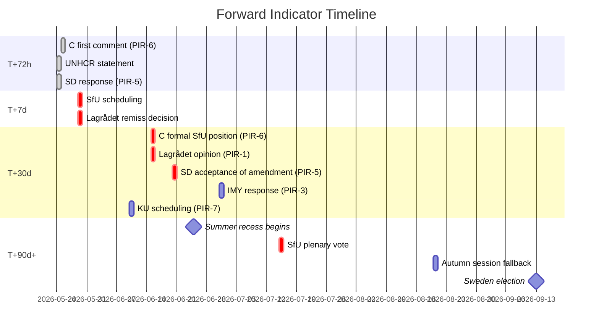

# Forward Indicators — 2026-05-22 Propositions

**Date**: 2026-05-22
**Purpose**: Dated trigger indicators across four horizons for monitoring proposition outcomes
**Horizons**: T+72h | T+7d | T+30d | T+90d (and beyond)

## Horizon T+72h (2026-05-22 to 2026-05-25)

| Indicator | Expected by | What it signals | PIR link |
|-----------|------------|-----------------|---------|
| Swedish media editorial responses to HD03262 | 2026-05-24 | Framing competition — if DN editorial is critical, Frame 2 dominates; if SvD supports, Frame 1 strengthens | — |
| UNHCR Sweden press statement on batch | 2026-05-24 | Will signal international human rights community mobilisation speed | — |
| C party leader (Demirok) first public comment on HD03262 | 2026-05-25 | First signal of C official position vs. individual MP dissent | PIR-6 |
| SD's Jimmie Åkesson press comment | 2026-05-24 | SD's tone — triumphant vs. demanding faster implementation | PIR-5 |

## Horizon T+7d (2026-05-25 to 2026-05-29)

| Indicator | Expected by | What it signals | PIR link |
|-----------|------------|-----------------|---------|
| Government remiss announcement (if seeking voluntary Lagrådet consultation on HD03267) | 2026-05-29 | If voluntary consultation announced → government is managing Lagrådet risk proactively | PIR-1 |
| SfU committee first reading schedule | 2026-05-29 | Timeline for HD03262-HD03265 committee votes — calendar constraint becomes visible | — |
| JuU committee scheduling of HD03267 | 2026-05-29 | Timeline for security fast-track committee vote | PIR-1 |
| Business community joint statement (Teknikföretagen + Almega) | 2026-05-28 | Signal of business community mobilisation against HD03262 skilled worker impact | — |
| V and MP amendment flood announcement | 2026-05-29 | Scale signals how hard opposition will fight — expected 30+ amendments per SfU proposition | — |

## Horizon T+30d (2026-05-22 to 2026-06-21)

| Indicator | Expected by | What it signals | PIR link |
|-----------|------------|-----------------|---------|
| Centerpartiet formal SfU position on HD03262 | **2026-06-15** | The single most important forward indicator — determines Scenario 2 vs Scenario 3 | PIR-6 |
| Lagrådet opinion on HD03267 | **2026-06-15** | Fundamental revision demand (high impact) vs. advisory amendments (manageable) | PIR-1 |
| IMY formal response to HD03261 consultation | **2026-07-01** | Enforcement action warning vs. guidance only — determines surveillance framing | PIR-3 |
| SD's response to C's HD03262 amendment demands | **2026-06-20** | Whether SD accepts modified form — determines whether coalition mathematics hold | PIR-5 |
| Migrationsverket formal implementation cost estimate submitted to Finansdepartementet | **2026-06-30** | First concrete signal of budget gap magnitude; if unfiled, confirms implementation delay | — |
| KU committee scheduling decision on HD03254 | **2026-06-10** | Whether KU refers to extended constitutional review — determines election window viability | PIR-7 |
| European Commission statement on HD03262 compatibility with Directive 2003/109/EC | **2026-06-30** | If EC opens dialogue → international pressure builds; if silent → pathway clear | — |
| First ECHR reference by Swedish NGO challenging HD03267 | **2026-06-30** | Pre-enactment challenge signals — if filed before enactment, could accelerate Strasbourg engagement | — |

## Horizon T+90d and Beyond (2026-05-22 to 2026-08-20 and Election)

| Indicator | Expected by | What it signals | PIR link |
|-----------|------------|-----------------|---------|
| SfU plenary vote on HD03262 (migration batch) | **2026-07-15 est.** | Whether government majority holds; HD03262 final form | All PIRs |
| JuU plenary vote on HD03267 | **2026-07-15 est.** | Security fast-track final form | PIR-1 |
| TU plenary vote on HD03250 | **2026-07-15 est.** | State e-identity — procedurally straightforward | — |
| Riksdag summer recess begins | **2026-06-25** | Any bills not passed by this date go to autumn session (post-election) | — |
| Autumn plenary if early session called | **2026-08-20** | Last opportunity for pre-election enactment of delayed propositions | — |
| Sweden election | **2026-09-13** | All scenarios crystallise | — |
| First HD03267 deportation case (if enacted) | **2026-Q4 est.** | First real test of security fast-track; ECtHR interim measure likely requested | R02 |
| Digg HD03250 procurement launch | **2027-Q1 est.** | Implementation signal — delay here means 2030+ for full rollout | — |
| CJEU referral decision on HD03262 | **2027-Q4 est.** | Long-horizon legal threat | — |

## Indicator Dashboard Summary

## Watch Items (Qualitative)

1. **PM Busch's communication on HD03262 amendment negotiation**: If the government proactively announces it is "open to refinements" — this signals Scenario 2 is in progress and the major collapse risk is contained.
2. **SD social media tone**: If SD begins a "betrayal" narrative about potential C amendments, this signals the coalition tension is escalating toward Scenario 3.
3. **C's European parliament group (Renew)**: If ALDE/Renew issues a formal statement supporting C's liberal wing on HD03262, this increases external pressure on C to hold its position.
4. **Statskontoret ad hoc report**: If Finansdepartementet commissions an emergency feasibility assessment for the migration cluster, this signals implementation concern at the ministerial level.
5. **Riksdag parliamentary calendar**: Any rescheduling of the June/July committee sessions signals political tension.
