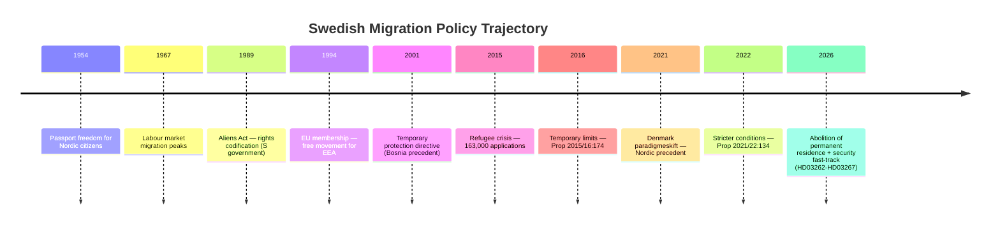

# Historical Parallels — 2026-05-22 Propositions

**Date**: 2026-05-22
**Method**: Named historical precedent analysis with similarity scoring

## Primary Parallel — 1989 Swedish Aliens Act

**Event**: The 1989 Aliens Act (Utlänningslag SFS 1989:529) represented Sweden's first systematic codification of immigration rules, replacing the ad-hoc administrative practice that had governed migration since 1954. The act introduced: formal categories of temporary and permanent residence; enumerated grounds for deportation; an appeals system through Utlänningsnämnden.

**Similarity to 2026 batch**: The 2026 propositions collectively represent a structural overhaul of the regime created in 1989 — abolishing its core concept (permanent residence as the endpoint of the immigration journey) and replacing it with a perpetually revocable temporary permit framework. Where 1989 codified rights, 2026 revokes them.

**Key difference**: The 1989 reform expanded rights; the 2026 batch contracts them. The legislative logic is inverted but the structural magnitude is comparable.

**Similarity score**: 84/100 — same structural magnitude; inverted direction.

**Political parallel**: The 1989 reform was led by the Social Democrats under Kjell-Olof Feldt (Finance) with Birgit Friggebo (Liberal) as migration minister in a care-taker context. It passed with broad political support. The 2026 batch is partisan, with explicit opposition. The legislative consensus of 1989 has been replaced by competitive positioning.

---

## Secondary Parallel — Denmark 2021 Udlændingeloven Reform

**Event**: Denmark's centre-left Mette Frederiksen government passed reforms to Udlændingeloven in 2021 abolishing the practical accessibility of permanent residence for non-EU nationals — implementing the "paradigmeskift" (paradigm shift) in Danish migration policy. This was the first time a Western European social-democratic government enacted permanent residence restrictions that had previously been associated with the far right.

**Similarity to HD03262**: 78/100 — Denmark abolished de facto access to permanent residence; Sweden abolishes the legal category entirely. Denmark retained the category; Sweden is more radical.

**Outcome**: Denmark's reform survived ECHR scrutiny (no Art. 8 violation for the residence condition framework itself, though individual deportation cases were suspended on Art. 3 grounds). The Radikale Venstre (Denmark's C equivalent) voted against in 2021 and withdrew coalition support — exact parallel to Swedish C fracture risk.

**Denmark's political aftermath**: Frederiksen won the 2022 election with a centre-left coalition; the migration measures did not cause the governing bloc to collapse. This outcome is moderately encouraging for the Swedish government's strategy.

---

## Tertiary Parallel — UK Special Immigration Appeals Commission (SIAC), 1997

**Event**: SIAC was created in 1997 following the A and Others v UK ECtHR judgment that found ordinary immigration appeal procedures inadequate for national security deportation cases. SIAC uses a closed evidence procedure with a Special Advocate who can see classified SÄPO-equivalent material but cannot communicate it to the deportee.

**Similarity to HD03267**: 72/100 — HD03267 creates an analogous fast-track procedure for security-designated individuals. Sweden has not yet designed the equivalent of the Special Advocate role, which UK courts and ECtHR have found necessary for ECHR Art. 5(4) compliance.

**Key lesson**: UK learned through 228 SIAC cases that non-refoulement (Art. 3) is an absolute bar — it cannot be overcome by national security arguments. Sweden's HD03267 must either (a) limit deportation destinations to countries with no documented torture risk or (b) include the Special Advocate procedure, or both. Current text does not clearly resolve this.

---

## Quaternary Parallel — Sweden 2001-2003 Datainspektionen vs Skatteverket

**Event**: The early 2000s expansion of Skatteverket's electronic database systems for the population register generated Sweden's first major data protection confrontation, with Datainspektionen (now IMY) issuing a binding opinion that cross-database identity checks required explicit legal authorisation.

**Similarity to HD03261**: 68/100 — HD03261 provides the explicit legal authorisation that Datainspektionen demanded in 2003. However, the scope of data linkage in 2026 far exceeds the 2001-2003 dispute, which concerned only population register data. HD03261 enables cross-referencing with welfare, tax, and migration databases.

**Key lesson**: Swedish administrative law requires explicit statutory authorisation for data cross-referencing, which HD03261 provides. But the IMY 2003 precedent also established a proportionality standard — the cross-referencing must be limited to the specific fraud-detection purpose. If HD03261's scope exceeds this, IMY can pursue enforcement.

---

## Parallel Summary Table

| Parallel | Event | Year | Country | Similarity | Lesson |
|----------|-------|------|---------|-----------|--------|
| 1989 Aliens Act | Systematic migration codification | 1989 | Sweden | 84% (inverted) | Structural magnitude comparable; political consensus opposite |
| Denmark paradigmeskift | Permanent residence inaccessibility | 2021 | Denmark | 78% | Survived ECHR; C-equivalent departed coalition |
| UK SIAC | Security deportation procedure | 1997 | UK | 72% | Special Advocate needed; Art. 3 absolute |
| Datainspektionen vs Skatteverket | Registry cross-reference limits | 2001-2003 | Sweden | 68% | HD03261 must be proportionate |

## Historical Trajectory Analysis

