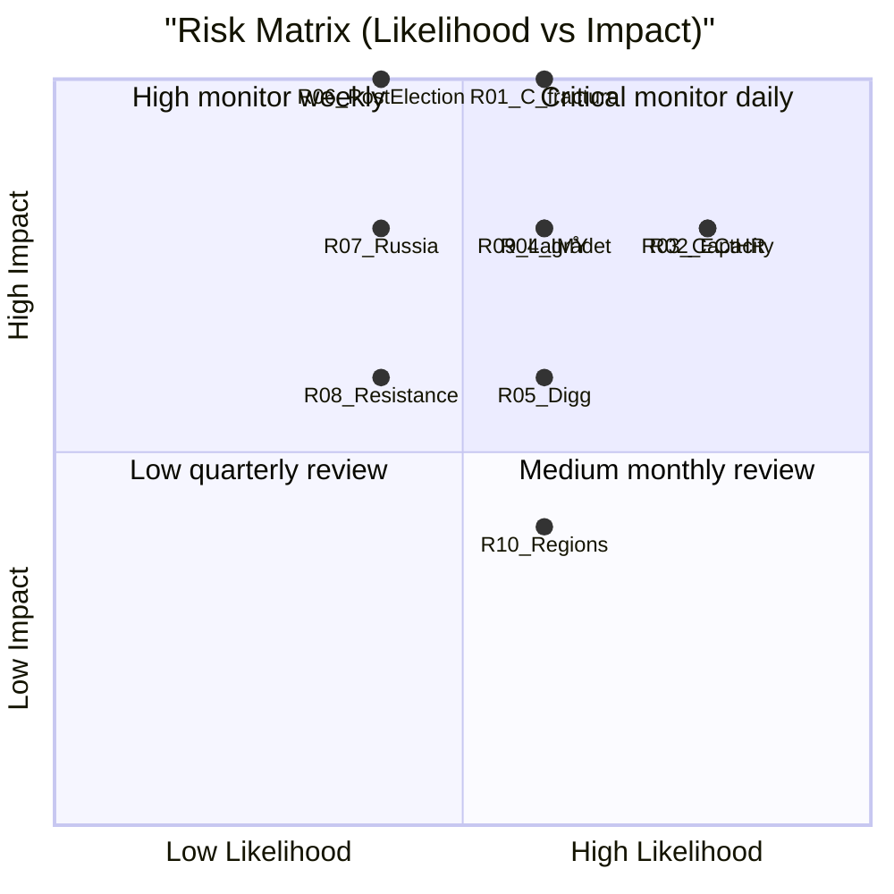

# Risk Assessment — 2026-05-22 Propositions

**Date**: 2026-05-22
**Dimensions**: Political · Legal/Constitutional · Implementation · Geopolitical · Social

## Risk Register (L×I Format)

| ID | Category | Risk Event | Likelihood (1-5) | Impact (1-5) | L×I | Mitigation | Owner | Horizon |
|----|----------|-----------|-----------------|-------------|-----|-----------|-------|---------|
| R01 | Political | C fracture on HD03262 — government majority collapses | 3 | 5 | **15** | Pre-negotiate C amendments limiting scope to third-country only | Prime Minister's Office | T+30d |
| R02 | Legal/Const | ECtHR suspension of HD03267 deportations (Art. 3) | 4 | 4 | **16** | Mandate country-condition reviews; embed non-refoulement safeguards in proposition text | Justitiedepartementet | T+6m |
| R03 | Implementation | Migrationsverket capacity overrun on HD03263+HD03265 | 4 | 4 | **16** | Emergency supplementary estimate; fast-track staffing from Polismyndigheten | Migrationsverket | T+12m |
| R04 | Legal/Const | IMY enforcement against HD03261 Skatteverket powers | 3 | 4 | **12** | Narrow scope via government directive before implementation | IMY + Finansdepartementet | T+6m |
| R05 | Implementation | Digg project failure on HD03250 state e-identity | 3 | 3 | **9** | Stage-gate review at 6 months; fallback option to private-sector BankID supplemented by state API | Digg | T+24m |
| R06 | Political | S+C post-election coalition reverses migration cluster | 2 | 5 | **10** | Embed measures in EU-transposition obligations (harder to reverse); use international law anchors | — | T+6m (post-election) |
| R07 | Geopolitical | Russian reactions to HD03254 Nordic military cooperation | 2 | 4 | **8** | Coordinate messaging with Försvarsdepartementet + MFA | Försvarsmakten | T+3m |
| R08 | Social | Organised resistance / civil disobedience against HD03264 | 2 | 3 | **6** | Community engagement program; explain character requirement scope limitations | Socialdepartementet | T+9m |
| R09 | Legal/Const | Lagrådet demands fundamental revision of HD03267 | 3 | 4 | **12** | Voluntary consultation before final bill; incorporate safeguards proactively | Justitiedepartementet | T+6w |
| R10 | Implementation | HD03251 care pathway integration fails at regional level | 3 | 2 | **6** | SKR agreement on implementation support; Socialstyrelsen monitoring | Socialdepartementet | T+18m |

## Top Risks Summary (L×I ≥ 12)

1. **R02/R03 (L×I 16)**: ECtHR suspension + Migrationsverket capacity — tied at highest risk score. Both relate to HD03267/HD03265 enforcement capacity.
2. **R01 (L×I 15)**: C fracture — second-highest political risk; potential legislative cascade if HD03262 fails in committee.
3. **R04/R09 (L×I 12)**: Regulatory enforcement and Lagrådet scrutiny — legal/institutional checks that could delay or modify the migration cluster.

## Cascading Risk Chains

**Chain A — Maximum Disruption**:
R01 (C fracture) → HD03262 fails committee → SD withdraws supply → early election → S+C minority forms → R06 (reversal)

**Chain B — Regulatory Cascade**:
R04 (IMY enforcement HD03261) → negative political attention on surveillance framing → C demands scope limitation across all migration propositions → R09 (Lagrådet revisions) → delays all five SfU bills

**Chain C — Implementation Collapse**:
R03 (Migrationsverket overrun) → enforcement backlog grows → HD03263 fast-track fails in practice → SD criticises government for half-measures → government credibility damage pre-election

## Risk Heatmap

## Control Adequacy Assessment

| Risk | Existing Control | Control Adequacy | Residual Risk |
|------|----------------|-----------------|--------------|
| R02 (ECtHR) | Country-condition guidelines (Utlänningsnämnden) | PARTIAL — guidelines not updated since 2023 | HIGH |
| R03 (Capacity) | Migrationsverket budget for 2026 | INADEQUATE — 300+ officers required, current recruitment freeze | CRITICAL |
| R01 (C fracture) | Informal government–C dialogue | PARTIAL — three C MPs publicly opposed | HIGH |
| R09 (Lagrådet) | Government legal review (Juristråden) | ADEQUATE — if voluntary consultation used | MEDIUM |
