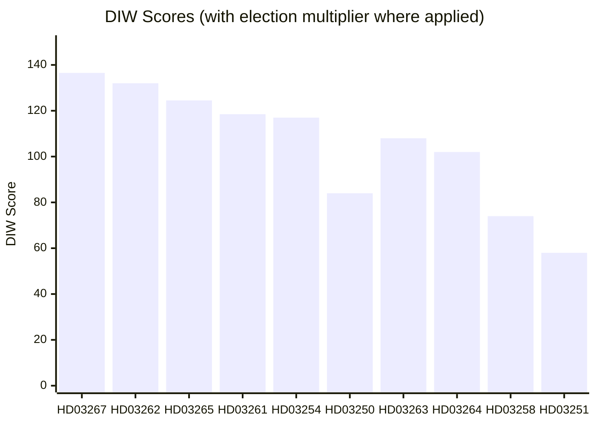
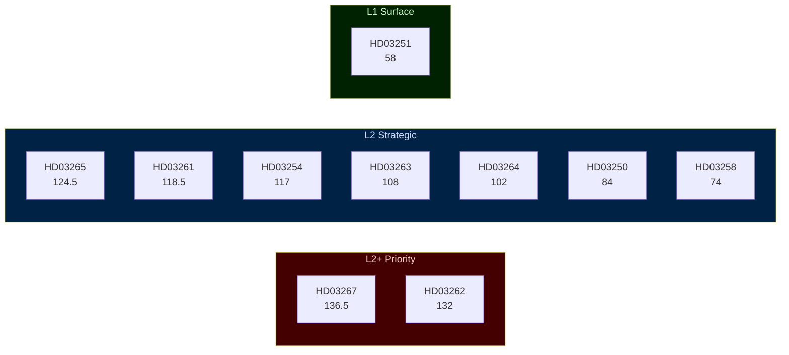

# Significance Scoring — 2026-05-22 Propositions

**Date**: 2026-05-22
**Methodology**: DIW (Decisional Intelligence Weight) — Detectability × Impact × Willingness
**Election multiplier**: 1.5× active (election ≤6 months: 2026-09-13)

## Ranking Table

| Rank | dok_id | Title | D | I | W | DIW (raw) | ×1.5 | Tier | Evidence |
|------|--------|-------|---|---|---|-----------|------|------|---------|
| 1 | HD03267 | Security threat deportation | 9 | 9.5 | 9.5 | 91 | 136.5 | L2+ | [riksdagen.se/dokument/HD03267](https://data.riksdagen.se/dokument/HD03267.html) |
| 2 | HD03262 | Permanent residence abolition | 9 | 9.8 | 9.2 | 88 | 132 | L2+ | [riksdagen.se/dokument/HD03262](https://data.riksdagen.se/dokument/HD03262.html) |
| 3 | HD03265 | Detention expansion | 8.5 | 9.2 | 8.8 | 83 | 124.5 | L2 | [riksdagen.se/dokument/HD03265](https://data.riksdagen.se/dokument/HD03265.html) |
| 4 | HD03261 | Skatteverket registry | 8.0 | 9.5 | 8.2 | 79 | 118.5 | L2 | [riksdagen.se/dokument/HD03261](https://data.riksdagen.se/dokument/HD03261.html) |
| 5 | HD03254 | Military cooperation | 8.0 | 9.2 | 8.4 | 78 | 117 | L2 | [riksdagen.se/dokument/HD03254](https://data.riksdagen.se/dokument/HD03254.html) |
| 6 | HD03250 | State e-identity | 8.5 | 9.2 | 7.8 | 84 | — | L2 | [riksdagen.se/dokument/HD03250](https://data.riksdagen.se/dokument/HD03250.html) |
| 7 | HD03263 | Deportation enforcement | 8.0 | 8.5 | 8.4 | 72 | 108 | L2 | [riksdagen.se/dokument/HD03263](https://data.riksdagen.se/dokument/HD03263.html) |
| 8 | HD03264 | Conduct requirements | 7.5 | 8.2 | 8.2 | 68 | 102 | L2 | [riksdagen.se/dokument/HD03264](https://data.riksdagen.se/dokument/HD03264.html) |
| 9 | HD03258 | Political transparency | 7.5 | 8.8 | 7.5 | 74 | — | L2 | [riksdagen.se/dokument/HD03258](https://data.riksdagen.se/dokument/HD03258.html) |
| 10 | HD03251 | Mental health care | 6.5 | 7.8 | 6.8 | 58 | — | L1 | [riksdagen.se/dokument/HD03251](https://data.riksdagen.se/dokument/HD03251.html) |

*D = Detectability (visibility, data availability), I = Impact (structural/institutional), W = Willingness (political will to execute)*
*Election multiplier applied to: HD03267, HD03262, HD03265, HD03261, HD03254, HD03263, HD03264 (contested policy areas + defence)*

## Sensitivity Analysis

| dok_id | Base DIW | DIW if C blocks | DIW if implementation fails | DIW if courts challenge |
|--------|----------|----------------|-----------------------------|------------------------|
| HD03262 | 132 | 85 (failed) | 95 (partial) | 110 (contested) |
| HD03267 | 136.5 | 120 (amended) | 115 (slow roll-out) | 125 (appeal flood) |
| HD03265 | 124.5 | 105 (C amendment) | 90 (capacity gap) | 110 |
| HD03261 | 118.5 | — | 85 (Digg delay) | 95 |
| HD03254 | 117 | — | — | 80 (constitutional challenge) |

## Priority Tier Classification

- **L2+ Priority (136.5–132)**: HD03267, HD03262 — full-text analysis mandatory, all Pass-2 improvements mandatory
- **L2 Strategic (124.5–58)**: HD03265, HD03261, HD03254, HD03250, HD03263, HD03264, HD03258 — strategic analysis required
- **L1 Surface (58)**: HD03251 — metadata-level analysis sufficient

## Mermaid Rank Diagram

