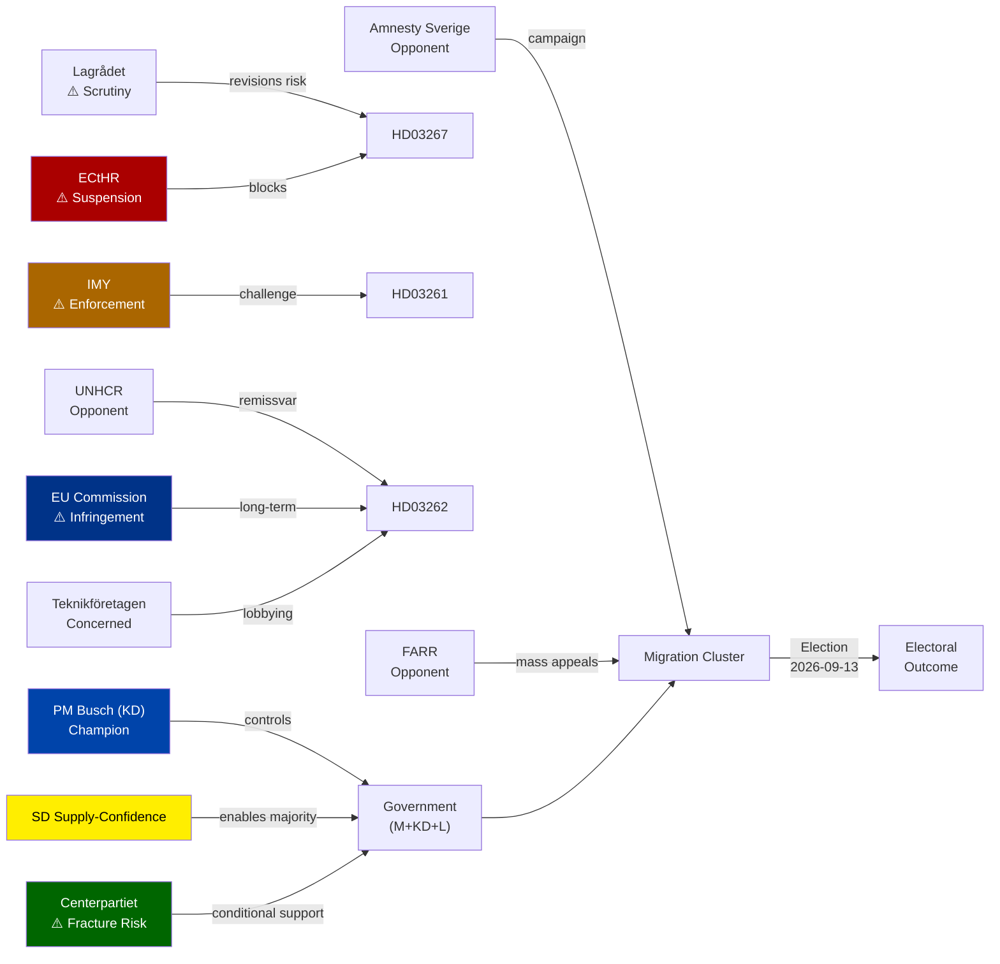

# Stakeholder Perspectives — 2026-05-22 Propositions

**Date**: 2026-05-22
**Lens Framework**: Government · Opposition · Civil Society · EU/International · Business · Affected Populations

## 6-Lens Stakeholder Matrix

### Lens 1 — Government Actors

| Actor | Position | Intensity | Credibility Signal | Action |
|-------|----------|-----------|-------------------|--------|
| PM Ebba Busch (KD) | Champion — all propositions | Maximum | Signed HD03267/HD03250/HD03261 on 2026-05-07 | Public defence in plenary |
| Acting PM Lotta Edholm (L) | Champion — HD03262-HD03265, HD03254, HD03258, HD03251 | High | Signed HD03262-HD03254 batch on 2026-04-30 | Press conference framing |
| Justitieminister (KD) | Technical champion — HD03267 | High | Proposition lead | Lagrådet consultation decision |
| Migrationsminister | Champion HD03262-HD03265 | High | Official spokesperson | Agency briefing |
| Finansminister (M) | Supportive — monitors implementation costs | Medium | No public opposition | Budget supplementary estimate decision |

### Lens 2 — Parliamentary Opposition

| Actor | Position | Key Concern | Likely Action | Vote Prediction |
|-------|----------|------------|--------------|----------------|
| Socialdemokraterna (S) | Opposed — all migration | ECHR compliance; worker rights HD03263 | 40+ amendments in each committee | Nej on all five migration props |
| Miljöpartiet (MP) | Strongly opposed | Fundamental rights, climate migration | Formal reservations + public campaign | Nej |
| Vänsterpartiet (V) | Strongly opposed | Class analysis — HD03264 criminalises poverty | Nej + KO complaint pre-legislation | Nej |
| Centerpartiet (C) | Split — key actor | HD03262 permanent residence abolition = redline for European liberal wing | Negotiation for amendments; 3 MPs may vote Nej | Conditional Ja (if amended) |
| Sverigedemokraterna (SD) | Champion — all migration | Insufficient: wants faster implementation | Press demand for acceleration | Ja |
| Moderaterna (M) | Champion — in government | Business concerns about HD03262 on skilled worker retention | Technical amendments to HD03262 | Ja |
| Liberalerna (L) | Champion — in government | Civil liberties concerns about HD03261 Skatteverket | Demand narrowing amendments | Conditional Ja |
| Kristdemokraterna (KD) | Champion — own party PM | No internal dissent | Ja | Ja |

### Lens 3 — Civil Society and Legal Institutions

| Actor | Position | Mechanism | Probability of Action |
|-------|----------|-----------|---------------------|
| Lagrådet | Scrutiniser | HD03267 likely flagged — ECHR Art. 3 compliance gap | HIGH (voluntary consultation sought) |
| JO (Ombudsmannen) | Monitor | HD03261 Skatteverket powers — prior investigation record | MEDIUM (new complaint likely) |
| IMY (Datainspektionen) | Scrutiniser | HD03261 and HD03267 GDPR compliance — existing remissvar on Skatteverket | HIGH (enforcement action possible) |
| Amnesty International Sverige | Opponent | HD03267 and HD03262 human rights framing | CERTAIN (campaigns already launched) |
| FARR (Flyktinggruppernas Riksråd) | Opponent | Legal support for affected asylum seekers | CERTAIN (mass appeal strategy expected) |
| SKR (Kommuner och regioner) | Cautious | HD03251 implementation costs for regions | MEDIUM (seeks funding guarantees) |
| Statskontoret | Technical reviewer | Implementation feasibility HD03250, HD03263 | Post-enactment evaluation commissioned |

### Lens 4 — EU and International Actors

| Actor | Position | Mechanism | Timeline |
|-------|----------|-----------|---------|
| European Commission | Monitoring | HD03262 vs Directive 2003/109/EC — potential infringement procedure | T+18m if no CJEU referral first |
| ECtHR | Potential intervener | HD03267 deportation suspensions under interim measures | T+6m from first case |
| UNHCR Sweden | Opponent | HD03262 violates Refugee Convention spirit | Immediate — remissvar expected |
| NATO (operational) | Supportive | HD03254 enables operational integration without political signalling | Quiet diplomatic support |
| Denmark | Reference state | HD03262 mirror of 2021 Danish reform — bilateral information exchange likely | Ongoing |
| Finland | Monitoring | HD03265 detention — comparative migration enforcement alignment | Low engagement |

### Lens 5 — Business Community

| Actor | Position | Key Concern | Action |
|-------|----------|------------|--------|
| Teknikföretagen | Concerned | HD03262 threatens skilled worker recruitment from non-EU countries | Lobbying for sector exemptions |
| Almega | Concerned | Implementation uncertainty for service sector non-EU staff | Joint industry statement expected |
| Swedish Fintech Association | Supportive (HD03250) | State e-identity expands digital service market; BankID competition concern | Regulatory engagement on HD03250 API |
| Banker (Swedbank, Handelsbanken) | Neutral → Concerned | HD03250 may reduce BankID market share | Lobbying on neutral API standards |

### Lens 6 — Affected Populations

| Population Segment | Propositions Affected | Impact Direction | Scale |
|-------------------|----------------------|-----------------|-------|
| Non-EU residents (existing permits) | HD03262 | NEGATIVE — permit renewal risk; permanent status abolished retroactively unclear | ~350,000 persons |
| SÄPO-flagged individuals | HD03267 | CRITICAL — fast-track deportation; rights of appeal severely constrained | ~200 identified individuals |
| Undocumented individuals | HD03263+HD03265 | HIGH — enforcement intensification | ~10,000-20,000 (estimate) |
| Non-EU skilled workers (prospective) | HD03262 | NEGATIVE — reduced incentive to settle in Sweden | Variable |
| Unbanked individuals | HD03250 | POSITIVE — digital service access without BankID | ~80,000 persons |
| Mental health patients (dual diagnosis) | HD03251 | POSITIVE — integrated care pathway | ~45,000 patients |
| Population register subjects | HD03261 | RISK — privacy; benefits from fraud reduction | 10.8 million |

## Influence Network

