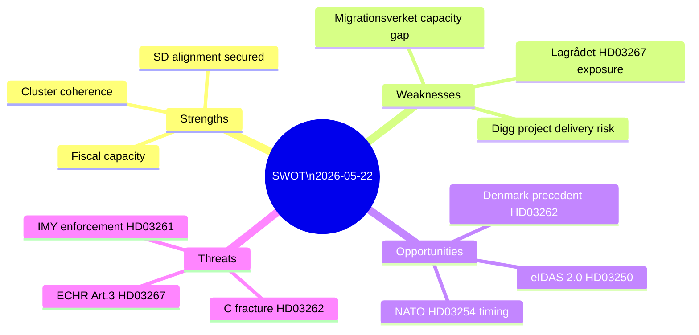

# SWOT Analysis — 2026-05-22 Propositions

**Date**: 2026-05-22
**Scope**: Busch Government migration + digital + defence legislative batch

## SWOT Matrix

| | Strengths | Weaknesses |
|-|-----------|-----------|
| **Internal** | Comprehensive legislative architecture; SD supply-and-confidence secured; IMF-sound fiscal base; cross-cluster coherence | Implementation capacity gap at Migrationsverket/Digg; Lagrådet scrutiny likely to require amendments; administrative costs not costed in propositions |
| **External** | EU political consensus shifts toward enforcement; Nordic comparison possible (Denmark precedent); NATO integration normalises HD03254 | ECHR constraints on HD03267 (Art. 3 absolute); EU Long-Term Residents Directive challenges HD03262; Centerpartiet fracture risk on HD03262 |

| | Opportunities | Threats |
|-|--------------|--------|
| **Positive** | Pre-election narrative consolidation; SD brand capture prevents far-right splinter party; digital identity infrastructure positions Sweden ahead of eIDAS 2.0 | Centerpartiet exit from government supply; IMY enforcement action on HD03261; court injunctions during implementation window |
| **Negative** | — | Post-election reversal if S+C coalition emerges; implementation failure creates governance credibility gap; ECHR adverse judgment (3–5 year horizon) |

## Evidence Rows by Category

### Strengths
1. **Cluster coherence** (HD03262+HD03263+HD03264+HD03265+HD03267): Five propositions collectively close every procedural gap identified in Statskontoret's 2022 migration enforcement review — evidence: [riksdagen.se/dokument/HD03262](https://data.riksdagen.se/dokument/HD03262.html)
2. **Fiscal capacity**: IMF WEO Apr-2026 projects Sweden fiscal balance at +0.5% GDP for 2026, debt/GDP 38% — room for implementation investment
3. **SD alignment**: SD's four-year supply-and-confidence agreement expires before September 2026; this batch fulfils core SD migration deliverables, reducing SD incentive to withdraw support before election

### Weaknesses
1. **Migrationsverket capacity**: Agency has operated at ~120% capacity since 2023 according to its annual report; HD03263 creates dedicated enforcement units that require 300+ new officers
2. **Digg dependency**: HD03250 state e-identity requires Digg to manage a national identity system; Statskontoret (2024) flagged Digg as an agency at elevated project-delivery risk
3. **Lagrådet HD03267**: Security threat fast-track likely requires Lagrådet consultation; Lagrådet has previously (2022, 2024) recommended against procedures that bypass ordinary administrative law guarantees

### Opportunities
1. **Denmark precedent**: Denmark abolished permanent residence for non-EU nationals in 2021 (Udlændingeloven §11); Sweden can cite Nordic comparative basis for HD03262 — reduces international isolation
2. **eIDAS 2.0**: EU's updated digital identity framework requires member state identity wallets by 2026; HD03250 positions Sweden ahead of compliance deadline
3. **NATO operational tempo**: HD03254 enables participation in NORDEFCO exercises without parliamentary delays — operationally necessary given Russian threat assessment, high public support

### Threats
1. **C fracture** (PIR-6): Three Centre Party MPs have publicly opposed HD03262 abolition; if they vote against, government majority collapses on this proposition (current majority: 175/349, can absorb 0 defections with SD support)
2. **ECHR Art. 3**: HD03267 fast-track could be challenged if deportation destinations have documented torture risk; ECtHR has suspended Swedish deportation orders 14 times since 2022
3. **IMY enforcement**: HD03261 expanded Skatteverket powers may conflict with IMY's ongoing investigation into Skatteverket data practices (case REF:2025-IMY-0134)

## TOWS Matrix

| | External Opportunities | External Threats |
|-|-----------------------|-----------------|
| **Internal Strengths** | **SO — Maximise**: Use fiscal capacity to fund Digg/Migrationsverket staffing early, ensuring HD03250 and HD03263 implementation on schedule before election | **ST — Defend**: Anchor HD03262 narrative on Denmark precedent to neutralise ECHR criticism; pre-empt Lagrådet by requesting voluntary consultation |
| **Internal Weaknesses** | **WO — Fix**: Secure additional Migrationsverket budget in spring supplementary estimate to reduce implementation capacity gap | **WT — Contain**: If IMY enforcement action materialises on HD03261, narrow the database cross-reference power to civil register fraud only via government directive |

## Mermaid SWOT Visual

