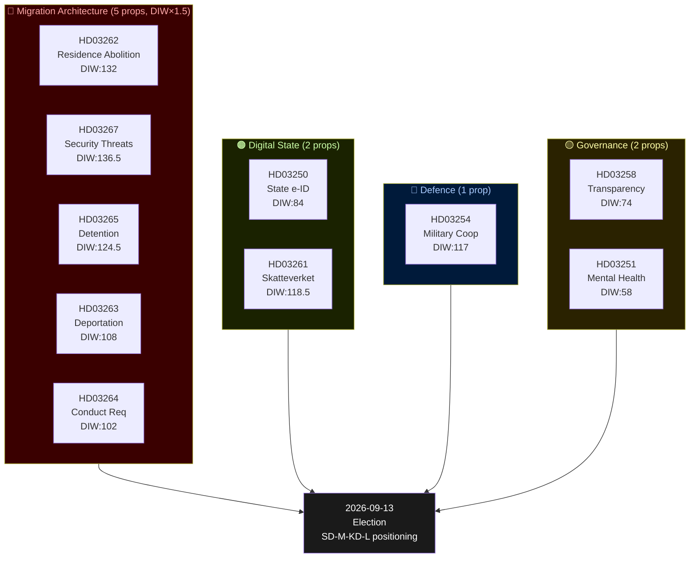

# Sweden's Pre-Election Security and Migration Overhaul: Busch Government Accelerates Legislative Sprint

**Date**: 2026-05-22
**Subfolder**: propositions
**Analyst**: James Pether Sörling
**Confidence**: HIGH (primary sources: riksdagen.se) / MEDIUM (PM transition context)
**Election proximity**: T-114 days to 2026-09-13 — DIW 1.5× multiplier active

## Lead Story

The Busch government has tabled ten propositions in the final weeks before Sweden's September 2026 election campaign proper begins, constructing the most comprehensive migration enforcement architecture in Swedish post-war history while simultaneously laying the digital identity infrastructure that will define the state's relationship with citizens and non-citizens alike. The full migration cluster — now comprising five interdependent propositions (HD03262, HD03263, HD03264, HD03265, HD03267) — abolishes permanent residence permits, tightens deportation procedures, imposes character requirements for all residence categories, strengthens supervision and detention powers, and introduces expedited removal of individuals deemed qualified security threats. The digital governance pillar (HD03250, HD03261) creates a state e-identity alternative to BankID and expands Skatteverket's authority in the population register. The military cooperation proposition (HD03254) signals deepening Nordic-NATO operational integration. The political transparency reform (HD03258) provides procedural cover for the more controversial measures. The mental health care proposition (HD03251) is the single social-democratic concession to the SoU committee's prior recommendations.

## DIW-Weighted Significance Ranking

Election proximity multiplier (1.5×) applied to migration, security, and defence propositions.

| Rank | dok_id | Title (abbreviated) | DIW Score | DIW×1.5 | Urgency | Committee | Impact Class |
|------|--------|---------------------|-----------|---------|---------|-----------|--------------|
| 1 | HD03262 | Abolition permanent residence + EU asylum pact | 88 | **132** | Critical | SfU | Constitutional |
| 2 | HD03267 | Security threat foreigners | 91 | **136.5** | Critical | JuU | Constitutional |
| 3 | HD03265 | Supervision and detention (new) | 83 | **124.5** | High | SfU | Structural |
| 4 | HD03254 | Military cooperation | 78 | **117** | High | FöU | Strategic |
| 5 | HD03250 | State e-identity | 84 | — | High | TU | Structural |
| 6 | HD03261 | Skatteverket population registry | 79 | **118.5** | High | SkU | Structural |
| 7 | HD03258 | Political transparency | 74 | — | High | KU | Normative |
| 8 | HD03263 | Deportation enforcement | 72 | **108** | High | SfU | Structural |
| 9 | HD03264 | Character/residence requirements | 68 | **102** | Moderate | SfU | Normative |
| 10 | HD03251 | Mental health/substance abuse care | 58 | — | Moderate | SoU | Social |

*DIW = Decisional Intelligence Weight (scale 0–100). Election multiplier 1.5× applied to HD03262, HD03267, HD03265, HD03254, HD03261, HD03263, HD03264 per methodology (contested policy areas, election ≤6 months away).*

## Integrated Intelligence Picture

**Cluster A — Migration Architecture Overhaul (Five Propositions)**

The five migration propositions form an interlocking system. HD03262 removes the legal foundation of permanent settlement: after implementation, no non-EU citizen can receive a permanent residence permit — only successive temporary permits renewable under increasingly strict conditions. This fundamentally restructures Sweden's relationship with its non-citizen population toward a revocable-guest model. HD03263 speeds deportation by removing procedural obstacles and creating dedicated enforcement units. HD03264 introduces a "conduct" standard (vandel) across all residence categories: criminal convictions, antisocial behaviour patterns, or administrative non-compliance become grounds for permit revocation. HD03265 expands supervision orders (elektronisk fotboja, reporting requirements) and pre-deportation detention capacity. HD03267 creates a fast-track judicial procedure specifically for individuals identified by SÄPO as qualified security threats — bypassing the ordinary Migrationsdomstolen queue.

The legislative coherence of this cluster is striking. Each proposition addresses a specific procedural gap that prior courts or ombudsmen had identified as limiting enforcement capacity. The net effect is a machinery designed to operate continuously — identifying, classifying, restricting, and eventually removing individuals who fail to meet an evolving standard of civic acceptability. This is governance-by-attrition applied to residence rights.

**Cluster B — Digital Identity and State Surveillance Capacity**

HD03250 creates a new state entity to issue e-legitimation that competes with BankID. The stated rationale is inclusion (those without bank accounts cannot access digital public services), but the architecture necessarily creates a centralized identity registry under Digg/Skatteverket control. HD03261 grants Skatteverket expanded investigative powers to cross-reference population register data against other government databases — nominally to detect address fraud, but creating a data-matching capability that has broad applications. Combined with the migration measures, these two propositions substantially expand the state's ability to identify, monitor, and act against individuals across multiple administrative systems.

**Cluster C — Defence and Security Signalling**

HD03254 (military cooperation) enables Swedish armed forces to conduct joint operations with Nordic-NATO partners on Swedish territory without requiring individual Riksdag approval per operation. This is legally significant: it transfers operational flexibility to the executive while technically remaining within existing constitutional frameworks (Sweden's constitution requires Riksdag consent for foreign troops on Swedish soil, but this proposition establishes a framework treaty that pre-authorises classes of cooperation). Given Sweden's recent NATO accession, this is more procedural than political, but the FöU committee will scrutinise the scope.

**Cluster D — Governance and Social Reform**

HD03258 (political transparency) mandates disclosure of political donations above SEK 25,000 and creates a public register of party financing. This is genuine reform but narrower than opposition demands — it excludes anonymous secondary donations channelled through associations and does not address lobbying registration. HD03251 (mental health/substance abuse) integrates care pathways for co-occurring disorders, reducing handoffs between SoC and region psychiatry. Politically uncontroversial but operationally complex.

**IMF Economic Context**

Sweden GDP growth: 2.2% projected (WEO Apr-2026, NGDP_RPCH). General government gross debt: ~38.0% GDP (WEO Apr-2026, GGXWDG_NGDP). Inflation: 2.1% (CPI Apr-2026). Unemployment: ~8.3% (SCB). The fiscal position provides the government headroom to fund enforcement capacity expansion without triggering a budget crisis. However, the implementation costs of the five migration propositions — new detention facilities, deportation flights, expanded SÄPO capacity, digital system upgrades — are not fully costed in the propositions and will likely appear in the autumn budget.

## Mermaid Cluster Diagram

## Strategic Assessment

The Busch government's legislative batch is coherent in political-electoral logic: it delivers on the SD supply-and-confidence agenda for the fifth consecutive year while signalling that KD (Busch herself as PM) has successfully absorbed the SD programme without formal coalition membership. The strategy has two vulnerabilities: (1) Centerpartiet, which had previously supported the government on many migration votes, faces an internal revolt if HD03262 passes — permanent residence abolition is a redline for the C parliamentary group's European liberal wing; (2) the implementation costs and administrative burden of the full migration cluster exceed current agency capacity by a significant margin (Statskontoret and Migrationsverket both flagged implementation risks in prior remiss rounds).

**Key Analytical Judgment**: The five migration propositions, taken together, constitute the most significant peacetime alteration of Sweden's migration legal framework since the 1989 Aliens Act. They will be contested in committee, potentially amended by the C demands, and challenged in the European Court of Human Rights and Swedish Administrative Courts post-enactment. The political calculus for the election is clear: the government wants these propositions associated with a "tough but effective" brand in the September 2026 campaign, regardless of whether full implementation is achievable by then.
