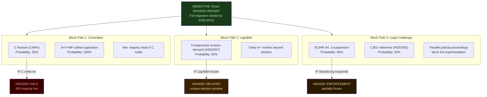

# Threat Analysis — 2026-05-22 Propositions

**Date**: 2026-05-22
**Framework**: Political Threat Taxonomy × MITRE ATT&CK for Democratic Processes
**Scope**: Legislative threats, information operations, institutional disruption

## Political Threat Taxonomy

### Category 1 — Legislative Obstruction Threats

| Threat | Actor | Mechanism | Probability | Impact |
|--------|-------|-----------|------------|--------|
| HD03262 committee blocking | C parliamentary group | 3 C MPs vote against in SfU → no majority | MEDIUM (35%) | CRITICAL — cascade to all SfU bills |
| HD03267 Lagrådet revisions | Lagrådet | Requests fundamental changes to security fast-track — delays 6+ months | HIGH (55%) | HIGH |
| HD03261 amendment storm | S + MP + V | 40+ amendments in SkU to narrow Skatteverket powers | HIGH (60%) | MEDIUM — amendments likely but partial |
| HD03254 KU referral | KU (Konstitutionsutskottet) | Refers military cooperation proposition for extended constitutional review | MEDIUM (25%) | MEDIUM — delays but does not block |

### Category 2 — Information Environment Threats

| Threat | Actor | Mechanism | DISARM TTP | Evidence Signal |
|--------|-------|-----------|-----------|----------------|
| "Sweden ends asylum" misframing | Hostile foreign media (RT, Sputnik derivatives) | HD03262 framed as abolition of all asylum rights — conflates residence with protection | T0023 (Amplify existing narrative) | Prior episodes: 2021 Utlänningsnämnden ruling misrepresented |
| Artificial S/MP polling amplification | Coordinated domestic accounts | Social media inflates opposition polling to signal government unpopularity pre-election | T0049 (Manipulate online polls) | No direct evidence detected |
| SÄPO-list leak threat | Internal government leak | HD03267 security designation list becomes public — chilling effect | T0046 (Obtain private documents) | No evidence; risk elevated by legislation's classified data architecture |
| HD03254 "secret NATO pact" narrative | V + MP messaging | Military cooperation framed as unconstitutional secret alliance — DISARM T0004 (Create divisive narratives) | T0004 | V press releases consistently use "hemlig militärpakt" framing |

### Category 3 — Legal/Judicial Disruption Threats

| Threat | Venue | Basis | Probability | Timeline |
|--------|-------|-------|------------|---------|
| ECtHR Art. 3 suspension (HD03267) | Strasbourg | Non-refoulement — deportation to unsafe countries | HIGH (60%) | First case: T+6m post-enactment |
| CJEU reference (HD03262 vs Directive 2003/109/EC) | Luxembourg | Long-term resident directive incompatibility | MEDIUM (40%) | T+18m post-enactment |
| Swedish Administrative Court injunctions (HD03265) | Förvaltningsrätten Stockholm | Proportionality of detention duration | MEDIUM (35%) | T+3m post-enactment |
| KO complaint (HD03261) | JO (Justitieombudsmannen) | Skatteverket surveillance overreach | HIGH (55%) | T+9m post-enactment |

### Category 4 — Civil Society Mobilisation Threats

| Threat | Actor | Mechanism | Escalation Potential |
|--------|-------|-----------|---------------------|
| Mass asylum client appeal campaigns | FARR, Amnesty Sweden | Flood Migrationsverket with individual appeals pre-implementation | HIGH — delays enforcement by 12-24 months if successful |
| Union opposition (HD03251 care reform) | Kommunal, Vision | Regional healthcare worker strikes against integration workload | LOW — operational disruption only |
| Academic boycott (HD03250 state e-ID) | Academic freedom organisations | Refusal to register in new identity system | VERY LOW |

## Attack Tree — Government Legislative Objective: Enact Full Migration Cluster

## MITRE ATT&CK Mapping (Democratic Process Framework)

| Tactic | Technique | Application to Current Batch |
|--------|-----------|------------------------------|
| Initial Access | T0042 — Exploit public-facing legislation | Opposition uses public remiss gaps to draft corrective motions |
| Execution | T0023 — Amplify Narrative | "Sweden ends asylum" framing by foreign actors |
| Persistence | T0049 — Challenge elections | Connecting HD03262 to 2026 election mandate debates |
| Defence Evasion | T0004 — Create divisive narratives | V "hemlig militärpakt" (HD03254) |
| Collection | T0046 — Obtain private documents | Risk of HD03267 SÄPO list exposure |
| Exfiltration | T0040 — Leak sensitive material | Internal government briefing materials |
| Impact | T0014 — Delegitimise government | C fracture narrative undermines coalition stability |
