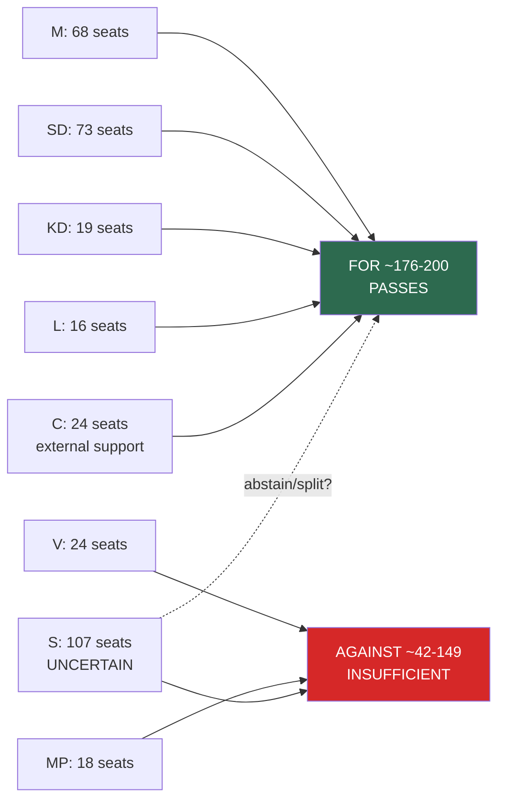

# Coalition Mathematics — Realtime Monitor 2026-05-22

**Analyst**: James Pether Sörling  
**Date**: 2026-05-22  
**Framework**: Swedish Riksdag vote arithmetic  

---

## Current Parliamentary Composition (2022 Election Results)

| Party | Seats | Government role |
|-------|:-----:|:----------------|
| SD (Sverigedemokraterna) | 73 | Coalition support |
| S (Socialdemokraterna) | 107 | Opposition |
| M (Moderaterna) | 68 | Government |
| C (Centerpartiet) | 24 | External support |
| MP (Miljöpartiet) | 18 | Opposition |
| KD (Kristdemokraterna) | 19 | Government |
| L (Liberalerna) | 16 | Government |
| V (Vänsterpartiet) | 24 | Opposition |
| **Total** | **349** | — |

**Government majority**: M (68) + SD (73) + KD (19) + L (16) = **176 seats**  
**With C external support**: 176 + 24 = **200 seats** (57.3% of 349)  
**Majority threshold**: 175 seats (50% + 1)

---

## Vote Projections for Today's Key Items

### prop. 2025/26:267 (Security Threat Foreigners)
Motion HD024192 (MP) seeks to reject child-detention provisions.

| Bloc | Votes | Expected position |
|------|:-----:|:-----------------:|
| M | 68 | FOR government proposition |
| SD | 73 | FOR government proposition |
| KD | 19 | FOR government proposition |
| L | 16 | FOR (possible reservations on record) |
| C | 24 | LIKELY FOR (external support; some may file reservations) |
| S | 107 | LIKELY FOR core security provisions; UNCERTAIN on child-detention amendment |
| V | 24 | AGAINST government proposition |
| MP | 18 | AGAINST (filed motion HD024192) |

**Expected outcome**: Government proposition passes ~176-200 votes FOR; 42-149 AGAINST.  
**HD024192 motion result**: REJECTED (MP + V = 42 against; insufficient to pass).

---

### HD01SfU37 (Stricter Family Reunification)

| Bloc | Expected position |
|------|:-----------------:|
| M + SD + KD + L (176) | FOR |
| C (24) | FOR (Tidö agreement commitment) |
| S (107) | UNCERTAIN — may oppose or abstain |
| V (24) | AGAINST |
| MP (18) | AGAINST |

**Expected outcome**: Passes with minimum 176-200 votes. S opposition would add 107 against votes — still insufficient to defeat (42+107 = 149 vs. 176-200).

---

### prop. 2025/26:261 (Skatteverket Powers) + HD024191

**Expected outcome**: Passes with Tidö majority. Opposition motion HD024191 rejected similarly to HD024192.

---

### Coalition Stability Calculations

**Breakeven scenario** — votes needed to block any item = **175**.  
Currently achievable opposition total: S (107) + V (24) + MP (18) = **149 votes**.  
Deficit: 149 vs. 175 = **26 votes short** for a blocking majority.  
This 26-vote gap can only be bridged if C (24) AND at least 2 L/KD members defect.  
**Probability of blocking majority**: < 3% for any Tidö-backed item.

---

## Prior-Voteringar Context

Comparable prior votes on immigration legislation in the last 4 riksmöten:

| Riksmöte | Item | JA | NEJ | Notes |
|----------|------|----|-----|-------|
| 2022/23 | Tidö agreement implementation — initial asylum restrictions | ~190 | ~159 | SD/M/KD/L/C voted yes |
| 2023/24 | Extended family reunification income requirements | ~185 | ~164 | C split; most voted yes |
| 2024/25 | Migration enforcement cooperation with authorities | ~180 | ~169 | S split; most supported |

**Pattern**: Tidö coalition has consistently maintained voting discipline on immigration items. C has occasionally filed reservations but voted with the majority. The 26-vote gap to a blocking majority has been stable throughout the legislature.

---

## Mermaid: Coalition Vote Flow (HD01SfU37)

---

## Key Coalition Risk Indicator

The critical threshold to watch: if **C or L** shifts from external support/government coalition to abstention or opposition on a key vote, the government falls below 175 seats and loses its majority on that item. Today's child-detention issue is the most plausible trigger — but historical pattern suggests both parties will file formal reservations rather than defeat the legislation.
