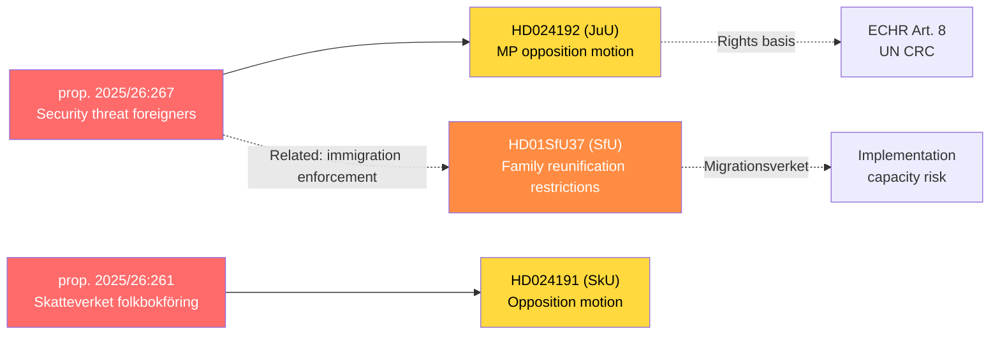
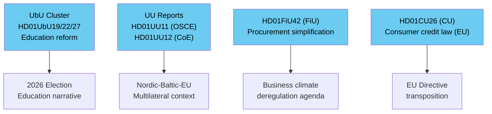

# Cross-Reference Map — Realtime Monitor 2026-05-22

**Analyst**: James Pether Sörling  
**Date**: 2026-05-22  

---

## Document Cross-References

### Legislative Cluster: Security-State Expansion

### Committee Report Cluster

---

## Thematic Cross-References

| Document | Related Document | Relationship |
|----------|-----------------|-------------|
| HD024192 (JuU) | HD01SfU37 (SfU) | Both address migration enforcement; security framing vs. humanitarian framing |
| HD024192 (JuU) | HD01UU12 (UU-CoE) | CoE monitoring of Sweden's rights record directly relevant to child-detention challenge |
| HD024191 (SkU) | HD01FiU42 (FiU) | Both involve administrative capacity of state agencies (Skatteverket / procurement authorities) |
| HD01UbU22 (school safety) | HD10504 (boarding school violence) | Both address child safety in educational settings; complementary legislative signals |
| HD11830 (Iran/Kurdish attacks) | HD01UU11 (OSCE) | Both address authoritarian-state threats to dissidents; OSCE monitoring mandate overlap |
| HD11832 (Turkmenistan cotton/forced labour) | HD01UU12 (CoE) | Both address human rights in third countries; CoE and EU trade-sanctions linkage |
| HD10503 (FMV garrison towns) | HD10502 (physical fitness) | Both signal ongoing Swedish defence readiness concerns post-NATO accession |

---

## Key Proposition-Motion Linkages

| Proposition | Motion(s) | Committee | Expected Vote Outcome |
|-------------|-----------|-----------|----------------------|
| prop. 2025/26:267 | HD024192 (MP) | JuU | Motion likely rejected; Tidö majority |
| prop. 2025/26:261 | HD024191 (opposition) | SkU | Motion likely rejected; Tidö majority |

---

## Inter-Agency Reference Web

| Agency | Documents | Role |
|--------|-----------|------|
| Skatteverket | prop. 2025/26:261 / HD024191 | Implementing agency + subject of expanded mandate |
| Migrationsverket | HD01SfU37 | Primary implementing agency |
| Skolinspektionen | HD01UbU22 | Supervision/enforcement role |
| Upphandlingsmyndigheten | HD01FiU42 | Guidance authority |
| FMV | HD10503 | Subject of interpellation |
| Barnombudsmannen | HD024192 | Rights monitoring role (prop. 2025/26:267) |

---

## Tier-C Sibling Folder Cross-References (Prior 7 Days)

| Date | Subfolder | Thematic Continuity | Key Artifact |
|------|-----------|---------------------|--------------|
| 2026-05-22 | propositions | Today's propositions cycle — prop. 2025/26:267 and prop. 2025/26:261 are the source instruments for HD024192/HD024191 opposition motions analysed here | analysis/daily/2026-05-22/propositions/ |
| 2026-05-22 | committee-reports | Today's committee-reports cycle covers FiU, UbU, SfU, CU, UU betänkanden — direct continuity with HD01FiU42, HD01SfU37, HD01UbU19/22/27, HD01CU26, HD01UU11/12 | analysis/daily/2026-05-22/committee-reports/ |
| 2026-05-22 | week-ahead | Week-ahead cycle provides T+7d forecast context for JuU/SfU/SkU committee vote scheduling | analysis/daily/2026-05-22/week-ahead/ |
| 2026-05-21 | realtime-pulse | Prior-day realtime cycle — immigration and security legislative cluster pre-cursor signals | analysis/daily/2026-05-21/realtime-pulse/ |
| 2026-05-21 | propositions | Prior-day propositions — legislative sprint continuity | analysis/daily/2026-05-21/propositions/ |
| 2026-05-21 | evening-analysis | Prior-day evening analysis — full-day synthesis that today's realtime cluster builds on | analysis/daily/2026-05-21/evening-analysis/ |
| 2026-05-20 | evening-analysis | 2-day prior evening analysis — cross-cycle pattern validation for Tidö legislative sprint | analysis/daily/2026-05-20/evening-analysis/ |
