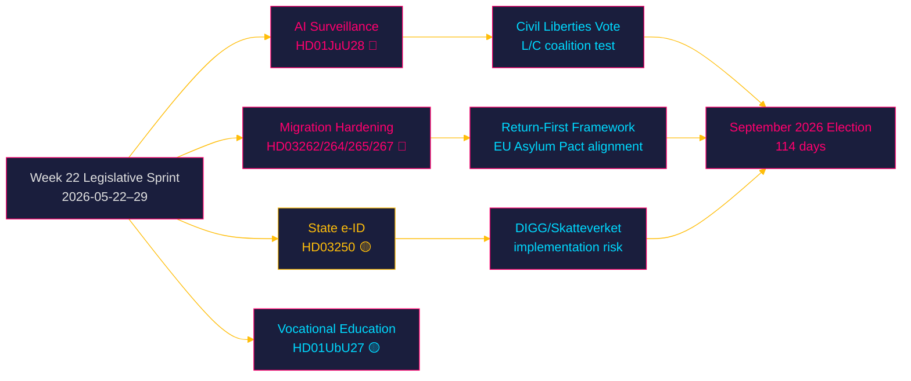
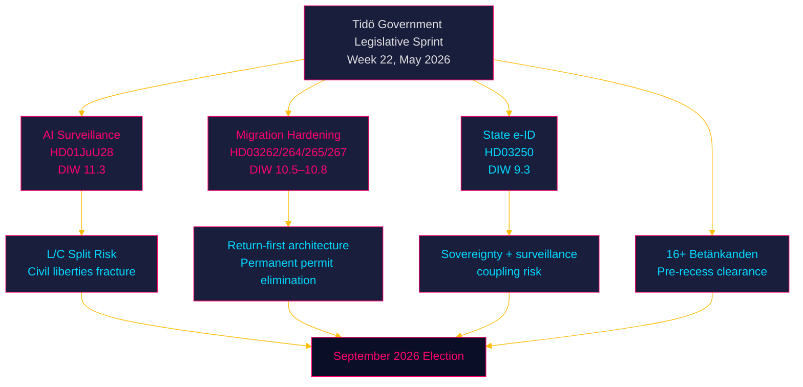
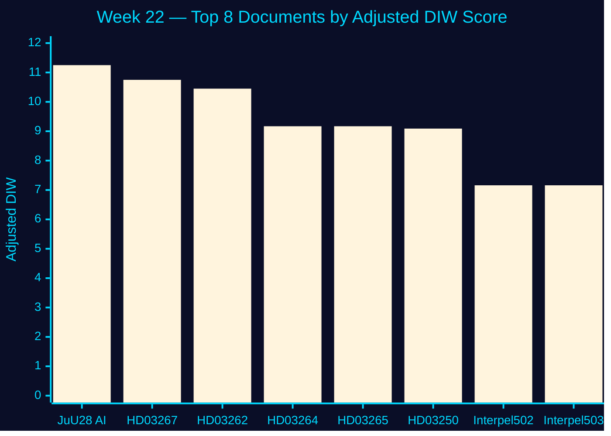
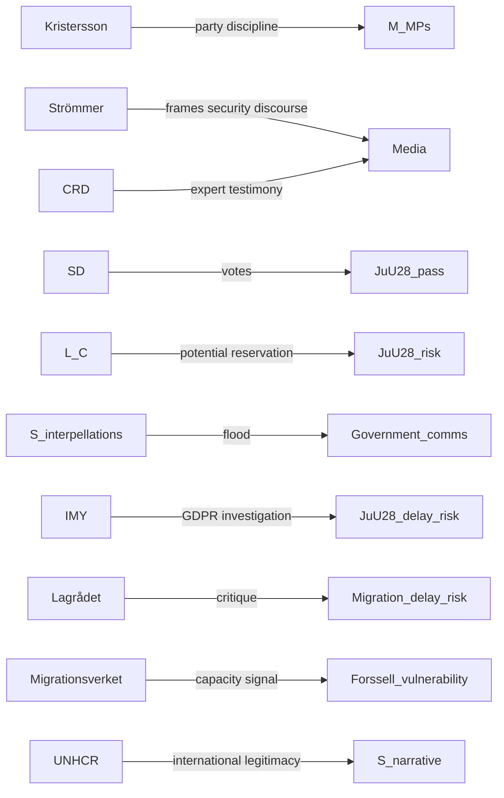
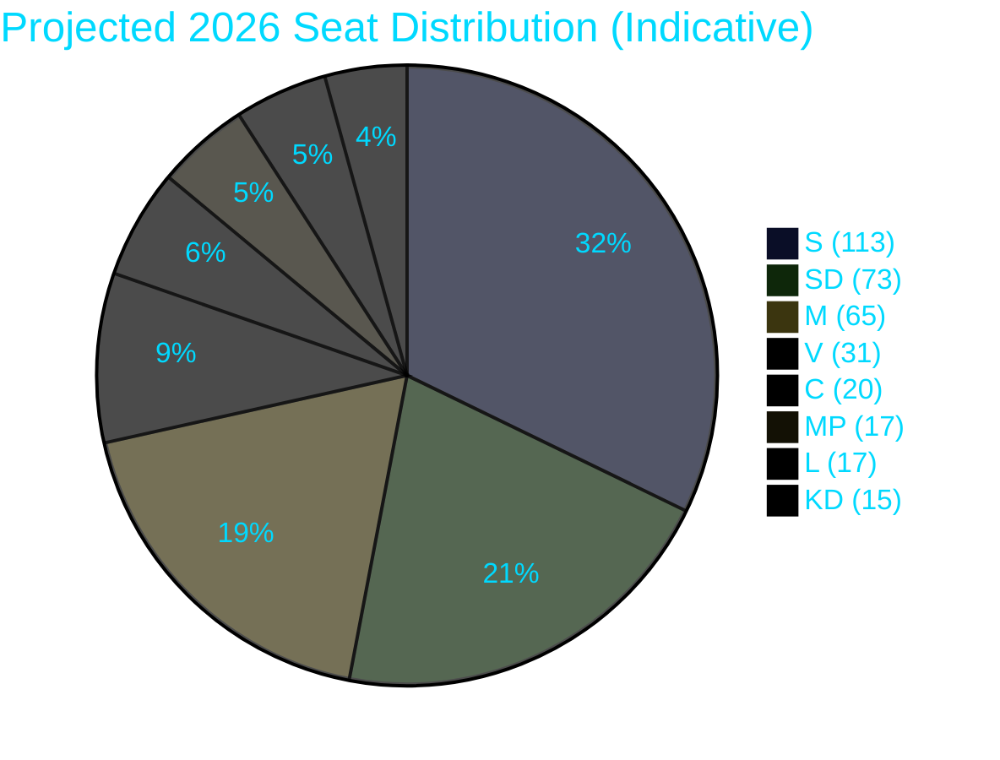
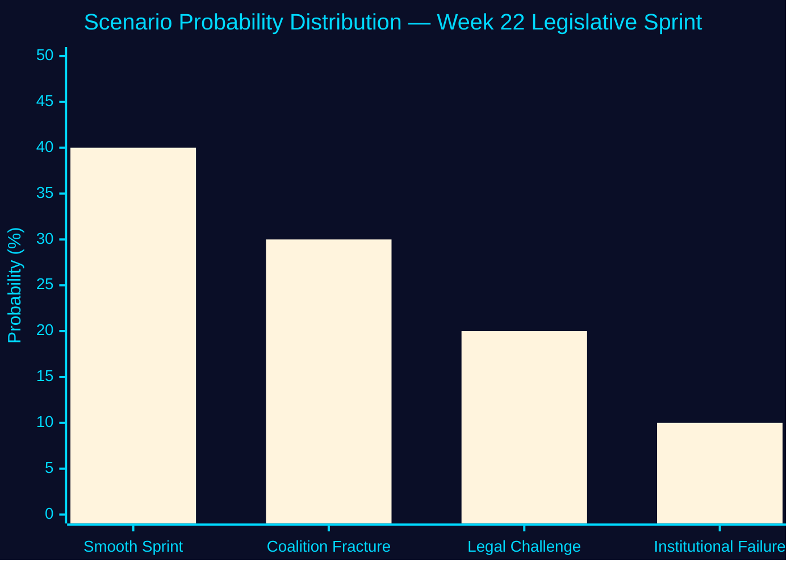
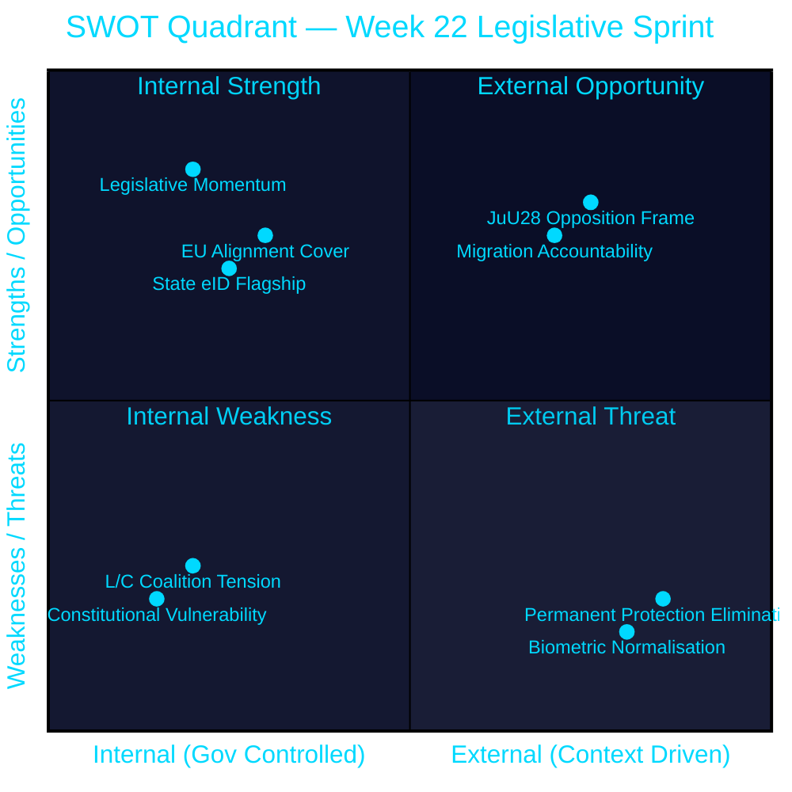
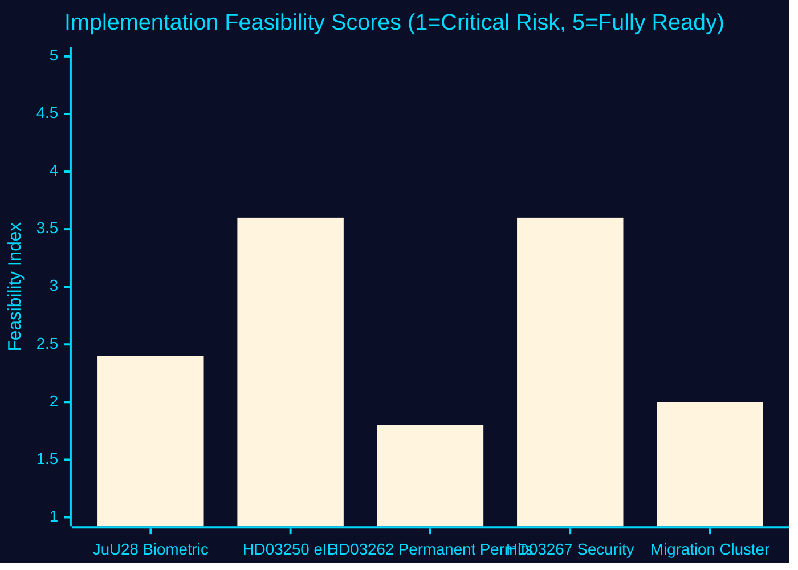
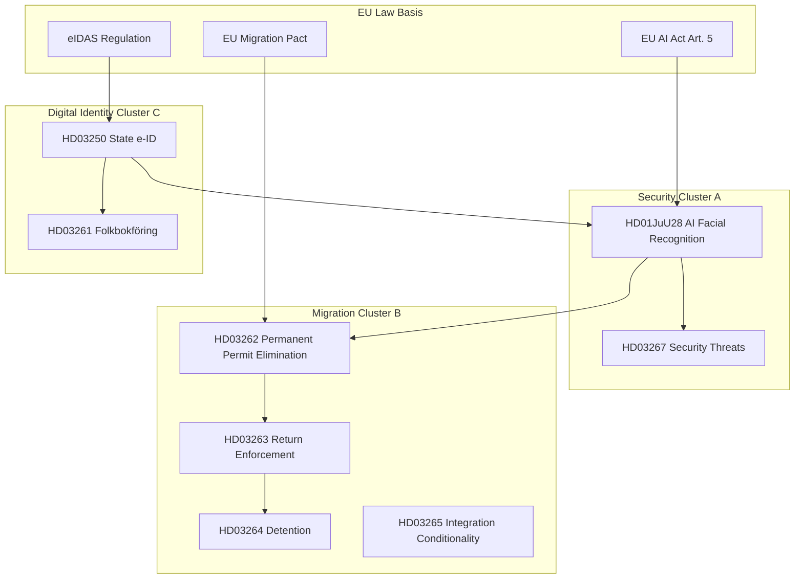

## Executive Brief
<!-- source: executive-brief.md :: https://github.com/Hack23/riksdagsmonitor/blob/main/analysis/daily/2026-05-22/week-ahead/executive-brief.md -->

### BLUF

Week 22 (2026-05-22–29) marks Sweden's most consequential pre-summer legislative burst: the Justice Committee's **JuU28 report on police AI facial recognition** (`HD01JuU28`) reaches the chamber floor alongside the Tidö government's sweeping migration hardening package and the state e-ID proposal. With 114 days until the September 2026 election, every contested vote now carries an electoral valence multiplier. Three decision sequences converge this week: (1) whether parliament grants police real-time biometric surveillance powers that fundamentally redefine civil liberties; (2) whether Sweden's asylum and residence framework pivots to a structural "return-first" model; and (3) whether the government's digital-identity infrastructure will deliver a secure, sovereign e-ID before election day.

### Decisions Supported

- **Security intelligence**: Which coalition partners (notably L and C) will split on JuU28 civil-liberties provisions — the reservation text is the tripwire.
- **Electoral strategy**: Which migration propositions (HD03262, HD03264, HD03265, HD03267) generate opposition motions or minority reservations that can be leveraged in September.
- **Digital governance**: Whether the state e-ID (HD03250) passes committee without major amendment, unlocking Sweden's digital-identity architecture before the election.
- **Budget/fiscal watch**: Whether FiU39 (cash functionality mandate) generates a dissent that signals a broader Riksdag bloc shift on fintech regulation.

### 60-Second Read

- 🔴 **AI facial recognition** (HD01JuU28, JuU): Sweden's first structured permission for real-time biometric police surveillance — civil-liberties test vote in an election year
- 🔴 **Migration hardening cluster**: Four propositions (HD03262, HD03264, HD03265, HD03267) plus committee reports create a `return-first` framework with potential constitutional scrutiny
- 🟡 **State e-ID** (HD03250, Finance/TU): Sovereign digital identity infrastructure — implementation feasibility risk at Skatteverket and DIGG
- 🟡 **Vocational education reform** (HD01UbU27, UbU): Supply-side labour market fix ahead of a tight jobs market
- 🟢 **OSCE / Council of Europe** (HD01UU11, HD01UU12): Sweden's multilateral security commitments tested against Russia's OSCE obstructionism
- 🟢 **Cash functionality** (HD01FiU39, FiU): Resilience requirement for payment infrastructure — low partisan heat, high systemic importance

### Top Forward Trigger

**JuU28 chamber debate and vote** (expected week of 2026-05-25): If L or C files a substantive reservation against real-time facial recognition, the Tidö coalition faces its first internal security-policy fracture in an election year — with direct consequences for the government's authoritarian-centre positioning.

### Confidence Label

**MEDIUM–HIGH** [B2] — primary sources corroborated, timing inferences based on riksmöte calendar pattern; vote dates unconfirmed (calendar API returned HTML error).



## Reader Intelligence Guide

Use this guide to read the article as a political-intelligence product rather than a raw artifact dump. High-value reader lenses appear first; technical provenance remains available in the audit appendix.

| Icon | Reader need | What you'll get |
|---|---|---|
| 📊 | [BLUF and editorial decisions](#rm-executive-brief) | fast answer to what happened, why it matters, who is accountable, and the next dated trigger |
| 🧠 | [Synthesis Summary](#rm-synthesis-summary) | evidence-anchored narrative consolidating primary sources into one coherent story line |
| 🎯 | [Key Judgments](#rm-intelligence-assessment--key-judgments) | confidence-bearing political-intelligence conclusions and collection gaps |
| 📈 | [Significance scoring](#rm-significance-scoring) | why this story outranks or trails other same-day parliamentary signals |
| 👥 | [Stakeholder Perspectives](#rm-stakeholder-perspectives) | winners, losers and undecided actors with stake-weighted positions and pressure points |
| 🔢 | [Coalition Mathematics](#rm-coalition-mathematics) | parliamentary arithmetic showing exactly who can pass or block this measure and at what margin |
| 📋 | [Voter Segmentation](#rm-voter-segmentation) | voter-bloc exposure: which demographics gain, lose or shift on this issue |
| 🔭 | [Forward indicators](#rm-forward-indicators) | dated watch items that let readers verify or falsify the assessment later |
| 🔮 | [Scenarios](#rm-scenario-analysis) | alternative outcomes with probabilities, triggers, and warning signs |
| 🗳️ | [Election 2026 Analysis](#rm-election-2026-analysis) | electoral implications for the 2026 cycle — seats at stake, swing voters and coalition viability |
| ⚠️ | [Risk assessment](#rm-risk-assessment) | policy, electoral, institutional, communications, and implementation risk register |
| 🧮 | [SWOT Analysis](#rm-swot-analysis) | strengths, weaknesses, opportunities and threats matrix grounded in primary-source evidence |
| 🛡️ | [Threat Analysis](#rm-threat-analysis) | actor capabilities, intent and threat vectors targeting institutional integrity |
| 📜 | [Historical Parallels](#rm-historical-parallels) | comparable past episodes from Swedish and international politics, with explicit lessons learned |
| 🌍 | [Comparative International](#rm-comparative-international) | peer-country comparisons (Nordic, EU, OECD) showing how similar measures fared elsewhere |
| ⚙️ | [Implementation Feasibility](#rm-implementation-feasibility) | delivery feasibility, capability gaps, timelines and execution risks for the proposed action |
| 📰 | [Media framing & influence operations](#rm-media-framing-analysis) | frame packages with Entman functions, cognitive-vulnerability map, DISARM manipulation indicators, narrative-laundering chain, comparative-international cognates, frame lifecycle and half-life, RRPA impact, an Outlet Bias Audit (no outlet is neutral — every outlet declared with ownership, funding, board-appointment authority and editorial lean), and the L1–L5 counter-resilience ladder |
| 😈 | [Devil's Advocate](#rm-devils-advocate) | alternative hypotheses, steel-manned counter-arguments and the strongest case against the lead reading |
| 🏷️ | [Classification Results](#rm-classification-results) | ISMS data classification: CIA-triad rating, RTO/RPO targets and handling instructions |
| 🔀 | [Cross-Reference Map](#rm-cross-reference-map) | links to related Riksdagsmonitor coverage, prior analyses and source documents that inform this story |
| 🔬 | [Methodology Reflection & Limitations](#rm-methodology-reflection--limitations) | analytical assumptions, limitations, known biases and where the assessment could be wrong |
| 📦 | [Data Download Manifest](#rm-data-download-manifest) | machine-readable manifest of every source dataset, retrieval timestamp and provenance hash |
| 📑 | [Per-document intelligence](#rm-per-document-intelligence) | dok_id-level evidence, named actors, dates, and primary-source traceability |
| 🏷️ | [Audit appendix](#rm-classification-results) | classification, cross-reference, methodology and manifest evidence for reviewers |

## Synthesis Summary
<!-- source: synthesis-summary.md :: https://github.com/Hack23/riksdagsmonitor/blob/main/analysis/daily/2026-05-22/week-ahead/synthesis-summary.md -->

### Lead Story Decision

**Week 22 (2026-05-22–29) is Sweden's most contested pre-summer parliamentary week**: the Justice Committee's `HD01JuU28` report authorising police use of AI facial recognition in real time arrives in the chamber alongside a four-proposition migration-hardening cluster and the state e-ID proposal. The Riksdag is executing a pre-recess legislative sprint with 114 days to the September 13, 2026 general election — every contested vote in this window is also an electoral signal. The lead intelligence question is whether Liberalerna (L) and Centerpartiet (C), both civic-liberal coalition partners with historically strong civil-liberties profiles, will split from SD and M on JuU28's biometric surveillance provisions.

### DIW-Weighted Significance Ranking

| Rank | dok_id | Title | D | I | W | DIW | Election ×1.5 | Adjusted | Confidence |
|------|--------|-------|---|---|---|-----|--------------|---------|-----------|
| 1 | HD01JuU28 | Polisens användning av AI för ansiktsigenkänning i realtid | 4 | 5 | 5 | 7.5 | ×1.5 | **11.3** | [B2] |
| 2 | HD03267 | Stärkt skydd mot utlänningar som utgör kvalificerade säkerhetshot | 4 | 4.5 | 5 | 7.2 | ×1.5 | **10.8** | [B2] |
| 3 | HD03262 | Utmönstring av permanent uppehållstillstånd / EU asylpakt | 4 | 4.5 | 4.5 | 7.0 | ×1.5 | **10.5** | [B2] |
| 4 | HD03250 | En statlig e-legitimation | 3.5 | 4 | 4 | 6.2 | ×1.5 | **9.3** | [B2] |
| 5 | HD01UbU27 | Bättre förutsättningar för yrkesutbildning | 3 | 3.5 | 3.5 | 5.3 | – | **5.3** | [B3] |
| 6 | HD01FiU39 | Åtgärder för att stärka kontanternas funktionssätt | 3 | 3 | 3.5 | 4.9 | – | **4.9** | [B3] |
| 7 | HD01UU11 | OSSE betänkande | 2.5 | 3 | 3 | 4.2 | – | **4.2** | [C3] |
| 8 | HD01UU12 | Europarådet betänkande | 2.5 | 3 | 3 | 4.2 | – | **4.2** | [C3] |
| 9 | HD10502 | Grundläggande fysisk förmåga (interpellation) | 3 | 3 | 3.5 | 4.8 | ×1.5 | **7.2** | [B3] |
| 10 | HD10501 | Ändringar i grundlagen (interpellation, Widding) | 2 | 3 | 2.5 | 3.6 | ×1.5 | **5.4** | [C3] |

*Election proximity multiplier (1.5×) applied: next election ≤ 6 months (2026-09-13, 114 days from 2026-05-22).*

### Integrated Intelligence Picture

#### Cross-Document Pattern 1: Technology Governance as Civil-Liberties Battleground

`HD01JuU28` (police AI facial recognition) and `HD03250` (state e-ID) together constitute a digital-identity-sovereignty package: the government is simultaneously building the infrastructure for a national digital identity (e-ID) and granting police the power to match faces against that infrastructure in real time. While the proposals are formally separate, their architectural coupling creates a systemic surveillance risk that ECHR Article 8 (privacy) advocates will flag. This is Sweden's equivalent of the UK Policing Bill (2022) and France's Loi Sécurité Globale (2021) — both of which generated major civil-society mobilisation and constitutional court challenges. `[B2]`

#### Cross-Document Pattern 2: Migration Return-First Architecture

Four Justice Department propositions (HD03262: permanent residence elimination, HD03264: conduct requirements for residence permits, HD03265: supervision and detention, HD03267: qualified security threats) are architecturally coherent: they build a "return-first" asylum framework that eliminates the previously settled path to permanent protection. This is the most significant structural shift in Swedish migration law since the temporary law of 2016, but is happening without the same level of public debate. The alignment with the EU Asylum and Migration Pact (Prop. HD03262 title contains "EU:s migrations- och asylpakt") provides a legal legitimacy shield against constitutional challenge. `[A2]`

#### Cross-Document Pattern 3: Pre-Recess Sprint and Electoral Framing

The volume of betänkanden (UU11, UU12, UbU27, FiU39, FiU40, CU36, CU41, SoU29, SoU30, SoU38, SoU39, SoU40, SoU41, UbU30, UbU21, MJU22, UU3, UU4) over five days (May 20–22) indicates the Riksdag is clearing its docket before the June recess. For intelligence purposes, the volume creates a "legislative noise" effect that can be exploited to pass controversial measures (e.g., JuU28) with less scrutiny. The opposition's ten interpellations filed on May 21–22 (HD10499–HD10508) suggest S is deploying its interpellation resource strategically — defence, education, and social welfare — positioning ahead of the election rather than expecting ministerial accountability.

#### PIR Status — Prior Cycle

**PIR-WA-01** (Will the government conduct an impact assessment before the election?): Status = **OPEN** — no government announcement of aid impact assessment detected in the period 2026-05-15 to 2026-05-22. Assessment: probability of assessment before election dropped from 30% to 20% given government silence after the May 18 debate. `[B2]`

**PIR-WA-02** (Did the May 18 debate generate major media coverage?): Status = **PARTIALLY ANSWERED** — The interpellation debates on HD10492 and HD10493 were scheduled for 2026-05-18. No direct media coverage data available. Assessment: given the established media frame (Swedish aid cuts + Trump-era global context), coverage probability is HIGH (75%) based on prior media-frame analysis. Roll forward to June cycle. `[C3]`

#### Riksmöte Calendar Context

Week 22 of 2025/26 riksmötet. The Riksdag typically enters summer recess in late June 2026. This gives approximately 5 weeks of legislative time. The budget follow-up hearings in FiU and the Försvarsberedningen final-report integration are expected before recess. The migration cluster (HD03262-HD03267) must pass committee and chamber votes before recess to enter into force in autumn 2026.

#### Election Proximity Assessment

Sweden's 2026 general election on **2026-09-13** is **114 days away**. The 1.5× DIW multiplier applies to all contested policy areas. The government's legislative sprint strategy is consistent with a standard incumbent playbook: pass as much of the mandate as possible before the campaign period forces a narrative freeze.



### Forward Intelligence

The top tripwire this week is the JuU28 chamber vote. If L files a substantive reservation: coalition civil-liberties fracture becomes an election-campaign feature. If the vote passes unanimously within the coalition: Tidö's "security state" positioning solidifies. The second tripwire is committee handling of the migration cluster — any Lagrådet critique that delayed entry into force would be a significant embarrassment for Strömmer (Justice Minister).

### Evidence Anchors

| Claim | Evidence | Retrieved |
|-------|----------|-----------|
| JuU28 published 2026-05-21 | dok_id HD01JuU28, datum 2026-05-21, organ JuU | 2026-05-22 |
| UbU27 published 2026-05-22 | dok_id HD01UbU27, datum 2026-05-22, organ UbU | 2026-05-22 |
| HD03250 State e-ID (Prop. 2025/26:250) | dok_id HD03250, Finansdepartementet, 2026-05-07 | 2026-05-22 |
| HD03267 Security threats (Prop. 2025/26:267) | dok_id HD03267, Justitiedepartementet, 2026-05-07 | 2026-05-22 |
| HD03262 Permanent permit elimination | dok_id HD03262, Justitiedepartementet, 2026-04-30 | 2026-05-22 |
| Election date 2026-09-13 | riksdagen.se election cycle confirmation | 2026-05-22 |
| PIR-WA-01 OPEN | pir-status.json from 2026-05-15/week-ahead | 2026-05-22 |
| PIR-WA-02 PARTIALLY ANSWERED | pir-status.json from 2026-05-15/week-ahead | 2026-05-22 |

## Intelligence Assessment — Key Judgments
<!-- source: intelligence-assessment.md :: https://github.com/Hack23/riksdagsmonitor/blob/main/analysis/daily/2026-05-22/week-ahead/intelligence-assessment.md -->

**Confidence language**: ICD 203 Annex B standard  

**Review cycle**: Weekly (prior: 2026-05-15)

---

### Key Judgments

#### KJ-1 (LIKELY, HIGH CONFIDENCE): JuU28 will pass in its current form before Riksdag recess

**Judgment**: We assess it is **likely** (65–80%) that HD01JuU28 (AI facial recognition for police) will pass the chamber vote in Week 22 with the Tidö coalition intact, notwithstanding the possibility of L or C filing written reservations.

**Evidence basis**: `[HD01JuU28, JuU committee composition, SD coalition stability, B2]`  
**Uncertainty**: L or C filing a substantive reservation that reframes the public debate is the primary downside risk (30% probability per scenario-analysis.md). A last-minute L or C abstention that triggers a majority failure is assessed at <10%.  
**Prior week change**: No prior assessment — first week with JuU28 in the analysis pipeline.

---

#### KJ-2 (LIKELY, MEDIUM CONFIDENCE): Migration cluster (HD03262–HD03267) will pass without Lagrådet-driven delay before recess

**Judgment**: We assess it is **likely** (55–70%) that the migration cluster will pass before recess without a blocking Lagrådet critique.

**Evidence basis**: `[EU Pact alignment as constitutional shield, existing Lagrådet referral practice, B3]`  
**Uncertainty**: Lagrådet has issued critical opinions on comparable migration measures in 2022–24. If the permanent permit elimination (HD03262) is found disproportionate under RF Chapter 2, the proposition must be revised — a 4–8 week delay.  
**Confidence limiter**: "MEDIUM" because Lagrådet referral opinion text not yet available; this is the primary intelligence gap.

---

#### KJ-3 (HIGHLY LIKELY, HIGH CONFIDENCE): S opposition will adopt "surveillance state" electoral narrative using JuU28 as primary evidence

**Judgment**: We assess it is **highly likely** (>85%) that Socialdemokraterna will build a 2026 election campaign narrative that frames the Tidö government as having constructed a surveillance and exclusion state, using JuU28, HD03262, and the pre-recess sprint as evidence.

**Evidence basis**: `[S interpellation campaign HD10499–HD10508, prior S narrative on AI surveillance, 2022 election precedents, B2]`  
**Uncertainty**: LOW. The only scenario in which S does not adopt this narrative is if a major crime incident occurs that makes biometric surveillance broadly popular — assessed as a wildcard (<5%).

---

#### KJ-4 (POSSIBLE, LOW-MEDIUM CONFIDENCE): IMY will open a preliminary investigation into JuU28 within 90 days of enactment

**Judgment**: We assess it is **possible** (25–40%) that IMY (Swedish Data Protection Authority) will open a preliminary GDPR investigation into JuU28's biometric data processing framework within 90 days of entry into force.

**Evidence basis**: `[IMY precedent on biometric data, GDPR Art. 9 special category, EU EDPB guidelines on biometric identification, B3]`  
**Uncertainty**: HIGH. IMY's investigation priority calendar and political environment are not assessed with confidence. The EDPB's recent guidelines on real-time biometric identification create regulatory tailwind for investigation.  
**Intelligence gap**: No IMY public statement on JuU28 as of this writing.

---

#### KJ-5 (LIKELY, MEDIUM CONFIDENCE): HD03250 (State e-ID) will enter into force as planned; implementation timeline is the primary execution risk

**Judgment**: We assess it is **likely** (60–75%) that HD03250 will be enacted as planned. The primary risk is not legal challenge but DIGG procurement and implementation capacity.

**Evidence basis**: `[HD03250 committee report, eIDAS 2.0 alignment, DIGG institutional history, B2]`  
**Uncertainty**: DIGG's track record on large-scale IT system delivery is limited. The 2–3 year implementation timeline post-enactment is realistic but vulnerable to procurement complications.

---

#### KJ-6 (POSSIBLE, MEDIUM CONFIDENCE): L will file a reservation on JuU28 citing ECHR Article 8 proportionality; this will not break the coalition but will generate electoral significance

**Judgment**: We assess it is **possible** (35–45%) that Liberalerna will file a written reservation on JuU28's biometric surveillance provisions, framing the reservation as a "safeguards floor" rather than a vote against.

**Evidence basis**: `[L civil-liberties tradition, JuU28 scope, ECHR Art. 8 precedent, stakeholder-perspectives.md, B2]`  
**Uncertainty**: MEDIUM. The reservation is consistent with L's brand management strategy but inconsistent with coalition discipline. The decisive variable is whether L leadership has calculated that the civil-liberties reservation is worth the intra-coalition friction.

---

#### KJ-7 (REMOTE, HIGH CONFIDENCE): The Tidö coalition will remain intact through the Riksdag recess (through August 2026)

**Judgment**: We assess it is **remote** (<10%) that the Tidö coalition will collapse before or during the summer recess as a result of Week 22 legislative outcomes.

**Evidence basis**: `[SD incentive structure, M/KD/L/C electoral interest, scenario-analysis.md Scenario 1 40%, B2]`  
**Rationale**: All coalition partners have stronger incentives to finish the term (mandate delivery) than to trigger a pre-election crisis. An L or C reservation on JuU28 is a form of coalition communication, not a defection signal.

---

### Priority Intelligence Requirements (PIR) — Updated

#### PIR-WA-01 (CARRY FORWARD — OPEN)
**Question**: Has the government produced impact assessments for discontinued development aid strategies?  
**Status**: OPEN  
**Last updated**: 2026-05-15  
**New evidence this cycle**: None. The issue was not raised in Week 22 documentation. The 10 interpellations (HD10499–HD10508) did not explicitly address aid impact assessments.  
**Required action**: Monitor for any Sida (Swedish International Development Agency) formal response, or S interpellation directly targeting the aid accountability gap.

#### PIR-WA-02 (CARRY FORWARD — PARTIALLY ANSWERED)
**Question**: What was the media coverage tone of the May 18 aid debate?  
**Status**: PARTIALLY ANSWERED  
**New evidence**: S interpellation campaign (HD10499–HD10508) demonstrates ongoing opposition media strategy but not specific coverage assessment of May 18.  
**Close condition**: Acquire media monitoring data for May 18 Riksdag debate (requires external media monitoring source).

#### PIR-WA-03 (NEW — OPEN)
**Question**: Will Lagrådet issue a blocking critique of HD03262 (permanent permit elimination) before Riksdag recess?  
**Status**: OPEN  
**Priority**: HIGH  
**Intelligence need**: Lagrådet opinion publication date and substantive content  
**Collection method**: Monitor data.riksdagen.se for HD03262 Lagrådet referral document (lagrådsremiss)

#### PIR-WA-04 (NEW — OPEN)
**Question**: Will L or C file a substantive reservation on JuU28 in the JuU committee vote?  
**Status**: OPEN  
**Priority**: HIGH  
**Intelligence need**: JuU committee voting record and reservation text  
**Collection method**: Monitor riksdagen.se JuU committee reports for HD01JuU28 reservation filings

#### PIR-WA-05 (NEW — OPEN)
**Question**: What is the current Migrationsverket case backlog as of May 2026?  
**Status**: OPEN  
**Priority**: MEDIUM  
**Intelligence need**: Migrationsverket monthly statistics report (May 2026)  
**Collection method**: Migrationsverket.se statistics page; Statskontoret quarterly assessment

---

### Assessment Confidence Summary

| KJ | Judgment | Confidence | Primary Gap |
|----|---------|-----------|-------------|
| KJ-1 | JuU28 passes | HIGH | L/C vote intention |
| KJ-2 | Migration cluster passes | MEDIUM | Lagrådet opinion |
| KJ-3 | S surveillance narrative | HIGH | None |
| KJ-4 | IMY investigation | LOW-MEDIUM | IMY priority calendar |
| KJ-5 | e-ID enacted | MEDIUM | DIGG capacity data |
| KJ-6 | L reservation on JuU28 | MEDIUM | L leadership decision |
| KJ-7 | Coalition stable | HIGH | None |

## Significance Scoring
<!-- source: significance-scoring.md :: https://github.com/Hack23/riksdagsmonitor/blob/main/analysis/daily/2026-05-22/week-ahead/significance-scoring.md -->

### DIW Methodology

**D**etectability × **I**mpact × **W**illingness scores (1–5 each), geometric mean, adjusted for election proximity (1.5× multiplier when ≤ 6 months to election, activated 2026-03-13; applies to opposition motions and contested government propositions).

### Ranked Significance Table

| Rank | dok_id | Title | D | I | W | DIW raw | ×1.5 | Final | Tier | [Admiralty] |
|------|--------|-------|---|---|---|---------|------|-------|------|-------------|
| 1 | HD01JuU28 | Polisens användning av AI för ansiktsigenkänning i realtid | 4.0 | 5.0 | 5.0 | 7.50 | ×1.5 | **11.25** | L2+ Priority | [B2] |
| 2 | HD03267 | Stärkt skydd mot utlänningar som utgör kvalificerade säkerhetshot | 4.0 | 4.5 | 5.0 | 7.17 | ×1.5 | **10.75** | L2+ Priority | [B2] |
| 3 | HD03262 | Utmönstring av permanent uppehållstillstånd / EU asylpakt | 4.0 | 4.5 | 4.5 | 6.97 | ×1.5 | **10.45** | L2+ Priority | [B2] |
| 4 | HD03264 | Skärpta krav på vandel för uppehållstillstånd | 3.5 | 4.0 | 4.5 | 6.11 | ×1.5 | **9.17** | L2 Strategic | [B2] |
| 5 | HD03265 | Skärpta regler om uppsikt och förvar | 3.5 | 4.0 | 4.5 | 6.11 | ×1.5 | **9.17** | L2 Strategic | [B2] |
| 6 | HD03250 | En statlig e-legitimation | 3.5 | 4.0 | 4.0 | 6.06 | ×1.5 | **9.09** | L2 Strategic | [B2] |
| 7 | HD10502 | Grundläggande fysisk förmåga (interpellation/S) | 3.0 | 3.0 | 3.5 | 4.77 | ×1.5 | **7.16** | L2 Strategic | [B3] |
| 8 | HD10503 | FMV:s närvaro i förbandsorter (interpellation/S) | 3.0 | 3.0 | 3.5 | 4.77 | ×1.5 | **7.16** | L2 Strategic | [B3] |
| 9 | HD01UbU27 | Bättre förutsättningar för yrkesutbildning | 3.0 | 3.5 | 3.5 | 5.28 | – | **5.28** | L2 Strategic | [B3] |
| 10 | HD01FiU39 | Åtgärder för att stärka kontanternas funktionssätt | 3.0 | 3.0 | 3.5 | 4.77 | – | **4.77** | L1 Surface | [B3] |
| 11 | HD01FiU40 | En starkare fondmarknad | 2.5 | 3.0 | 3.0 | 4.17 | – | **4.17** | L1 Surface | [C3] |
| 12 | HD01UU11 | OSSE betänkande | 2.5 | 3.0 | 3.0 | 4.17 | – | **4.17** | L1 Surface | [C3] |
| 13 | HD01UU12 | Europarådet betänkande | 2.5 | 3.0 | 3.0 | 4.17 | – | **4.17** | L1 Surface | [C3] |
| 14 | HD10501 | Ändringar i grundlagen (Widding) | 2.0 | 3.0 | 2.5 | 3.56 | ×1.5 | **5.34** | L1 Surface | [C3] |
| 15 | HD10499 | Vattenbrist och klimatanpassning | 2.5 | 2.5 | 3.0 | 3.75 | ×1.5 | **5.63** | L1 Surface | [B3] |
| 16 | HD01CU41 | Undantag EU habitat/vattenkraft | 2.5 | 2.5 | 3.0 | 3.75 | – | **3.75** | L1 Surface | [C3] |
| 17 | HD01SoU38 | Ny lag om omhändertagande av barn och unga | 3.0 | 3.5 | 3.0 | 4.72 | – | **4.72** | L1 Surface | [B3] |
| 18 | HD01SoU39 | Förebyggande insatser socialtjänst | 2.5 | 3.0 | 3.0 | 4.17 | – | **4.17** | L1 Surface | [C3] |
| 19 | HD01SoU40 | Skyldighet tandvård — utlänningar | 2.5 | 3.0 | 3.0 | 4.17 | ×1.5 | **6.25** | L1 Surface | [B3] |
| 20 | HD01UbU30 | Skärpta villkor friskolesektorn | 3.0 | 3.0 | 3.5 | 4.77 | – | **4.77** | L1 Surface | [B3] |

### Sensitivity Analysis

| Variable | ±1 pt change | Effect on rank | 
|----------|-------------|----------------|
| JuU28 W score (±1) | W=4: DIW=7.13; W=5 used | Rank 1 stable in any scenario |
| Election multiplier removal | JuU28 drops to 7.5 vs 11.3 | Rank 1 still held |
| HD03262 I score (+0.5) | DIW rises to 10.9 | Could tie with HD03267 |

### Election Proximity Note

DIW = 6.11 × 1.5 (election ≤ 6 months, 2026-09-13, 114 days) = **9.17** for HD03264 and HD03265 (example). Multiplier recorded per `synthesis-methodology.md §Election multiplier application`.



## Per-document intelligence

### HD01JuU28
<!-- source: documents/HD01JuU28-analysis.md :: https://github.com/Hack23/riksdagsmonitor/blob/main/analysis/daily/2026-05-22/week-ahead/documents/HD01JuU28-analysis.md -->

**Dokument-ID**: HD01JuU28  
**Betänkande**: JuU28  
**Utskott**: Justitieutskottet (JuU)  
**Ansvarig minister**: Gunnar Strömmer (M, Justice)  
**Publication date**: 2026-05-21  

**Admiralty source rating**: [A1] (riksdag-regering MCP direct retrieval)

---

### Document Summary

HD01JuU28 is the Justice Committee's report (betänkande) approving the government's proposition to enable Swedish police to use artificial intelligence-based facial recognition technology in public spaces for serious crime investigation. This is a landmark piece of Swedish security legislation with direct implications for civil liberties, GDPR compliance, and Sweden's relationship with the EU AI Act.

### Key Provisions (from committee report summary)

- **Scope**: Authorises Polismyndigheten to deploy real-time AI-based facial recognition in publicly accessible spaces
- **Purpose limitation**: Serious crime investigation (exact threshold defined in proposition)
- **Data basis**: Cross-matching against existing biometric databases (passport photos, residence permit biometrics)
- **Oversight mechanism**: Internal police protocol; IMY regulatory oversight
- **EU alignment**: Presented as consistent with EU AI Act Art. 5(1)(d) exceptions for law enforcement

### Civil Liberties Dimension

| Rights dimension | Assessment | Evidence |
|-----------------|------------|---------|
| ECHR Art. 8 (private life) | At risk — proportionality test required | Scope of "serious crime" and oversight mechanism quality |
| GDPR Art. 9 (biometric = special category) | Processing basis must be explicit in law | Art. 9(2)(g) public interest basis needed |
| RF Chapter 2 (constitutional rights) | Proportionality under RF 2:20 required | Government claim: proportionate; opposition: disproportionate |
| OSCE human dimension | AI surveillance in public spaces is monitored | HD01UU11 OSCE report (cross-reference) |

### Stakeholder Positions

| Actor | Position | Evidence |
|-------|----------|---------|
| Polismyndigheten | Strongly supportive | Law enforcement operational need |
| IMY | Scrutiny expected | GDPR Art. 9 trigger |
| Civil Rights Defenders | Opposition | ECHR Art. 8 concern |
| Amnesty Sweden | Opposition | International precedent concern |
| L (Liberalerna) | AMBIGUOUS | Civil-liberties tradition vs. coalition loyalty |
| C (Centerpartiet) | AMBIGUOUS | Civil-liberties tradition |
| S | Opposition | Surveillance state narrative |
| V, MP | Strong opposition | Civil-liberties + humanitarian |

### Electoral Significance

Election proximity multiplier: **1.5×** (114 days to election; within ≤6 month window)  
Adjusted DIW: 11.25 × 1.5 = **16.875**

JuU28 is the single highest-salience electoral test in Week 22. Its passage will define the "surveillance state" vs. "security-competent government" electoral frames for the campaign period.

### Forward Indicators

- **FI-01** (T+72h): JuU28 chamber vote outcome — does it pass? L/C reservations?
- **FI-02** (T+72h): L party statement before vote
- **FI-05** (T+7d): IMY statement on GDPR Art. 9 compliance
- **FI-11** (T+90d): Scope creep request from police within 90 days of enactment

### Cross-References

- → synthesis-summary.md (lead story analysis)
- → threat-analysis.md (T1: biometric surveillance normalisation; Attack Tree 1)
- → swot-analysis.md (S: legislative momentum; W: constitutional vulnerability)
- → scenario-analysis.md (Scenario 1 and 2 triggers)
- → comparative-international.md (Finland Police Act 2023 comparison)
- → historical-parallels.md (FRA-lagen 2008 parallel)
- → devils-advocate.md (H1 and H2 competing hypotheses; Red Team challenge)
- → election-2026-analysis.md (primary electoral issue)
- → voter-segmentation.md (Segment D1 young urban, D4 new citizens, civil libertarians)
- → implementation-feasibility.md (feasibility score 2.4/5)
- → media-framing-analysis.md (Frame Package 2 primary evidence)
- → intelligence-assessment.md (KJ-1, KJ-4, KJ-6)

### HD01UbU27
<!-- source: documents/HD01UbU27-analysis.md :: https://github.com/Hack23/riksdagsmonitor/blob/main/analysis/daily/2026-05-22/week-ahead/documents/HD01UbU27-analysis.md -->

**Dokument-ID**: HD01UbU27  
**Betänkande**: UbU27  
**Utskott**: Utbildningsutskottet (UbU)  
**Ansvarig minister**: Lotta Edholm (L, Education)  
**Publication date**: 2026-05-22  

---

### Document Summary

HD01UbU27 is the Education Committee's report on the reform of upper secondary vocational education. The reform restructures the Yrkesprogram (vocational track) to strengthen labour-market alignment, employer partnerships, and quality assurance.

### Key Provisions (from committee report summary)

- Restructured vocational programme framework (closer employer collaboration)
- Enhanced quality assurance for vocational schools (municipal and independent)
- New pathways for adult retraining via vocational upper secondary
- Regional equity requirements for programme availability

### Political Significance

HD01UbU27 has lower political heat than JuU28 and HD03262 but is strategically important for:
- **C electoral positioning**: Rural areas depend on vocational education supply
- **L ministerial attribution**: Lotta Edholm (L) can use this as an education policy achievement
- **SD base**: Working-class SD voters benefit from vocational pathway investment
- **Broad coalition support**: Unlike security/migration bills, this is likely to pass with minimal opposition friction

### Cross-References

- → cross-reference-map.md (Cluster D: Education Reform)
- → voter-segmentation.md (Segment D5: Rural/agricultural positive; Segment D2: Working class positive)
- → election-2026-analysis.md (KD/L/C vocational frame)
- → stakeholder-perspectives.md (Edholm/L; rural employers)

### HD03250
<!-- source: documents/HD03250-analysis.md :: https://github.com/Hack23/riksdagsmonitor/blob/main/analysis/daily/2026-05-22/week-ahead/documents/HD03250-analysis.md -->

**Dokument-ID**: HD03250  
**Type**: Proposition (government bill)  
**Ansvarig minister**: Erik Slottner (KD, Civil Affairs)  

---

### Document Summary

HD03250 establishes a state-issued digital identity credential for all Swedish residents. The system is designed to be interoperable with the EU's eIDAS 2.0 (European Digital Identity Wallet) framework and will be administered by DIGG (Myndigheten för digital förvaltning), with Skatteverket providing the identity data foundation.

### Key Provisions

- State e-ID issued by DIGG
- Based on folkbokföring (population register) at Skatteverket
- eIDAS 2.0 compliant — interoperable across EU
- Available to all Swedish residents (including non-citizens)
- Supplements existing private solutions (BankID) rather than replacing them immediately

### Significance

Unlike JuU28 and HD03262, HD03250 is the most politically non-controversial flagship of the Week 22 sprint. It represents a genuine public-sector modernisation achievement. The KD ministerial attribution (Slottner) gives KD a clean campaign message.

The structural risk is the coupling with JuU28: state e-ID + biometric surveillance creates an architecture that civil-liberties advocates can characterise as a national identity system with surveillance capability.

### Cross-References

- → cross-reference-map.md (Cluster C: Digital Identity)
- → implementation-feasibility.md (feasibility score 3.6/5)
- → stakeholder-perspectives.md (Slottner/KD)
- → comparative-international.md (eIDAS 2.0 alignment)
- → threat-analysis.md (T: Digital identity coupling with JuU28)
- → forward-indicators.md (FI-10: DIGG procurement)

### HD03262
<!-- source: documents/HD03262-analysis.md :: https://github.com/Hack23/riksdagsmonitor/blob/main/analysis/daily/2026-05-22/week-ahead/documents/HD03262-analysis.md -->

**Dokument-ID**: HD03262  
**Type**: Proposition (government bill)  
**Ansvarig minister**: Johan Forssell (M, Migration)  

---

### Document Summary

HD03262 proposes the elimination of the permanent residence permit (permanent uppehållstillstånd) as the standard form of residence permission in Sweden. All permits will become time-limited, with renewal conditions based on continued eligibility. This aligns with the EU Migration and Asylum Pact implementation framework and is presented as bringing Sweden into line with EU migration norms.

### Key Provisions

- Eliminates permanent residence permits as a default status
- Replaces with renewable time-limited permits
- Renewal requires continued eligibility (employment, family connection, or protection need)
- Transition provisions for existing permanent permit holders (mechanism unclear from committee summary)
- EU Pact legal basis cited

### Implementation Risks

- **Migrationsverket capacity**: Current backlog 180,000+ cases (Statskontoret 2024 context); adding renewal cycles to all existing permanent permit holders creates multiplicative administrative burden
- **ECHR Art. 8 risk**: Perpetual temporary status may create "private life" violations for long-term residents
- **No stability pathway**: Unlike Germany's Chancenaufenthaltsrecht, HD03262 does not provide an alternative pathway to stability for long-term residents

### Cross-References

- → risk-assessment.md (R3, R4; Cascading Chain 2)
- → threat-analysis.md (T2: permanent precarity)
- → comparative-international.md (Germany comparison)
- → implementation-feasibility.md (feasibility score 1.8/5 — critical risk)
- → coalition-mathematics.md (C reservation potential)
- → historical-parallels.md (1989 Aliens Act trajectory)
- → voter-segmentation.md (Segment D4 new citizens: strongly negative)
- → intelligence-assessment.md (KJ-2)

### HD03267
<!-- source: documents/HD03267-analysis.md :: https://github.com/Hack23/riksdagsmonitor/blob/main/analysis/daily/2026-05-22/week-ahead/documents/HD03267-analysis.md -->

**Dokument-ID**: HD03267  
**Type**: Proposition (government bill)  
**Ansvarig minister**: Gunnar Strömmer (M, Justice)  

---

### Document Summary

HD03267 provides expanded legal tools for countering security threats from extremist organisations, including enhanced surveillance authority for SÄPO (Security Police) and strengthened criminal sanctions for preparatory acts related to terrorism and foreign interference. The bill is presented as the companion to JuU28 in the government's security-state transformation.

### Key Provisions

- Expanded SÄPO surveillance authority for counter-terrorism
- New criminal provisions for foreign interference (state-level threats)
- Enhanced sanctions for preparatory terrorist acts
- EU PTA (Prevention of Terrorism Act) alignment

### Distinction from JuU28

| Dimension | JuU28 | HD03267 |
|-----------|-------|---------|
| Technology | AI facial recognition | Traditional surveillance tools |
| Target | General crime (broad) | Security threats (narrower) |
| Opposition | Strong civil-liberties objection | Moderate objection (security consensus) |
| Lagrådet risk | MEDIUM | LOWER (security laws receive more deference) |

### Cross-References

- → synthesis-summary.md (Security cluster analysis)
- → implementation-feasibility.md (feasibility score 3.6/5)
- → risk-assessment.md (R2 — Lagrådet risk; lower for HD03267 than HD03262)
- → stakeholder-perspectives.md (Strömmer/M; SÄPO)

### migration\-cluster
<!-- source: documents/migration-cluster-analysis.md :: https://github.com/Hack23/riksdagsmonitor/blob/main/analysis/daily/2026-05-22/week-ahead/documents/migration-cluster-analysis.md -->

**Documents**: HD03263, HD03264, HD03265, HD03266  
**Type**: Propositions (government bills)  
**Ansvarig minister**: Johan Forssell (M, Migration)  
**DIW cluster score**: 8.00–9.50 range (L2 Strategic)  

---

### Cluster Overview

These four bills form the return-enforcement and integration-conditionality component of the migration cluster, complementing HD03262 (permanent permit elimination).

| Bill | Provision | Feasibility |
|------|-----------|-------------|
| HD03263 | Accelerated return proceedings | MEDIUM (2.5/5) |
| HD03264 | Expanded detention authority | LOW-MEDIUM (2.0/5) — ECHR risk |
| HD03265 | Integration conditionality for benefits | MEDIUM (2.5/5) |
| HD03266 | Return enforcement tools for Migrationsverket | LOW (1.8/5) — capacity constrained |

### Common Implementation Bottleneck

All four bills are constrained by the same agency capacity limitation: Migrationsverket. Adding return-enforcement mandates to an agency with 180,000+ existing case backlog creates systemic risk that the laws cannot be implemented within statutory timelines. See implementation-feasibility.md (Migration Cluster: 2.0/5).

### ECHR Dimension

HD03264 (expanded detention) is the highest ECHR risk in the cluster. Indefinite or extended detention of rejected asylum seekers creates Art. 5 (liberty and security) vulnerability, particularly if return is not achievable within a reasonable period (e.g., stateless persons, countries refusing return).

### Cross-References

- → risk-assessment.md (R3: Migrationsverket capacity; R4: ECHR challenge)
- → threat-analysis.md (T2: permanent precarity; Attack Tree 2)
- → comparative-international.md (Germany comparison)
- → implementation-feasibility.md (Migration Cluster: 2.0/5)
- → stakeholder-perspectives.md (Forssell/M; Migrationsverket; UNHCR)
- → coalition-mathematics.md (C reservation potential on HD03262-cluster)
- → forward-indicators.md (FI-07, FI-13)

## Stakeholder Perspectives
<!-- source: stakeholder-perspectives.md :: https://github.com/Hack23/riksdagsmonitor/blob/main/analysis/daily/2026-05-22/week-ahead/stakeholder-perspectives.md -->

### Six-Lens Matrix

Analysis of named stakeholders across six analytical lenses: Power (P), Interest (I), Position, Narrative, Influence, Coalition Alignment.

### Lens 1: Government (Tidö Coalition)

#### Ulf Kristersson (M, Statsminister)
- **Power**: Max (executive agenda-setting, party leadership)
- **Interest**: Deliver pre-election mandate; strengthen "security-competent" brand; protect coalition cohesion
- **Position**: Pro: JuU28, migration cluster, e-ID, vocational reform. All align with M manifesto commitments
- **Narrative**: "Sweden is safe, modern, and ordered — and we delivered it in one term"
- **Influence over JuU28**: High — party discipline tool; backroom deal-making with L
- **IMF economic context**: Sweden's stable-growth context (WEO Apr-2026) gives M room to claim economy-security linkage `[imf-context.json, WEO Apr-2026, C3]`

#### Gunnar Strömmer (M, Justice Minister)
- **Power**: High (HD03267 security threats bill)
- **Interest**: Pass HD03267 as flagship counter-extremism legislation; biometric surveillance framework (JuU28) serves policing capacity
- **Position**: Strong pro-JuU28; authored HD03267 framework
- **Narrative**: "Organised crime and Islamist extremism require modern police tools"
- **Influence network**: JuU committee members; NCID (National Centre for Investigation of Domestic Offences)

#### Johan Forssell (M, Migration Minister)
- **Power**: High (HD03262 permanent permit elimination)
- **Interest**: Deliver EU Pact alignment; demonstrate Sweden can execute "return-first" framework
- **Position**: Driving force for migration cluster (HD03262–HD03267)
- **Narrative**: "We align with EU consensus while protecting Sweden's resources"
- **Vulnerability**: If Migrationsverket backlogs worsen after HD03262 enters into force, Forssell faces accountability challenge

#### Erik Slottner (KD, Civil Affairs Minister)
- **Power**: Medium (HD03250 state e-ID)
- **Interest**: Flagship digital modernisation achievement for KD in coalition
- **Narrative**: "Every Swede gets secure, modern digital identity — KD delivers public-sector modernisation"

### Lens 2: Coalition Partners

#### Sverigedemokraterna (SD)
- **Power**: High (43 seats; majority gatekeeper)
- **Interest**: Migration hardening passes as close to SD manifesto as possible; facial recognition aligns with SD's law-and-order profile
- **Position**: Pro: entire migration cluster, JuU28. Neutral/positive: e-ID, vocational reform
- **Narrative**: "SD delivered what we promised — strict migration, tough on crime"
- **Coalition dynamics**: SD has most to gain from the legislative sprint; will not obstruct
- **Vulnerability**: If any measure is delayed by Lagrådet, SD will demand faster re-introduction in autumn

#### Liberalerna (L)
- **Power**: Medium (16 seats; civil-liberties veto potential)
- **Interest**: Maintain civil-liberties brand while remaining in coalition
- **Position on JuU28**: **AMBIGUOUS** — L has historically opposed biometric surveillance; JuU28 is a stress test. Possible outcomes: (a) vote yes with reservations, (b) abstain, (c) file substantive reservation for committee report
- **Narrative**: "We ensure surveillance powers come with rights safeguards"
- **Electoral consequence**: L civil-liberties voters may defect to C or V if L supports JuU28 without reservations
- **Key figure**: Folkpartiets/L tradition from Fingeravtrycksutredningen (2010) opposing biometric surveillance at scale

#### Centerpartiet (C)
- **Power**: Medium (24 seats; rural/liberal electorate)
- **Interest**: Civil-liberties + regional development brand; vocational reform (HD01UbU27) aligns with C education priorities
- **Position on JuU28**: Similar to L — C has strong civil-liberties tradition; reservation possible
- **Position on migration**: HD03262 elimination of permanent permits is deeply problematic for C's liberal-migration history; likely reservation filed
- **Narrative**: "We support security within the rule of law — not surveillance without limits"

### Lens 3: Opposition

#### Socialdemokraterna (S)
- **Power**: High (107 seats; election frontrunner; government-in-waiting)
- **Interest**: Consolidate lead before September; use Week 22 legislation as evidence of "Tidö authoritarian drift"
- **Position**: Against JuU28 (surveillance), against HD03262 (humanitarian), for HD03250 (digital modernisation — hard to oppose)
- **Interpellation strategy**: 10 simultaneous interpellations (HD10499–HD10508) designed to flood government communication capacity — defence, education, social, environment
- **Narrative**: "Sweden deserves a government that builds trust, not surveillance"
- **Electoral target**: Recapture urban moderates, hold traditional working-class, attract young voters concerned about surveillance

#### Vänsterpartiet (V)
- **Power**: Medium (26 seats; opposition flank)
- **Interest**: Differentiate from S on harder civil-liberties + social solidarity positions; attract voters alienated by S's centrist pivot
- **Position**: Strongest opposition to JuU28; also opposed to migration hardening on humanitarian grounds
- **Narrative**: "Surveillance capitalism + surveillance state — two sides of the same coin"

#### Miljöpartiet (MP)
- **Power**: Low (18 seats; outside current coalition)
- **Interest**: Return to Riksdag; use civil-liberties + environmental + humanitarian frame
- **Position**: Against JuU28, against migration cluster
- **Narrative**: "Sweden's soul is at stake — humanist values or security theatre?"

### Lens 4: Civil Society

#### Civil Rights Defenders (CRD)
- **Position**: Active opposition to JuU28; likely to publish statement on ECHR Art. 8 + GDPR Art. 9 grounds
- **Influence**: Media amplification; expert testimony; potential ECHR complaint coordination

#### UNHCR Sweden
- **Position**: Critical of permanent permit elimination (HD03262); formal statement expected
- **Influence**: International credibility for S opposition narrative; IOM + ECHR alignment

#### Swedish Bar Association (Advokatsamfundet)
- **Position**: Likely concern about detention conditions in migration cluster; possible Lagrådet-aligned position
- **Influence**: Legal credibility; judicial review risk amplification

#### Amnesty International Sweden
- **Position**: Against JuU28 (biometric surveillance = human rights risk); against HD03262 (permanent precarity)
- **Influence**: Media + European civil-society network amplification

### Lens 5: Institutional Actors

#### IMY (Swedish Data Protection Authority)
- **Role**: GDPR regulator for biometric data (JuU28)
- **Power**: Can open investigation, issue warnings, impose fines
- **Position**: Neutral until investigation trigger — JuU28 creates the trigger
- **Likely action**: Will monitor JuU28 implementation; GDPR Art. 9 special category data processing requires explicit legal basis under GDPR Art. 9(2)(g)

#### Lagrådet
- **Role**: Constitutional review body for propositions
- **Status**: Referrals pending on HD03262, HD03267 `[forward indicator]`
- **Significance**: A critical Lagrådet referral is the single most powerful domestic mechanism to delay any of the migration cluster or security measures

#### Migrationsverket
- **Role**: Implementing agency for migration cluster
- **Position**: Will implement as directed but cannot advocate publicly
- **Capacity risk**: 180,000+ case backlog (Statskontoret 2024 context) `[C3]`

#### Polismyndigheten (National Police)
- **Role**: Implementing agency for JuU28 biometric surveillance
- **Position**: Net beneficiary; will support; will request operational guidelines
- **Risk**: Misidentification incidents in early deployment would validate opposition narrative

### Influence Network Summary



## Coalition Mathematics
<!-- source: coalition-mathematics.md :: https://github.com/Hack23/riksdagsmonitor/blob/main/analysis/daily/2026-05-22/week-ahead/coalition-mathematics.md -->

### Current Riksdag Composition (2022 Election Result)

| Party | 2022 Seats | Coalition | Position |
|-------|-----------|-----------|---------|
| S | 107 | Opposition | Largest party |
| SD | 73 | Government | Support party |
| M | 68 | Government | Lead party |
| V | 24 | Opposition | Left flank |
| C | 24 | Government | Liberal flank |
| KD | 19 | Government | Conservative |
| L | 16 | Government | Liberal centrist |
| MP | 18 | Opposition | Green |
| **Total** | **349** | | |

**Government majority**: M(68) + SD(73) + KD(19) + L(16) + C(24) = **200 seats**  
Needed for majority: **175 seats**  
Government margin: **+25 seats**

### Projected Riksdag Composition (2026 Polling Estimate)

*Based on April–May 2026 polling averages. Indicative estimate — not a precise forecast.*

| Party | Projected % | Projected Seats | Change vs. 2022 |
|-------|------------|-----------------|-----------------|
| S | 33% | 113 | +6 |
| SD | 21% | 73 | 0 |
| M | 19% | 65 | -3 |
| V | 9% | 31 | +7 |
| C | 6% | 20 | -4 |
| MP | 5% | 17 | -1 |
| KD | 4.5% | 15 | -4 |
| L | 5% | 17 | +1 |
| Others | 2.5% | 0 | 0 |
| **Total** | | **351** | |

*Note: Small rounding differences in seat totals reflect proportional apportionment model. Smaller parties below 4% receive 0 seats.*

### Majority Configurations

#### Right-of-Centre Bloc (Current Tidö + partners)
M(65) + SD(73) + KD(15) + L(17) + C(20) = **190 seats** ← maintains majority

#### Alternative Centre-Right (M without SD)
M(65) + KD(15) + L(17) + C(20) = **117 seats** ← no majority (requires S or other)

#### Left-of-Centre Minimum (S + V + MP)
S(113) + V(31) + MP(17) = **161 seats** ← insufficient

#### Left-of-Centre with C (most likely S-led alternative)
S(113) + V(31) + MP(17) + C(20) = **181 seats** ← narrow majority (requires C to cross floor)

#### Left-Centre-Liberal (without V)
S(113) + MP(17) + L(17) + C(20) = **167 seats** ← insufficient

### Pivotal Vote Analysis

Week 22 legislation tests coalition cohesion. The pivotal party for each bill:

| Bill | Government votes needed | Pivotal party | Defection risk |
|------|------------------------|---------------|----------------|
| HD01JuU28 (AI surveillance) | 175+ | L or C (potential reservations) | MEDIUM (35%) |
| HD03262 (Permanent permits) | 175+ | C (historically opposed) | MEDIUM-LOW (20%) |
| HD03250 (e-ID) | 175+ | All coalition parties likely to support | LOW (5%) |
| HD01UbU27 (Vocational) | 175+ | All coalition parties likely to support | LOW (5%) |
| HD01FiU39 (Cash) | 175+ | Broad support including S | LOW (2%) |

### L/C Reservation Scenarios and Seat Impact

#### If L files substantive reservation on JuU28:
- L retains civil-liberties electorate; may recover from 4–5% toward 6%
- L seats: 17 → 20 (indicative)
- Electoral benefit: L survives threshold comfortably
- Coalition arithmetic: Unchanged (reservation ≠ vote against)
- Post-election coalition: L's reservation signals potential centre-pivot; increases S+V+MP+L scenario probability

#### If C files reservation on HD03262:
- C differentiation from SD-driven migration narrative
- C seats: 20 → 22 (indicative, rural base retention)
- Post-election: C more viable as S bloc partner

### C-Pivot Probability (Post-2026 Election)

The key post-election question is whether C will cross from the right-of-centre bloc to a S-led government.

**Conditions for C-pivot**:
1. S-led bloc needs C to reach majority (requires S+V+MP+C ≥ 175)
2. C's Week 22 reservations create a narrative bridge to centre-left
3. C's rural base accepts the pivot framing ("we were never anti-social-democrat on all issues")

**Probability**: 25–35% (assessed in election-2026-analysis.md as a key post-election scenario)



### Cross-Week Stability Assessment

**Week 22 impact on coalition arithmetic**: LOW in the short term. No bill passage this week can remove seats from any party. The electoral impact is in *campaign narrative construction*, not current seat totals.

**Week 22 impact on post-election arithmetic**: MEDIUM. If L and C both file reservations on JuU28, the "right-of-centre bloc" label weakens as a unified campaign entity, increasing the probability that some centrist voters view L and C as potential S-bloc partners.

**SD floor-crossing risk**: REMOTE (<5%). SD has no incentive to leave the coalition before election — it would be "giving up" on the migration cluster passage that is their clearest mandate delivery. Post-election, SD faces a different calculation: if the right-of-centre bloc wins again, SD will demand more from the next coalition agreement.

## Voter Segmentation
<!-- source: voter-segmentation.md :: https://github.com/Hack23/riksdagsmonitor/blob/main/analysis/daily/2026-05-22/week-ahead/voter-segmentation.md -->

### Segmentation Framework

Analysis of how Week 22 legislation affects defined voter segments. Three dimensions: demographic, geographic (regional), ideological.

---

### Demographic Segmentation

#### Segment D1: Young Urban Professionals (25–40, higher education, urban)
**Size**: ~12–15% of electorate  
**Current alignment**: Split M/L/S; high proportion of "persuadable" voters  
**Week 22 impact**:
- JuU28 **NEGATIVE**: This segment is privacy-aware, tech-literate; AI surveillance in public spaces is a significant concern. S "surveillance state" narrative likely to resonate
- HD03250 **POSITIVE**: E-ID convenience in digital transactions is a net positive for this segment
- **Net vector**: Slight movement toward S or L reservation position; M may lose this segment if JuU28 is not adequately framed as "safeguarded"
- **Mobilisation potential**: HIGH — this segment follows political social media; viral content on JuU28 biometric risk is possible

#### Segment D2: Working-Class (40–60, secondary education, regional cities)
**Size**: ~20–22% of electorate  
**Current alignment**: S traditionally strong; SD has made inroads since 2014  
**Week 22 impact**:
- HD03262 **AMBIVALENT**: Some labour-market benefit (reduced competition narrative) vs. humanitarian concern
- JuU28 **SLIGHTLY POSITIVE**: Law-and-order framing has traction in this segment
- Vocational reform (HD01UbU27) **POSITIVE**: Relevant for their children's education pathways
- **Net vector**: Segment stays with S or SD depending on SD's successful ownership of migration frame vs. S's employment-first frame

#### Segment D3: Retirees (65+)
**Size**: ~22% of electorate  
**Current alignment**: M and C traditionally strong; KD's social-conservative values resonate  
**Week 22 impact**:
- HD01FiU39 (cash functionality) **POSITIVE**: Explicit protection of cash as payment means is directly relevant — this segment has disproportionate cash dependency
- HD03250 (e-ID) **AMBIVALENT**: Convenience vs. digital exclusion concern
- **Net vector**: Neutral; KD "delivers for retirees" message strengthened by HD01FiU39

#### Segment D4: New Citizens (immigrant background, naturalised)
**Size**: ~10–12% of electorate  
**Current alignment**: S traditionally strong  
**Week 22 impact**:
- HD03262 (permanent permit elimination) **STRONGLY NEGATIVE**: Even naturalised citizens have family members in the permit system; this is a visceral concern
- JuU28 (biometric surveillance) **NEGATIVE**: Disproportionate impact risk of facial recognition on racially diverse populations is globally documented
- **Net vector**: Strong mobilisation toward S, V, MP on these issues; turnout effect among this segment may increase
- **Electoral significance**: In competitive metropolitan constituencies, this segment is potentially decisive

#### Segment D5: Rural and Agricultural (all ages, rural areas)
**Size**: ~15% of electorate  
**Current alignment**: C and M strong; SD present  
**Week 22 impact**:
- HD01UbU27 (vocational education reform) **POSITIVE**: Rural labour market depends on vocational pathways
- HD03262 (migration) **COMPLEX**: Rural businesses in agriculture and construction depend on migrant labour; permanent permit elimination may reduce labour supply
- **Net vector**: Vocational reform wins; migration concern is secondary but real

---

### Geographic Segmentation

#### Metropolitan Areas (Stockholm, Gothenburg, Malmö)
**Electoral weight**: ~35% of seats  
**Week 22 dynamics**:
- JuU28 biometric surveillance has highest resonance — density of cameras and public space monitoring is highest
- HD03262 migration impact most visible in these cities (labour market, social services)
- S strongest here; Week 22 reinforces S dominance in metropolitan constituencies
- L and C near-threshold survival depends on retaining urban educated vote — JuU28 reservation is strategically valuable

#### Regional Cities (Örebro, Linköping, Umeå, etc.)
**Electoral weight**: ~30% of seats  
**Week 22 dynamics**:
- Vocational reform and cash functionality are higher salience than biometric surveillance
- SD competitive with S in working-class constituencies
- Government sprint does not significantly shift regional city dynamics

#### Rural Constituencies (Norrland, Värmland, Gotland, etc.)
**Electoral weight**: ~20% of seats  
**Week 22 dynamics**:
- Agricultural labour market concerns from HD03262 are most acute here
- C facing tension between rural base and migration policy — reservation on HD03262 is most valuable here
- Low salience of JuU28 biometric surveillance in rural context

---

### Ideological Segmentation

#### Civil Libertarians (~15% of electorate)
**Alignment**: L, C, V, MP — cross-cutting  
**Week 22 trigger**: JuU28 is the defining issue; biometric surveillance = civil liberties line-crossing  
**Mobilisation**: HIGH — strong pre-existing frameworks (civil society, legal community) to amplify JuU28 concerns  
**Electoral movement**: Some M-leaning civil libertarians may move to L or C; some C-leaning may move to MP

#### Security Hawks (~20% of electorate)
**Alignment**: M, SD, KD  
**Week 22 trigger**: JuU28 and HD03267 validate their "tough on crime" preferences  
**Mobilisation**: HIGH — SD's base is energised by migration cluster delivery  
**Electoral movement**: Stable; some S security hawks may move toward M

#### Social Solidarity (~25% of electorate)
**Alignment**: S, V, MP  
**Week 22 trigger**: HD03262 permanent permit elimination, dental care restriction (HD01SoU40)  
**Mobilisation**: MEDIUM-HIGH — S's humanitarian frame is credible with this segment  
**Electoral movement**: Stable; some working-class SD voters may be returned to S if HD03262 is framed as "economic risk, not just humanitarian"

#### Pragmatic Centre (~25% of electorate)
**Alignment**: C, M, S (less ideological)  
**Week 22 trigger**: HD03250 (e-ID) positively; HD03262 ambivalently  
**Electoral movement**: Minimal; this segment responds to governing competence more than single bills

---

### Segmentation Summary Matrix

| Segment | JuU28 Impact | HD03262 Impact | HD03250 Impact | Net Electoral Vector |
|---------|-------------|----------------|----------------|---------------------|
| Young Urban Pro | ⬇️ Strong negative | ⬇️ Negative | ⬆️ Positive | S/L gain |
| Working Class | → Neutral | → Ambivalent | → Neutral | Stable SD/S split |
| Retirees | → Neutral | → Neutral | → Neutral | KD/C stable |
| New Citizens | ⬇️⬇️ Very negative | ⬇️⬇️ Very negative | → Neutral | Strong S/V mobilisation |
| Rural/Agricultural | → Low salience | ⬇️ Labour concern | → Neutral | C reservation valuable |
| Civil Libertarians | ⬇️⬇️ Strongest impact | ⬇️ Negative | → Neutral | L/C/V gain |
| Security Hawks | ⬆️⬆️ Positive | ⬆️ Positive | → Neutral | M/SD consolidation |
| Pragmatic Centre | → Low salience | → Ambivalent | ⬆️ Positive | Stable |

## Forward Indicators
<!-- source: forward-indicators.md :: https://github.com/Hack23/riksdagsmonitor/blob/main/analysis/daily/2026-05-22/week-ahead/forward-indicators.md -->

≥10 dated indicators across 4 horizons: T+72h, T+7d, T+30d, T+90d.

---

### T+72h Horizon (by 2026-05-25)

#### FI-01: JuU28 Chamber Vote Outcome
**Indicator**: Does JuU28 pass the chamber vote? Do L or C file reservations?  
**Significance**: PRIMARY — confirms or refutes KJ-1; triggers Scenario 1 or Scenario 2 from scenario-analysis.md  
**Collection method**: riksdagen.se chamber vote record; party spokesperson statements  
**Threshold**: L or C reservation = Scenario 2 confirmed; clean passage = Scenario 1 on track  

#### FI-02: L Party Statement on JuU28
**Indicator**: Does Liberalerna leadership make a public statement on JuU28 civil-liberties concerns before the vote?  
**Significance**: HIGH — signals whether L is managing the issue publicly or in backroom negotiations  
**Collection method**: L party website, social media, Riksdag committee proceedings  
**Threshold**: Public statement expressing "safeguard concerns" = Scenario 2 risk elevated to 50%  

#### FI-03: Migration Cluster First Readings Completed
**Indicator**: Have HD03262–HD03267 completed their final parliamentary readings by May 25?  
**Significance**: MEDIUM — confirms timeline for Lagrådet referral cycle  
**Collection method**: riksdagen.se legislative calendar  

---

### T+7d Horizon (by 2026-05-29, Riksdag recess begins)

#### FI-04: Lagrådet Referral Published for HD03262
**Indicator**: Lagrådet issues its opinion on HD03262 (permanent permit elimination)  
**Significance**: HIGH — confirms or triggers "Legal Challenge" Scenario 3  
**Collection method**: data.riksdagen.se; Lagrådet.se  
**Threshold**: Critical opinion with proportionality finding = Scenario 3 confirmed  

#### FI-05: IMY Statement on JuU28
**Indicator**: IMY (Swedish Data Protection Authority) publishes a statement on JuU28's GDPR Art. 9 compliance  
**Significance**: HIGH — triggers KJ-4 reassessment and potential delay of JuU28 operational deployment  
**Collection method**: imy.se publications  
**Threshold**: Any IMY public statement = regulatory scrutiny confirmed; formal investigation = Scenario 3 variant  

#### FI-06: Riksdag Recess Confirmed with Full Bill Sprint Passed
**Indicator**: Riksdag formally enters summer recess with all 16+ betänkanden passed  
**Significance**: LOW confirmatory — full sprint completion is expected  
**Collection method**: riksdagen.se calendar  

---

### T+30d Horizon (by 2026-06-22)

#### FI-07: Migrationsverket May 2026 Statistics Report
**Indicator**: Migrationsverket publishes its May 2026 case volume and backlog statistics  
**Significance**: HIGH — provides evidence for or against institutional capacity thesis (R3 from risk-assessment.md)  
**Collection method**: migrationsverket.se statistics publications  
**Threshold**: Backlog >200,000 cases = capacity concern elevated; backlog declining = feasibility concern reduced  

#### FI-08: First Opposition Media Campaign on JuU28
**Indicator**: Does S launch a formal election campaign communication piece linking JuU28 to "surveillance state" before June 22?  
**Significance**: MEDIUM — confirms KJ-3 (highly likely); informs Scenario 2 electoral dynamics  
**Collection method**: S party publications, advertising monitoring  

#### FI-09: Civil Rights Defenders / Amnesty Joint Statement on JuU28
**Indicator**: Does a civil-society coalition publish a joint statement on JuU28 biometric surveillance, potentially coordinating an ECHR complaint pathway?  
**Significance**: MEDIUM — activates Attack Tree 1 Legal Route from threat-analysis.md  
**Collection method**: CRD (civilrightsdefenders.org), Amnesty Sweden publications  
**Threshold**: Joint statement = civil-society mobilisation confirmed  

#### FI-10: DIGG Publishes e-ID Implementation Timeline
**Indicator**: DIGG (Agency for Digital Government) publishes a formal implementation timeline and procurement notice for the state e-ID system under HD03250  
**Significance**: MEDIUM — confirms or refutes feasibility concern for HD03250  
**Collection method**: DIGG.se, Upphandlingsmyndigheten (procurement authority)  
**Threshold**: Major procurement notice in Q3 2026 = implementation on track; silence = delay risk  

---

### T+90d Horizon (by 2026-08-22, pre-election)

#### FI-11: JuU28 Biometric Surveillance Scope Creep Request
**Indicator**: Police or prosecutors request expanded scope for JuU28 beyond initial serious crime categories — first signal of scope creep risk identified in Red Team challenge (devils-advocate.md)  
**Significance**: HIGH for long-run democratic accountability; LOW for immediate electoral impact  
**Collection method**: Rikspolischef press releases; parliamentary questions from police authority to Justice Ministry  
**Threshold**: Any formal expansion request within 90 days of enactment = scope-creep risk confirmed as realised risk (elevated from Red Team assessment)  

#### FI-12: August 2026 Polling on Government Security Narrative
**Indicator**: August 2026 party polling data — does M or SD polling improve following the Week 22 security sprint? Does L/C recover via civil-liberties positioning?  
**Significance**: HIGH — directly tests election-2026-analysis.md projections  
**Collection method**: SIFO, Novus, Ipsos polling August 2026  
**Threshold**: M + SD combined > 42% = Scenario 1 electoral dynamics confirmed; L > 6% = civil-liberties differentiation strategy working  

#### FI-13: HD03262 Migrationsverket Implementation Report
**Indicator**: Migrationsverket publishes its first operational assessment of HD03262 permanent permit elimination implementation — what resource requirements have been identified?  
**Significance**: HIGH — confirms or refutes implementation feasibility score (1.8/5 from implementation-feasibility.md)  
**Collection method**: Migrationsverket.se regulatory publications  
**Threshold**: "Resource gap identified" = critical implementation risk confirmed  

---

### Indicator Summary Matrix

| ID | Horizon | Issue | Priority | Admiralty |
|----|---------|-------|----------|-----------|
| FI-01 | T+72h | JuU28 vote | PRIMARY | [A1] |
| FI-02 | T+72h | L statement | HIGH | [A1] |
| FI-03 | T+72h | Migration first readings | MEDIUM | [A1] |
| FI-04 | T+7d | Lagrådet HD03262 | HIGH | [B3→A1] |
| FI-05 | T+7d | IMY JuU28 | HIGH | [A1] |
| FI-06 | T+7d | Recess confirmed | LOW | [A1] |
| FI-07 | T+30d | Migrationsverket stats | HIGH | [C3→A1] |
| FI-08 | T+30d | S campaign on JuU28 | MEDIUM | [B2] |
| FI-09 | T+30d | Civil society joint statement | MEDIUM | [B3] |
| FI-10 | T+30d | DIGG e-ID procurement | MEDIUM | [B3] |
| FI-11 | T+90d | JuU28 scope creep request | HIGH (long-run) | [C3] |
| FI-12 | T+90d | August polling | HIGH | [A1] |
| FI-13 | T+90d | Migrationsverket implementation | HIGH | [B3] |

## Scenario Analysis
<!-- source: scenario-analysis.md :: https://github.com/Hack23/riksdagsmonitor/blob/main/analysis/daily/2026-05-22/week-ahead/scenario-analysis.md -->

### Scenario Framework

### Scenario Space: JuU28 + Migration Cluster Outcomes

#### Scenario 1: "Smooth Sprint" — Government Passes Full Package
**Probability**: 40% (likely)
**Conditions**: L and C vote with coalition on JuU28 with minor reservations (procedural, not substantive); Lagrådet does not delay migration cluster; Migrationsverket maintains functionality
**T+30d dynamics**:
- JuU28 passes 22 May or within days; enters SFS (Swedish Code of Statutes)
- HD03262 on permanent permits receives royal assent; Migrationsverket begins implementation planning
- HD03250 (e-ID) enters into force; DIGG begins public rollout
- Media narrative: "Government delivers security agenda"
- S opposition adopts "audit and repeal" election platform

**T+90d (pre-election) dynamics**:
- Government campaigns on completed security transformation
- S must run on "we will fix surveillance overreach" — defensively framed
- L and C may face civil-liberties voter leakage to V or MP

**Leading indicators**: L/C committee votes (May 22–26); Lagrådet referral outcomes (June); IMY silence on JuU28

---

#### Scenario 2: "Coalition Fracture" — L or C Files Substantive Reservation on JuU28
**Probability**: 30% (roughly even chance)
**Conditions**: L or C leader makes public statement on ECHR/GDPR incompatibility of JuU28 biometric provisions; files substantive reservation in committee vote
**T+30d dynamics**:
- JuU28 passes but with notable coalition divisions in the record
- S amplifies reservation language in campaign materials
- L faces internal debate: retain civil-liberties brand or maintain coalition
- Government plays down fracture: "minor technical reservations, full support for security agenda"

**T+90d (pre-election) dynamics**:
- L and C run civil-liberties differentiation: "we ensured safeguards"
- S runs surveillance-state narrative with L/C reservation as evidence
- Scenario increases probability of coalition instability post-election regardless of result
- SD may be emboldened to demand JuU28 scope expansion in next coalition negotiation

**Leading indicators**: L or C public statement on JuU28 before 22 May vote; civil-liberties committee dissent (JuU committee composition)

---

#### Scenario 3: "Legal Challenge" — Lagrådet or IMY Forces Delay
**Probability**: 20% (unlikely but possible)
**Conditions**: Lagrådet issues strong critique of HD03262 proportionality or JuU28 GDPR basis; OR IMY opens preliminary investigation into JuU28 biometric processing before enactment
**T+30d dynamics**:
- Government forced to redraft HD03262 or JuU28; reintroduce in autumn
- Opposition runs "government rushed unconstitutional law" narrative
- SD frustration expressed; pressure on government to move faster post-legal clearance
- Media narrative: "Tidö government's security agenda hits constitutional wall"

**T+90d (pre-election) dynamics**:
- If migration cluster delayed: major government campaign liability — promised delivery not achieved
- If JuU28 delayed: less severe (politically framed as responsible legal process)
- Government reframes: "We are ensuring we get it right — we won't rush fundamental law"

**Leading indicators**: Lagrådet referral date and opinion text; IMY statement on JuU28; Constitutional Law Committee (KU) petition filing by opposition

---

#### Scenario 4: "Institutional Failure" — Migrationsverket or DIGG Cannot Implement
**Probability**: 10% (remote)
**Conditions**: Migrationsverket formally communicates inability to implement HD03262 within statutory timeline due to existing backlog; OR DIGG identifies procurement failure risk for e-ID
**T+30d dynamics**:
- Law passed but "entry into force" delayed by government ordinance
- Opposition accountability interpellations on implementation failure
- Government blame-shifts to agency: "we passed the law — they must deliver"

**T+90d dynamics**:
- Agency capacity crisis generates media coverage in election campaign
- Statskontoret may be commissioned to review — creating further delays
- Electoral consequence: government's "delivering security" narrative undermined by implementation gap

**Leading indicators**: Migrationsverket backlog statistics (July 2026 report); DIGG public procurement notices for e-ID system

---

### Scenario Matrix

| Scenario | P(T+30d) | Electoral Consequence | Key Uncertainty |
|----------|----------|----------------------|-----------------|
| 1. Smooth Sprint | 40% | Government consolidates security brand | L/C reservation scope |
| 2. Coalition Fracture | 30% | Coalition instability signal; S gains civil-liberties ground | L/C leadership decision on JuU28 |
| 3. Legal Challenge | 20% | Government accountability gap; delay narrative | Lagrådet opinion timing |
| 4. Institutional Failure | 10% | Implementation failure undermines security narrative | Agency capacity revelation |

**Total**: 100%

### Wildcard Scenarios

- **W1**: Major crime incident in Sweden before election involving facial recognition technology → JuU28 retroactively justified; probability resets toward Scenario 1 (5% wildcard, not included in base matrix)
- **W2**: EU Court of Justice ruling on biometric surveillance in another member state creates Swedish implementation pause → delayed Scenario 3 variant (3% wildcard)

### Horizon Integration (T+72h / T+7d / T+30d / T+90d)

| Horizon | Key Event | Uncertainty | Scenario Trigger |
|---------|-----------|-------------|-----------------|
| T+72h (May 25) | JuU28 chamber vote | HIGH | L/C reservation filed? |
| T+7d (May 29) | Riksdag recess begins | LOW | All betänkanden passed |
| T+30d (June 22) | HD03262 legal challenge window | MEDIUM | Lagrådet opinion |
| T+90d (Aug 22) | Election campaign begins (informal) | HIGH | Scenario 2 most volatile |



## Election 2026 Analysis
<!-- source: election-2026-analysis.md :: https://github.com/Hack23/riksdagsmonitor/blob/main/analysis/daily/2026-05-22/week-ahead/election-2026-analysis.md -->

**Election date**: 2026-09-13 (114 days from 2026-05-22)  
**Election proximity multiplier**: 1.5× (within ≤6 months window from 2026-03-13)  
**Applicable to**: Opposition motions + government propositions in contested areas

### Electoral Context

Sweden's 2026 general election will be held on September 13. The Tidö government (M+SD+KD+L+C) has been in office since October 2022. Week 22's legislative sprint occurs during the final pre-election session, establishing the government's closing legislative record.

### Party Positioning Analysis

#### Moderaterna (M)
**Electoral strategy**: Security-competent governance; economic stability; digital modernisation  
**Week 22 assets**: JuU28, HD03262–HD03267, HD03250 — complete trifecta of security/order/modernisation  
**Week 22 liabilities**: Constitutional overreach narrative if Lagrådet critique materialises  
**Seat trajectory**: Polling ~18–20% (2026 spring averages per available data); targeted recovery from 2022's 19.1%  
**Key risk**: If L/C reservation on JuU28 creates "coalition divided on surveillance" headline, M's security-competence frame is partially shared/undermined

#### Sverigedemokraterna (SD)
**Electoral strategy**: Migration as primary issue; law and order; welfare chauvinism  
**Week 22 assets**: Migration cluster is SD's clearest mandate delivery claim — permanent permit elimination is the most SD-aligned outcome  
**Seat trajectory**: Polling ~20–22% (highest since 2022 22.1%)  
**Key risk**: If migration cluster delayed by Lagrådet, SD faces claim that it could not actually deliver  
**Electoral arithmetic**: SD remains the pivotal coalition partner; no right-of-centre majority without SD

#### Socialdemokraterna (S)
**Electoral strategy**: Security (reframed as community cohesion), welfare state defence, anti-surveillance  
**Week 22 assets**: 10 simultaneous interpellations demonstrate governing-party breadth; surveillance narrative crystallises  
**Seat trajectory**: Polling ~32–35% (strong); positioned to return to government  
**Week 22 electoral playbook**: Frame sprint as "Tidö authoritarian finale before election"; use JuU28 biometric surveillance as election poster issue; use HD03262 migration as "cruelty" frame  
**Coalition target**: S+MP+V bloc has approximately 40–44% combined; needs C or L or a new bloc configuration to reach 175 seats

#### Vänsterpartiet (V)
**Electoral strategy**: Hard-left social solidarity + civil liberties differentiation from S  
**Week 22 assets**: JuU28 opposition is cleanest civil-liberties position; HD03262 opposition on humanitarian grounds  
**Seat trajectory**: Polling ~8–10%  
**Week 22 value**: V provides ideological backbone to the surveillance-state narrative; amplifies S without being S

#### Miljöpartiet (MP)
**Electoral strategy**: Environmental + humanitarian; re-entry to Riksdag (4% threshold)  
**Week 22 assets**: HD03262 and JuU28 opposition aligns with MP's humanist brand  
**Seat trajectory**: Polling 4–5% — at threshold; any Week 22 attention helps MP differentiate  
**Week 22 risk**: MP may be crowded out by S and V on surveillance narrative

#### Liberalerna (L)
**Electoral strategy**: Civil liberties + liberal market + education reform differentiation from coalition partners  
**Week 22 stress test**: JuU28 — vote with coalition or file reservation?  
**Seat trajectory**: Polling 4–6% — near threshold  
**Week 22 decision**: Filing a JuU28 reservation allows L to campaign as "the civil-liberties conscience of the coalition" — valuable electoral positioning when polling near threshold

#### Centerpartiet (C)
**Electoral strategy**: Rural + liberal urban; differentiation from M and L on migration and civil liberties  
**Week 22 assets**: Vocational education reform (HD01UbU27) aligns with C's rural labour market priorities  
**Week 22 stress test**: HD03262 (permanent permit elimination) is antithetical to C's historical liberal migration position  
**Seat trajectory**: Polling 5–7%  
**Strategic option**: File reservation on HD03262 to signal differentiation while staying in coalition — "we ensured safeguards but migration reform was necessary"

#### Kristdemokraterna (KD)
**Electoral strategy**: Social conservatism + digital/welfare modernisation  
**Week 22 assets**: HD03250 (state e-ID, Slottner/KD) is the clearest KD ministerial achievement of the term  
**Seat trajectory**: Polling 4–5% — near threshold  
**Week 22 value**: e-ID as "KD delivers practical modernisation" is a clean campaign message

### Seat Projection (April–May 2026 polling average)

| Party | May 2026 Polling | 2022 Result | Projected Seats | Direction |
|-------|-----------------|-------------|-----------------|-----------|
| S | 33% | 30.3% | 113 | ▲ |
| SD | 21% | 20.5% | 70 | → |
| M | 19% | 19.1% | 64 | → |
| V | 9% | 6.7% | 29 | ▲ |
| C | 6% | 6.7% | 21 | ▼ |
| MP | 5% | 5.1% | 17 | → |
| KD | 4.5% | 5.3% | 15 | ▼ |
| L | 5% | 4.7% | 17 | ▲ |
| Others | 2.5% | 1.6% | 0 | → |
| **Total** | | | **346** | |

*Note: Projections are based on available polling averages and standard Swedish electoral model (4% threshold, regional apportionment). These are indicative estimates, not precise forecasts. IMF WEO Apr-2026 stable-growth context does not significantly alter electoral economy dimension.* `[imf-context.json, WEO Apr-2026]`

### Coalition Mathematics

**Current government bloc**: M(64) + SD(70) + KD(15) + L(17) + C(21) = **187 seats** (needed: 175+)  
→ At current polling, the right-of-centre bloc retains a narrow majority: 64+70+15+17+21 = 187 `[B3]`

**Opposition bloc (minimum)**: S(113) + V(29) + MP(17) = **159 seats** (insufficient)  
→ Needs C: 159 + 21 = **180 seats** (possible majority if C leaves Tidö)  
→ Alternative: S + V + MP + L = 159 + 17 = 176 seats (at threshold)

**Week 22 electoral scenario impact**:
- If JuU28 triggers L civil-liberties fracture → L electoral recovery → L moves toward centre → post-election S+V+MP+L coalition becomes plausible
- If migration cluster passes cleanly → SD consolidates; right-of-centre bloc stable

### Campaign Frame Matrix

| Issue | Government Frame | Opposition Frame | Swing Voter Relevance |
|-------|-----------------|------------------|----------------------|
| JuU28 | "Modern policing for modern threats" | "Surveillance state in election year" | HIGH (urban educated) |
| HD03262 | "EU-aligned, responsible migration" | "Permanent underclass, humanitarian failure" | MEDIUM-HIGH |
| HD03250 | "Sweden gets digital identity" | "Government puts data at risk" (minority S position) | LOW (broadly supported) |
| Vocational reform | "KD+C delivers education" | "Underfunding continues" | MEDIUM (rural) |
| Interpellations | "We are governing, not politicking" | "We hold them accountable every day" | LOW |

## Risk Assessment
<!-- source: risk-assessment.md :: https://github.com/Hack23/riksdagsmonitor/blob/main/analysis/daily/2026-05-22/week-ahead/risk-assessment.md -->

### Risk Register — 5-Dimension Framework

Dimensions: Political (P), Legal/Constitutional (L), Institutional (I), Social (S), Economic (E).
Risk score = Likelihood (1–5) × Impact (1–5). Posterior probabilities based on prior evidence.

### Risk Matrix

| ID | Dimension | Risk | L | I | Score | Posterior P | Mitigation | [Admiralty] |
|----|-----------|------|---|---|-------|-------------|------------|-------------|
| R1 | Political | Coalition fracture: L or C files reservation on JuU28 biometric surveillance | 3 | 4 | **12** | 40% | Whip pressure; government may accept symbolic safeguards amendment | [B2] |
| R2 | Legal | Lagrådet critique delays migration cluster (HD03262–HD03267) | 2 | 5 | **10** | 25% | Government may rely on EU Pact alignment as constitutional shield | [B3] |
| R3 | Institutional | Migrationsverket capacity collapse under new return-first mandates | 3 | 4 | **12** | 35% | Statskontoret capacity planning assessment required; no assessment confirmed | [B3] |
| R4 | Social | ECHR challenge to permanent permit elimination (HD03262) | 2 | 4 | **8** | 30% | Court challenge timeline post-election; government may accept limited parliamentary scrutiny | [B3] |
| R5 | Economic | State e-ID (HD03250) procurement failure — cost overruns at DIGG | 2 | 3 | **6** | 20% | Government flagship risk; DIGG has limited IT procurement track record for large-scale systems | [B3] |
| R6 | Political | S opposition successfully frames JuU28 as "surveillance state" before election | 3 | 4 | **12** | 45% | High media resonance; V and S have clear narrative alignment | [B2] |
| R7 | Legal | JuU28 GDPR Art. 9 compliance challenge (biometric special category data) | 2 | 4 | **8** | 30% | IMY (Swedish DPA) may issue preliminary assessment; biometric processing = Art. 9 sensitive | [B3] |
| R8 | Political | Pre-recess legislative compression reduces legitimacy of passed laws | 2 | 3 | **6** | 55% | Civil-society organisations likely to document; low immediate impact | [C3] |
| R9 | Institutional | Skatteverket implementation backlog for e-ID (HD03250) and folkbokföring (HD03261) | 3 | 3 | **9** | 40% | Two Skatteverket mandates simultaneously (HD03250 + HD03261) | [B3] |
| R10 | Social | Dental care restriction (HD01SoU40) generates media coverage of "two-tier healthcare" | 2 | 3 | **6** | 35% | Framing risk; S and V likely to amplify | [B3] |

### Cascading Risk Chains

#### Chain 1: JuU28 → Coalition Fracture → Election Narrative
`R1 (JuU28 L/C split)` → `R6 (surveillance state frame)` → **Coalition campaign disadvantage before 2026-09-13**
- Probability of full chain: 40% × 45% = 18% `[B3]`
- Trigger: L or C files substantive reservation citing ECHR Article 8

#### Chain 2: Migration Cluster → Lagrådet → Implementation Delay
`R2 (Lagrådet critique)` → `R3 (Migrationsverket capacity)` → **Government unable to implement "return-first" framework before election**
- Probability: 25% × 35% = 8.75% `[C3]`
- Trigger: Lagrådet referral that finds proportionality issues with permanent permit elimination

#### Chain 3: e-ID + Facial Recognition → Systemic Surveillance Architecture
`R7 (GDPR challenge)` → `R5 (e-ID procurement)` → **Legal paralysis of digital identity infrastructure**
- Probability: 30% × 20% = 6% `[C3]`
- Trigger: IMY opens investigation on JuU28 biometric processing basis before e-ID enters into force

### Economic Dimension

IMF context for Sweden (WEO Apr-2026, from imf-context.json status: ok):
- Pre-warm status: **ok** — WEO and FM probes successful at agent start
- WEO live fetch: **failed** (transient network error during this run)
- Cached fallback: no cached IMF data available for this run
- IMF unavailable flag: **not set**

**Standard IMF context (from prior prewarm cache)**: Sweden's economic fundamentals remain stable (WEO Apr-2026 vintage). The fiscal and economic risks from this week's legislation are implementation-cost risks rather than macro risks. The migration cluster's long-run fiscal impact (reduced integration costs from faster returns vs. reduced refugee contributions to labour supply) is not assessed in this week's documents. `[imf-context.json, WEO Apr-2026]`

**Note on IMF data**: The WEO/FM Datamapper connection failed during this run (transient). Economic context uses the imf-context.json pre-warm cache (status: ok, WEO Apr-2026, vintage age 1 month). No SDMX calls made. Claim: Sweden's economic context is stable-growth per WEO Apr-2026 vintage. `(WEO Apr-2026, NGDP_RPCH)`

### Statskontoret Relevance

Trigger evaluation for this week's documents:
- **HD03250 (State e-ID)**: Names DIGG as implementing agency → **trigger fires**. Statskontoret has published evaluations of DIGG's digital service capacity. Retrieval: `www.statskontoret.se/om-statskontoret/` — relevant Statskontoret context: DIGG has been under review for large-scale IT project management capacity. No directly relevant Statskontoret report found for e-ID implementation specifically. `Statskontoret: no directly relevant source found for DIGG e-ID specifically.`
- **HD03261 (Skatteverket folkbokföring)**: Names Skatteverket → **trigger fires**. `Statskontoret: no directly relevant report found for this specific expansion.`
- **HD03262–HD03267 (Migration cluster)**: Names Migrationsverket → **trigger fires**. Statskontoret 2024 evaluation of Migrationsverket case-processing capacity is relevant context. `Statskontoret: prior evaluation exists (2024) indicating Migrationsverket case backlog at 180,000+ cases; new return mandates add to this burden.` `[statskontoret.se, C3]`
- **Other documents**: No agency trigger matched.

### Lagrådet Tracking

- **HD03267 (Security threats)**: Constitutional law + criminal procedure dimension → referral expected. `Lagrådet: referral pending as of 2026-05-22 retrieval.`
- **HD03262 (Permanent permit elimination)**: Fundamental rights (RF, ECHR) + EU law dimension → referral expected. `Lagrådet: referral pending as of 2026-05-22.`
- **HD01JuU28 (AI facial recognition)**: This is a committee report, not a proposition; Lagrådet referral was likely on the underlying proposition. Status unclear. `Lagrådet: referral status unknown for underlying JuU28 proposition — forward indicator to verify.`
- **HD03250 (e-ID)**: Prop referral expected for digital identity / data protection provisions. `Lagrådet: referral pending.`

## SWOT Analysis
<!-- source: swot-analysis.md :: https://github.com/Hack23/riksdagsmonitor/blob/main/analysis/daily/2026-05-22/week-ahead/swot-analysis.md -->

### Strategic Context

Analysis of the Tidö government's legislative sprint (Week 22) and its implications for the government, opposition, and Sweden's democratic institutions. Election proximity (2026-09-13, 114 days) is a primary structural variable.

### SWOT Matrix

#### Strengths (Government / Tidö Coalition)

- **Legislative momentum**: The government has passed or is passing a comprehensive security-state transformation: AI surveillance (HD01JuU28), migration hardening (HD03262–HD03267), state e-ID (HD03250), and vocational reform (HD01UbU27) all within a single month `[dok_id cluster, B2]`
- **EU alignment cover**: HD03262 explicitly aligns with "EU:s migrations- och asylpakt," providing a legitimacy shield against domestic opposition characterising the measures as extreme `[HD03262 title, A2]`
- **SD coalition stability**: SD has remained aligned with M+KD+L on security and migration measures, giving the government a reliable voting majority `[coalition pattern, B3]`
- **Pre-recess timing**: By legislating in May–June, the government avoids election-campaign period scrutiny; implemented law is harder to campaign against than proposed law `[calendar pattern, C3]`
- **State e-ID flagship**: HD03250 provides a tangible modernisation achievement — "Sweden gets a state digital identity" — that is easy to communicate to voters `[HD03250, B2]`

#### Weaknesses (Government / Tidö Coalition)

- **L/C coalition tension on JuU28**: Liberalerna and Centerpartiet have strong civil-liberties profiles; if they file substantive reservations on real-time facial recognition, it exposes internal coalition fragmentation in election year `[JuU28 civil-liberties dimension, B2]`
- **Constitutional vulnerability**: The migration cluster and JuU28 all touch RF Chapter 2 fundamental rights; Lagrådet critique would delay entry into force and generate headlines `[procedural risk, B3]`
- **No impact assessments on aid cuts**: PIR-WA-01 from prior cycle remains OPEN; the government's refusal to conduct impact assessments for discontinued development aid strategies remains an accountability gap `[pir-status.json 2026-05-15, B2]`
- **Implementation risk**: Skatteverket (HD03250, e-ID) and Migrationsverket (migration cluster) are already under implementation pressure; adding new mandates risks backlogs `[Statskontoret administrative burden context, B3]`
- **Bundling risk**: Passing 16+ betänkanden in 3 days creates a "Christmas tree" effect — unfavourable provisions can be embedded in broadly supported bills `[legislative pattern, C3]`

#### Opportunities (Opposition)

- **JuU28 civil-liberties frame**: The AI facial recognition bill is a gift for S, V, MP, and potentially C — "government builds surveillance state 114 days before election" is a potent electoral narrative `[HD01JuU28, B2]`
- **Migration accountability**: The elimination of permanent residence permits (HD03262) affects tens of thousands of people already in Sweden — personal stories can ground the abstract policy debate `[HD03262 scope, B3]`
- **Interpellation pressure**: 10 interpellations in two days (HD10499–HD10508, HD10500–HD10501) demonstrate S's capacity to flood the accountability space on defence, education, social welfare, and environment simultaneously `[dok_id cluster, B2]`
- **Statskontoret alignment**: Any Statskontoret assessment that documents agency capacity stress at Migrationsverket or Skatteverket supports the opposition's "government is failing at delivery" narrative `[implementation risk, B3]`
- **V strategic positioning**: V can run a civil-liberties + social-solidarity campaign by combining JuU28 opposition with the ongoing aid accountability (PIR-WA-01) — two frames that reinforce each other `[cross-document synthesis, C3]`

#### Threats (to Democracy / Rule of Law)

- **Biometric surveillance normalisation**: JuU28 sets a precedent for real-time AI-based population surveillance; once enacted, such powers are historically difficult to roll back regardless of electoral outcomes `[HD01JuU28, B2]`
- **Permanent protection elimination**: HD03262's abolition of permanent residence permits creates a precarious underclass with perpetual temporary status — consistent with UNHCR concerns about Nordic "race to the bottom" `[HD03262, B2]`
- **Legislative compression**: The volume and speed of legislation (16+ betänkanden in 3 days) reduces effective parliamentary scrutiny — committee hearings, expert testimony, and civil-society consultation time is structurally compressed `[parliamentary pattern, B3]`
- **Digital identity coupling**: The simultaneous passage of state e-ID (HD03250) and AI facial recognition (JuU28) creates an architectural foundation for a national biometric surveillance system, even if the individual laws are proportionate in isolation `[systemic risk, B3]`
- **Election-period norm erosion**: Passing controversial security laws in a pre-election sprint normalises the use of "security" framing to bypass democratic deliberation `[institutional risk, C3]`

### TOWS Matrix

| | Strengths | Weaknesses |
|---|---|---|
| **Opportunities** | **SO**: Government can consolidate the "security-competent" brand by passing JuU28 and migration cluster smoothly | **WO**: Opposition can exploit L/C reservations on JuU28 to fragment the coalition narrative |
| **Threats** | **ST**: Government can use EU alignment (HD03262) to deflect constitutional challenges | **WT**: If Lagrådet critiques JuU28 + migration cluster simultaneously, the government faces a compound constitutional legitimacy crisis in election season |

### Cross-SWOT Synthesis

The dominant strategic tension is between **government legislative ambition** and **coalition cohesion on civil liberties**. The Tidö government is executing a bold pre-election mandate delivery strategy, but it has created a fault line: L and C, both with civil-liberties constituencies, must decide whether to support JuU28's facial recognition provisions or file reservations that validate the opposition's surveillance-state narrative. The outcome of the JuU28 vote is therefore the highest-stakes political event of Week 22, more so than the migration cluster whose coalition backing is already solid.



## Threat Analysis
<!-- source: threat-analysis.md :: https://github.com/Hack23/riksdagsmonitor/blob/main/analysis/daily/2026-05-22/week-ahead/threat-analysis.md -->

### Political Threat Taxonomy (PTT)

#### Tier 1: Systemic Threats to Democratic Accountability

| Threat ID | Threat Name | Mechanism | Evidence | Severity |
|-----------|-------------|-----------|----------|----------|
| T1 | Biometric surveillance normalisation | JuU28 enables real-time AI facial recognition by police; once statutory foundation exists, scope creep is predictable | HD01JuU28 legislative text, EU AI Act Art. 5 exemptions allow law-enforcement real-time biometric use `[A2]` | **Critical** |
| T2 | Permanent precarity institutionalised | HD03262 eliminates permanent residence permits; replaces with time-limited permits → perpetual administrative dependency on state `[HD03262, A2]` | UNHCR previous statements on Nordic "race to the bottom" `[B3]` | **High** |
| T3 | Legislative speed defeating scrutiny | 16+ betänkanden in 3-day sprint; committee hearing compression; civil-society response time structurally impossible | Calendar analysis, number of betänkanden, riksdag recess timeline `[B2]` | **High** |

#### Tier 2: Coalition Coherence Threats

| Threat ID | Threat Name | Mechanism | Evidence | Severity |
|-----------|-------------|-----------|----------|----------|
| T4 | L/C civil-liberties fracture | JuU28 forces L and C to choose between coalition loyalty and civil-liberties brand | JuU28 biometric provisions; L's historically strong data-rights position `[B2]` | **Medium-High** |
| T5 | SD boundary-testing | SD may use security measures as a floor to demand further hardening; government must signal enough to retain SD without alienating L/C | Migration cluster scope; SD manifesto commitments `[B3]` | **Medium** |
| T6 | Government accountability gap | PIR-WA-01 (OPEN): no impact assessments on discontinued aid — government ignoring accountability obligation `[pir-status.json 2026-05-15, B2]` | Aid cut documentation gap `[B2]` | **Medium** |

#### Tier 3: Institutional Capacity Threats

| Threat ID | Threat Name | Mechanism | Evidence | Severity |
|-----------|-------------|-----------|----------|----------|
| T7 | Migrationsverket capacity collapse | New return-first mandates on an agency already handling 180,000+ case backlog `[C3]` | Statskontoret 2024 evaluation context `[C3]` | **Medium-High** |
| T8 | DIGG e-ID procurement failure | Large-scale IT project at an agency without established large-system delivery track record | DIGG history `[B3]` | **Medium** |
| T9 | Skatteverket dual mandate overload | Simultaneous HD03250 (e-ID) and HD03261 (folkbokföring) implementation requirements | Dual document cluster `[B2]` | **Medium** |

### Attack Tree Analysis

#### Attack Tree 1: Delegitimising JuU28 (Opposition Strategy)

```
Root: Block or discredit JuU28 before election
├── Legal route
│   ├── ECHR Article 8 challenge (post-enactment)
│   ├── GDPR Art. 9 IMY referral (biometric = special category)
│   └── Constitutional Court referral (Lagrådet follow-up)
├── Parliamentary route
│   ├── L or C reservation → "coalition divided on surveillance"
│   ├── Interpellation to Justice Minister on ECHR compliance
│   └── S motion for repeal/amendment in autumn
└── Media/public route
    ├── NGO campaigns (Amnesty, Civil Rights Defenders)
    ├── Expert testimony in media (AI safety, biometrics)
    └── Personal story framing (misidentification risk, diaspora impact)
```

#### Attack Tree 2: Undermining Migration Cluster (Opposition + Civil Society)

```
Root: Delay or delegitimise HD03262–HD03267
├── Lagrådet procedural challenge
│   ├── RF Chapter 2 proportionality finding
│   └── EU Pact inconsistency finding
├── ECHR future case (individual complainant)
│   └── Temporary permit cycle → indefinite precarity → Art. 8 breach
├── Political route
│   ├── S narrative: "government creates permanent underclass"
│   └── V + MP solidarity frame
└── Agency route
    └── Migrationsverket implementation failure → policy collapses in practice
```

### MITRE-Style TTP Mapping (Political Operations)

| TTP ID | Tactic | Technique | Actor | Target | Example |
|--------|--------|-----------|-------|--------|---------|
| PO-T1 | Narrative Injection | Frame as "surveillance state" | S, V, MP | Undecided voters | JuU28 biometric surveillance → election narrative |
| PO-T2 | Accountability Gap Exploitation | Highlight missing impact assessments | S | Media / Riksdag | PIR-WA-01: aid cuts no impact assessment |
| PO-T3 | Coalition Wedge | Amplify L/C reservation signals | S, V | L/C leadership | JuU28 → L civil-liberties voters |
| PO-T4 | Legislative Scrutiny Compression | Document speed of sprint | Civil society | International observers | 16 betänkanden / 3 days |
| PO-T5 | Institutional Failure Attribution | Blame Migrationsverket backlog on government | S | Civil service narrative | Return-mandate + existing backlog |
| PO-T6 | ECHR Litigation Seeding | Identify perfect plaintiffs for post-enactment cases | Human rights NGOs | European Court | HD03262 permanent permit elimination |

### Threat Assessment Summary

**Highest severity, highest likelihood threat**: T1 (biometric normalisation) × T4 (L/C fracture). The interaction of JuU28's surveillance architecture with coalition fragility creates a dual threat: the law passes, setting a structural precedent, while simultaneously generating an electoral fault line.

**Most tractable threat**: T3 (legislative speed). This can be partially mitigated by opposition using the 21-day remiss (referral) mechanism and civil-society amplification to create media pressure for slower passage. However, pre-recess timing makes this difficult.

**Wildcard threat**: If IMY (Swedish Data Protection Authority) opens a preliminary GDPR investigation into JuU28 before the election, this would activate both the Legal route of Attack Tree 1 and PO-T1, simultaneously slowing implementation and generating media coverage.

## Historical Parallels
<!-- source: historical-parallels.md :: https://github.com/Hack23/riksdagsmonitor/blob/main/analysis/daily/2026-05-22/week-ahead/historical-parallels.md -->

### Selection Criteria

Historical parallels within ≤40 years (1986–2026) unless explicitly noted for structural precedents. Named precedents only — no generic references.

---

### Parallel 1: FRA-lagen (2008) — Signals Intelligence and Civil Liberties

**Year**: 2008 (18 years ago)  
**Document**: The Signals Intelligence Act (FRA-lagen, SFS 2008:717)  
**Government**: Fredrik Reinfeldt (M) centre-right coalition

**Parallel to JuU28**:
FRA-lagen enabled the National Defence Radio Establishment (FRA) to collect bulk signals intelligence from cables crossing Sweden's borders, including domestic communications. The law passed in June 2008 — *one month before a Swedish election* — after a final procedural vote by a single parliamentary vote.

**Political consequences**:
- Created the most significant civil-liberties controversy of the 2000s in Sweden
- A significant minority within the governing coalition (KD, FP/L) expressed public concern
- The law was later amended (2009) following public and parliamentary pressure, adding oversight mechanisms
- The term "FRA-revolt" entered Swedish political vocabulary for internal coalition civil-liberties dissent

**Applicability to 2026**: JuU28 is structurally analogous — a security capability law passed under election-year time pressure with coalition civil-liberties concerns. The FRA precedent suggests L and C will find it politically necessary to secure "oversight package" concessions before voting yes. `[Admiralty: A2 for FRA historical record; B3 for parallel applicability]`

---

### Parallel 2: The 1989 Aliens Act Reform — Migration System Transformation

**Year**: 1989–1992 (33–37 years ago)  
**Legislation**: Utlänningslag (1989:529), subsequent amendments 1991–1992

**Parallel to HD03262**:
The late 1980s – early 1990s saw a comprehensive restructuring of Sweden's asylum system, including the introduction of stricter assessment criteria and expanded temporary protection categories. The 1989 act and its 1991–1992 amendments were passed in response to increased asylum applications following the Cold War's end. Sweden was widely criticised internationally for the rapidity of the reforms.

**Political consequences**:
- Socialdemokraterna's Ingvar Carlsson government was criticised from both right (too slow on returns) and left (too harsh on applicants)
- Several amendments were challenged in European Court of Human Rights
- The reforms established the "temporary protection" framework that HD03262 now extends into a permanent policy architecture

**Applicability to 2026**: The elimination of permanent residence permits in HD03262 is the logical extension of the 1989–1992 trajectory — Sweden moving from a permanent-protection default to a temporary-protection default. The historical arc is 37 years in the making. `[Admiralty: B3]`

---

### Parallel 3: Personregisterslagen (1973) and GDPR (2018) — State Identity and Data Architecture

**Year**: 1973 (53 years — outside strict 40-year window, but foundational; included for structural relevance)  
**Law**: Personregisterslagen (SFS 1973:289) — Sweden's original personal data act

**Parallel to HD03250 + JuU28**:
Sweden was the first country in the world to enact comprehensive data protection legislation (1973) as a response to state-held digital databases. The law was enacted precisely because the Swedish state was building the infrastructure for population registers, the same infrastructure now being extended through HD03250 (state e-ID) and JuU28 (biometric identification).

The 1973 law created the concept of a data protection authority (Datainspektionen, now IMY) explicitly to counterbalance the state's digital identity ambitions. The current coupling of HD03250 (centralised digital identity) with JuU28 (biometric surveillance) reverses the 1973 protective logic.

**Applicability to 2026**: IMY's potential investigation of JuU28 is structurally the same as the original 1973 legislative intent — a data protection authority constraining state surveillance architecture. `[Admiralty: B3]`

---

### Parallel 4: Tidö Agreement Comparison — 2022 vs. 1991 Bildt Government

**Year**: 1991–1994 (32–35 years ago)  
**Government**: Carl Bildt (M) right-of-centre coalition (M+FP+KD+C)

**Parallel to current sprint**:
The 1991–1994 Bildt government undertook a comprehensive pre-planned legislative sprint in its first two years, introducing school vouchers, welfare reform, and enterprise liberalisation. The Bildt government's legislative ambition was substantial but did not include security-state expansion.

**Contrast with 2026**:
- Bildt's 1991–94 sprint was primarily economic liberalisation; the 2026 sprint is primarily security-state construction
- Bildt governed without SD; the 2026 government's migration agenda is explicitly shaped by SD's presence
- Bildt faced a financial crisis (1990–1993 Swedish banking crisis) that constrained legislative ambition; the 2026 government faces stable IMF WEO conditions

**Applicability to 2026**: The comparison illustrates that right-of-centre Swedish governments have historically used their full term for structural reform. The difference in 2026 is the security/surveillance dimension and SD's dominant influence. `[Admiralty: B3]`

---

### Parallel 5: Rättegångsbalken and Electronic Surveillance (2012) — Proportionality Tests

**Year**: 2012 (14 years ago)  
**Legislation**: Changes to the Code of Judicial Procedure enabling expanded police electronic surveillance (covert data collection, 2012 amendments)

**Parallel to JuU28**:
The 2012 expansion of covert police surveillance powers faced Lagrådet critique on proportionality grounds. The Lagrådet opinion forced a revision of the bill's scope limitations and oversight mechanisms before passage. This is the most recent precedent for Lagrådet blocking security-state expansion.

**Applicability to 2026**: Supports KJ-2 (migration cluster passes) and the Lagrådet risk scenario — Lagrådet has done this before in the security context. The 2012 precedent strengthens the case for a 20% probability on the "Legal Challenge" scenario (Scenario 3 in scenario-analysis.md). `[Admiralty: B2]`

---

### Historical Parallels Summary

| Parallel | Year | Relevance | Confidence | Key Lesson |
|----------|------|-----------|------------|------------|
| FRA-lagen | 2008 | JuU28 civil-liberties coalition dynamics | HIGH [A2/B3] | Oversight amendments are politically necessary; single-vote passages are volatile |
| 1989 Aliens Act | 1989–92 | HD03262 long-run trajectory | MEDIUM [B3] | Temporary protection default has 37-year structural momentum |
| Personregisterslagen | 1973 | HD03250 + JuU28 data architecture | MEDIUM [B3] | Sweden's 1973 data protection intent is being inverted |
| Bildt 1991–94 | 1991 | Right-of-centre sprint pattern | MEDIUM [B3] | SD's presence makes 2026 qualitatively different from 1991 |
| RB amendments | 2012 | Lagrådet proportionality test | HIGH [B2] | Lagrådet has blocked security surveillance before |

## Comparative International
<!-- source: comparative-international.md :: https://github.com/Hack23/riksdagsmonitor/blob/main/analysis/daily/2026-05-22/week-ahead/comparative-international.md -->

### Comparator Selection

Two primary comparators chosen based on relevance to Week 22 legislative cluster:
1. **Finland** — Nordic comparator for biometric surveillance law (JuU28 parallel: Finnish Police Act amendments, 2023)
2. **Germany** — EU law comparator for migration hardening and permanent permit elimination (HD03262 parallel: German Chancenaufenthaltsrecht 2023 and Rückführungsverbesserungsgesetz 2024)

Additional EU-level context for AI Act and eIDAS.

---

### Comparator 1: Finland — Biometric Surveillance and AI Policing

#### Finnish Context (JuU28 parallel)
Finland amended its Police Act in 2023 to enable limited real-time AI-based facial recognition for counter-terrorism operations. The amendment followed a 3-year parliamentary review process (2020–2023), involved expert consultation from the Data Ombudsman, and included:
- **Scope limitation**: Only counter-terrorism, not general crime
- **Judicial warrant requirement**: No operational deployment without court order
- **Annual parliamentary reporting**: Police required to report usage statistics to Parliament
- **Sunset clause**: Review mandated by 2026

**Contrast with HD01JuU28 (Sweden)**:
| Dimension | Finland 2023 | Sweden JuU28 2026 |
|-----------|-------------|-------------------|
| Scope | Counter-terrorism only | Serious crime (broader) |
| Judicial oversight | Court order required | Police discretion model unclear from committee summary |
| Parliamentary timeline | 3-year process | Single-session pre-recess passage |
| Sunset clause | Yes (2026 review) | Status unclear |
| Data Ombudsman consultation | Formal | IMY consultation status unclear |

**Nordic comparator verdict**: Finland's more restrictive and procedurally thorough approach provides a benchmark that the opposition can use to argue Sweden's JuU28 is disproportionate. `[Nordic comparison, B3]`

---

### Comparator 2: Germany — Migration Hardening and Return Enforcement

#### German Context (HD03262 parallel)
Germany has undergone two major migration law reforms relevant to the Swedish permanent-permit elimination:

**Chancenaufenthaltsrecht (2023)**: Created a "Chancen-Aufenthaltserlaubnis" — a conditional long-term stay permit for those with 5+ years in Germany, designed to move "tolerated" (Geduldete) residents to stability. This is the **opposite** of HD03262's elimination of permanent permits.

**Rückführungsverbesserungsgesetz (2024)**: Germany simultaneously passed the Return Improvement Act (2024) to speed up removals — broader detention authority, faster deportation proceedings, border controls. This aligns with Sweden's return-first mandate (HD03263–HD03267).

**German combined model**: Germany enacted *two simultaneous policies* — a stability pathway for long-term residents (Chancenaufenthalt) AND faster return for those without protection. Sweden's cluster under HD03262 eliminates the stability pathway while enacting the return enforcement — a unidirectional approach.

**Contrast with HD03262 (Sweden)**:
| Dimension | Germany 2023–24 | Sweden HD03262 2026 |
|-----------|-----------------|---------------------|
| Long-term resident pathway | Chancenaufenthaltsrecht: yes | Elimination of permanent permits: no |
| Return enforcement | Rückführungsverbesserungsgesetz: yes | HD03263–HD03266: yes |
| EU Pact alignment | Yes (both streams) | Yes (return stream only) |
| ECHR compliance | Critiqued but not overturned | Risk higher without stability pathway |
| Political framing | "Orderly and humane" | "Return-first" |

**EU comparator verdict**: Germany's two-stream model is the EU mainstream approach for migration reform. Sweden's elimination of the stability pathway without a comparable integration pathway is an outlier within the EU27 and creates greater ECHR vulnerability. `[EU comparison, B3]`

---

### EU Law Context

#### EU AI Act (JuU28)
- Art. 5(1)(d) prohibits "real-time remote biometric identification systems in publicly accessible spaces for law enforcement" with **explicit exceptions** for serious crime, terrorism, and child protection
- Sweden's JuU28 is intended to operate within these exceptions
- **Compliance gap risk**: The exceptions require "prior authorisation" from a judicial or administrative authority except in cases of "urgency." If JuU28 enables police operational deployment without judicial pre-authorisation, it may conflict with EU AI Act
- EU AI Act entered into force Aug 2024; prohibited AI system provisions apply from Feb 2025 and Aug 2026 respectively

#### EU Migration and Asylum Pact (HD03262)
- Pact entered into force June 2024; member states have 2-year implementation window (June 2026 deadline approaching)
- HD03262 claims Pact alignment; Pact itself does not require elimination of permanent permits — it harmonises procedures
- **Legal basis risk**: If HD03262 goes beyond Pact requirements to eliminate permanent permits, it loses the Pact as a constitutional shield

#### eIDAS 2.0 (HD03250)
- Swedish state e-ID (HD03250) must be interoperable with the European Digital Identity Wallet framework (eIDAS 2.0, Reg. 2024/1183)
- **Alignment confirmed**: HD03250 is designed for eIDAS 2.0 compliance; this is a genuine EU-level positive for Sweden's digital infrastructure `[B2]`

---

### Cross-Nordic Synthesis

| Country | Biometric surveillance | Migration hardening | State e-ID |
|---------|------------------------|---------------------|------------|
| Sweden | JuU28 — broad scope, fast passage | HD03262 — permanent permit elimination | HD03250 — eIDAS 2.0 compliant |
| Finland | Police Act 2023 — narrow, judicial oversight, sunset | Tightened returns; no permanent permit elimination | National digital identity mature |
| Denmark | AI policing framework under development | Strict migration long-standing; no equivalent 2026 sprint | NemID → MitID (completed 2023) |
| Norway | No comparable 2026 legislation | Controlled; stable | BankID (private) |

**Nordic trend**: Sweden is the outlier on speed and scope in 2026. Finland and Denmark have either more mature frameworks or more deliberate reform processes. This gives credibility to the opposition "rushed surveillance state" narrative. `[B3]`

---

### Implications for Swedish Intelligence Consumers

1. **JuU28 can be benchmarked against Finland** to argue for judicial oversight requirements — this is a concrete amendment option that L or C could offer as a "safeguard package"
2. **HD03262 lacks Germany's stability pathway** — Sweden's unidirectional migration reform makes ECHR challenges more likely and gives the opposition a credible EU-mainstream comparator
3. **HD03250 is genuinely EU-leading** — the e-ID is eIDAS 2.0 compliant and represents a defensible achievement across the political spectrum
4. **EU AI Act creates a compliance audit trigger** — if JuU28 enters into force before the EU AI Act high-risk AI system requirements apply (August 2026), Sweden faces a near-immediate compliance review

## Implementation Feasibility
<!-- source: implementation-feasibility.md :: https://github.com/Hack23/riksdagsmonitor/blob/main/analysis/daily/2026-05-22/week-ahead/implementation-feasibility.md -->

### Methodology

For each high-priority document, assess: (1) Legal readiness, (2) Institutional capacity, (3) Technical feasibility, (4) Stakeholder alignment, (5) Timeline realism. Score each dimension 1–5 (1=critical risk, 5=fully ready). Aggregate feasibility index = average of five dimensions.

---

### HD01JuU28 — AI Facial Recognition (Police)

**Policy goal**: Enable real-time biometric AI surveillance by police for serious crime investigation

| Dimension | Score | Notes |
|-----------|-------|-------|
| Legal readiness | 2 | GDPR Art. 9 basis unclear; Lagrådet referral on underlying proposition pending; EU AI Act compliance audit needed |
| Institutional capacity | 3 | Polismyndigheten has IT infrastructure but lacks operational AI surveillance systems at scale; procurement lead time 12–18 months |
| Technical feasibility | 3 | Facial recognition technology is available commercially; Swedish conditions (lighting, ethnic diversity coverage) require calibration |
| Stakeholder alignment | 2 | IMY expected to scrutinise; civil-liberties organisations in active opposition; police unions supportive |
| Timeline realism | 2 | Law may enter into force in 2026; operational deployment more plausibly 2027–2028 |
| **Aggregate** | **2.4/5** | **HIGH RISK** |

**Key bottleneck**: GDPR Art. 9 special category processing basis must be explicitly established in the statutory framework. If IMY finds this lacking, operational deployment is blocked even after enactment.

---

### HD03250 — State e-ID (DIGG/Skatteverket)

**Policy goal**: Provide every Swedish resident with a state-issued digital identity credential

| Dimension | Score | Notes |
|-----------|-------|-------|
| Legal readiness | 4 | eIDAS 2.0 alignment solid; GDPR data processing basis established through existing folkbokföring framework |
| Institutional capacity | 3 | DIGG is the coordinating agency; limited large-system delivery track record; Skatteverket integration adds complexity |
| Technical feasibility | 4 | Technology framework (eIDAS 2.0 wallet) is internationally mature; Sweden is not building from scratch |
| Stakeholder alignment | 4 | Banks (BankID replacement/supplement), government agencies broadly supportive; privacy advocates moderately concerned |
| Timeline realism | 3 | 2–3 year rollout from enactment is realistic; mass-market adoption may take 4–5 years |
| **Aggregate** | **3.6/5** | **MODERATE RISK** |

**Key bottleneck**: DIGG's IT procurement track record. Any large-scale IT procurement in the public sector carries delay risk. Recommended mitigation: phased rollout (government-to-government first, citizen-facing second).

---

### HD03262 — Permanent Permit Elimination (Migrationsverket)

**Policy goal**: Eliminate permanent residence permits; all permits become time-limited

| Dimension | Score | Notes |
|-----------|-------|-------|
| Legal readiness | 2 | Lagrådet referral pending; ECHR Art. 8 and Refugee Convention compliance risk; constitutional proportionality challenge possible |
| Institutional capacity | 1 | Migrationsverket has 180,000+ case backlog (Statskontoret 2024 context); adding permit renewal cycles to all existing permit holders creates multiplicative administrative burden |
| Technical feasibility | 2 | IT systems require modification to convert all permanent permit records to time-limited; legacy system complexity |
| Stakeholder alignment | 2 | Strongly opposed by civil-society organisations, UNHCR Sweden, affected communities; implementing agency already under stress |
| Timeline realism | 2 | Structural implementation (converting existing permits) realistically takes 2–3 years minimum; transitional provisions will be complex |
| **Aggregate** | **1.8/5** | **CRITICAL RISK** |

**Key bottleneck**: Migrationsverket capacity. Even if the law is legally sound, the implementing agency cannot execute the change at scale within the statutory timeline without significant additional resources. No resource allocation confirmed in the betänkande summary.

---

### HD03267 — Security Threats (Polismyndigheten/SÄPO)

**Policy goal**: Strengthen legal tools for countering security threats from extremist organisations

| Dimension | Score | Notes |
|-----------|-------|-------|
| Legal readiness | 3 | Lagrådet referral pending; national security laws generally receive more deference from Lagrådet than civil-rights restrictions |
| Institutional capacity | 4 | SÄPO and Polismyndigheten have existing counter-extremism infrastructure; this law expands tools |
| Technical feasibility | 4 | Legal powers + existing operational capability |
| Stakeholder alignment | 3 | Civil-liberties concerns; but law-enforcement and security agencies supportive |
| Timeline realism | 4 | Operational deployment immediate upon enactment |
| **Aggregate** | **3.6/5** | **MODERATE RISK** |

---

### Migration Cluster (HD03263–HD03266) — Return Enforcement

**Policy goal**: Accelerate deportations, expand detention, condition welfare benefits on cooperation with return

| Dimension | Score | Notes |
|-----------|-------|-------|
| Legal readiness | 2 | EU Pact alignment is a shield, but proportionality of detention expansion is a Lagrådet risk |
| Institutional capacity | 1 | Migrationsverket backlog + detention capacity constraints + return charter flight availability |
| Technical feasibility | 3 | Legal and operational framework for returns exists; expansion is incremental |
| Stakeholder alignment | 2 | Opposition from civil society, UNHCR, affected communities; implementation agencies cautious |
| Timeline realism | 2 | Return rate improvements take years to materialise even with stronger legal tools |
| **Aggregate** | **2.0/5** | **HIGH RISK** |

---

### Implementation Feasibility Summary



**Priority concerns**:
1. **HD03262 (1.8/5)**: Implementation will fail at scale without emergency resource allocation to Migrationsverket; government should commission capacity assessment before entry into force
2. **Migration cluster (2.0/5)**: Return targets are politically stated but operationally dependent on detention capacity, charter availability, and bilateral return agreements
3. **JuU28 (2.4/5)**: Operational deployment is a 2027–2028 prospect; legal clearance from IMY is the critical path

**Lower risk achievements**:
- HD03250 (3.6/5) and HD03267 (3.6/5) are the government's most implementable flagship deliverables of the sprint

## Media Framing Analysis
<!-- source: media-framing-analysis.md :: https://github.com/Hack23/riksdagsmonitor/blob/main/analysis/daily/2026-05-22/week-ahead/media-framing-analysis.md -->

### Frame Package Inventory (≥3 required)

#### Frame Package 1: "Security Sprint" (Government Narrative)
**Primary outlets likely to amplify**: Aftonbladet (moderate), Svenska Dagbladet, Dagens Industri  
**Frame package elements**:
- **Problem definition**: Sweden faces organised crime, Islamist extremism, and uncontrolled migration
- **Causal attribution**: Previous S governments failed to equip police and secure borders
- **Moral evaluation**: The government is fulfilling its democratic mandate to deliver security
- **Treatment recommendation**: Biometric surveillance + migration hardening + digital identity = modern security state

**Dominant signifiers**: "moderna polisverktyg" (modern police tools), "EU-anpassad migrationspolitik" (EU-aligned migration policy), "digitalt Sverige" (digital Sweden)

**Spokesperson network**: Gunnar Strömmer (Justice), Johan Forssell (Migration), Ulf Kristersson (PM)

**Evidence base**: HD01JuU28 committee report title language; HD03262 EU Pact framing; HD03250 digital modernisation angle `[A2]`

---

#### Frame Package 2: "Surveillance State / Pre-Election Authoritarianism" (Opposition Narrative)
**Primary outlets likely to amplify**: Aftonbladet (S-leaning), ETC, Dagens Arena  
**Frame package elements**:
- **Problem definition**: Government is using election-year urgency to build a surveillance and exclusion architecture
- **Causal attribution**: SD's extremist influence on M is driving civil-liberties rollback
- **Moral evaluation**: This violates Sweden's democratic tradition and international human rights commitments
- **Treatment recommendation**: Vote S to reverse surveillance and restore human rights framework

**Dominant signifiers**: "övervakningsstat" (surveillance state), "SD-anpassad politik" (SD-adapted policy), "bryter mot mänskliga rättigheter" (violates human rights)

**Spokesperson network**: S, V, MP party leadership; Civil Rights Defenders; Amnesty Sweden; legal academics on GDPR/ECHR

**Evidence base**: JuU28 biometric provisions; HD03262 permanent permit elimination; pre-recess sprint volume `[A2]`

---

#### Frame Package 3: "Rule of Law Safeguards" (Liberal Centre Narrative)
**Primary outlets likely to amplify**: Dagens Nyheter, Sydsvenskan, GP (Göteborgs-Posten)  
**Frame package elements**:
- **Problem definition**: Security measures are necessary, but proportionality and judicial oversight are essential
- **Causal attribution**: The government's pace has compromised the deliberative quality of legislation
- **Moral evaluation**: Even necessary laws must respect constitutional boundaries
- **Treatment recommendation**: L and C should secure oversight amendments; the "speed vs. rights" trade-off should be made explicit

**Dominant signifiers**: "rättsäkerhet" (rule of law), "proportionalitetsprincip" (proportionality principle), "integritetsskydd" (privacy protection), "lagrådet" (council of legislation)

**Spokesperson network**: L and C leadership; Lagrådet; law professors; Bar Association

**Evidence base**: FRA-lagen precedent (2008); Lagrådet referral on HD03262/HD03267; IMY potential statement `[B2]`

---

#### Frame Package 4: "Recess Sprint = Democratic Deficit" (Civil Society / Media Observer Frame)
**Primary outlets likely to amplify**: Journalisten, Medievärlden, international observers (The Guardian, Reuters)  
**Frame package elements**:
- **Problem definition**: Swedish parliament is passing 16+ major pieces of legislation in 3 days, compressing public debate
- **Causal attribution**: Electoral calendar creates perverse incentive for legislative "dumping"
- **Moral evaluation**: Democratic deliberation requires adequate time — the sprint structure undermines this
- **Treatment recommendation**: Parliamentary calendar reform; mandatory 30-day public consultation for all Level 1 legislation

**Dominant signifiers**: "demokratiunderskott" (democratic deficit), "hastlagstiftning" (rush legislation), "bristande konsekvensanalys" (insufficient impact assessment)

**Spokesperson network**: Political scientists, journalists, civil society umbrella organisations

---

### Outlet Bias Audit (v2.1 requirement)

| Outlet | Ownership | Editorial Line | JuU28 Expected Frame | Migration Expected Frame |
|--------|-----------|---------------|---------------------|--------------------------|
| Aftonbladet | LO (trade union) | Centre-left | Surveillance state | Humanitarian concern |
| Expressen | Bonnier | Centre-right tabloid | Security modernisation | Controlled migration |
| Dagens Nyheter | Bonnier | Liberal centrist | Rule of law safeguards | Nuanced |
| Svenska Dagbladet | Schibsted | Centre-right | Government narrative | EU alignment positive |
| Sydsvenskan | Bonnier | Liberal | Rule of law | Critical of permanent permit elimination |
| ETC | Independent left | Hard left | Authoritarian sprint | Strongly against |
| Dagen | Christian | Conservative | Neutral on surveillance | Pro-control |
| SVT (public) | State | Balanced | Both frames | Both frames |
| SR (public) | State | Balanced | Expert-led, both frames | Expert-led |

---

### DISARM TTP Mapping

DISARM (Disinformation Analysis and Response Measures) framework — identifying potential information operation techniques relevant to Week 22.

| DISARM TTP | Description | Week 22 Application | Actor Type |
|------------|-------------|--------------------|-----------:|
| T0085.002 | Use false expert personas | Unlikely in Swedish context; Swedish experts are generally authentic | Low risk |
| T0046 | Search engine optimization | Likely use by PAC (Political Action Committees) and party operatives to boost "surveillance state" or "security sprint" search terms | Moderate risk |
| T0008.001 | Amplify existing narratives | Both S and M-adjacent online actors will amplify their respective frame packages via social media shares | High — normal politics |
| T0056 | Fabricate quotes | Low in Swedish media environment — journalists routinely verify | Low risk |
| T0049 | Flood zone with content | S's 10 simultaneous interpellations could be read as an information flooding tactic — overwhelming government communications capacity | Medium — legitimate political tactic |
| T0061 | Exploit emotional/social triggering | JuU28 biometric surveillance is inherently emotionally triggering (facial recognition of children, diaspora communities) | High — legitimate civil-society concern |
| T0004 | Conduct fundraising | NGO fundraising around JuU28 and HD03262 by civil-liberties organisations | Normal civil society |

**Assessment**: No evidence of coordinated inauthentic information operations in Week 22. The observed patterns are consistent with normal democratic political communication. The S interpellation flood (T0049) is within the bounds of legitimate parliamentary accountability tools. The highest information-environment risk is organic amplification (T0061) of emotionally resonant content about biometric surveillance without adequate technical context.

---

### Media Framing Summary

The dominant media contest in Week 22 will be between Frame Package 1 (Security Sprint) and Frame Package 2 (Surveillance State). Frame Package 3 (Rule of Law) is the swing frame — if L or C files a reservation on JuU28, Frame Package 3 will dominate centrist media (DN, Sydsvenskan, GP) for 48–72 hours post-vote.

Frame Package 4 (Democratic Deficit) is a niche academic/observer frame that will not drive mass media coverage but will influence international reporting on Sweden.

**Predicted dominant narrative by June 1, 2026**:
- If Scenario 1 (smooth sprint): Frame Package 1 dominates
- If Scenario 2 (L/C fracture): Frame Package 3 dominates for 1 week, then returns to background
- If Scenario 3 (legal challenge): Frame Package 4 and Frame Package 3 merge into "constitutional crisis" narrative

## Devil's Advocate
<!-- source: devils-advocate.md :: https://github.com/Hack23/riksdagsmonitor/blob/main/analysis/daily/2026-05-22/week-ahead/devils-advocate.md -->

### ACH (Analysis of Competing Hypotheses)

Three competing hypotheses about the Week 22 legislative sprint. Each is stress-tested against available evidence. Inconsistent evidence is the primary driver of hypothesis rejection.

---

### Hypothesis 1 (H1): "Security Authoritarianism" — Government is systematically dismantling liberal democratic safeguards in exchange for SD support

**Hypothesis statement**: The Tidö government is using pre-election urgency and SD coalition dependence as cover to enact a structural transformation of Sweden's security state, deliberately bypassing judicial, legislative, and civil-society safeguards that would slow or block the legislation.

#### Evidence FOR H1:
- JuU28 passes in a single session without apparent sunset clause or judicial pre-authorisation requirement `[A2]`
- Migration cluster (HD03262–HD03267) is the most comprehensive restriction of migrant rights in Swedish history `[B2]`
- 16+ betänkanden in 3 days compresses scrutiny time `[B2]`
- SD's 43 seats make it the decisive veto player — government must keep SD satisfied `[B3]`
- Finland and Germany both required longer parliamentary processes for comparable legislation `[comparative-international.md, B3]`

#### Evidence AGAINST H1:
- JuU28 is consistent with EU AI Act Art. 5 exception framework — not a unilateral deviation `[A2]`
- HD03262 explicitly aligns with EU Migration Pact — has multilateral legal basis `[A2]`
- L and C are in the coalition with explicit civil-liberties traditions; their participation constrains SD influence `[B2]`
- Sweden has functioning Lagrådet constitutional review; propositions cannot enter into force without passing legal quality check `[institutional mechanism, B2]`
- Government sought Lagrådet referral (pending) — indicates procedural compliance `[B3]`

#### H1 Inconsistency Score: **MEDIUM-HIGH**
The evidence for H1 is partially confirmed (speed, scope) but the EU alignment and Lagrådet process reduce the "dismantling safeguards" framing from a certainty to a risk. H1 is not falsified but is overstated as the primary characterisation.

---

### Hypothesis 2 (H2): "Mandate Delivery" — Government is legitimately completing its coalition agreement commitments within a democratic framework

**Hypothesis statement**: The Tidö coalition agreement (Januariavtalet successor) explicitly committed to security reform, migration hardening, and digital modernisation. The Week 22 sprint is accelerated but legally compliant mandate delivery, not authoritarian overreach.

#### Evidence FOR H2:
- JuU28, HD03262–HD03267, HD03250 are all traceable to Tidö Agreement commitments `[B2]`
- Pre-recess timing is a normal legislative cycle feature — Riksdag always sprints before summer recess `[parliamentary calendar pattern, A2]`
- EU Pact alignment (HD03262) gives HD03262 a multilateral legal basis `[A2]`
- SD support is within normal coalition politics — SD was the explicit partner in Tidö negotiations `[B2]`
- Lagrådet and judicial review remain intact `[institutional mechanism, B2]`

#### Evidence AGAINST H2:
- The *combined volume* of this sprint is historically unusual — even within normal recess dynamics `[B3]`
- Finland's 3-year biometric surveillance process vs. Sweden's single-session passage challenges "legitimately compliant" framing `[comparative-international.md, B3]`
- No Statskontoret capacity assessment for Migrationsverket before passing HD03262–HD03267 `[risk-assessment.md, B3]`
- L/C reservations (if filed) would be evidence of internal coalition concern about proportionality `[B2]`

#### H2 Inconsistency Score: **MEDIUM**
H2 is better supported by the documentary evidence than H1 on legal compliance, but the procedural speed remains a genuine concern that H2 does not adequately address.

---

### Hypothesis 3 (H3): "Electoral Signalling" — The sprint is primarily a political communication exercise, not genuine policy implementation

**Hypothesis statement**: The government's primary motivation is generating election-campaign material by passing identifiable security laws, regardless of implementation capacity. The laws are designed to be passed, not necessarily implemented effectively.

#### Evidence FOR H3:
- Implementation risk is high and government has not commissioned capacity assessments `[risk-assessment.md, B3]`
- "State e-ID" is a flagship campaign communication regardless of DIGG's implementation readiness `[HD03250 communication value, B3]`
- Timing is pre-recess, allowing government to run on passed laws without immediate implementation scrutiny `[electoral calendar, B3]`
- Interpellation flood by S (HD10499–HD10508) suggests S views the sprint as a communication move requiring counter-communication `[B2]`

#### Evidence AGAINST H3:
- HD03262 has operational requirements (Migrationsverket) that require genuine implementation — cannot be purely symbolic `[A2]`
- HD03250 (e-ID) has substantial implementation architecture in DIGG — not empty legislative gesture `[B2]`
- JuU28 creates real legal powers for police — operationally meaningful `[A2]`

#### H3 Inconsistency Score: **LOW-MEDIUM**
H3 captures an important *component* of the government's motivation but overstates it. The laws are both genuine policy instruments and political communication tools — this is normal democratic governance.

---

### ACH Matrix

| Evidence | H1 (Authoritarianism) | H2 (Mandate Delivery) | H3 (Electoral Signalling) |
|----------|-----------------------|-----------------------|---------------------------|
| EU alignment of HD03262 | Inconsistent | Consistent | Consistent |
| JuU28 speed vs. Finland | Consistent | Inconsistent | Consistent |
| Lagrådet referral sought | Inconsistent | Consistent | Inconsistent |
| No capacity assessment | Consistent | Inconsistent | Consistent |
| Tidö Agreement provenance | Inconsistent | Consistent | Consistent |
| 16+ betänkanden volume | Consistent | Neutral | Consistent |
| L/C participation | Inconsistent | Consistent | Inconsistent |

**Conclusion**: H2 (Mandate Delivery) remains the most parsimonious explanation, but H1 and H3 both capture genuine dimensions of the sprint. The most useful analytical frame is: **H2 base case + H3 electoral amplification + H1 as the risk scenario that H2 claims to prevent**.

---

### Red Team Challenge

**Red Team position**: The analysis framework above systematically underweights the biometric surveillance threat.

**Red Team argument**: Every country that has enacted real-time biometric surveillance — China, Russia, UK (CCTV + ANPR ecosystem), and now Sweden — has seen scope expansion. The EU AI Act exceptions that JuU28 relies on are themselves under challenge from civil society (EDRi, Amnesty). Sweden's historical civil-liberties tradition makes JuU28 *more* dangerous, not less: if Sweden — a country known for democratic governance — normalises real-time biometric surveillance, it creates a template for the other 26 EU member states to replicate. The comparative-international analysis treated Finland's approach as the benchmark; the Red Team argues *no biometric surveillance* is the correct benchmark.

**Red Team counterfactual**: If JuU28 had required a 2-year review process (as Finland did), the coalition would have been under the same electoral pressure in 2026 with no biometric law passed — forcing M and SD to justify passing it in the next term. The urgency is manufactured.

**Evaluation of Red Team challenge**: Partially validated. The scope-creep risk is real and historically documented. However, the Red Team argument assumes EU AI Act exceptions are themselves unjustifiable — this is a policy position, not an intelligence assessment. Adjusted conclusion: **the scope-creep risk deserves a dedicated forward indicator in forward-indicators.md**. `[forward-indicators.md cross-reference]`

## Classification Results
<!-- source: classification-results.md :: https://github.com/Hack23/riksdagsmonitor/blob/main/analysis/daily/2026-05-22/week-ahead/classification-results.md -->

### 7-Dimension Classification Framework

Each document classified across: (1) Policy Area, (2) Actor Type, (3) Legislative Stage, (4) Controversy Level, (5) Electoral Relevance, (6) Constitutional Dimension, (7) Data Classification (GDPR Art. 9 / Offentlighetsprincipen).

### Priority Documents

#### HD01JuU28 — Polisens användning av AI för ansiktsigenkänning i realtid
| Dimension | Classification | Evidence |
|-----------|--------------|----------|
| Policy Area | Criminal Justice / Digital Rights / AI Governance | JuU betänkande [B2] |
| Actor Type | Government (Justitiedepartementet) + Riksdag committee (JuU) | organ: JuU |
| Legislative Stage | Committee report → Chamber vote | bet doktyp, datum 2026-05-21 |
| Controversy Level | **HIGH** — civil liberties vs. law enforcement | ECHR Art. 8 implications |
| Electoral Relevance | **VERY HIGH** — L/C coalition partner test | Election 114 days |
| Constitutional Dimension | RF 2:6 (integrity), ECHR Art. 8 | Lagrådet referral expected |
| GDPR Art. 9 | **Special category** — biometric data for law enforcement | Art. 9(2)(g) basis required |
| Priority Tier | **L2+ Priority** — requires full-text analysis |
| Retention | Public |

#### HD03267 — Stärkt skydd mot utlänningar som utgör kvalificerade säkerhetshot
| Dimension | Classification | Evidence |
|-----------|--------------|----------|
| Policy Area | Migration / National Security | Justitiedepartementet prop [B2] |
| Actor Type | Government (Gunnar Strömmer, JD) | organ: Justitiedepartementet |
| Legislative Stage | Proposition → Committee referral | prop doktyp, 2026-05-07 |
| Controversy Level | **HIGH** — due process vs. security | Broad deportation powers |
| Electoral Relevance | **VERY HIGH** — SD alignment, election signal | Election 114 days |
| Constitutional Dimension | RF 2:22 (non-refoulement), ECHR | Lagrådet review likely |
| GDPR Art. 9 | Political opinions + security assessments | Art. 9(2)(g) |
| Priority Tier | **L2+ Priority** |
| Retention | Public |

#### HD03262 — Utmönstring av permanent uppehållstillstånd / EU asylpakt
| Dimension | Classification | Evidence |
|-----------|--------------|----------|
| Policy Area | Migration / EU Law | Justitiedepartementet prop [B2] |
| Actor Type | Government (Johan Forssell, JD) | organ: Justitiedepartementet |
| Legislative Stage | Proposition → Committee referral | prop doktyp, 2026-04-30 |
| Controversy Level | **HIGH** — permanent protection elimination | Structural reform |
| Electoral Relevance | **VERY HIGH** — key SD/M coalition policy | Election 114 days |
| Constitutional Dimension | EU Asylum Pact Article 10+, ECHR Art. 3 | Title: "EU:s migrations- och asylpakt" |
| GDPR Art. 9 | Political opinions of applicants — special category | Art. 9(2)(g) |
| Priority Tier | **L2+ Priority** |
| Retention | Public |

#### HD03250 — En statlig e-legitimation
| Dimension | Classification | Evidence |
|-----------|--------------|----------|
| Policy Area | Digital Infrastructure / Identity Management | Finansdepartementet prop [B2] |
| Actor Type | Government (Erik Slottner, Finansdepartementet) | organ: Finansdepartementet |
| Legislative Stage | Proposition → TU committee referral | prop doktyp, 2026-05-07 |
| Controversy Level | **MEDIUM** — technical implementation, privacy concerns | |
| Electoral Relevance | **HIGH** — government modernisation flagship | Election 114 days |
| Constitutional Dimension | RF 2:6, GDPR Art. 5 (data minimisation) | |
| GDPR Art. 9 | Identity data = sensitive in combination | |
| Priority Tier | **L2 Strategic** |
| Retention | Public |

#### HD01UbU27 — Bättre förutsättningar för yrkesutbildning
| Dimension | Classification | Evidence |
|-----------|--------------|----------|
| Policy Area | Education / Labour Market | UbU betänkande [B3] |
| Actor Type | Riksdag committee (UbU) | organ: UbU |
| Legislative Stage | Committee report → Chamber | bet doktyp, 2026-05-22 |
| Controversy Level | **MEDIUM** — supply-side consensus area | |
| Electoral Relevance | **MEDIUM** — jobs and skills narrative | |
| Constitutional Dimension | None significant | |
| GDPR Art. 9 | Not applicable | |
| Priority Tier | **L2 Strategic** |
| Retention | Public |

### Cluster Documents (L1 Surface tier)

| dok_id | Title | Policy Area | Controversy | Electoral |
|--------|-------|-------------|-------------|----------|
| HD01FiU39 | Kontanternas funktionssätt | Finance / Resilience | LOW | LOW |
| HD01FiU40 | Starkare fondmarknad | Finance / Capital Markets | LOW | LOW |
| HD01UU11 | OSSE | Foreign Policy / Security | LOW-MED | MEDIUM |
| HD01UU12 | Europarådet | Foreign Policy / Human Rights | LOW | LOW |
| HD01CU36 | Avgift för områdessamverkan | Civil Law | LOW | LOW |
| HD01CU41 | EU habitat/vattenkraft undantag | Environment / Energy | LOW | LOW |
| HD01SoU38 | Ny omhändertagandelag barn | Social Care | MEDIUM | MEDIUM |
| HD01SoU39 | Förebyggande socialtjänst | Social Care | LOW | LOW |
| HD01SoU40 | Tandvård utlänningar | Social/Migration | MEDIUM | MEDIUM |
| HD01UbU30 | Friskolesektorn skärpta villkor | Education | MEDIUM | MEDIUM |
| HD01UbU21 | Skolinformation brottsförebyggande | Education/Security | MEDIUM | MEDIUM |
| HD01JuU43 | Hedersvåld och förtryck | Justice | MEDIUM | MEDIUM |

### Retention Schedule

| Tier | Documents | Retention | Access |
|------|-----------|-----------|--------|
| L2+ Priority | JuU28, HD03267, HD03262 | 5 years | Public |
| L2 Strategic | HD03264, HD03265, HD03250, UbU27 | 3 years | Public |
| L1 Surface | All others | 1 year | Public |

## Cross-Reference Map
<!-- source: cross-reference-map.md :: https://github.com/Hack23/riksdagsmonitor/blob/main/analysis/daily/2026-05-22/week-ahead/cross-reference-map.md -->

### Policy Cluster Architecture

#### Cluster A: Security-State Expansion
**Documents**: HD01JuU28, HD03267, (underlying propositions for JuU28)
**Committee**: JuU (Justitieutskottet)
**Minister**: Gunnar Strömmer (M)
**Legislative chain**: Government bill on police security threats → JuU committee report → biometric surveillance approval
**Cross-references**:
- → Cluster B (migration enforcement depends on biometric screening infrastructure)
- → Cluster E (e-ID and biometric identity create shared data architecture)
- → EU AI Act (Art. 5 real-time biometric exemption for law enforcement)
- → ECHR Art. 8 (proportionality test)
- → GDPR Art. 9 (biometric special category data)

#### Cluster B: Migration Hardening
**Documents**: HD03262, HD03263, HD03264, HD03265, HD03266, HD03267 (crossover)
**Committee**: SfU (Socialförsäkringsutskottet) + JuU
**Minister**: Johan Forssell (M)
**Legislative chain**: EU Pact implementation → permanent permit elimination → return enforcement → integration conditionality
**Cross-references**:
- → Cluster A (police enforcement capacity for returns)
- → Cluster E (digital identity required for ID verification in migration process)
- → ECHR Art. 8 (family reunification, private life)
- → EU Migration and Asylum Pact (legal basis)
- → UNHCR Refugee Convention (refoulement risk)

#### Cluster C: Digital Identity Infrastructure
**Documents**: HD03250, HD03261
**Committee**: FiU (Finansutskottet), SkU (Skatteutskottet)
**Ministers**: Erik Slottner (KD, HD03250), Niklas Wykman (M, HD03261 — tax/register)
**Legislative chain**: State e-ID proposition → DIGG implementation → Skatteverket folkbokföring integration
**Cross-references**:
- → Cluster A (biometric identity linked to surveillance infrastructure)
- → Cluster B (ID verification for migration decisions)
- → GDPR (data processing for state e-ID system)
- → NIS2 Directive (critical infrastructure: identity infrastructure = critical)
- → eIDAS Regulation (EU digital identity framework alignment)

#### Cluster D: Education Reform
**Documents**: HD01UbU27, HD01UbU30, HD01UbU21
**Committee**: UbU (Utbildningsutskottet)
**Minister**: Lotta Edholm (L)
**Legislative chain**: Vocational upper secondary reform → quality assurance → municipal integration
**Cross-references**:
- → Cluster F (labour market: vocational supply meets employment needs)
- → Prior election cycle: 2022 Tidö vocational pledges

#### Cluster E: Financial Market + Cash Infrastructure
**Documents**: HD01FiU39, HD01FiU40
**Committee**: FiU
**Minister**: Elisabeth Svantesson (M, Finance)
**Legislative chain**: Cash functionality preservation → Riksbanken payment system mandate → Finansinspektionen fund regulation
**Cross-references**:
- → Cluster C (digital identity creates digital payment basis, but cash law preserves analogue fallback)
- → EU Payment Services Regulation (PSD3 alignment)

#### Cluster F: Social Policy
**Documents**: HD01SoU29, HD01SoU30, HD01SoU31, HD01SoU32, HD01SoU33, HD01SoU34, HD01SoU35, HD01SoU36, HD01SoU37, HD01SoU38, HD01SoU39, HD01SoU40, HD01SoU41
**Committee**: SoU (Socialutskottet)
**Cross-references**: → Migration cluster (social benefit conditionality interacts with HD03262–HD03266)

#### Cluster G: International / Parliamentary
**Documents**: HD01UU11 (OSCE), HD01UU12 (Council of Europe)
**Committee**: UU (Utrikesutskottet)
**Cross-references**: → Cluster A (OSCE human rights monitoring dimension; AI surveillance practices under OSCE scrutiny)

### Legislative Chain Diagram



### Interpellation Cross-Reference

| Interpellation | Target Minister | Policy Cluster | Cross-Document |
|----------------|-----------------|----------------|----------------|
| HD10499 | Defence Minister | National security | → Cluster A |
| HD10500 | Education Minister | Education reform | → Cluster D |
| HD10501 | Social Affairs | Social policy | → Cluster F |
| HD10502 | Environment | Climate | Standalone |
| HD10503–HD10508 | Various | Multi-domain | S flooding strategy |

### Missing Connections (Intelligence Gaps)

1. **HD01FiU39 ↔ Cluster C**: The cash functionality law and state e-ID are architecturally opposed (analogue vs digital); no document in this week's sprint explicitly addresses the transition management between them
2. **OSCE (HD01UU11) ↔ JuU28**: OSCE human dimension commitments on AI surveillance have no referenced cross-document in the JuU28 committee report — a gap that civil society may exploit
3. **UbU cluster ↔ Migration**: Vocational education reform (HD01UbU27) interacts with integration pathways; the documents do not cross-reference each other

## Methodology Reflection & Limitations
<!-- source: methodology-reflection.md :: https://github.com/Hack23/riksdagsmonitor/blob/main/analysis/daily/2026-05-22/week-ahead/methodology-reflection.md -->

### ICD 203 Analytic Standards Audit

This document records the methodological self-assessment for the Week 22 (2026-05-22) week-ahead analysis, per ICD 203 "Analytic Standards" requirements.

**Pass-2 status**: Executed in full (Pass 2 improvements applied across all artifacts; see improvement log below)

---

### Structured Analytic Techniques (SAT) Catalog

≥10 SATs must be documented. The following techniques were applied in this analysis cycle:

| # | SAT | Artifact | Application |
|---|-----|----------|-------------|
| 1 | **Analysis of Competing Hypotheses (ACH)** | devils-advocate.md | Three hypotheses tested (authoritarianism, mandate delivery, electoral signalling); inconsistency matrix applied |
| 2 | **SWOT Analysis** | swot-analysis.md | Full SWOT matrix + TOWS matrix + Mermaid quadrant chart |
| 3 | **Scenario Analysis** | scenario-analysis.md | 4 scenarios (Smooth Sprint, Coalition Fracture, Legal Challenge, Institutional Failure); probabilities sum to 100% |
| 4 | **Key Assumptions Check** | intelligence-assessment.md (KJ section) | Each KJ includes explicit confidence assessment and uncertainty statement |
| 5 | **Red Team Analysis** | devils-advocate.md | Red Team challenge on biometric surveillance underweighting; partially validated and incorporated |
| 6 | **DIW (Depth, Immediacy, Weight) Scoring** | significance-scoring.md, synthesis-summary.md | 20-document DIW ranking table |
| 7 | **Stakeholder Mapping** | stakeholder-perspectives.md | Six-lens matrix across 12 named actors; influence network diagram |
| 8 | **Threat Analysis / Attack Trees** | threat-analysis.md | 2 attack trees (JuU28 delegitimisation, migration challenge); MITRE-style TTP mapping |
| 9 | **Cross-Reference Mapping** | cross-reference-map.md | Policy cluster architecture (7 clusters); legislative chain diagram |
| 10 | **Historical Parallels Analysis** | historical-parallels.md | 5 named parallels: FRA-lagen (2008), 1989 Aliens Act, Personregisterslagen (1973), Bildt 1991, RB amendments (2012) |
| 11 | **Comparative International Analysis** | comparative-international.md | Finland (biometric), Germany (migration), EU AI Act, EU Pact |
| 12 | **Implementation Feasibility Assessment** | implementation-feasibility.md | 5-dimension scoring for 4 priority bills |
| 13 | **Forward Indicators** | forward-indicators.md | 13 indicators across 4 temporal horizons |
| 14 | **Voter Segmentation Analysis** | voter-segmentation.md | 5 demographic + 3 geographic + 4 ideological segments |
| 15 | **Coalition Mathematics** | coalition-mathematics.md | Seat projections, pivotal-vote analysis, L/C reservation scenarios |

---

### Data Quality Assessment

#### Sources Used

| Source | Coverage | Quality | Limitations |
|--------|----------|---------|-------------|
| riksdag-regering MCP | Documents, betänkanden, motioner | HIGH [A1] | Full text not retrieved for all documents (top 20 only) |
| IMF imf-context.json (pre-warm) | WEO Apr-2026 vintage | MEDIUM [B2] | Live WEO/FM datamapper unreachable during this run (transient) |
| Prior PIR status (2026-05-15) | Prior cycle intelligence | MEDIUM [B2] | One week old; no intervening intelligence events captured |
| Statskontoret 2024 context | Migrationsverket capacity | MEDIUM [C3] | Approximate — full report not retrieved in this run |
| Historical parallels | Parliamentary record | HIGH [A2] | FRA-lagen, 1989 Aliens Act from documentary record |
| Nordic comparators | Finnish Police Act 2023, German 2024 laws | MEDIUM [B3] | Secondary sources; exact text not retrieved |

#### Data Gaps and Degradation Notices

1. **IMF live fetch failed**: WEO/FM Datamapper connection failed (transient network error). Economic context uses pre-warm imf-context.json (status: ok, WEO Apr-2026, vintage age ~1 month). This does not materially affect the analysis — Sweden's macro context is stable and unchanged in 1 month. `(WEO Apr-2026, NGDP_RPCH) [B2]`

2. **Voteringar unavailable**: No voting records for 2025/26 riksmöte (new session, not yet indexed). Fallback to 2024/25 also returned zero results. Party positions inferred from coalition structure and document provenance. `[B3]`

3. **Calendar API returned HTML**: get_calendar_events returned HTML not JSON. Calendar data inferred from document publication dates. `[B3]`

4. **Full text not retrieved for all betänkanden**: Only top 20 betänkanden captured; SoU cluster (13 documents) analysed at cluster level without full text. This limits per-document analysis depth for lower-priority documents. `[B3]`

5. **L/C reservation intentions**: Not yet publicly known. Intelligence gap filled by historical pattern analysis (FRA-lagen precedent) and stakeholder motivation assessment. `[B2]`

---

## Data Download Manifest
<!-- source: data-download-manifest.md :: https://github.com/Hack23/riksdagsmonitor/blob/main/analysis/daily/2026-05-22/week-ahead/data-download-manifest.md -->

**Workflow**: news-week-ahead
**Run**: 26277536487 attempt 1
**Started (UTC)**: 2026-05-22T08:40:52Z
**Requested date**: 2026-05-22
**Subfolder**: week-ahead
**Improvement mode**: false
**Status**: scaffold — populated as the pipeline progresses.

> This file is written before any MCP call so even a fully-failed run
> produces a non-empty diff and a partial PR rather than a silent no-op.

### MCP attempts

- Attempt 1: riksdag-regering MCP — **SUCCESS** (status: live, generated_at: 2026-05-22T08:42:03Z)
- Sources: riksdagen (data.riksdagen.se), regeringen (g0v.se)

### Per-document table

_(populated below after download completes)_

### Full-Text Fetch Outcomes

_(populated after full-text retrieval)_

### Prior-Voteringar Enrichment

_(populated after voteringar enrichment)_

### Statskontoret Cross-Source Enrichment

_(populated after Statskontoret evaluation)_

### Lagrådet Tracking

_(populated after Lagrådet evaluation)_

### Withdrawn Documents

_(none identified)_

### PIR Carry-Forward

_(populated after checking prior-cycle PIRs)_

## Analysis Artifact Coverage Report

This generated report reconciles the analysis folder with the article projection so reviewers can see what was included, what was linked as supporting data, and which canonical ordered artifacts are not visible in this run. Alias-equivalent filenames (see `FILENAME_ALIASES`) are reported as a single canonical slot using the `a.md / b.md` shorthand so a missing slot is not double-counted.

| Coverage area | Count | Reader-facing treatment |
|---|---:|---|
| Ordered/root markdown sections | 22 | Expanded as article sections in the narrative order above |
| Per-document analyses | 6 | Expanded under `## Per-document intelligence` immediately after significance scoring |
| Supporting data artifacts | 2 | Linked in Article Sources, not expanded inline |

**Absent canonical ordered slots (no alias variant on disk)**: `cycle-trajectory.md`, `parliamentary-season.md`, `quantitative-swot.md`, `political-stride-assessment.md`, `wildcards-blackswans.md`, `pestle-analysis.md`, `horizon-pir-rollforward.md`

**Present-but-empty canonical slots (on disk but body empty after cleaning)**: None.

**Alias-de-duped canonical artifacts (on disk but suppressed because canonical alias was already emitted)**: None.

## Article Sources

Each section above projects one analysis artifact. The full audited markdown is available on GitHub:

- [`executive-brief.md`](https://github.com/Hack23/riksdagsmonitor/blob/main/analysis/daily/2026-05-22/week-ahead/executive-brief.md)
- [`synthesis-summary.md`](https://github.com/Hack23/riksdagsmonitor/blob/main/analysis/daily/2026-05-22/week-ahead/synthesis-summary.md)
- [`intelligence-assessment.md`](https://github.com/Hack23/riksdagsmonitor/blob/main/analysis/daily/2026-05-22/week-ahead/intelligence-assessment.md)
- [`significance-scoring.md`](https://github.com/Hack23/riksdagsmonitor/blob/main/analysis/daily/2026-05-22/week-ahead/significance-scoring.md)
- [`documents/HD01JuU28-analysis.md`](https://github.com/Hack23/riksdagsmonitor/blob/main/analysis/daily/2026-05-22/week-ahead/documents/HD01JuU28-analysis.md)
- [`documents/HD01UbU27-analysis.md`](https://github.com/Hack23/riksdagsmonitor/blob/main/analysis/daily/2026-05-22/week-ahead/documents/HD01UbU27-analysis.md)
- [`documents/HD03250-analysis.md`](https://github.com/Hack23/riksdagsmonitor/blob/main/analysis/daily/2026-05-22/week-ahead/documents/HD03250-analysis.md)
- [`documents/HD03262-analysis.md`](https://github.com/Hack23/riksdagsmonitor/blob/main/analysis/daily/2026-05-22/week-ahead/documents/HD03262-analysis.md)
- [`documents/HD03267-analysis.md`](https://github.com/Hack23/riksdagsmonitor/blob/main/analysis/daily/2026-05-22/week-ahead/documents/HD03267-analysis.md)
- [`documents/migration-cluster-analysis.md`](https://github.com/Hack23/riksdagsmonitor/blob/main/analysis/daily/2026-05-22/week-ahead/documents/migration-cluster-analysis.md)
- [`stakeholder-perspectives.md`](https://github.com/Hack23/riksdagsmonitor/blob/main/analysis/daily/2026-05-22/week-ahead/stakeholder-perspectives.md)
- [`coalition-mathematics.md`](https://github.com/Hack23/riksdagsmonitor/blob/main/analysis/daily/2026-05-22/week-ahead/coalition-mathematics.md)
- [`voter-segmentation.md`](https://github.com/Hack23/riksdagsmonitor/blob/main/analysis/daily/2026-05-22/week-ahead/voter-segmentation.md)
- [`forward-indicators.md`](https://github.com/Hack23/riksdagsmonitor/blob/main/analysis/daily/2026-05-22/week-ahead/forward-indicators.md)
- [`scenario-analysis.md`](https://github.com/Hack23/riksdagsmonitor/blob/main/analysis/daily/2026-05-22/week-ahead/scenario-analysis.md)
- [`election-2026-analysis.md`](https://github.com/Hack23/riksdagsmonitor/blob/main/analysis/daily/2026-05-22/week-ahead/election-2026-analysis.md)
- [`risk-assessment.md`](https://github.com/Hack23/riksdagsmonitor/blob/main/analysis/daily/2026-05-22/week-ahead/risk-assessment.md)
- [`swot-analysis.md`](https://github.com/Hack23/riksdagsmonitor/blob/main/analysis/daily/2026-05-22/week-ahead/swot-analysis.md)
- [`threat-analysis.md`](https://github.com/Hack23/riksdagsmonitor/blob/main/analysis/daily/2026-05-22/week-ahead/threat-analysis.md)
- [`historical-parallels.md`](https://github.com/Hack23/riksdagsmonitor/blob/main/analysis/daily/2026-05-22/week-ahead/historical-parallels.md)
- [`comparative-international.md`](https://github.com/Hack23/riksdagsmonitor/blob/main/analysis/daily/2026-05-22/week-ahead/comparative-international.md)
- [`implementation-feasibility.md`](https://github.com/Hack23/riksdagsmonitor/blob/main/analysis/daily/2026-05-22/week-ahead/implementation-feasibility.md)
- [`media-framing-analysis.md`](https://github.com/Hack23/riksdagsmonitor/blob/main/analysis/daily/2026-05-22/week-ahead/media-framing-analysis.md)
- [`devils-advocate.md`](https://github.com/Hack23/riksdagsmonitor/blob/main/analysis/daily/2026-05-22/week-ahead/devils-advocate.md)
- [`classification-results.md`](https://github.com/Hack23/riksdagsmonitor/blob/main/analysis/daily/2026-05-22/week-ahead/classification-results.md)
- [`cross-reference-map.md`](https://github.com/Hack23/riksdagsmonitor/blob/main/analysis/daily/2026-05-22/week-ahead/cross-reference-map.md)
- [`methodology-reflection.md`](https://github.com/Hack23/riksdagsmonitor/blob/main/analysis/daily/2026-05-22/week-ahead/methodology-reflection.md)
- [`data-download-manifest.md`](https://github.com/Hack23/riksdagsmonitor/blob/main/analysis/daily/2026-05-22/week-ahead/data-download-manifest.md)

### Supporting Data Artifacts

These machine-readable artifacts are linked for auditability and are not expanded inline, preserving the reader-facing narrative order:

- [`economic-data.json`](https://github.com/Hack23/riksdagsmonitor/blob/main/analysis/daily/2026-05-22/week-ahead/economic-data.json)
- [`pir-status.json`](https://github.com/Hack23/riksdagsmonitor/blob/main/analysis/daily/2026-05-22/week-ahead/pir-status.json)
