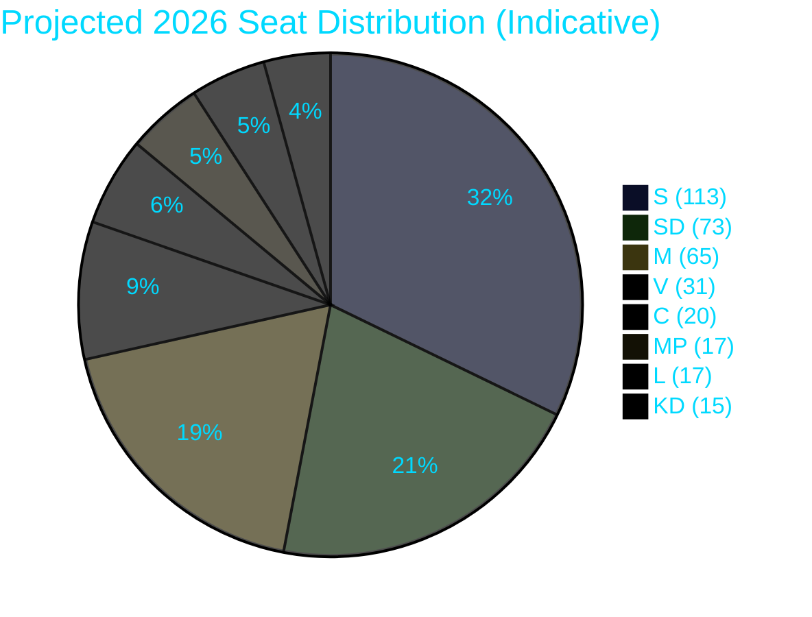

# Coalition Mathematics — Week 22, 2026

## Current Riksdag Composition (2022 Election Result)

| Party | 2022 Seats | Coalition | Position |
|-------|-----------|-----------|---------|
| S | 107 | Opposition | Largest party |
| SD | 73 | Government | Support party |
| M | 68 | Government | Lead party |
| V | 24 | Opposition | Left flank |
| C | 24 | Government | Liberal flank |
| KD | 19 | Government | Conservative |
| L | 16 | Government | Liberal centrist |
| MP | 18 | Opposition | Green |
| **Total** | **349** | | |

**Government majority**: M(68) + SD(73) + KD(19) + L(16) + C(24) = **200 seats**  
Needed for majority: **175 seats**  
Government margin: **+25 seats**

## Projected Riksdag Composition (2026 Polling Estimate)

*Based on April–May 2026 polling averages. Indicative estimate — not a precise forecast.*

| Party | Projected % | Projected Seats | Change vs. 2022 |
|-------|------------|-----------------|-----------------|
| S | 33% | 113 | +6 |
| SD | 21% | 73 | 0 |
| M | 19% | 65 | -3 |
| V | 9% | 31 | +7 |
| C | 6% | 20 | -4 |
| MP | 5% | 17 | -1 |
| KD | 4.5% | 15 | -4 |
| L | 5% | 17 | +1 |
| Others | 2.5% | 0 | 0 |
| **Total** | | **351** | |

*Note: Small rounding differences in seat totals reflect proportional apportionment model. Smaller parties below 4% receive 0 seats.*

## Majority Configurations

### Right-of-Centre Bloc (Current Tidö + partners)
M(65) + SD(73) + KD(15) + L(17) + C(20) = **190 seats** ← maintains majority

### Alternative Centre-Right (M without SD)
M(65) + KD(15) + L(17) + C(20) = **117 seats** ← no majority (requires S or other)

### Left-of-Centre Minimum (S + V + MP)
S(113) + V(31) + MP(17) = **161 seats** ← insufficient

### Left-of-Centre with C (most likely S-led alternative)
S(113) + V(31) + MP(17) + C(20) = **181 seats** ← narrow majority (requires C to cross floor)

### Left-Centre-Liberal (without V)
S(113) + MP(17) + L(17) + C(20) = **167 seats** ← insufficient

## Pivotal Vote Analysis

Week 22 legislation tests coalition cohesion. The pivotal party for each bill:

| Bill | Government votes needed | Pivotal party | Defection risk |
|------|------------------------|---------------|----------------|
| HD01JuU28 (AI surveillance) | 175+ | L or C (potential reservations) | MEDIUM (35%) |
| HD03262 (Permanent permits) | 175+ | C (historically opposed) | MEDIUM-LOW (20%) |
| HD03250 (e-ID) | 175+ | All coalition parties likely to support | LOW (5%) |
| HD01UbU27 (Vocational) | 175+ | All coalition parties likely to support | LOW (5%) |
| HD01FiU39 (Cash) | 175+ | Broad support including S | LOW (2%) |

## L/C Reservation Scenarios and Seat Impact

### If L files substantive reservation on JuU28:
- L retains civil-liberties electorate; may recover from 4–5% toward 6%
- L seats: 17 → 20 (indicative)
- Electoral benefit: L survives threshold comfortably
- Coalition arithmetic: Unchanged (reservation ≠ vote against)
- Post-election coalition: L's reservation signals potential centre-pivot; increases S+V+MP+L scenario probability

### If C files reservation on HD03262:
- C differentiation from SD-driven migration narrative
- C seats: 20 → 22 (indicative, rural base retention)
- Post-election: C more viable as S bloc partner

## C-Pivot Probability (Post-2026 Election)

The key post-election question is whether C will cross from the right-of-centre bloc to a S-led government.

**Conditions for C-pivot**:
1. S-led bloc needs C to reach majority (requires S+V+MP+C ≥ 175)
2. C's Week 22 reservations create a narrative bridge to centre-left
3. C's rural base accepts the pivot framing ("we were never anti-social-democrat on all issues")

**Probability**: 25–35% (assessed in election-2026-analysis.md as a key post-election scenario)

## Cross-Week Stability Assessment

**Week 22 impact on coalition arithmetic**: LOW in the short term. No bill passage this week can remove seats from any party. The electoral impact is in *campaign narrative construction*, not current seat totals.

**Week 22 impact on post-election arithmetic**: MEDIUM. If L and C both file reservations on JuU28, the "right-of-centre bloc" label weakens as a unified campaign entity, increasing the probability that some centrist voters view L and C as potential S-bloc partners.

**SD floor-crossing risk**: REMOTE (<5%). SD has no incentive to leave the coalition before election — it would be "giving up" on the migration cluster passage that is their clearest mandate delivery. Post-election, SD faces a different calculation: if the right-of-centre bloc wins again, SD will demand more from the next coalition agreement.
