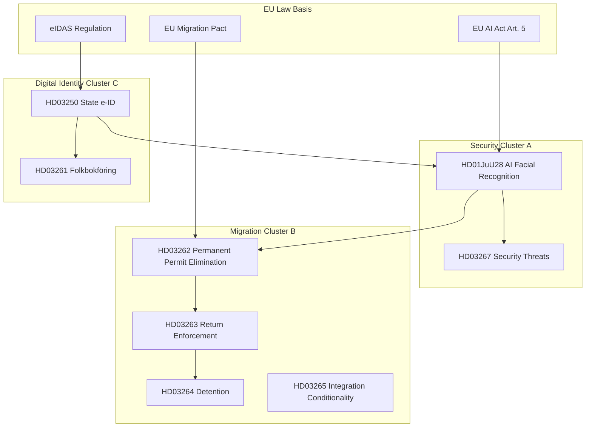

# Cross-Reference Map — Week 22, 2026

## Policy Cluster Architecture

### Cluster A: Security-State Expansion
**Documents**: HD01JuU28, HD03267, (underlying propositions for JuU28)
**Committee**: JuU (Justitieutskottet)
**Minister**: Gunnar Strömmer (M)
**Legislative chain**: Government bill on police security threats → JuU committee report → biometric surveillance approval
**Cross-references**:
- → Cluster B (migration enforcement depends on biometric screening infrastructure)
- → Cluster E (e-ID and biometric identity create shared data architecture)
- → EU AI Act (Art. 5 real-time biometric exemption for law enforcement)
- → ECHR Art. 8 (proportionality test)
- → GDPR Art. 9 (biometric special category data)

### Cluster B: Migration Hardening
**Documents**: HD03262, HD03263, HD03264, HD03265, HD03266, HD03267 (crossover)
**Committee**: SfU (Socialförsäkringsutskottet) + JuU
**Minister**: Johan Forssell (M)
**Legislative chain**: EU Pact implementation → permanent permit elimination → return enforcement → integration conditionality
**Cross-references**:
- → Cluster A (police enforcement capacity for returns)
- → Cluster E (digital identity required for ID verification in migration process)
- → ECHR Art. 8 (family reunification, private life)
- → EU Migration and Asylum Pact (legal basis)
- → UNHCR Refugee Convention (refoulement risk)

### Cluster C: Digital Identity Infrastructure
**Documents**: HD03250, HD03261
**Committee**: FiU (Finansutskottet), SkU (Skatteutskottet)
**Ministers**: Erik Slottner (KD, HD03250), Niklas Wykman (M, HD03261 — tax/register)
**Legislative chain**: State e-ID proposition → DIGG implementation → Skatteverket folkbokföring integration
**Cross-references**:
- → Cluster A (biometric identity linked to surveillance infrastructure)
- → Cluster B (ID verification for migration decisions)
- → GDPR (data processing for state e-ID system)
- → NIS2 Directive (critical infrastructure: identity infrastructure = critical)
- → eIDAS Regulation (EU digital identity framework alignment)

### Cluster D: Education Reform
**Documents**: HD01UbU27, HD01UbU30, HD01UbU21
**Committee**: UbU (Utbildningsutskottet)
**Minister**: Lotta Edholm (L)
**Legislative chain**: Vocational upper secondary reform → quality assurance → municipal integration
**Cross-references**:
- → Cluster F (labour market: vocational supply meets employment needs)
- → Prior election cycle: 2022 Tidö vocational pledges

### Cluster E: Financial Market + Cash Infrastructure
**Documents**: HD01FiU39, HD01FiU40
**Committee**: FiU
**Minister**: Elisabeth Svantesson (M, Finance)
**Legislative chain**: Cash functionality preservation → Riksbanken payment system mandate → Finansinspektionen fund regulation
**Cross-references**:
- → Cluster C (digital identity creates digital payment basis, but cash law preserves analogue fallback)
- → EU Payment Services Regulation (PSD3 alignment)

### Cluster F: Social Policy
**Documents**: HD01SoU29, HD01SoU30, HD01SoU31, HD01SoU32, HD01SoU33, HD01SoU34, HD01SoU35, HD01SoU36, HD01SoU37, HD01SoU38, HD01SoU39, HD01SoU40, HD01SoU41
**Committee**: SoU (Socialutskottet)
**Cross-references**: → Migration cluster (social benefit conditionality interacts with HD03262–HD03266)

### Cluster G: International / Parliamentary
**Documents**: HD01UU11 (OSCE), HD01UU12 (Council of Europe)
**Committee**: UU (Utrikesutskottet)
**Cross-references**: → Cluster A (OSCE human rights monitoring dimension; AI surveillance practices under OSCE scrutiny)

## Legislative Chain Diagram

## Interpellation Cross-Reference

| Interpellation | Target Minister | Policy Cluster | Cross-Document |
|----------------|-----------------|----------------|----------------|
| HD10499 | Defence Minister | National security | → Cluster A |
| HD10500 | Education Minister | Education reform | → Cluster D |
| HD10501 | Social Affairs | Social policy | → Cluster F |
| HD10502 | Environment | Climate | Standalone |
| HD10503–HD10508 | Various | Multi-domain | S flooding strategy |

## Missing Connections (Intelligence Gaps)

1. **HD01FiU39 ↔ Cluster C**: The cash functionality law and state e-ID are architecturally opposed (analogue vs digital); no document in this week's sprint explicitly addresses the transition management between them
2. **OSCE (HD01UU11) ↔ JuU28**: OSCE human dimension commitments on AI surveillance have no referenced cross-document in the JuU28 committee report — a gap that civil society may exploit
3. **UbU cluster ↔ Migration**: Vocational education reform (HD01UbU27) interacts with integration pathways; the documents do not cross-reference each other
