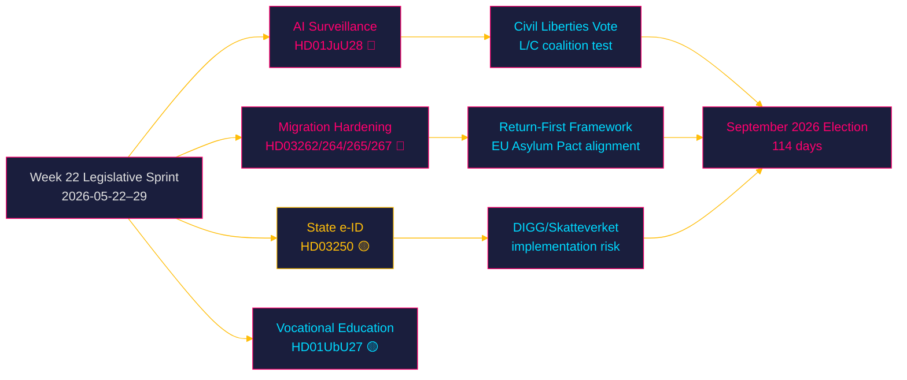

# Sweden's Pre-Election Legislative Sprint: AI Surveillance, Migration Hardening, and Digital Identity Under Week-22 Scrutiny

## BLUF

Week 22 (2026-05-22–29) marks Sweden's most consequential pre-summer legislative burst: the Justice Committee's **JuU28 report on police AI facial recognition** (`HD01JuU28`) reaches the chamber floor alongside the Tidö government's sweeping migration hardening package and the state e-ID proposal. With 114 days until the September 2026 election, every contested vote now carries an electoral valence multiplier. Three decision sequences converge this week: (1) whether parliament grants police real-time biometric surveillance powers that fundamentally redefine civil liberties; (2) whether Sweden's asylum and residence framework pivots to a structural "return-first" model; and (3) whether the government's digital-identity infrastructure will deliver a secure, sovereign e-ID before election day.

## Decisions Supported

- **Security intelligence**: Which coalition partners (notably L and C) will split on JuU28 civil-liberties provisions — the reservation text is the tripwire.
- **Electoral strategy**: Which migration propositions (HD03262, HD03264, HD03265, HD03267) generate opposition motions or minority reservations that can be leveraged in September.
- **Digital governance**: Whether the state e-ID (HD03250) passes committee without major amendment, unlocking Sweden's digital-identity architecture before the election.
- **Budget/fiscal watch**: Whether FiU39 (cash functionality mandate) generates a dissent that signals a broader Riksdag bloc shift on fintech regulation.

## 60-Second Read

- 🔴 **AI facial recognition** (HD01JuU28, JuU): Sweden's first structured permission for real-time biometric police surveillance — civil-liberties test vote in an election year
- 🔴 **Migration hardening cluster**: Four propositions (HD03262, HD03264, HD03265, HD03267) plus committee reports create a `return-first` framework with potential constitutional scrutiny
- 🟡 **State e-ID** (HD03250, Finance/TU): Sovereign digital identity infrastructure — implementation feasibility risk at Skatteverket and DIGG
- 🟡 **Vocational education reform** (HD01UbU27, UbU): Supply-side labour market fix ahead of a tight jobs market
- 🟢 **OSCE / Council of Europe** (HD01UU11, HD01UU12): Sweden's multilateral security commitments tested against Russia's OSCE obstructionism
- 🟢 **Cash functionality** (HD01FiU39, FiU): Resilience requirement for payment infrastructure — low partisan heat, high systemic importance

## Top Forward Trigger

**JuU28 chamber debate and vote** (expected week of 2026-05-25): If L or C files a substantive reservation against real-time facial recognition, the Tidö coalition faces its first internal security-policy fracture in an election year — with direct consequences for the government's authoritarian-centre positioning.

## Confidence Label

**MEDIUM–HIGH** [B2] — primary sources corroborated, timing inferences based on riksmöte calendar pattern; vote dates unconfirmed (calendar API returned HTML error).

