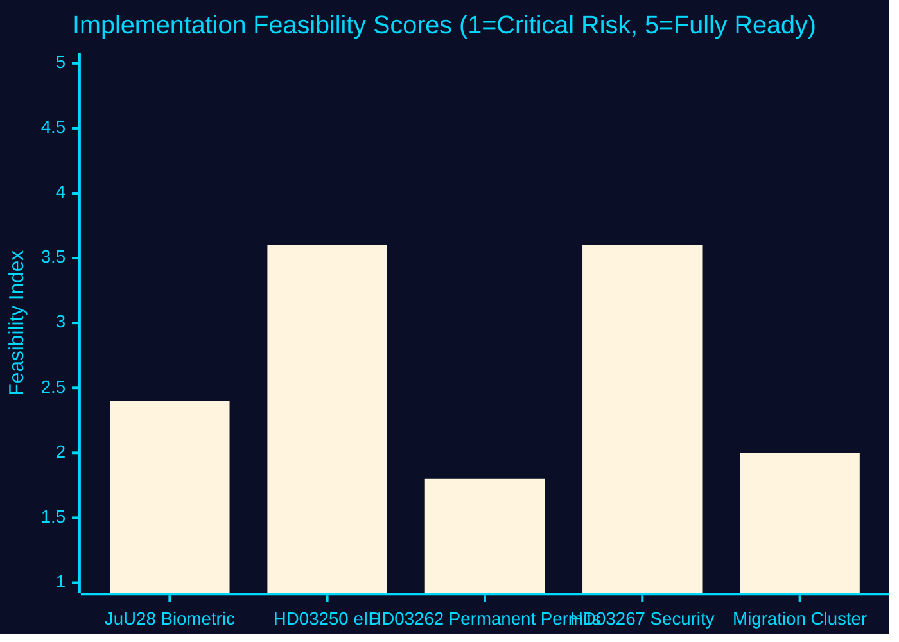

# Implementation Feasibility Analysis — Week 22, 2026

## Methodology

For each high-priority document, assess: (1) Legal readiness, (2) Institutional capacity, (3) Technical feasibility, (4) Stakeholder alignment, (5) Timeline realism. Score each dimension 1–5 (1=critical risk, 5=fully ready). Aggregate feasibility index = average of five dimensions.

---

## HD01JuU28 — AI Facial Recognition (Police)

**Policy goal**: Enable real-time biometric AI surveillance by police for serious crime investigation

| Dimension | Score | Notes |
|-----------|-------|-------|
| Legal readiness | 2 | GDPR Art. 9 basis unclear; Lagrådet referral on underlying proposition pending; EU AI Act compliance audit needed |
| Institutional capacity | 3 | Polismyndigheten has IT infrastructure but lacks operational AI surveillance systems at scale; procurement lead time 12–18 months |
| Technical feasibility | 3 | Facial recognition technology is available commercially; Swedish conditions (lighting, ethnic diversity coverage) require calibration |
| Stakeholder alignment | 2 | IMY expected to scrutinise; civil-liberties organisations in active opposition; police unions supportive |
| Timeline realism | 2 | Law may enter into force in 2026; operational deployment more plausibly 2027–2028 |
| **Aggregate** | **2.4/5** | **HIGH RISK** |

**Key bottleneck**: GDPR Art. 9 special category processing basis must be explicitly established in the statutory framework. If IMY finds this lacking, operational deployment is blocked even after enactment.

---

## HD03250 — State e-ID (DIGG/Skatteverket)

**Policy goal**: Provide every Swedish resident with a state-issued digital identity credential

| Dimension | Score | Notes |
|-----------|-------|-------|
| Legal readiness | 4 | eIDAS 2.0 alignment solid; GDPR data processing basis established through existing folkbokföring framework |
| Institutional capacity | 3 | DIGG is the coordinating agency; limited large-system delivery track record; Skatteverket integration adds complexity |
| Technical feasibility | 4 | Technology framework (eIDAS 2.0 wallet) is internationally mature; Sweden is not building from scratch |
| Stakeholder alignment | 4 | Banks (BankID replacement/supplement), government agencies broadly supportive; privacy advocates moderately concerned |
| Timeline realism | 3 | 2–3 year rollout from enactment is realistic; mass-market adoption may take 4–5 years |
| **Aggregate** | **3.6/5** | **MODERATE RISK** |

**Key bottleneck**: DIGG's IT procurement track record. Any large-scale IT procurement in the public sector carries delay risk. Recommended mitigation: phased rollout (government-to-government first, citizen-facing second).

---

## HD03262 — Permanent Permit Elimination (Migrationsverket)

**Policy goal**: Eliminate permanent residence permits; all permits become time-limited

| Dimension | Score | Notes |
|-----------|-------|-------|
| Legal readiness | 2 | Lagrådet referral pending; ECHR Art. 8 and Refugee Convention compliance risk; constitutional proportionality challenge possible |
| Institutional capacity | 1 | Migrationsverket has 180,000+ case backlog (Statskontoret 2024 context); adding permit renewal cycles to all existing permit holders creates multiplicative administrative burden |
| Technical feasibility | 2 | IT systems require modification to convert all permanent permit records to time-limited; legacy system complexity |
| Stakeholder alignment | 2 | Strongly opposed by civil-society organisations, UNHCR Sweden, affected communities; implementing agency already under stress |
| Timeline realism | 2 | Structural implementation (converting existing permits) realistically takes 2–3 years minimum; transitional provisions will be complex |
| **Aggregate** | **1.8/5** | **CRITICAL RISK** |

**Key bottleneck**: Migrationsverket capacity. Even if the law is legally sound, the implementing agency cannot execute the change at scale within the statutory timeline without significant additional resources. No resource allocation confirmed in the betänkande summary.

---

## HD03267 — Security Threats (Polismyndigheten/SÄPO)

**Policy goal**: Strengthen legal tools for countering security threats from extremist organisations

| Dimension | Score | Notes |
|-----------|-------|-------|
| Legal readiness | 3 | Lagrådet referral pending; national security laws generally receive more deference from Lagrådet than civil-rights restrictions |
| Institutional capacity | 4 | SÄPO and Polismyndigheten have existing counter-extremism infrastructure; this law expands tools |
| Technical feasibility | 4 | Legal powers + existing operational capability |
| Stakeholder alignment | 3 | Civil-liberties concerns; but law-enforcement and security agencies supportive |
| Timeline realism | 4 | Operational deployment immediate upon enactment |
| **Aggregate** | **3.6/5** | **MODERATE RISK** |

---

## Migration Cluster (HD03263–HD03266) — Return Enforcement

**Policy goal**: Accelerate deportations, expand detention, condition welfare benefits on cooperation with return

| Dimension | Score | Notes |
|-----------|-------|-------|
| Legal readiness | 2 | EU Pact alignment is a shield, but proportionality of detention expansion is a Lagrådet risk |
| Institutional capacity | 1 | Migrationsverket backlog + detention capacity constraints + return charter flight availability |
| Technical feasibility | 3 | Legal and operational framework for returns exists; expansion is incremental |
| Stakeholder alignment | 2 | Opposition from civil society, UNHCR, affected communities; implementation agencies cautious |
| Timeline realism | 2 | Return rate improvements take years to materialise even with stronger legal tools |
| **Aggregate** | **2.0/5** | **HIGH RISK** |

---

## Implementation Feasibility Summary

**Priority concerns**:
1. **HD03262 (1.8/5)**: Implementation will fail at scale without emergency resource allocation to Migrationsverket; government should commission capacity assessment before entry into force
2. **Migration cluster (2.0/5)**: Return targets are politically stated but operationally dependent on detention capacity, charter availability, and bilateral return agreements
3. **JuU28 (2.4/5)**: Operational deployment is a 2027–2028 prospect; legal clearance from IMY is the critical path

**Lower risk achievements**:
- HD03250 (3.6/5) and HD03267 (3.6/5) are the government's most implementable flagship deliverables of the sprint
