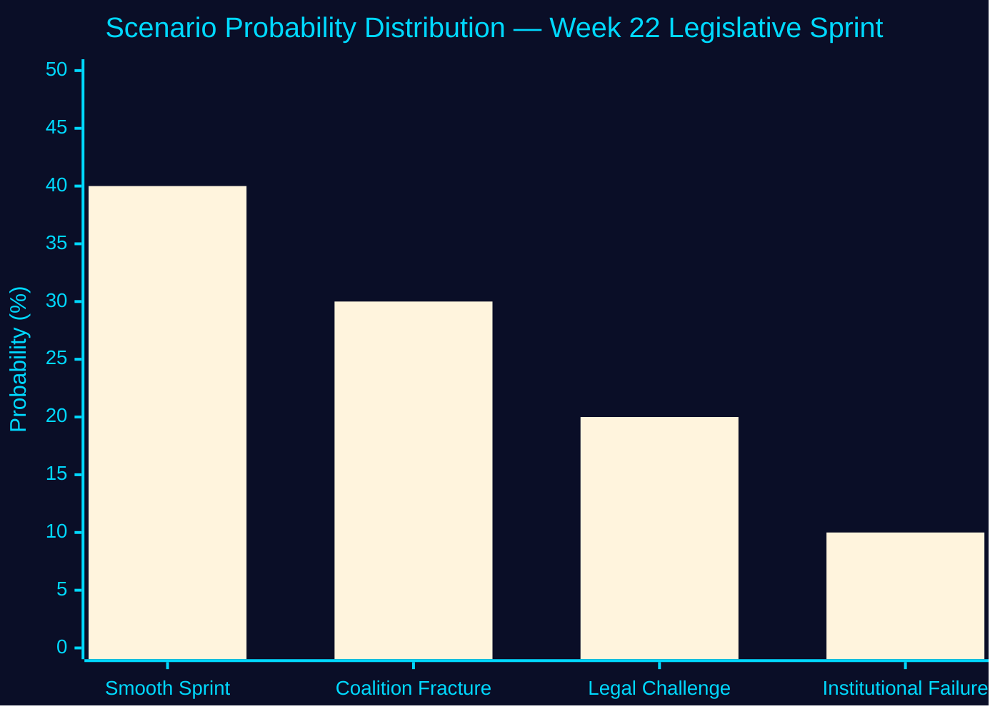

# Scenario Analysis — Week 22, 2026

## Scenario Framework

Horizon: T+30d (June 22) and T+90d (August 22, pre-election). Base date: 2026-05-22. Election date: 2026-09-13 (114 days). Confidence language follows ICD 203 Annex B. Probabilities sum to 100%.

## Scenario Space: JuU28 + Migration Cluster Outcomes

### Scenario 1: "Smooth Sprint" — Government Passes Full Package
**Probability**: 40% (likely)
**Conditions**: L and C vote with coalition on JuU28 with minor reservations (procedural, not substantive); Lagrådet does not delay migration cluster; Migrationsverket maintains functionality
**T+30d dynamics**:
- JuU28 passes 22 May or within days; enters SFS (Swedish Code of Statutes)
- HD03262 on permanent permits receives royal assent; Migrationsverket begins implementation planning
- HD03250 (e-ID) enters into force; DIGG begins public rollout
- Media narrative: "Government delivers security agenda"
- S opposition adopts "audit and repeal" election platform

**T+90d (pre-election) dynamics**:
- Government campaigns on completed security transformation
- S must run on "we will fix surveillance overreach" — defensively framed
- L and C may face civil-liberties voter leakage to V or MP

**Leading indicators**: L/C committee votes (May 22–26); Lagrådet referral outcomes (June); IMY silence on JuU28

---

### Scenario 2: "Coalition Fracture" — L or C Files Substantive Reservation on JuU28
**Probability**: 30% (roughly even chance)
**Conditions**: L or C leader makes public statement on ECHR/GDPR incompatibility of JuU28 biometric provisions; files substantive reservation in committee vote
**T+30d dynamics**:
- JuU28 passes but with notable coalition divisions in the record
- S amplifies reservation language in campaign materials
- L faces internal debate: retain civil-liberties brand or maintain coalition
- Government plays down fracture: "minor technical reservations, full support for security agenda"

**T+90d (pre-election) dynamics**:
- L and C run civil-liberties differentiation: "we ensured safeguards"
- S runs surveillance-state narrative with L/C reservation as evidence
- Scenario increases probability of coalition instability post-election regardless of result
- SD may be emboldened to demand JuU28 scope expansion in next coalition negotiation

**Leading indicators**: L or C public statement on JuU28 before 22 May vote; civil-liberties committee dissent (JuU committee composition)

---

### Scenario 3: "Legal Challenge" — Lagrådet or IMY Forces Delay
**Probability**: 20% (unlikely but possible)
**Conditions**: Lagrådet issues strong critique of HD03262 proportionality or JuU28 GDPR basis; OR IMY opens preliminary investigation into JuU28 biometric processing before enactment
**T+30d dynamics**:
- Government forced to redraft HD03262 or JuU28; reintroduce in autumn
- Opposition runs "government rushed unconstitutional law" narrative
- SD frustration expressed; pressure on government to move faster post-legal clearance
- Media narrative: "Tidö government's security agenda hits constitutional wall"

**T+90d (pre-election) dynamics**:
- If migration cluster delayed: major government campaign liability — promised delivery not achieved
- If JuU28 delayed: less severe (politically framed as responsible legal process)
- Government reframes: "We are ensuring we get it right — we won't rush fundamental law"

**Leading indicators**: Lagrådet referral date and opinion text; IMY statement on JuU28; Constitutional Law Committee (KU) petition filing by opposition

---

### Scenario 4: "Institutional Failure" — Migrationsverket or DIGG Cannot Implement
**Probability**: 10% (remote)
**Conditions**: Migrationsverket formally communicates inability to implement HD03262 within statutory timeline due to existing backlog; OR DIGG identifies procurement failure risk for e-ID
**T+30d dynamics**:
- Law passed but "entry into force" delayed by government ordinance
- Opposition accountability interpellations on implementation failure
- Government blame-shifts to agency: "we passed the law — they must deliver"

**T+90d dynamics**:
- Agency capacity crisis generates media coverage in election campaign
- Statskontoret may be commissioned to review — creating further delays
- Electoral consequence: government's "delivering security" narrative undermined by implementation gap

**Leading indicators**: Migrationsverket backlog statistics (July 2026 report); DIGG public procurement notices for e-ID system

---

## Scenario Matrix

| Scenario | P(T+30d) | Electoral Consequence | Key Uncertainty |
|----------|----------|----------------------|-----------------|
| 1. Smooth Sprint | 40% | Government consolidates security brand | L/C reservation scope |
| 2. Coalition Fracture | 30% | Coalition instability signal; S gains civil-liberties ground | L/C leadership decision on JuU28 |
| 3. Legal Challenge | 20% | Government accountability gap; delay narrative | Lagrådet opinion timing |
| 4. Institutional Failure | 10% | Implementation failure undermines security narrative | Agency capacity revelation |

**Total**: 100%

## Wildcard Scenarios

- **W1**: Major crime incident in Sweden before election involving facial recognition technology → JuU28 retroactively justified; probability resets toward Scenario 1 (5% wildcard, not included in base matrix)
- **W2**: EU Court of Justice ruling on biometric surveillance in another member state creates Swedish implementation pause → delayed Scenario 3 variant (3% wildcard)

## Horizon Integration (T+72h / T+7d / T+30d / T+90d)

| Horizon | Key Event | Uncertainty | Scenario Trigger |
|---------|-----------|-------------|-----------------|
| T+72h (May 25) | JuU28 chamber vote | HIGH | L/C reservation filed? |
| T+7d (May 29) | Riksdag recess begins | LOW | All betänkanden passed |
| T+30d (June 22) | HD03262 legal challenge window | MEDIUM | Lagrådet opinion |
| T+90d (Aug 22) | Election campaign begins (informal) | HIGH | Scenario 2 most volatile |

