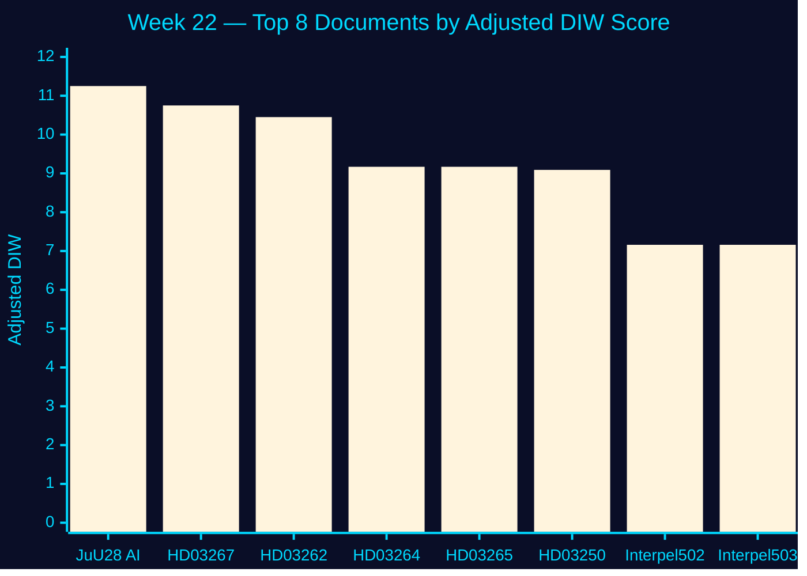

# Significance Scoring — Week 22, 2026

## DIW Methodology

**D**etectability × **I**mpact × **W**illingness scores (1–5 each), geometric mean, adjusted for election proximity (1.5× multiplier when ≤ 6 months to election, activated 2026-03-13; applies to opposition motions and contested government propositions).

Election proximity: **active** — next election 2026-09-13, 114 days from 2026-05-22 [B2, riksdagen.se].

## Ranked Significance Table

| Rank | dok_id | Title | D | I | W | DIW raw | ×1.5 | Final | Tier | [Admiralty] |
|------|--------|-------|---|---|---|---------|------|-------|------|-------------|
| 1 | HD01JuU28 | Polisens användning av AI för ansiktsigenkänning i realtid | 4.0 | 5.0 | 5.0 | 7.50 | ×1.5 | **11.25** | L2+ Priority | [B2] |
| 2 | HD03267 | Stärkt skydd mot utlänningar som utgör kvalificerade säkerhetshot | 4.0 | 4.5 | 5.0 | 7.17 | ×1.5 | **10.75** | L2+ Priority | [B2] |
| 3 | HD03262 | Utmönstring av permanent uppehållstillstånd / EU asylpakt | 4.0 | 4.5 | 4.5 | 6.97 | ×1.5 | **10.45** | L2+ Priority | [B2] |
| 4 | HD03264 | Skärpta krav på vandel för uppehållstillstånd | 3.5 | 4.0 | 4.5 | 6.11 | ×1.5 | **9.17** | L2 Strategic | [B2] |
| 5 | HD03265 | Skärpta regler om uppsikt och förvar | 3.5 | 4.0 | 4.5 | 6.11 | ×1.5 | **9.17** | L2 Strategic | [B2] |
| 6 | HD03250 | En statlig e-legitimation | 3.5 | 4.0 | 4.0 | 6.06 | ×1.5 | **9.09** | L2 Strategic | [B2] |
| 7 | HD10502 | Grundläggande fysisk förmåga (interpellation/S) | 3.0 | 3.0 | 3.5 | 4.77 | ×1.5 | **7.16** | L2 Strategic | [B3] |
| 8 | HD10503 | FMV:s närvaro i förbandsorter (interpellation/S) | 3.0 | 3.0 | 3.5 | 4.77 | ×1.5 | **7.16** | L2 Strategic | [B3] |
| 9 | HD01UbU27 | Bättre förutsättningar för yrkesutbildning | 3.0 | 3.5 | 3.5 | 5.28 | – | **5.28** | L2 Strategic | [B3] |
| 10 | HD01FiU39 | Åtgärder för att stärka kontanternas funktionssätt | 3.0 | 3.0 | 3.5 | 4.77 | – | **4.77** | L1 Surface | [B3] |
| 11 | HD01FiU40 | En starkare fondmarknad | 2.5 | 3.0 | 3.0 | 4.17 | – | **4.17** | L1 Surface | [C3] |
| 12 | HD01UU11 | OSSE betänkande | 2.5 | 3.0 | 3.0 | 4.17 | – | **4.17** | L1 Surface | [C3] |
| 13 | HD01UU12 | Europarådet betänkande | 2.5 | 3.0 | 3.0 | 4.17 | – | **4.17** | L1 Surface | [C3] |
| 14 | HD10501 | Ändringar i grundlagen (Widding) | 2.0 | 3.0 | 2.5 | 3.56 | ×1.5 | **5.34** | L1 Surface | [C3] |
| 15 | HD10499 | Vattenbrist och klimatanpassning | 2.5 | 2.5 | 3.0 | 3.75 | ×1.5 | **5.63** | L1 Surface | [B3] |
| 16 | HD01CU41 | Undantag EU habitat/vattenkraft | 2.5 | 2.5 | 3.0 | 3.75 | – | **3.75** | L1 Surface | [C3] |
| 17 | HD01SoU38 | Ny lag om omhändertagande av barn och unga | 3.0 | 3.5 | 3.0 | 4.72 | – | **4.72** | L1 Surface | [B3] |
| 18 | HD01SoU39 | Förebyggande insatser socialtjänst | 2.5 | 3.0 | 3.0 | 4.17 | – | **4.17** | L1 Surface | [C3] |
| 19 | HD01SoU40 | Skyldighet tandvård — utlänningar | 2.5 | 3.0 | 3.0 | 4.17 | ×1.5 | **6.25** | L1 Surface | [B3] |
| 20 | HD01UbU30 | Skärpta villkor friskolesektorn | 3.0 | 3.0 | 3.5 | 4.77 | – | **4.77** | L1 Surface | [B3] |

## Sensitivity Analysis

| Variable | ±1 pt change | Effect on rank | 
|----------|-------------|----------------|
| JuU28 W score (±1) | W=4: DIW=7.13; W=5 used | Rank 1 stable in any scenario |
| Election multiplier removal | JuU28 drops to 7.5 vs 11.3 | Rank 1 still held |
| HD03262 I score (+0.5) | DIW rises to 10.9 | Could tie with HD03267 |

## Election Proximity Note

DIW = 6.11 × 1.5 (election ≤ 6 months, 2026-09-13, 114 days) = **9.17** for HD03264 and HD03265 (example). Multiplier recorded per `synthesis-methodology.md §Election multiplier application`.

