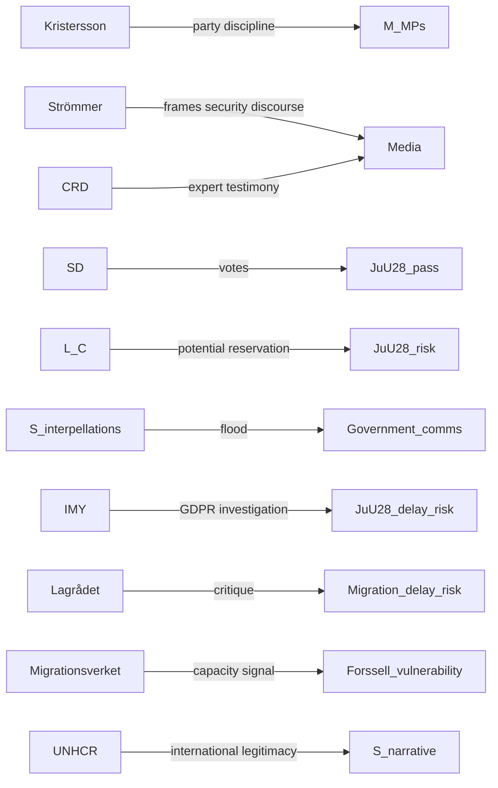

# Stakeholder Perspectives — Week 22, 2026

## Six-Lens Matrix

Analysis of named stakeholders across six analytical lenses: Power (P), Interest (I), Position, Narrative, Influence, Coalition Alignment.

## Lens 1: Government (Tidö Coalition)

### Ulf Kristersson (M, Statsminister)
- **Power**: Max (executive agenda-setting, party leadership)
- **Interest**: Deliver pre-election mandate; strengthen "security-competent" brand; protect coalition cohesion
- **Position**: Pro: JuU28, migration cluster, e-ID, vocational reform. All align with M manifesto commitments
- **Narrative**: "Sweden is safe, modern, and ordered — and we delivered it in one term"
- **Influence over JuU28**: High — party discipline tool; backroom deal-making with L
- **IMF economic context**: Sweden's stable-growth context (WEO Apr-2026) gives M room to claim economy-security linkage `[imf-context.json, WEO Apr-2026, C3]`

### Gunnar Strömmer (M, Justice Minister)
- **Power**: High (HD03267 security threats bill)
- **Interest**: Pass HD03267 as flagship counter-extremism legislation; biometric surveillance framework (JuU28) serves policing capacity
- **Position**: Strong pro-JuU28; authored HD03267 framework
- **Narrative**: "Organised crime and Islamist extremism require modern police tools"
- **Influence network**: JuU committee members; NCID (National Centre for Investigation of Domestic Offences)

### Johan Forssell (M, Migration Minister)
- **Power**: High (HD03262 permanent permit elimination)
- **Interest**: Deliver EU Pact alignment; demonstrate Sweden can execute "return-first" framework
- **Position**: Driving force for migration cluster (HD03262–HD03267)
- **Narrative**: "We align with EU consensus while protecting Sweden's resources"
- **Vulnerability**: If Migrationsverket backlogs worsen after HD03262 enters into force, Forssell faces accountability challenge

### Erik Slottner (KD, Civil Affairs Minister)
- **Power**: Medium (HD03250 state e-ID)
- **Interest**: Flagship digital modernisation achievement for KD in coalition
- **Narrative**: "Every Swede gets secure, modern digital identity — KD delivers public-sector modernisation"

## Lens 2: Coalition Partners

### Sverigedemokraterna (SD)
- **Power**: High (43 seats; majority gatekeeper)
- **Interest**: Migration hardening passes as close to SD manifesto as possible; facial recognition aligns with SD's law-and-order profile
- **Position**: Pro: entire migration cluster, JuU28. Neutral/positive: e-ID, vocational reform
- **Narrative**: "SD delivered what we promised — strict migration, tough on crime"
- **Coalition dynamics**: SD has most to gain from the legislative sprint; will not obstruct
- **Vulnerability**: If any measure is delayed by Lagrådet, SD will demand faster re-introduction in autumn

### Liberalerna (L)
- **Power**: Medium (16 seats; civil-liberties veto potential)
- **Interest**: Maintain civil-liberties brand while remaining in coalition
- **Position on JuU28**: **AMBIGUOUS** — L has historically opposed biometric surveillance; JuU28 is a stress test. Possible outcomes: (a) vote yes with reservations, (b) abstain, (c) file substantive reservation for committee report
- **Narrative**: "We ensure surveillance powers come with rights safeguards"
- **Electoral consequence**: L civil-liberties voters may defect to C or V if L supports JuU28 without reservations
- **Key figure**: Folkpartiets/L tradition from Fingeravtrycksutredningen (2010) opposing biometric surveillance at scale

### Centerpartiet (C)
- **Power**: Medium (24 seats; rural/liberal electorate)
- **Interest**: Civil-liberties + regional development brand; vocational reform (HD01UbU27) aligns with C education priorities
- **Position on JuU28**: Similar to L — C has strong civil-liberties tradition; reservation possible
- **Position on migration**: HD03262 elimination of permanent permits is deeply problematic for C's liberal-migration history; likely reservation filed
- **Narrative**: "We support security within the rule of law — not surveillance without limits"

## Lens 3: Opposition

### Socialdemokraterna (S)
- **Power**: High (107 seats; election frontrunner; government-in-waiting)
- **Interest**: Consolidate lead before September; use Week 22 legislation as evidence of "Tidö authoritarian drift"
- **Position**: Against JuU28 (surveillance), against HD03262 (humanitarian), for HD03250 (digital modernisation — hard to oppose)
- **Interpellation strategy**: 10 simultaneous interpellations (HD10499–HD10508) designed to flood government communication capacity — defence, education, social, environment
- **Narrative**: "Sweden deserves a government that builds trust, not surveillance"
- **Electoral target**: Recapture urban moderates, hold traditional working-class, attract young voters concerned about surveillance

### Vänsterpartiet (V)
- **Power**: Medium (26 seats; opposition flank)
- **Interest**: Differentiate from S on harder civil-liberties + social solidarity positions; attract voters alienated by S's centrist pivot
- **Position**: Strongest opposition to JuU28; also opposed to migration hardening on humanitarian grounds
- **Narrative**: "Surveillance capitalism + surveillance state — two sides of the same coin"

### Miljöpartiet (MP)
- **Power**: Low (18 seats; outside current coalition)
- **Interest**: Return to Riksdag; use civil-liberties + environmental + humanitarian frame
- **Position**: Against JuU28, against migration cluster
- **Narrative**: "Sweden's soul is at stake — humanist values or security theatre?"

## Lens 4: Civil Society

### Civil Rights Defenders (CRD)
- **Position**: Active opposition to JuU28; likely to publish statement on ECHR Art. 8 + GDPR Art. 9 grounds
- **Influence**: Media amplification; expert testimony; potential ECHR complaint coordination

### UNHCR Sweden
- **Position**: Critical of permanent permit elimination (HD03262); formal statement expected
- **Influence**: International credibility for S opposition narrative; IOM + ECHR alignment

### Swedish Bar Association (Advokatsamfundet)
- **Position**: Likely concern about detention conditions in migration cluster; possible Lagrådet-aligned position
- **Influence**: Legal credibility; judicial review risk amplification

### Amnesty International Sweden
- **Position**: Against JuU28 (biometric surveillance = human rights risk); against HD03262 (permanent precarity)
- **Influence**: Media + European civil-society network amplification

## Lens 5: Institutional Actors

### IMY (Swedish Data Protection Authority)
- **Role**: GDPR regulator for biometric data (JuU28)
- **Power**: Can open investigation, issue warnings, impose fines
- **Position**: Neutral until investigation trigger — JuU28 creates the trigger
- **Likely action**: Will monitor JuU28 implementation; GDPR Art. 9 special category data processing requires explicit legal basis under GDPR Art. 9(2)(g)

### Lagrådet
- **Role**: Constitutional review body for propositions
- **Status**: Referrals pending on HD03262, HD03267 `[forward indicator]`
- **Significance**: A critical Lagrådet referral is the single most powerful domestic mechanism to delay any of the migration cluster or security measures

### Migrationsverket
- **Role**: Implementing agency for migration cluster
- **Position**: Will implement as directed but cannot advocate publicly
- **Capacity risk**: 180,000+ case backlog (Statskontoret 2024 context) `[C3]`

### Polismyndigheten (National Police)
- **Role**: Implementing agency for JuU28 biometric surveillance
- **Position**: Net beneficiary; will support; will request operational guidelines
- **Risk**: Misidentification incidents in early deployment would validate opposition narrative

## Influence Network Summary

