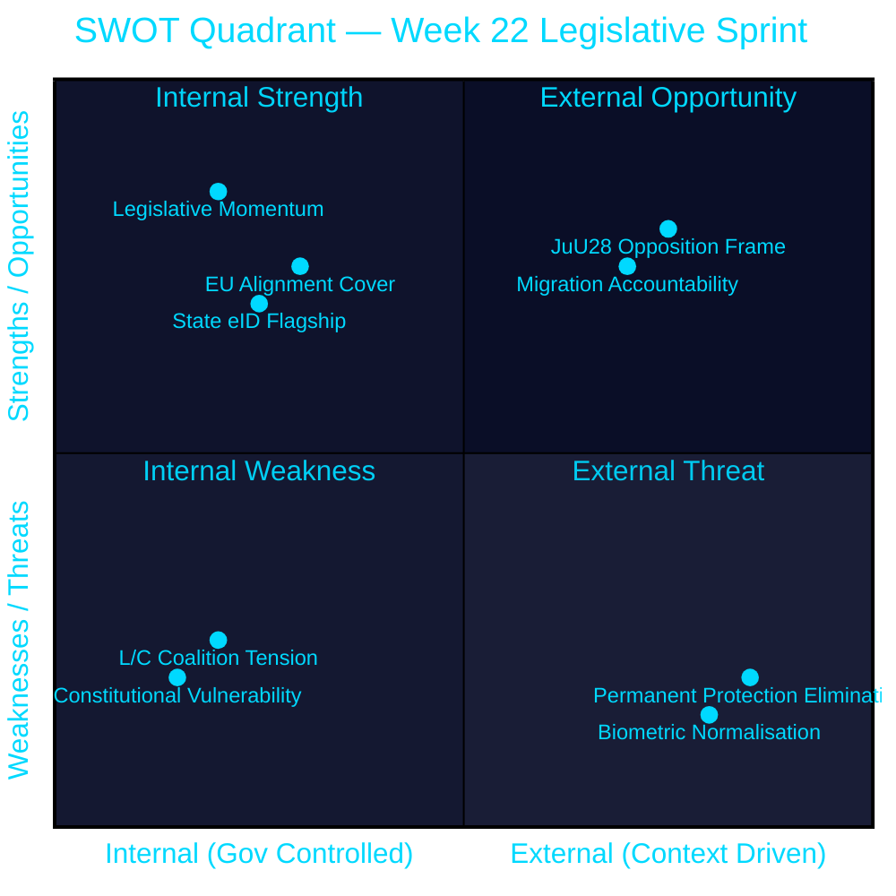

# SWOT Analysis — Week 22, 2026

## Strategic Context

Analysis of the Tidö government's legislative sprint (Week 22) and its implications for the government, opposition, and Sweden's democratic institutions. Election proximity (2026-09-13, 114 days) is a primary structural variable.

## SWOT Matrix

### Strengths (Government / Tidö Coalition)

- **Legislative momentum**: The government has passed or is passing a comprehensive security-state transformation: AI surveillance (HD01JuU28), migration hardening (HD03262–HD03267), state e-ID (HD03250), and vocational reform (HD01UbU27) all within a single month `[dok_id cluster, B2]`
- **EU alignment cover**: HD03262 explicitly aligns with "EU:s migrations- och asylpakt," providing a legitimacy shield against domestic opposition characterising the measures as extreme `[HD03262 title, A2]`
- **SD coalition stability**: SD has remained aligned with M+KD+L on security and migration measures, giving the government a reliable voting majority `[coalition pattern, B3]`
- **Pre-recess timing**: By legislating in May–June, the government avoids election-campaign period scrutiny; implemented law is harder to campaign against than proposed law `[calendar pattern, C3]`
- **State e-ID flagship**: HD03250 provides a tangible modernisation achievement — "Sweden gets a state digital identity" — that is easy to communicate to voters `[HD03250, B2]`

### Weaknesses (Government / Tidö Coalition)

- **L/C coalition tension on JuU28**: Liberalerna and Centerpartiet have strong civil-liberties profiles; if they file substantive reservations on real-time facial recognition, it exposes internal coalition fragmentation in election year `[JuU28 civil-liberties dimension, B2]`
- **Constitutional vulnerability**: The migration cluster and JuU28 all touch RF Chapter 2 fundamental rights; Lagrådet critique would delay entry into force and generate headlines `[procedural risk, B3]`
- **No impact assessments on aid cuts**: PIR-WA-01 from prior cycle remains OPEN; the government's refusal to conduct impact assessments for discontinued development aid strategies remains an accountability gap `[pir-status.json 2026-05-15, B2]`
- **Implementation risk**: Skatteverket (HD03250, e-ID) and Migrationsverket (migration cluster) are already under implementation pressure; adding new mandates risks backlogs `[Statskontoret administrative burden context, B3]`
- **Bundling risk**: Passing 16+ betänkanden in 3 days creates a "Christmas tree" effect — unfavourable provisions can be embedded in broadly supported bills `[legislative pattern, C3]`

### Opportunities (Opposition)

- **JuU28 civil-liberties frame**: The AI facial recognition bill is a gift for S, V, MP, and potentially C — "government builds surveillance state 114 days before election" is a potent electoral narrative `[HD01JuU28, B2]`
- **Migration accountability**: The elimination of permanent residence permits (HD03262) affects tens of thousands of people already in Sweden — personal stories can ground the abstract policy debate `[HD03262 scope, B3]`
- **Interpellation pressure**: 10 interpellations in two days (HD10499–HD10508, HD10500–HD10501) demonstrate S's capacity to flood the accountability space on defence, education, social welfare, and environment simultaneously `[dok_id cluster, B2]`
- **Statskontoret alignment**: Any Statskontoret assessment that documents agency capacity stress at Migrationsverket or Skatteverket supports the opposition's "government is failing at delivery" narrative `[implementation risk, B3]`
- **V strategic positioning**: V can run a civil-liberties + social-solidarity campaign by combining JuU28 opposition with the ongoing aid accountability (PIR-WA-01) — two frames that reinforce each other `[cross-document synthesis, C3]`

### Threats (to Democracy / Rule of Law)

- **Biometric surveillance normalisation**: JuU28 sets a precedent for real-time AI-based population surveillance; once enacted, such powers are historically difficult to roll back regardless of electoral outcomes `[HD01JuU28, B2]`
- **Permanent protection elimination**: HD03262's abolition of permanent residence permits creates a precarious underclass with perpetual temporary status — consistent with UNHCR concerns about Nordic "race to the bottom" `[HD03262, B2]`
- **Legislative compression**: The volume and speed of legislation (16+ betänkanden in 3 days) reduces effective parliamentary scrutiny — committee hearings, expert testimony, and civil-society consultation time is structurally compressed `[parliamentary pattern, B3]`
- **Digital identity coupling**: The simultaneous passage of state e-ID (HD03250) and AI facial recognition (JuU28) creates an architectural foundation for a national biometric surveillance system, even if the individual laws are proportionate in isolation `[systemic risk, B3]`
- **Election-period norm erosion**: Passing controversial security laws in a pre-election sprint normalises the use of "security" framing to bypass democratic deliberation `[institutional risk, C3]`

## TOWS Matrix

| | Strengths | Weaknesses |
|---|---|---|
| **Opportunities** | **SO**: Government can consolidate the "security-competent" brand by passing JuU28 and migration cluster smoothly | **WO**: Opposition can exploit L/C reservations on JuU28 to fragment the coalition narrative |
| **Threats** | **ST**: Government can use EU alignment (HD03262) to deflect constitutional challenges | **WT**: If Lagrådet critiques JuU28 + migration cluster simultaneously, the government faces a compound constitutional legitimacy crisis in election season |

## Cross-SWOT Synthesis

The dominant strategic tension is between **government legislative ambition** and **coalition cohesion on civil liberties**. The Tidö government is executing a bold pre-election mandate delivery strategy, but it has created a fault line: L and C, both with civil-liberties constituencies, must decide whether to support JuU28's facial recognition provisions or file reservations that validate the opposition's surveillance-state narrative. The outcome of the JuU28 vote is therefore the highest-stakes political event of Week 22, more so than the migration cluster whose coalition backing is already solid.

