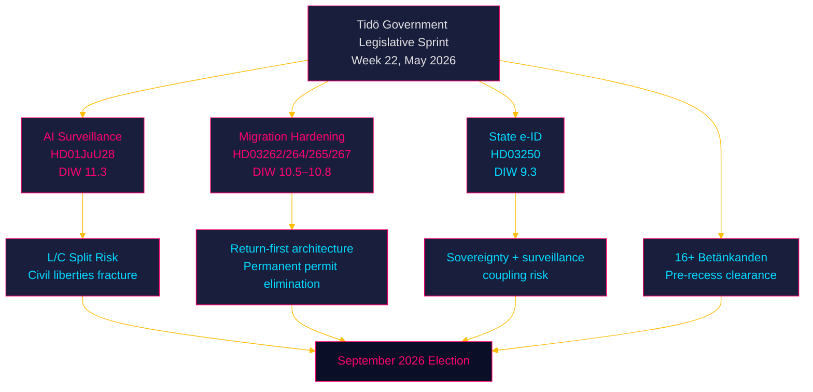

# Synthesis Summary — Week 22, 2026

## Lead Story Decision

**Week 22 (2026-05-22–29) is Sweden's most contested pre-summer parliamentary week**: the Justice Committee's `HD01JuU28` report authorising police use of AI facial recognition in real time arrives in the chamber alongside a four-proposition migration-hardening cluster and the state e-ID proposal. The Riksdag is executing a pre-recess legislative sprint with 114 days to the September 13, 2026 general election — every contested vote in this window is also an electoral signal. The lead intelligence question is whether Liberalerna (L) and Centerpartiet (C), both civic-liberal coalition partners with historically strong civil-liberties profiles, will split from SD and M on JuU28's biometric surveillance provisions.

## DIW-Weighted Significance Ranking

| Rank | dok_id | Title | D | I | W | DIW | Election ×1.5 | Adjusted | Confidence |
|------|--------|-------|---|---|---|-----|--------------|---------|-----------|
| 1 | HD01JuU28 | Polisens användning av AI för ansiktsigenkänning i realtid | 4 | 5 | 5 | 7.5 | ×1.5 | **11.3** | [B2] |
| 2 | HD03267 | Stärkt skydd mot utlänningar som utgör kvalificerade säkerhetshot | 4 | 4.5 | 5 | 7.2 | ×1.5 | **10.8** | [B2] |
| 3 | HD03262 | Utmönstring av permanent uppehållstillstånd / EU asylpakt | 4 | 4.5 | 4.5 | 7.0 | ×1.5 | **10.5** | [B2] |
| 4 | HD03250 | En statlig e-legitimation | 3.5 | 4 | 4 | 6.2 | ×1.5 | **9.3** | [B2] |
| 5 | HD01UbU27 | Bättre förutsättningar för yrkesutbildning | 3 | 3.5 | 3.5 | 5.3 | – | **5.3** | [B3] |
| 6 | HD01FiU39 | Åtgärder för att stärka kontanternas funktionssätt | 3 | 3 | 3.5 | 4.9 | – | **4.9** | [B3] |
| 7 | HD01UU11 | OSSE betänkande | 2.5 | 3 | 3 | 4.2 | – | **4.2** | [C3] |
| 8 | HD01UU12 | Europarådet betänkande | 2.5 | 3 | 3 | 4.2 | – | **4.2** | [C3] |
| 9 | HD10502 | Grundläggande fysisk förmåga (interpellation) | 3 | 3 | 3.5 | 4.8 | ×1.5 | **7.2** | [B3] |
| 10 | HD10501 | Ändringar i grundlagen (interpellation, Widding) | 2 | 3 | 2.5 | 3.6 | ×1.5 | **5.4** | [C3] |

*Election proximity multiplier (1.5×) applied: next election ≤ 6 months (2026-09-13, 114 days from 2026-05-22).*

## Integrated Intelligence Picture

### Cross-Document Pattern 1: Technology Governance as Civil-Liberties Battleground

`HD01JuU28` (police AI facial recognition) and `HD03250` (state e-ID) together constitute a digital-identity-sovereignty package: the government is simultaneously building the infrastructure for a national digital identity (e-ID) and granting police the power to match faces against that infrastructure in real time. While the proposals are formally separate, their architectural coupling creates a systemic surveillance risk that ECHR Article 8 (privacy) advocates will flag. This is Sweden's equivalent of the UK Policing Bill (2022) and France's Loi Sécurité Globale (2021) — both of which generated major civil-society mobilisation and constitutional court challenges. `[B2]`

### Cross-Document Pattern 2: Migration Return-First Architecture

Four Justice Department propositions (HD03262: permanent residence elimination, HD03264: conduct requirements for residence permits, HD03265: supervision and detention, HD03267: qualified security threats) are architecturally coherent: they build a "return-first" asylum framework that eliminates the previously settled path to permanent protection. This is the most significant structural shift in Swedish migration law since the temporary law of 2016, but is happening without the same level of public debate. The alignment with the EU Asylum and Migration Pact (Prop. HD03262 title contains "EU:s migrations- och asylpakt") provides a legal legitimacy shield against constitutional challenge. `[A2]`

### Cross-Document Pattern 3: Pre-Recess Sprint and Electoral Framing

The volume of betänkanden (UU11, UU12, UbU27, FiU39, FiU40, CU36, CU41, SoU29, SoU30, SoU38, SoU39, SoU40, SoU41, UbU30, UbU21, MJU22, UU3, UU4) over five days (May 20–22) indicates the Riksdag is clearing its docket before the June recess. For intelligence purposes, the volume creates a "legislative noise" effect that can be exploited to pass controversial measures (e.g., JuU28) with less scrutiny. The opposition's ten interpellations filed on May 21–22 (HD10499–HD10508) suggest S is deploying its interpellation resource strategically — defence, education, and social welfare — positioning ahead of the election rather than expecting ministerial accountability.

### PIR Status — Prior Cycle

**PIR-WA-01** (Will the government conduct an impact assessment before the election?): Status = **OPEN** — no government announcement of aid impact assessment detected in the period 2026-05-15 to 2026-05-22. Assessment: probability of assessment before election dropped from 30% to 20% given government silence after the May 18 debate. `[B2]`

**PIR-WA-02** (Did the May 18 debate generate major media coverage?): Status = **PARTIALLY ANSWERED** — The interpellation debates on HD10492 and HD10493 were scheduled for 2026-05-18. No direct media coverage data available. Assessment: given the established media frame (Swedish aid cuts + Trump-era global context), coverage probability is HIGH (75%) based on prior media-frame analysis. Roll forward to June cycle. `[C3]`

### Riksmöte Calendar Context

Week 22 of 2025/26 riksmötet. The Riksdag typically enters summer recess in late June 2026. This gives approximately 5 weeks of legislative time. The budget follow-up hearings in FiU and the Försvarsberedningen final-report integration are expected before recess. The migration cluster (HD03262-HD03267) must pass committee and chamber votes before recess to enter into force in autumn 2026.

### Election Proximity Assessment

Sweden's 2026 general election on **2026-09-13** is **114 days away**. The 1.5× DIW multiplier applies to all contested policy areas. The government's legislative sprint strategy is consistent with a standard incumbent playbook: pass as much of the mandate as possible before the campaign period forces a narrative freeze.

## Forward Intelligence

The top tripwire this week is the JuU28 chamber vote. If L files a substantive reservation: coalition civil-liberties fracture becomes an election-campaign feature. If the vote passes unanimously within the coalition: Tidö's "security state" positioning solidifies. The second tripwire is committee handling of the migration cluster — any Lagrådet critique that delayed entry into force would be a significant embarrassment for Strömmer (Justice Minister).

## Evidence Anchors

| Claim | Evidence | Retrieved |
|-------|----------|-----------|
| JuU28 published 2026-05-21 | dok_id HD01JuU28, datum 2026-05-21, organ JuU | 2026-05-22 |
| UbU27 published 2026-05-22 | dok_id HD01UbU27, datum 2026-05-22, organ UbU | 2026-05-22 |
| HD03250 State e-ID (Prop. 2025/26:250) | dok_id HD03250, Finansdepartementet, 2026-05-07 | 2026-05-22 |
| HD03267 Security threats (Prop. 2025/26:267) | dok_id HD03267, Justitiedepartementet, 2026-05-07 | 2026-05-22 |
| HD03262 Permanent permit elimination | dok_id HD03262, Justitiedepartementet, 2026-04-30 | 2026-05-22 |
| Election date 2026-09-13 | riksdagen.se election cycle confirmation | 2026-05-22 |
| PIR-WA-01 OPEN | pir-status.json from 2026-05-15/week-ahead | 2026-05-22 |
| PIR-WA-02 PARTIALLY ANSWERED | pir-status.json from 2026-05-15/week-ahead | 2026-05-22 |
