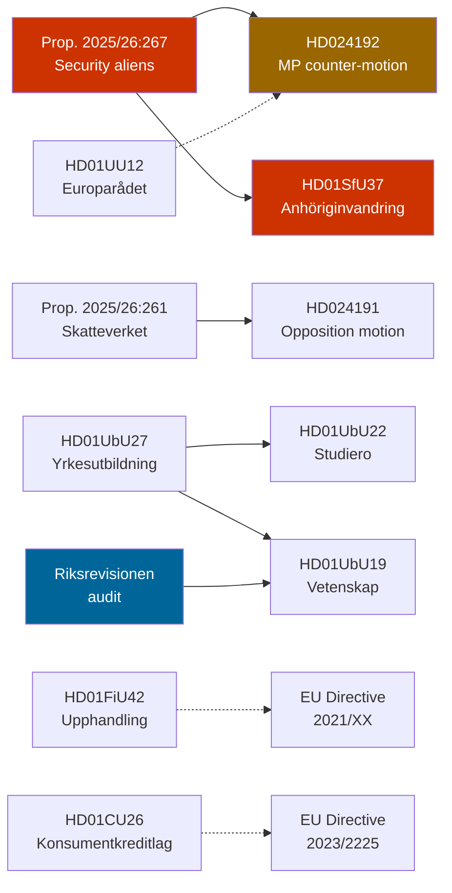

# Cross-Reference Map — Weekly Review, Week of 23 May 2026

**Date**: 2026-05-23

## Intra-Week Document Linkages

## Thematic Cross-References

### Security Cluster
| dok_id | Links to | Relationship |
|--------|----------|--------------|
| HD024192 (MP motion JuU) | Prop. 2025/26:267 | Opposition counter to security alien proposition |
| HD024192 | HD01UU12 (Council of Europe) | ECHR monitoring angle; Europarådet report referenced in rights context |
| HD01SfU37 (anhöriginvandring) | Prop. 2025/26:267 | Both advance Tidö migration tightening agenda; processed same week |
| HD01SfU37 | HD11830 (Iran attacks on Kurdish opposition) | Written question on Iran/Iraq provides foreign-context layer for migration risk analysis |

### Tax/Governance Cluster
| dok_id | Links to | Relationship |
|--------|----------|--------------|
| HD024191 (SkU motion) | Prop. 2025/26:261 | Opposition challenge to Skatteverket expansion |
| HD024191 | HD01FiU42 (procurement) | Both touch state procurement/administrative simplification themes |

### Education Cluster
| dok_id | Links to | Relationship |
|--------|----------|--------------|
| HD01UbU19 | Riksrevisionen 2025/26 audit | Riksrevisionens finding triggers government response |
| HD01UbU22 | HD01UbU27 | Both UbU betänkanden in same cycle; school-level (22) vs. system-level (27) |
| HD01UbU27 | IMF labour market data | Vocational reform responds to documented skills gap in technical trades (WEO Apr-2026) |
| HD01UbU27 | HD11829 (Arbetsförmedlingen Öresund) | Labour market cross-reference |

### EU Alignment Cluster
| dok_id | Links to | Relationship |
|--------|----------|--------------|
| HD01FiU42 | EU public procurement directives | Transposition of EU supplier simplification agenda |
| HD01CU26 | EU Credit Directive 2023/2225/EU | Direct transposition |
| HD01UU11 (OSSE) | HD01UU12 (Europarådet) | Twin foreign affairs committee reports; processed concurrently |

## Macro-Context Cross-References

| Topic | Internal ref | External source |
|-------|-------------|-----------------|
| Sweden GDP growth | Synthesis-summary | IMF WEO Apr-2026 (NGDP_RPCH, SWE, vintage 2026-04) |
| Fiscal space for education investment | Risk-assessment | IMF GGXWDG_NGDP SWE |
| Labour market tightness | UbU27 analysis | IMF SWE unemployment; SCB AKU |
| Global trade slowdown | Risk-assessment | IMF WEO Apr-2026 global projections |
| Nordic security environment | SfU37/HD024192 | NATO accession 2024; Nordic defence cooperation |
