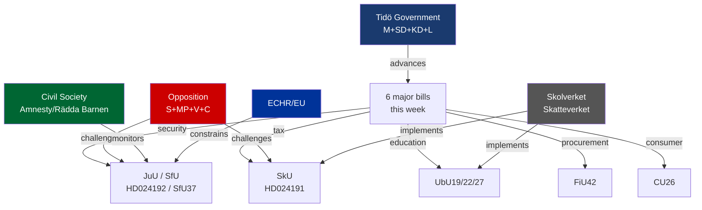

# Stakeholder Perspectives — Weekly Review, Week of 23 May 2026

**Date**: 2026-05-23

## Stakeholder Map

## Key Stakeholders

### Government Coalition Parties

**Moderaterna (M)**
- Position: Government lead; pushing security, tax authority, education discipline
- Interests: Demonstrate governance capacity; own the vocational training and procurement efficiency narrative
- Constraint: Must manage SD demands without alienating liberal centrists (voters who might return to C/L)

**Sverigedemokraterna (SD)**
- Position: Government partner; key driver of SfU37 migration tightening
- Interests: Maximum credit for immigration restriction; secondary interest in school discipline (UbU22)
- Constraint: Election pressure to show decisive results; risks escalating demands if polls slip

**Kristdemokraterna (KD)**
- Position: Strong on school safety (UbU22 aligns with KD family values) and consumer protection (CU26)
- Interests: Maintain moderate Christian democratic profile

**Liberalerna (L)**
- Position: Most cautious in coalition on child detention provisions (HD024192); supports research-based education (UbU19)
- Interests: Rule-of-law profile; potential friction point on security overreach

### Opposition

**Socialdemokraterna (S)**
- Position: Accepts vocational training (UbU27); opposes security detention expansion, Skatteverket surveillance
- Strategy: Differentiate on welfare and rights; avoid being outflanked on security by appearing soft
- Evidence: AU10 voting pattern (Ja on labour-related matters; opposition on migration/security)

**Miljöpartiet (MP)**
- Position: Strongest opposition this week — filed HD024192 specifically targeting child rights in prop. 2025/26:267
- Interests: Principled rights-based politics; niche differentiation from S
- Evidence: HD024192 full text; MP parliamentary platform

**Vänsterpartiet (V)**
- Position: Opposes all security/surveillance expansion; supports school welfare over discipline
- Interests: Consistent civil liberties and labour profile

**Centerpartiet (C)**
- Position: Supports procurement simplification (FiU42); split on migration (SfU37); sceptical of security expansion
- Interests: Business-friendly, liberal; potentially the swing vote on security issues

### Institutions

**Riksrevisionen**
- Triggered UbU19 through its audit report on research-based education; now monitoring government response
- Interest: Institutional credibility and follow-through

**Skolverket**
- Implementation agency for UbU19/22/27
- Constraint: Three concurrent mandates; capacity and timeline concerns
- Interest: Adequate appropriations and phased implementation

**Skatteverket**
- Gains expanded population-registration authority under prop. 2025/26:261
- Interest: Clear legal mandate and operational IT investment

**Lagrådet (Council on Legislation)**
- Expected referral on prop. 2025/26:267
- Interest: Constitutional coherence and RF compliance
- Role: Advisory but politically significant

### Civil Society

**Amnesty International Sweden / Rädda Barnen**
- Monitoring HD024192 child-detention provisions
- Expected to issue public statements ahead of chamber vote
- Historical precedent: Both organisations issued critical statements during 2021–2023 migration law tightening

**Swedish procurement agencies (Upphandlingsmyndigheten)**
- FiU42 beneficiary; supporting simplification
- Interests: Reduced administrative burden

**Consumer organisations (Konsumentverket, HOI)**
- CU26 stakeholders; generally supportive of stronger consumer credit protections
