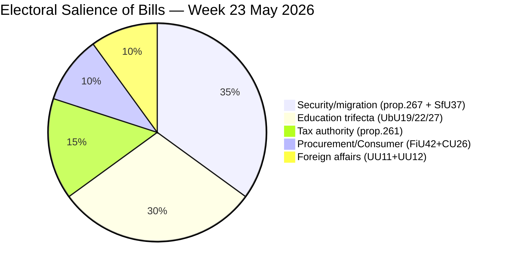

# Voter Segmentation — Weekly Review, Week of 23 May 2026

**Date**: 2026-05-23

## Voter Segments Affected by This Week's Legislation

### Segment A: Security-First Voters (SD base + M suburban)
**Size**: ~35% of electorate (SD ~20% + M-overlap ~15%)
**Response to this week**:
- Prop. 2025/26:267 security detention: STRONGLY POSITIVE
- SfU37 family immigration tightening: STRONGLY POSITIVE
- UbU22 school discipline: POSITIVE
- Overall week assessment: 🟢 Reinforces coalition support

### Segment B: Welfare State Defenders (S core + V)
**Size**: ~30% of electorate (S ~30% + V ~7% minus overlap)
**Response to this week**:
- Security detention expansion: NEGATIVE (proportionality concerns)
- Skatteverket surveillance: NEGATIVE
- Education reform (UbU27 vocational): MIXED-POSITIVE (S supports vocational)
- UbU22 discipline: NEGATIVE
- Overall week assessment: 🔴 Reinforces opposition support; no crossover likely

### Segment C: Rights-Conscious Voters (MP, civil society left)
**Size**: ~5–7% of electorate
**Response to this week**:
- Child detention (HD024192): STRONGLY NEGATIVE — MP's core mobilisation issue
- Skatteverket surveillance: NEGATIVE
- Overall week assessment: 🔴 Energises MP base; may increase MP voter turnout

### Segment D: Liberal Business Voters (C, L moderate)
**Size**: ~10–15% of electorate (C ~7%, L ~5%)
**Response to this week**:
- FiU42 procurement simplification: POSITIVE (C/L pro-business)
- Skatteverket expansion: MIXED (anti-fraud positive vs. surveillance scepticism)
- Child detention (L): NEGATIVE — Liberalerna's constitutional red line
- Overall week assessment: 🟡 Split reaction; C and L maintain internal debate positions

### Segment E: Parental/Education Voters (cross-cutting)
**Size**: ~25% of electorate (parents of school-age children)
**Response to this week**:
- UbU19 research-based education: POSITIVE (quality signal)
- UbU22 school safety: MIXED (parents of bullied children: positive; progressive parents: negative on punitive framing)
- UbU27 vocational training: BROADLY POSITIVE
- Overall week assessment: 🟡 Mixed; government can claim some progress

### Segment F: Consumer / Ordinary Citizen
**Size**: Universal
**Response to CU26 consumer credit law**: 🟢 Low awareness but positive net effect (stronger consumer protections)

## Electoral Salience Map

## Swing Voter Analysis

**Key swing segments** (voters who may change preference 2022→2026):
1. **Former M → C voters**: C's liberal profile was weakened by joining Tidöavtalet implicitly. FiU42 (procurement) is a policy win but security overreach risks pushing this segment back to C or even L.
2. **Former S → SD voters**: This segment is the core SD growth driver 2018–2022. SfU37 and prop. 2025/26:267 directly lock in this cohort for SD.
3. **Former S → M voters** (2022 swing): Prop. 2025/26:267 may appeal if framed as competent governance; school discipline bills appeal to parents who prioritised school safety.

**Net swing impact this week**: Marginally reinforces Tidö coalition core; limited new voter acquisition beyond the coalition's existing base.
