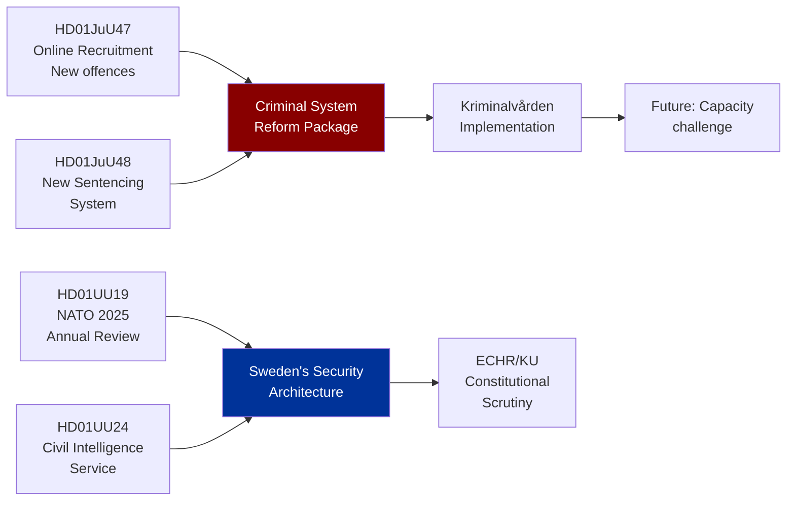

# Cross-Reference Map — Evening Analysis 2026-05-25

**Author**: James Pether Sörling
**Generated**: 2026-05-25T18:45Z

---

## Policy Clusters

### Cluster A: Criminal Justice Reform Package

**Documents**: HD01JuU47 + HD01JuU48
**Legislative chain**: Both are JuU betänkanden debated on the same day — coordinated justice committee calendar
**Connection**: Online recruitment (JuU47) feeds into broader criminal justice system processed by new sentencing system (JuU48)
**Cross-reference**: Kriminalvården capacity in `implementation-feasibility.md`; ECHR risk in `threat-analysis.md`; coalition vote math in `coalition-mathematics.md`

### Cluster B: National Security Architecture

**Documents**: HD01UU19 + HD01UU24
**Legislative chain**: NATO integration (UU19) creates political context for domestic intelligence expansion (UU24)
**Connection**: Foreign intelligence (UU24) is natural complement to NATO membership (UU19) — Sweden needs civilian HUMINT capability to match alliance partners
**Cross-reference**: Defence spending in `election-2026-analysis.md`; constitutional risks in `threat-analysis.md`

### Cluster C: Climate Opposition Package

**Documents**: HD10509 + HD10510
**Pattern**: Two interpellations from same MP member (Katarina Luhr) to same minister (Johan Britz/L) on same day — coordinated MP accountability strategy
**Cross-reference**: Climate in `forward-indicators.md`; MP election positioning in `voter-segmentation.md`

### Cluster D: Social Welfare / Economic Challenge

**Documents**: HD10511 + HD10512
**Pattern**: S party dual-track: economic distribution + domestic violence protection — social democracy "bread and butter" issues
**Cross-reference**: `voter-segmentation.md` (working class, women voters); `media-framing-analysis.md`

### Cluster E: Foreign Policy Questions

**Documents**: HD11836 + HD11837
**Pattern**: S questioning government on humanitarian and EU health dimensions
**HD11836 connection to HD01UU19**: Both address foreign/security policy — Sudan atrocity prevention complements NATO collective security narrative
**Cross-reference**: `comparative-international.md`

---

## Legislative Chain Analysis

---

## Coordinated Activity Patterns

1. **Government coordination**: JuU47+JuU48+UU19+UU24 all scheduled same day → likely deliberate "security delivery" day
2. **Opposition coordination**: IP509+IP510 (MP climate twins) + IP511+IP512 (S social twins) + HD11836+HD11837 (S foreign twins) → three-axis opposition pressure strategy
3. **Narrative collision**: Government pushes "security"; opposition pushes "care/climate" — pre-election narrative contest

---

## Sibling-folder Citations

Prior evening analysis cycles:
- 2026-05-22: evening-analysis (no open PIRs carried forward)
- No sibling folder citations from same-day other article types (this is first generation for 2026-05-25 evening-analysis)
