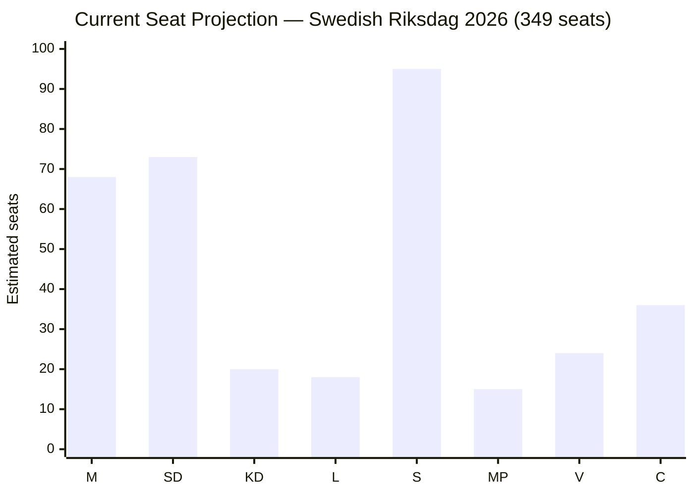

# Election 2026 Analysis — Evening Analysis 2026-05-25

**Author**: James Pether Sörling
**Generated**: 2026-05-25T18:48Z

---

## Electoral Context (2026 Swedish General Election)

**Next election**: September 2027 (standard 4-year cycle from September 2022 + September 2026 midterm)
**Current government**: M-SD-KD-L majority (Tidökoalitionen)
**Opinion polling trend**: M + SD together ~40–42%; S ~28–30%; MP near threshold; V stable ~7%

---

## Seat Projection Delta from Today's Activity

| Factor | Electoral impact | Affected parties |
|--------|-----------------|-----------------|
| JuU47/48 passage | +0.5–1.0% for M+SD "law and order" bloc | M (↑), SD (↑) |
| Women's shelter decline (IP512) | -0.5–0.8% for government coalition if amplified | M (↓), KD (↓) |
| NATO review positive | +0.3% M and SD defence narrative | M (↑), SD (↑) |
| Climate gap (IP509/510) | +0.3–0.5% for MP | MP (↑ potentially) |
| Economic inequality (IP511) | +0.2–0.4% S working class narrative | S (↑ marginally) |

**Net assessment**: Today's activity slightly consolidates M+SD security position; creates modest S+MP opportunities on social/climate flanks.

---

## Coalition Viability Scenarios (post-2026)

### Current coalition continuation (Tidö-2)

**Probability**: 45%
- M+SD bloc maintains or grows to 40%+ combined
- KD and L above 4% threshold
- S too weak to form alternative without major gains

### S-led centre-left minority (S+MP+V with C support)

**Probability**: 35%
- S recovers to 32%+; MP survives threshold; V stable
- C provides confidence-and-supply outside government
- Requires MP above 4% (currently near-threshold)

### Grand coalition or technical government

**Probability**: 15%
- No majority bloc; minority government supported by multiple parties
- Likely with M as PM in minority

### Snap election / extraordinary scenario

**Probability**: 5%
- Coalition collapse before 2027 on Lagrådet/constitutional issue or SD breakaway

---

## Key Electoral Dimensions from Today

### JuU48 "New Sentencing System" — L&O positioning

The passage of a comprehensive sentencing reform is the most significant electoral asset the government can bank today. M+SD have dominated "law and order" polling since 2018. JuU48 delivers on that promise tangibly. S's criticism must navigate its own moderate-voter base that also wants gang violence addressed.

### UU19 NATO review — Defence premium

Sweden's NATO membership is an irreversible asset for M+SD+KD+L. The annual NATO review consolidates this. V's opposition isolates it from mainstream; S has accepted NATO — this is a positive for government incumbency.

### IP512 women's shelters — S's best attack line

Of all opposition documents today, IP512 has the highest electoral resonance. "Fewer women in shelters despite unchanged violence risk" is a concrete, emotionally compelling charge. If sustained, it undermines the government's "safer society" narrative on domestic violence — an area where KD (social conservatism) and M face authenticity questions.

---

## Seat Projection (current polling baseline)

*Note: Projections based on polling averages; ±10 seat uncertainty. 175 seats needed for majority.*

**Government bloc (M+SD+KD+L)**: ~179 seats (slim majority)
**Opposition bloc (S+MP+V)**: ~134 seats
**Centre (C)**: ~36 seats (balance of power)
