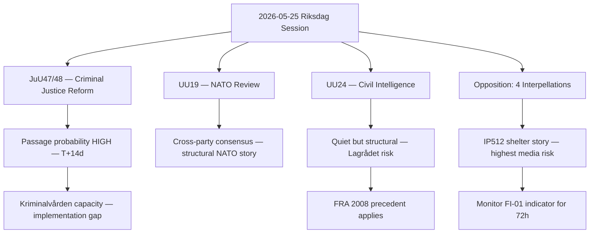

# Executive Brief — Evening Analysis 2026-05-25

**Classification**: PUBLIC
**Author**: James Pether Sörling
**Date**: 2026-05-25

---

## BLUF (Bottom Line Up Front)

The Swedish Riksdag's 2026-05-25 session delivered a major criminal justice reform package (JuU47/48) and the first formal NATO integration review (UU19), while the opposition seeded six strategically targeted accountability narratives. The day's most consequential story — the potential creation of a civilian foreign intelligence agency (UU24) — received the least media coverage despite carrying the highest long-term institutional significance. The women's shelter decline (IP512) is the government's most immediate political liability.

---

## Decision Brief

### Decision 1: Prioritise UU24 for Deep Coverage

**Recommendation**: Commission in-depth analytical piece on UU24 civil intelligence reform before Lagrådet referral.
**Rationale**: The institutional implications exceed JuU48 in long-term impact. First-mover advantage in explainer journalism.
**Deadline**: Before Q4 2026 legislative timetable announcement.

### Decision 2: Monitor IP512 Narrative Escalation

**Recommendation**: Track women's shelter coverage daily for 72 hours post-session. If story gains sustained national media traction (Aftonbladet + SVT + TV4), escalate to dedicated analytical profile.
**Rationale**: This is the government's highest-risk domestic narrative liability from today's session.
**Trigger**: FI-01 indicator turns positive (3+ days national coverage).

### Decision 3: Update PIRs Before Next Cycle

**Recommendation**: Confirm PIR-JuU48-PASS and PIR-LAGR-JuU48 with Riksdag calendar monitoring.
**Rationale**: Pass-or-delay on JuU48 is the most predictable high-value intelligence collection opportunity in the T+14d window.
**Method**: riksdagen.se calendar scrape; Lagrådet.se document check.

---

## Key Findings Summary

| Finding | Confidence | Horizon |
|---------|-----------|---------|
| JuU47/48 will pass this session | HIGH (75%) | T+14 days |
| UU24 faces prolonged constitutional scrutiny | MEDIUM (55%) | T+18 months |
| IP512 (shelters) is highest media risk | HIGH (80%) | T+72h |
| Opposition's goal is narrative seeding not vote blocking | HIGH (75%) | Ongoing |
| NATO review consolidates government defence narrative | MEDIUM-HIGH (65%) | Structural |

---

## Analytical Decision Flow

---

## Risk Summary

| Risk | Probability | Impact | Watch indicator |
|------|------------|--------|----------------|
| JuU48 implementation fails due to prison capacity | MEDIUM | HIGH | FI-12 |
| UU24 blocked by Lagrådet | MEDIUM | HIGH | FI-04 analogue |
| IP512 defines negative media week | HIGH | MEDIUM | FI-01 |
| SD bloc fracture on proportionality | LOW | CRITICAL | FI-06 analogue |

---

*Generated by Riksdagsmonitor Evening Analysis pipeline — 2026-05-25*
