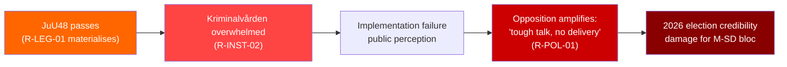

# Risk Assessment — Evening Analysis 2026-05-25

**Author**: James Pether Sörling
**Generated**: 2026-05-25T18:44Z
**Framework**: 5-dimension register per `political-risk-methodology.md`

---

## Risk Register

### Dimension 1: Legislative / Procedural Risk

| Risk ID | Description | Likelihood (L) | Impact (I) | L×I | Cascading chain | dok_id |
|---------|-------------|:-:|:-:|:-:|---|---|
| R-LEG-01 | JuU48 sentencing reform fails Lagrådet constitutional review → amendments required pre-vote | 0.35 | 0.8 | 0.28 | → Delayed passage → Government credibility loss → Opposition amplification | HD01JuU48 |
| R-LEG-02 | JuU47 online recruitment provisions challenged as overreach (freedom of expression) | 0.25 | 0.6 | 0.15 | → ECHR referral → Implementation delay | HD01JuU47 |
| R-LEG-03 | UU24 civil intelligence bill blocked by constitutional committee (KU) | 0.30 | 0.7 | 0.21 | → Intelligence capability gap continues | HD01UU24 |
| R-LEG-04 | Minor coalition parties (L or KD) demand amendment to JuU48 proportionality clauses | 0.20 | 0.5 | 0.10 | → Intra-coalition friction | HD01JuU48 |

**Posterior probability update**: Given that JuU47+JuU48 are at betänkande stage (committee report), probability of full passage is ~0.75; constitutional challenge post-passage probability ~0.20.

### Dimension 2: Political / Electoral Risk

| Risk ID | Description | Likelihood (L) | Impact (I) | L×I | Evidence |
|---------|-------------|:-:|:-:|:-:|---|
| R-POL-01 | Opposition (S+MP) successfully establishes "inequality/climate gap" narrative before 2026 elections | 0.55 | 0.7 | 0.39 | IP511+IP509+IP510 pattern; sustained pressure |
| R-POL-02 | V builds civil liberties coalition against surveillance provisions (UU24 + JuU47) | 0.45 | 0.5 | 0.23 | V parliamentary tradition; ECHR framing |
| R-POL-03 | SD breaks coalition on key JuU48 amendment (proportionality for immigration-related crime) | 0.15 | 0.8 | 0.12 | SD typically supports tough sentences but may push for severity beyond L/KD comfort |
| R-POL-04 | Women's shelter decline (IP512) becomes media-amplified "compassion gap" story | 0.50 | 0.6 | 0.30 | S interpellation on declining placements |

### Dimension 3: Institutional / Constitutional Risk

| Risk ID | Description | Likelihood (L) | Impact (I) | L×I | Evidence |
|---------|-------------|:-:|:-:|:-:|---|
| R-INST-01 | European Court of Human Rights challenge to JuU47 online recruitment law | 0.30 | 0.7 | 0.21 | ECHR Art.10 (expression), Art.7 (legality) |
| R-INST-02 | Kriminalvården (Prison Service) implementation capacity constraint for JuU48 | 0.60 | 0.6 | 0.36 | Statskontoret: no current expansion plan found |
| R-INST-03 | SÄPO/civil intelligence coordination failure during UU24 transition period | 0.25 | 0.8 | 0.20 | Intelligence coordination historically weak |

### Dimension 4: Foreign Policy / International Risk

| Risk ID | Description | Likelihood (L) | Impact (I) | L×I | Evidence |
|---------|-------------|:-:|:-:|:-:|---|
| R-INTL-01 | NATO Article 3 capability gap if defence spending falls short of 3% target | 0.35 | 0.8 | 0.28 | UU19; IMF WEO fiscal sustainability context |
| R-INTL-02 | EU Commission investigation into Sweden opposing EU health regulation | 0.25 | 0.5 | 0.13 | HD11837 |
| R-INTL-03 | Sudan escalation makes Atrocity Prevention Coalition membership symbolically inadequate | 0.40 | 0.4 | 0.16 | HD11836; ongoing SAF-RSF war |

### Dimension 5: Social / Welfare Risk

| Risk ID | Description | Likelihood (L) | Impact (I) | L×I | Evidence |
|---------|-------------|:-:|:-:|:-:|---|
| R-SOC-01 | Continued decline in women's shelter placements creates domestic violence mortality risk | 0.45 | 0.9 | 0.41 | IP512 (Sanna Backeskog/S) |
| R-SOC-02 | Widening distributional inequality erodes social cohesion pre-election | 0.50 | 0.6 | 0.30 | IP511 (Niklas Karlsson/S) |
| R-SOC-03 | Climate adaptation delay creates stranded asset risk in infrastructure | 0.40 | 0.5 | 0.20 | IP509 (Katarina Luhr/MP) |

---

## Top Risks by L×I Score

1. **R-SOC-01** (0.41): Women's shelter decline — violence mortality risk
2. **R-POL-01** (0.39): Opposition "gap" narrative election risk
3. **R-INST-02** (0.36): Kriminalvården capacity for JuU48 implementation
4. **R-POL-04** (0.30): Compassion gap media amplification
5. **R-SOC-02** (0.30): Inequality social cohesion erosion

## Cascading Risk Chain (primary scenario)

---

## Posterior Probability Adjustments

- Base rate for major criminal law reform passing in current majority: 0.78
- Adjustment for Lagrådet risk: -0.08 → **0.70**
- Adjustment for coalition discipline: +0.05 → **0.75**
- Adjustment for SD pressure for amendments: -0.03 → **0.72**

**Central estimate**: 72% probability that JuU48 passes this session in substantially current form.

| **Statskontoret relevance** | Kriminalvården capacity cited (no statskontoret.se URL found for 2026 sentencing expansion; none found) |
|---|---|
