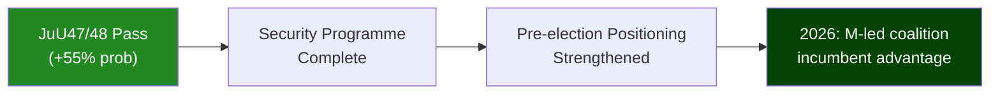

# Scenario Analysis — Evening Analysis 2026-05-25

**Author**: James Pether Sörling
**Generated**: 2026-05-25T18:46Z
**Framework**: `scenario-analysis.md` template; ≥ 3 scenarios, probabilities sum to 100%

---

## Scenario Overview

Scenarios assess the near-to-medium-term trajectory for Sweden's political landscape based on today's Riksdag activity.

---

## Scenario 1: "Security Delivery Consolidation" (Base Case)

**Probability**: 55%
**Time horizon**: T+30 to T+90 days

**Description**: JuU47 and JuU48 pass the Riksdag chamber with M-SD-KD-L majority, with V and MP filing reservations but unable to block. NATO review (UU19) generates cross-party approval. Civil intelligence reform (UU24) advances with constitutional safeguards added. Government successfully positions as "law and order + security" bloc ahead of 2026 election. Opposition interpellations generate media attention but no legislative change.

**Leading indicator**: JuU48 vote passes by >170 votes, SD votes in full bloc discipline

**Consequences**:
- Government credibility on core programme: HIGH
- Opposition narrative: muted on criminal justice; elevated on climate/welfare
- 2026 electoral benefit for M+SD: MEDIUM-HIGH

**Mermaid**:

---

## Scenario 2: "Constitutional Friction" (Moderate Disruption)

**Probability**: 28%
**Time horizon**: T+14 to T+90 days

**Description**: Lagrådet delivers adverse opinion on JuU48 (proportionality/ECHR) or JuU47 (freedom of expression), forcing government to table amendments. Civil intelligence reform (UU24) is referred to KU for additional constitutional scrutiny. Opposition exploits delays as evidence of poor legislative preparation. NATO review passes but defence spending debate intensifies.

**Leading indicator**: Lagrådet publishes critical opinion on JuU48 within 2 weeks; L and/or KD distance themselves from specific provisions

**Consequences**:
- Government legislative calendar disrupted: MEDIUM
- Opposition narrative strengthened: "Government cuts corners on rights"
- 2026 electoral impact: NEUTRAL to mildly negative for government

---

## Scenario 3: "Social Welfare Flashpoint" (Opposition Breakthrough)

**Probability**: 12%
**Time horizon**: T+7 to T+60 days

**Description**: IP512 women's shelter decline story goes viral in media; S successfully frames as "government's 'safe society' is not safe for women." IP511 distributional inequality data cited in major media coverage. Government forced into defensive mode, spending political capital on social welfare rather than security. Criminal justice reform overshadowed by welfare debate.

**Leading indicator**: Major national tabloid runs front-page story on women's shelter decline; Camilla Waltersson Grönvall's response to IP512 generates backlash

**Consequences**:
- Government defensive on social welfare: HIGH
- S strengthened in pre-election polling: MEDIUM
- Criminal justice agenda: deprioritised temporarily

---

## Scenario 4: "Alliance Strain" (Low Probability Disruption)

**Probability**: 5%
**Time horizon**: T+14 to T+180 days

**Description**: NATO review (UU19) surfaces a significant compliance gap in Sweden's defence capabilities or spending trajectory. Civil intelligence reform (UU24) collapses due to coalition disagreement (L uncomfortable with surveillance scope, KD concerned about civil liberties). EU Commission formally challenges Sweden on health policy (HD11837).

**Leading indicator**: NATO SecGen publicly notes Sweden's capability shortfall; UU24 tabled indefinitely

**Consequences**:
- Government security narrative damaged: HIGH
- International relations friction: MEDIUM
- Coalition stability: LOW-MEDIUM risk

---

## Probability Summary

| Scenario | Probability |
|----------|------------|
| 1. Security Delivery Consolidation | 55% |
| 2. Constitutional Friction | 28% |
| 3. Social Welfare Flashpoint | 12% |
| 4. Alliance Strain | 5% |
| **Total** | **100%** |
