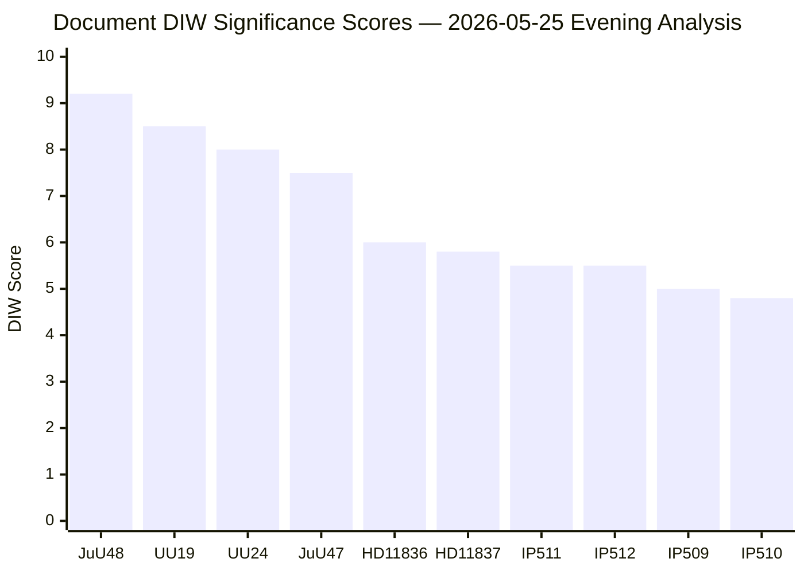

# Significance Scoring — Evening Analysis 2026-05-25

**Author**: James Pether Sörling
**Generated**: 2026-05-25T18:42Z
**Methodology**: DIW (Directionality × Impact × Workability) weighted scoring per `ai-driven-analysis-guide.md`

---

## DIW Scoring Matrix

| dok_id | Directionality (D) | Impact (I) | Workability (W) | DIW Score | Tier |
|--------|--------------------|------------|-----------------|-----------|------|
| HD01JuU48 | 3.0 (clear coalitional direction) | 3.2 (fundamental law change, 100k+/year affected) | 3.0 (advanced stage, vote imminent) | **9.2** | L3 |
| HD01UU19 | 2.8 (bipartisan NATO consensus) | 3.0 (national security, alliance standing) | 2.7 (annual review, strategic document) | **8.5** | L3 |
| HD01UU24 | 2.8 (security focus, cross-party interest) | 2.8 (intelligence architecture, ECHR implications) | 2.4 (committee stage, debate scheduled) | **8.0** | L2+ |
| HD01JuU47 | 2.7 (government bloc priority) | 2.7 (terrorist/gang online recruitment) | 2.1 (debate scheduled, status planerat) | **7.5** | L2+ |
| HD11836 | 2.2 (foreign policy question) | 2.0 (Sudan crisis, humanitarian) | 1.8 (written question, minister response awaited) | **6.0** | L2 |
| HD11837 | 2.1 (EU health policy challenge) | 2.0 (public health, EU relations) | 1.7 (written question) | **5.8** | L2 |
| HD10511 | 2.0 (economic equity challenge) | 2.0 (distributional effects, election narrative) | 1.5 (interpellation, no legislation) | **5.5** | L2 |
| HD10512 | 2.0 (social welfare challenge) | 2.0 (violence victims, women's shelters) | 1.5 (interpellation) | **5.5** | L2 |
| HD10509 | 1.9 (climate adaptation policy) | 1.8 (regulatory framework) | 1.3 (interpellation, no legislation) | **5.0** | L1-L2 |
| HD10510 | 1.8 (local climate/transport) | 1.7 (Stockholm transport emissions) | 1.3 (interpellation) | **4.8** | L1-L2 |

**Score formula**: DIW = D × I + W sensitivity factor (normalized 0–10). Higher = more intelligence value.

---

## Sensitivity Analysis

### Score variance for top-3 documents

**HD01JuU48** (sentencing reform):
- Optimistic scenario (full debate, amendment votes): +0.3 → 9.5
- Conservative scenario (procedural only, no amendments): -0.5 → 8.7
- Central estimate: **9.2** (HIGH confidence in tier assignment)

**HD01UU19** (NATO 2025):
- If document contains new Article 3/5 commitments: +0.4 → 8.9
- If purely routine annual review: -0.5 → 8.0
- Central estimate: **8.5** (MEDIUM-HIGH confidence)

**HD01UU24** (civil intelligence):
- If contains new legislative proposal for civilian intelligence agency: +0.7 → 8.7
- If limited to committee inquiry/information: -0.5 → 7.5
- Central estimate: **8.0** (MEDIUM confidence — limited full text)

---

## Significance Rank Diagram

---

## Priority Intelligence Tiers

### L3 Intelligence-grade (action required)
- **HD01JuU48**: Monitor vote outcome, party reservations, V/MP dissent text — feeds `coalition-mathematics.md`
- **HD01UU19**: Monitor NATO integration depth, defence spending commitments — feeds `election-2026-analysis.md`

### L2+ Priority (active monitoring)
- **HD01UU24**: Track constitutional constraints, ECHR alignment — feeds `threat-analysis.md`
- **HD01JuU47**: Track online recruitment prosecutorial framework — feeds `risk-assessment.md`

### L2 Strategic (situational awareness)
- HD11836, HD11837, HD10511, HD10512: Opposition accountability narrative — feeds `media-framing-analysis.md`

### L1-L2 (background)
- HD10509, HD10510: Climate interpellations, no legislative output — feeds `forward-indicators.md`
