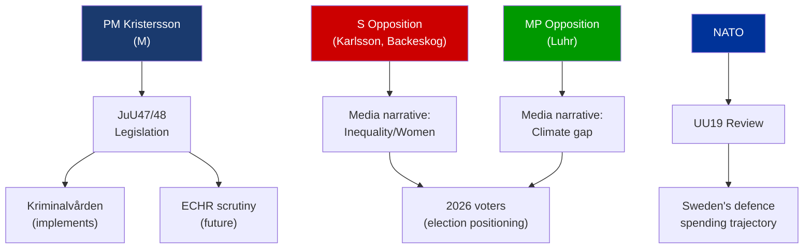

# Stakeholder Perspectives — Evening Analysis 2026-05-25

**Author**: James Pether Sörling
**Generated**: 2026-05-25T18:45Z
**Framework**: 6-lens stakeholder matrix per `stakeholder-impact.md`

---

## 6-Lens Stakeholder Matrix

### Lens 1: Political Parties

| Party | Position on JuU47/JuU48 | Position on UU19/UU24 | Position on Interpellations | Influence |
|-------|------------------------|----------------------|---------------------------|-----------|
| **M** (Moderaterna) | Strongly supportive — criminal justice reform core manifesto | Supportive NATO, leads civil intelligence reform | Defends government record | Very High |
| **SD** (Sverigedemokraterna) | Strongly supportive — severity for violent crime | Supportive NATO | Dismissive of opposition | High |
| **KD** (Kristdemokraterna) | Supportive with proportionality emphasis | Supportive NATO | Responds to IP512 (Waltersson Grönvall) | High |
| **L** (Liberalerna) | Cautious — free expression concerns re JuU47 | Supportive NATO | Responds to IP509/IP510 (Britz) | High |
| **S** (Socialdemokraterna) | Critical of severity overreach in JuU48; files IP511+IP512+questions | Supports NATO; scrutinises UU24 civil liberty aspects | Leads opposition accountability | Very High |
| **MP** (Miljöpartiet) | Opposes — punitive turn and expression concerns | Ambivalent NATO; civil liberty concerns UU24 | Files IP509+IP510 on climate | Medium |
| **V** (Vänsterpartiet) | Strongly opposes — civil liberties, proportionality | Opposes NATO entirely | Likely supports opposition interpellations | Medium |
| **C** (Centerpartiet) | Mixed — supports proportionality reform, sceptical severity expansion | Supports NATO | Not leading any interpellation today | Medium |

---

### Lens 2: Named Actors

| Actor | Role | Stakes | Likely action |
|-------|------|--------|---------------|
| **Ulf Kristersson** (M, PM) | Government leader | JuU48/47 passage = programme delivery | Champion |
| **Gunnar Strömmer** (M, Justice Minister) | Responsible for JuU47/48 | Legislative legacy | Advocates passage |
| **Johan Forssell** (M) | Secretary of State, security | UU19/24 oversight | Advocates |
| **Maria Malmer Stenergard** (M, Foreign Minister) | HD11836 addressee | Sudan coalition question | To respond |
| **Jakob Forssmed** (KD, Social Minister) | HD11837 addressee | EU health policy | To respond |
| **Camilla Waltersson Grönvall** (M) | IP512 addressee | Women's shelters | To respond |
| **Elisabeth Svantesson** (M, Finance Minister) | IP511 addressee | Economic distribution | To respond |
| **Johan Britz** (L, acting climate minister) | IP509/IP510 addressee | Climate legislation | To respond |
| **Katarina Luhr** (MP) | IP509/IP510 filer | Climate accountability | Challenges government |
| **Niklas Karlsson** (S) | IP511 filer | Economic inequality | Challenges government |
| **Sanna Backeskog** (S) | IP512 filer | Violence victim protection | Challenges government |
| **Linnéa Wickman** (S) | HD11836 filer | Sudan/atrocity prevention | Challenges foreign policy |
| **Karin Sundin** (S) | HD11837 filer | EU health policy | Challenges government |

---

### Lens 3: Civil Society and NGOs

| Actor | Stakes | Position |
|-------|--------|----------|
| **Kriminalvården** (Prison Service) | Implements JuU48 — capacity risk | Neutral/cautious |
| **Riksorganisationen ROKS** (women's shelters) | IP512 directly concerns their funding/cases | Concerned — decline in placements |
| **Unizon** (women's shelters federation) | Same as ROKS | Concerned |
| **Amnesty Sverige** | UU24 surveillance concerns; JuU47 free expression | Critical |
| **Civil Rights Defenders** | JuU47/48 ECHR dimensions; UU24 privacy | Critical |
| **Lagrådet** | Constitutional review body | Technical/neutral — referral pending |
| **NATO member states** | UU19 — allies monitoring Sweden's contribution level | Observing |

---

### Lens 4: Media

Key framing battleground: government will highlight "security delivery" narrative (JuU47/48 + NATO); opposition will push "inequality and climate neglect" counter-narrative. Tabloids (Aftonbladet, Expressen) likely to amplify women's shelter story (IP512 has emotive resonance).

---

### Lens 5: International Actors

| Actor | Stakes | Position |
|-------|--------|----------|
| **NATO** | UU19 review — Sweden as reliable partner | Monitoring compliance |
| **EU Commission** | HD11837 — Sweden opposing EU health rules | Potential inquiry |
| **UN/AU on Sudan** | HD11836 — Swedish coalition membership signal | Welcoming if joined |
| **ECHR / CoE** | JuU47/48 compatibility | Scrutinising |

---

### Lens 6: Influence Network

