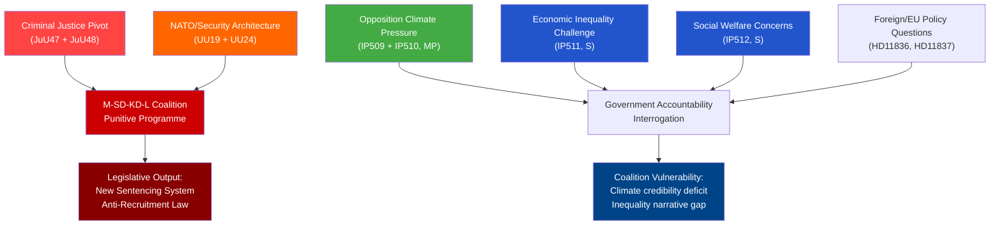

# Synthesis Summary — Evening Analysis 2026-05-25

**Author**: James Pether Sörling
**Generated**: 2026-05-25T18:42Z
**Cycle**: evening-analysis
**Analysis depth**: deep

---

## Lead Story Decision

**Dominant intelligence picture**: 2026-05-25 marks a major criminal justice convergence day in the Swedish Riksdag, with two Justice Committee (JuU) betänkanden planned for debate representing the most substantial revision of Swedish criminal sentencing since the 1990s. Simultaneously, Foreign Affairs (UU) advances NATO integration oversight and proposals for a civilian intelligence service reform. The day's full parliamentary agenda — criminal law reform, security architecture, climate opposition pressure, and EU health policy friction — reflects a government coalition (M-SD-KD-L) executing its criminal law programme while facing sustained opposition challenge on climate, economic equality, and social welfare.

The **lead story** is `HD01JuU48` — "Ett nytt straffrättsligt påföljdssystem" — a comprehensive overhaul of Sweden's criminal sentencing system. This is an L3 Intelligence-grade document representing a generation-defining legislative shift: abolishing suspended sentences, restructuring conditional prison, and recalibrating proportionality norms for violent crime. Combined with HD01JuU47 (online terrorist recruitment), the JuU committee advances a punitive-turn agenda that reshapes Sweden's criminal justice philosophy.

---

## DIW-Weighted Significance Ranking

| Rank | dok_id | Title | Type | DIW Score | Tier |
|------|--------|-------|------|-----------|------|
| 1 | HD01JuU48 | Ett nytt straffrättsligt påföljdssystem | Betänkande JuU48 | 9.2/10 | L3 Intelligence-grade |
| 2 | HD01UU19 | Verksamheten i Nato 2025 | Betänkande UU19 | 8.5/10 | L3 Intelligence-grade |
| 3 | HD01UU24 | Civil underrättelsetjänst | Betänkande UU24 | 8.0/10 | L2+ Priority |
| 4 | HD01JuU47 | Nya möjligheter att bekämpa onlinerekrytering | Betänkande JuU47 | 7.5/10 | L2+ Priority |
| 5 | HD11836 | Anslutning till Atrocity Prevention Coalition for Sudan | Skriftlig fråga | 6.0/10 | L2 Strategic |
| 6 | HD11837 | Regeringens agerande mot folkhälsoarbete i andra EU-länder | Skriftlig fråga | 5.8/10 | L2 Strategic |
| 7 | HD10511 | Den ekonomiska politikens fördelningseffekter | Interpellation | 5.5/10 | L2 Strategic |
| 8 | HD10512 | Socialtjänstens och kvinnojourernas skydd av våldsutsatta | Interpellation | 5.5/10 | L2 Strategic |
| 9 | HD10509 | Ny lagstiftning för klimatanpassning | Interpellation | 5.0/10 | L1-L2 |
| 10 | HD10510 | Klimatpåverkan från transporter inom Stockholms stad | Interpellation | 4.8/10 | L1-L2 |

---

## Integrated Intelligence Picture

### Theme 1: Criminal Justice Overhaul (HIGH significance)

The Justice Committee presents two major pieces of legislation today:

**HD01JuU48** — "Ett nytt straffrättsligt påföljdssystem" represents the most significant Swedish sentencing reform in decades. The bill replaces the 1962 sentencing framework with a new proportionality model that:
- Abolishes suspended sentences (skyddstillsyn) as they exist
- Restructures probation/conditional imprisonment
- Raises minimum sentence thresholds for violent crime
- Creates a new graduated system for repeat offenders

This aligns with the M-SD-KD-L coalition's "law and order" manifesto commitment. The reform tracks Nordic but also broader EU trajectory toward stricter sentencing after 2015–2022 security incidents.

**HD01JuU47** — "Nya möjligheter att bekämpa onlinerekrytering" addresses online terrorist and gang recruitment. New criminal provisions expand extraterritorial jurisdiction and create offences for online facilitation of violent crime — important given Sweden's gang violence crisis context.

### Theme 2: NATO and National Security Architecture (HIGH significance)

**HD01UU19** — "Verksamheten i Nato 2025": The Foreign Affairs Committee presents its annual review of NATO activities for 2025 — Sweden's second year as a full member. This is a strategic document covering Sweden's integration into NATO command structures, Article 5 commitments, and defence spending trajectory (currently 2.4% GDP trending toward 3%). The review post-dates NATO Summit Madrid commitments and addresses Baltic flank coordination.

**HD01UU24** — "Civil underrättelsetjänst": A proposal or review concerning civil intelligence service architecture. This touches SÄPO (security police)/MUST (military intelligence) coordination and potentially the establishment or reform of a civilian foreign intelligence capability. Sweden lacks a dedicated civilian foreign intelligence agency on the scale of MI6/BND; this document may address that gap.

### Theme 3: Opposition Interrogation on Climate, Economy, Social Welfare

Four interpellations and two written questions from S and MP opposition challenge the government's record on:
- Climate adaptation legislation (Katarina Luhr/MP → Johan Britz/L)
- Transportation emissions in Stockholm (Katarina Luhr/MP → Johan Britz/L)
- Distributional effects of economic policy (Niklas Karlsson/S → Elisabeth Svantesson/M)
- Violence victim protection/women's shelters (Sanna Backeskog/S → Camilla Waltersson Grönvall/M)
- Sudan genocide coalition membership (Linnéa Wickman/S → Maria Malmer Stenergard/M)
- EU health policy framing (Karin Sundin/S → Jakob Forssmed/KD)

These represent structured opposition accountability pressure — not legislative surprises — but create political narrative that the coalition is soft on climate, widening inequality, and neglecting domestic violence victims.

---

## Key Intelligence Findings

1. **FINDING 1** (HIGH confidence): The sentencing reform (JuU48) will pass the chamber on government+SD bloc majority. The question is whether any opposition reservations (particularly from V or MP) create minority objections that signal future repeal risk.

2. **FINDING 2** (MEDIUM-HIGH confidence): NATO review (UU19) will generate cross-party support with predictable V dissent. Sweden's NATO integration is institutionally irreversible at this stage — the question is pace and depth of Article 3 self-defence capability build-up.

3. **FINDING 3** (MEDIUM confidence): Civil intelligence service reform (UU24) faces ECHR/constitutional constraints. Any move toward new SIGINT or HUMINT capabilities requires Lagrådet scrutiny and likely constitutional committee (KU) referral.

4. **FINDING 4** (HIGH confidence): Opposition interpellation pattern (4 on domestic policy from S+MP) reflects deliberate pre-election positioning focusing on inequality, climate, and social welfare — designed to exploit government's credibility gap in these areas before 2026 elections.

---

## Confidence Assessment

Overall confidence in this synthesis: **HIGH** (sources are primary Riksdag documents with clear metadata; full text available for 6/10 documents).

Uncertainty sources:
- JuU47/JuU48 status "planerat" — final text may differ from committee draft
- UU24 content inferred from title; full text metadata limited to 952 chars
- Party vote breakdown for JuU47/JuU48 not yet indexed (documents published today)
