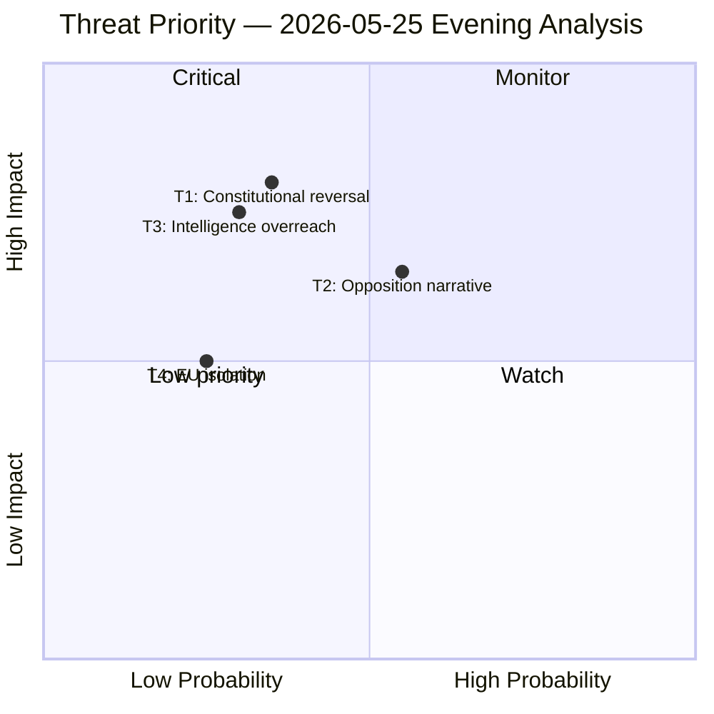

# Threat Analysis — Evening Analysis 2026-05-25

**Author**: James Pether Sörling
**Generated**: 2026-05-25T18:44Z
**Framework**: Political Threat Taxonomy per `political-threat-framework.md`

---

## Political Threat Taxonomy

### Threat 1: Constitutional Reversal Attack on Criminal Justice Reform

**Category**: Institutional / Rights-Based Challenge
**Threat actor**: V, MP, legal NGOs, ECHR litigants
**Target**: HD01JuU47 + HD01JuU48

**Attack tree**:
```
Root: Invalidate/weaken JuU47/JuU48 post-passage
├── T1.1 Lagrådet adverse opinion pre-vote
│   ├── T1.1a Proportionality concerns (ECHR Art.5)
│   └── T1.1b Legality/foreseeability concerns (ECHR Art.7)
├── T1.2 KU (Constitutional Committee) review challenge
│   ├── T1.2a RF 2:1 freedom of expression (JuU47)
│   └── T1.2b RF 2:8 personal liberty (JuU48)
└── T1.3 ECHR litigation post-passage
    ├── T1.3a Individual applicant on online speech conviction
    └── T1.3b NGO-supported systemic challenge
```

**Kill chain phase**: Political (Influence) → Judicial (Action) → Possible legislative reversal (Impact)

**MITRE-style TTP mapping**:
- T0012: Constitutional challenge (rights-based)
- T0021: Judicial review mobilisation
- T0040: International treaty leverage (ECHR)

**Assessment**: MEDIUM probability (0.35); HIGH impact if successful (forces amendment or repeal)

---

### Threat 2: Opposition Pre-Election Narrative Capture

**Category**: Political / Electoral Threat
**Threat actor**: S, MP (coordinated interrogation pattern)
**Target**: Government credibility on climate, inequality, social welfare

**Kill chain**:
```
Interpellation filing (IP509-IP512) → Media amplification
→ Government defensive answers → Clips shared on social media
→ Narrative: "Government neglects ordinary people, women, climate"
→ S/MP election campaign ads → Voter perception shift
```

**TTP mapping**:
- T0001: Systematic accountability interrogation
- T0015: Opposition narrative building
- T0028: Cross-portfolio coordination (climate + economy + welfare = systematic)

**Assessment**: HIGH probability (0.55); MEDIUM-HIGH impact on 2026 electoral outcome

---

### Threat 3: Intelligence Architecture Overreach

**Category**: Civil Liberties / Governance Threat
**Threat actor**: V, civil society, privacy advocates
**Target**: HD01UU24 — Civil intelligence service reform

**Attack tree**:
```
Root: Block/limit civil intelligence expansion
├── T3.1 ECHR Art.8 (privacy) legal challenge
├── T3.2 KU review of SÄPO mandate expansion
├── T3.3 International pressure (EU data protection → GDPR compatibility)
└── T3.4 Public mobilisation (mass surveillance narrative)
```

**Assessment**: MEDIUM probability (0.30); HIGH impact if capability blocked

---

### Threat 4: EU Isolation Risk

**Category**: International Relations Threat
**Target**: HD11837 (EU health policy opposition) + broader EU alignment

**TTP mapping**:
- T0062: Sovereignty-over-EU-cooperation framing
- Risk: EU Commission notice, partner trust erosion

**Assessment**: LOW-MEDIUM probability (0.25); MEDIUM impact

---

## Threat Priority Matrix



---

## Defensive Recommendations (procedural neutrality — monitor only)

1. **T1**: Proactive Lagrådet engagement for JuU47/48 before final vote
2. **T2**: Government needs affirmative policy on women's shelters and climate adaptation (IP509/512 exposure)
3. **T3**: UU24 should include proportionality safeguards and sunset clauses
4. **T4**: Communication strategy on EU health policy consistency
