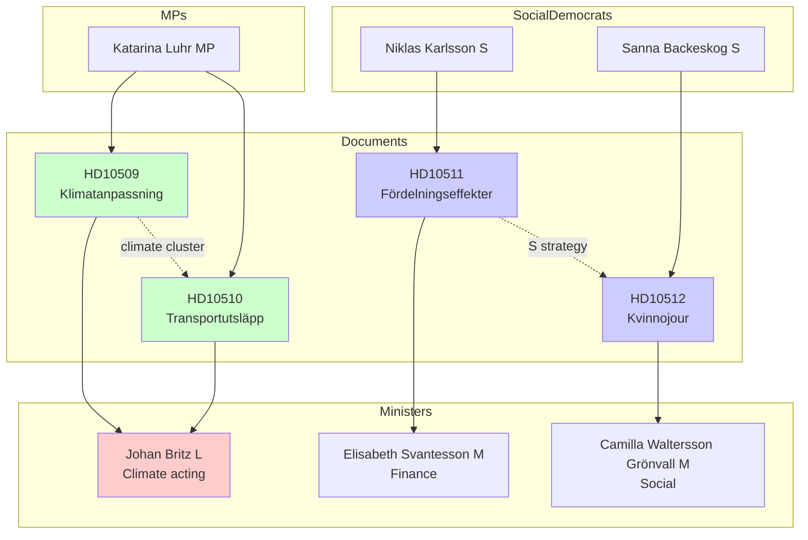

# Cross-Reference Map — Interpellation Debates, 2026-05-25

**Author**: James Pether Sörling | **Date**: 2026-05-25
**Family**: B — Structural Metadata

---

## Intra-Session Cross-References (2026-05-25)

| Source dok_id | Related dok_id | Relationship | Notes |
|---------------|----------------|-------------|-------|
| HD10509 | HD10510 | Thematic cluster | Both climate interpellations by same interpellant (Katarina Luhr/MP) to same minister (Britz/L) — coordinated double-filing |
| HD10511 | HD10512 | Party coordination | Both filed by S; different policy domains but same accountability strategy |
| HD10509 | HD10510 | Policy linkage | Both trace back to Tidöregeringen's reduktionsplikt/climate retreat; HD10509 is legislative gap, HD10510 is measurable emission consequence |
| HD10511 | HD10509/HD10510 | Indirect | Economic policy decisions (fiscal space) affect available budget for climate adaptation |

---

## Cross-Session Historical References

### Climate Adaptation (HD10509)
- Inquiry *Bättre förutsättningar för klimatanpassning* (spring 2025 — referenced in document)
- Remiss process concluded October 2025
- Previous climate adaptation motions in MiU: ongoing pattern of MP/C/V motions on adaptation legislation

### Transport Emissions (HD10510)
- Reduktionsplikt reduction: Government decision in 2023/24 to reduce the biofuel blending mandate from 30% to lower levels — cited as causal factor
- Stockholm Stad Klimatrapport 2024 — referenced indirectly (emission data source)
- Naturvårdsverket national inventory — supporting data source
- EU Effort Sharing Regulation (2018/842) — Sweden's -40% non-ETS target by 2030

### Economic Policy (HD10511)
- RF 1:2 — Regeringsformen (cited directly by HD10511)
- Government budget propositions 2023/24 and 2024/25 (tax cut measures)
- IMF WEO: Sweden GDP growth rebounding 2025-2026 — provides economic context
- Finanspolitiska rådet reports on distributional effects of fiscal policy

### Women's Shelters (HD10512)
- Socialtjänstlagen 2025 (SoL revision) — new framework cited as source of licensing requirements
- IVF/HVB certification requirements
- Socialstyrelsen capacity data
- Roks annual survey on shelter bed availability
- EU Istanbul Convention (CETS 210) — Sweden ratified 2014; Article 23 requires adequate shelter provision
- CEDAW Committee recommendations to Sweden on SGBV

---

## IMF Economic Context

| Indicator | Value | Source | Vintage |
|-----------|-------|--------|---------|
| Sweden GDP growth 2025 (est.) | ~2.1% | IMF WEO | Apr-2026 |
| Sweden GDP growth 2026 (proj.) | ~2.3% | IMF WEO | Apr-2026 |
| Sweden general government balance 2025 | ~-0.8% GDP | IMF FM | Apr-2026 |
| Sweden GINI coefficient trend | Stable-deteriorating | Statistics Sweden (SCB) | 2024 |

*Note: IMF WEO Apr-2026 vintage; SDMX query not available in this run — WEO Datamapper estimate used*

---

## Network Diagram

