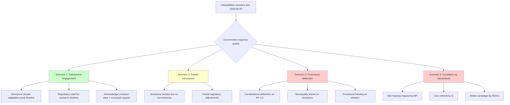

# Scenario Analysis — Interpellation Debates, 2026-05-25

**Author**: James Pether Sörling | **Date**: 2026-05-25
**WEP Confidence**: MEDIUM-HIGH | **Horizon**: T+14d (answers) / T+90d (political consequence)

---

## Scenario Framework

Four interpellations with answers due 2026-06-05 generate four scenario branches based on government response quality. Each response choice has downstream electoral and coalition consequences.

---

## Scenario Tree

---

## Scenario 1: Substantive Engagement (Probability: 25%)

**Description**: Government chooses to respond constructively across all four interpellations, announcing concrete commitments:
- Climate adaptation proposition timeline announced (summer 2026)
- Acknowledgement of transport emission trends + Stockholm municipal support package
- Distributional modelling provided on economic policy
- Women's shelter regulatory relief package + transitional funding

**Drivers**: Pre-election positioning; L-party internal pressure; desire to neutralise opposition momentum before summer recess.

**Consequences**:
- Short-term: Positive media cycle; MP and S interpellations partially defused
- Medium-term: Government gains climate/social credibility; L retains climate voters
- Electoral: Improves coalition polling in climate-salient demographic

**Indicators**: Government press release before answer deadline; media briefing by Britz or Waltersson Grönvall.

---

## Scenario 2: Partial Concession (Probability: 45%)

**Description**: Government gives mixed answers — substantive on social services (announces Socialstyrelsen review) but procedural on climate (defends reduktionsplikt policy); constitutional deflection on RF 1:2; no distributional data provided.

**Drivers**: Coalition constraints prevent full climate policy reversal; social services response easier to make without ideological cost; RF 1:2 framing can be technically deflected.

**Consequences**:
- Short-term: Women's shelter story partially managed; climate criticism persists
- Medium-term: MP uses climate interpellation in autumn campaign
- Electoral: Neutral-to-slightly-positive for coalition in social domain; negative in climate domain

**This is the most likely scenario.**

---

## Scenario 3: Procedural Deflection (Probability: 20%)

**Description**: All four interpellations receive defensive, procedural answers with no policy commitments. Britz blames municipalities on emissions, deflects on climate adaptation timeline. Svantesson rejects RF framing as non-justiciable. Waltersson Grönvall defends licensing quality rationale.

**Drivers**: Coalition discipline; belief that the political cost is manageable; calculation that pre-election concessions signal weakness.

**Consequences**:
- Short-term: Opposition escalates — MiU hearing, SoU review, NGO campaign
- Medium-term: Women's shelter story becomes dominant in women's rights media cycle
- Electoral: Significant risk in climate and women's rights demographics

---

## Scenario 4: Escalation (Probability: 10%)

**Description**: Interpellants use inadequate answers as trigger for escalated action: formal MiU hearing requests, linked committee questions, and coordinated NGO media campaign during the summer. This scenario overlaps with and follows Scenario 3.

**Drivers**: Continued government defensiveness; NGO data publications corroborating interpellant claims.

**Consequences**:
- Short-term: Summer news cycle dominated by climate/shelter stories
- Medium-term: Government forced to respond substantively ahead of autumn session
- Electoral: Significant damage in climate and gender-equality voter segments

---

## Key Discriminating Indicators

| Scenario | Leading Indicator | Lagging Indicator |
|----------|------------------|-------------------|
| 1 | Press conference by Britz before June 5 | Climate adaptation prop in autumn program |
| 2 | Socialstyrelsen review announced | Partial emission acknowledgement |
| 3 | No pre-answer communications | MiU hearing request filed |
| 4 | NGO data publication | Media coverage dominates summer news |
