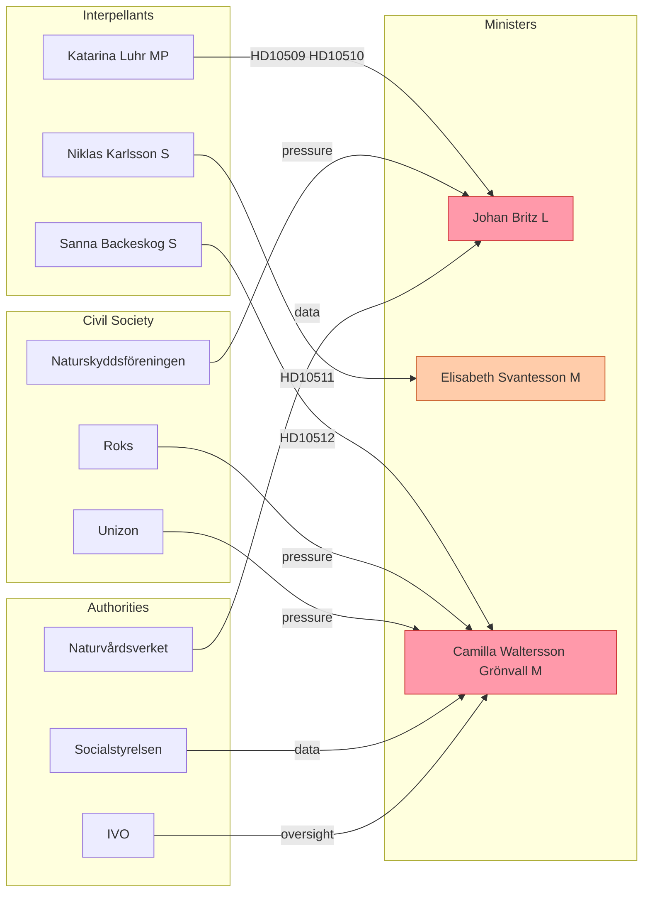

# Stakeholder Perspectives — Interpellation Debates, 2026-05-25

**Author**: James Pether Sörling | **Date**: 2026-05-25
**WEP Confidence**: HIGH | **Admiralty**: B2

---

## Stakeholder Map

### Primary Actors

#### Johan Britz (L) — Arbetsmarknadsminister och vikarierande klimat- och miljöminister

**Position**: Acting climate minister in a dual role; formal respondent to HD10509 and HD10510.
**Interests**: Defend government policy, protect L's climate credentials, avoid fracturing coalition, manage relationship with Stockholm Stad.
**Constraints**: Bound by Tidöavtalet (reduktionsplikt policy); cannot unilaterally change climate policy without M and SD agreement; dual-portfolio limits depth of climate expertise visible to public.
**Expected behaviour**: Will defend the government's economic rationale for reduktionsplikt reduction (fuel affordability, cost of living); will acknowledge municipal climate concerns while deflecting direct causality claim; may announce targeted support measures to soften criticism.
**Vulnerability**: If he concedes even partial causality on transport emissions, it creates a precedent for further accountability. If he fully denies, he risks factual contradiction by Naturvårdsverket data.

#### Elisabeth Svantesson (M) — Finansminister

**Position**: Formal respondent to HD10511 on economic distributional effects.
**Interests**: Defend tax policy as growth-enabling and welfare-compatible; avoid being captured by opposition constitutional framing; maintain fiscal credibility.
**Expected behaviour**: Will invoke RF 1:2's programmatic (non-binding) nature; cite employment growth, real wage recovery, and social spending levels; argue tax cuts broadly support working Swedes.
**Vulnerability**: If she cannot produce distributional modelling showing broad-based benefit, the framing favours the opposition.

#### Camilla Waltersson Grönvall (M) — Socialtjänstminister

**Position**: Formal respondent to HD10512 on women's shelters.
**Interests**: Defend social services reform; protect political legacy on women's rights; announce concrete measures to defuse the interpellation without reversing the licensing regime.
**Expected behaviour**: Will acknowledge the shelter capacity challenge; likely to announce a Socialstyrelsen review and/or transitional support package; will frame licensing requirements as quality protection.
**Vulnerability**: The 40-shelter closure figure is politically devastating if corroborated; she needs to announce concrete remedial action in her answer.

---

### Opposition Actors

#### Katarina Luhr (MP) — Interpellant (HD10509 + HD10510)

**Interests**: Hold government accountable on climate; establish a clear parliamentary record of government climate policy failures ahead of 2026 election; strengthen MP's climate-ownership narrative.
**Strategy**: Double-interpellation filing creates compound pressure on one minister; both climate adaptation delay and transport emissions link back to government policy choices.
**Expected outcome**: Will likely receive procedural answers; will use the debate to generate social media and press content; may request MiU hearing.

#### Niklas Karlsson (S) — Interpellant (HD10511)

**Interests**: Advance S's economic equality narrative; elevate distributional debate to constitutional register; create campaign-ready material.
**Strategy**: Constitutional framing is aggressive but media-friendly — "government violates Constitution" is a headline generator.
**Expected outcome**: Will use debate to extract distributional data or highlight its absence.

#### Sanna Backeskog (S) — Interpellant (HD10512)

**Interests**: Protect women's rights and safety; create accountability record for government's shelter policy failures; connect with civil society networks.
**Strategy**: Grounding in concrete statistics (40 closures) makes evasion difficult; emotional and human-rights framing has broad appeal.
**Expected outcome**: Will press for specific policy commitments; likely to work with Roks, Unizon on media amplification.

---

### Institutional Stakeholders

| Institution | Interest | Role |
|-------------|---------|------|
| Naturvårdsverket | Scientific accuracy on emission data | Independent corroboration of HD10510 claims |
| Socialstyrelsen | Social services capacity monitoring | Data source for HD10512 assessment |
| IVO (Inspektionen för vård och omsorg) | Oversight of shelters | Compliance and inspection authority |
| Stockholm Stad | Climate goal protection | Supporting political actor for HD10510 |
| Roks (Riksorganisationen för kvinnojourer) | Shelter network representation | Civil society amplification for HD10512 |
| Unizon | Women's shelter network | Civil society amplification for HD10512 |
| NCK (Nationellt centrum för kvinnofrid) | Research on SGBV | Scientific authority for HD10512 |
| Lagrådet | Legal review | Would assess constitutional dimensions of climate adaptation legislation (HD10509) |
| EU Commission | ESR compliance | Indirect stakeholder in HD10510 emission trajectory |

---

### Civil Society and Media

| Stakeholder | Alignment | Expected Role |
|-------------|-----------|--------------|
| Naturskyddsföreningen | Pro-climate action | Publish data, hold press conferences |
| WWF Sverige | Pro-climate action | International credibility on Swedish climate policy |
| Aftonbladet / Expressen | Tabloid; women's rights angle | HD10512 human interest narrative |
| SVT / SR | Public broadcaster; climate beat | Both climate clusters + women's shelters |
| Dagens Nyheter | Broadsheet; all four topics | Economic analysis (HD10511), investigation (HD10512) |
| Svenska Dagbladet | Centre-right; may defend government | Alternative framing for HD10511 |

---

## Stakeholder Influence Map

