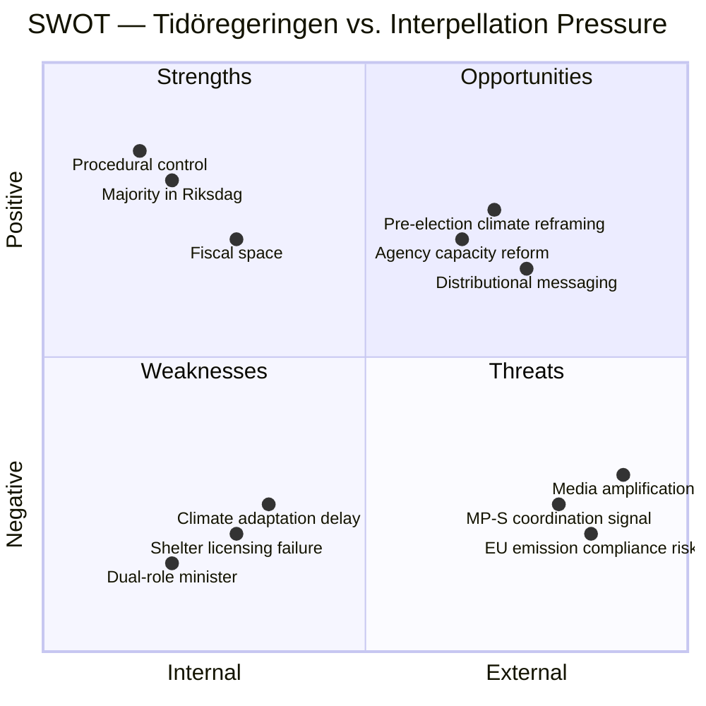

# SWOT Analysis — Interpellation Debates, 2026-05-25

**Author**: James Pether Sörling | **Date**: 2026-05-25
**Framework**: Political SWOT — Four-quadrant strategic analysis
**Subject**: Tidöregeringen's position in response to the four interpellations

---

## Overview

This SWOT analyses the Tidö coalition government's strategic position as it must respond to four simultaneous opposition interpellations on climate, economic justice, and social protection.

---

---

## Strengths (Government)

1. **Parliamentary majority**: The Tidökoalitionen (M+L+KD+SD) commands a working majority. Interpellations create political costs but no legislative risk — ministers can give measured responses without parliamentary consequence.
2. **Fiscal space**: Sweden's public finances have been on a consolidation path. The government can point to strong fiscal fundamentals to defend its economic approach (HD10511).
3. **Procedural authority**: The government controls the legislative calendar. Britz can choose when (if ever) to present the climate adaptation proposition, effectively setting the timeline on HD10509.
4. **Delegated accountability**: On HD10510, the minister has already deployed a deflection strategy (pointing to municipalities). While politically risky, this creates ambiguity that is hard to definitively refute without detailed emission attribution modelling.

## Weaknesses (Government)

1. **Climate adaptation legislation delay**: The government cannot credibly claim it has not had time to review the inquiry — 7 months have passed since the remiss deadline (October 2025). The delay is a verifiable inaction gap (HD10509).
2. **Dual-role minister exposure**: Johan Britz holding both Labour Market and acting Climate/Environment portfolios signals the government's ranking of climate policy. Britz lacks the specialist credibility of a dedicated climate minister.
3. **Women's shelter licensing failure**: The closure of 40 shelters is a concrete, documentable harm that the government's social services reform framework produced — even if unintentionally. This is a classic implementation accountability problem.
4. **Distributional data deficit**: On HD10511, if the government cannot produce its own distributional modelling showing the tax cuts benefit broad income ranges, the opposition's framing will dominate.

## Opportunities (Government)

1. **Pre-election climate repositioning**: The 2026 election creates an incentive to table a climate adaptation proposition now — converting the HD10509 pressure into a political positive. A June 2026 proposition announcement would neutralise the interpellation and generate positive climate coverage.
2. **Women's shelter regulatory relief**: The government can announce transitional licensing support or simplified certification pathways that directly address HD10512 without fully reversing the regime.
3. **Reframe distributional argument**: The government can commission or cite existing analysis showing employment growth, real wage increases, and labour market gains from fiscal stimulus — shifting from distribution to participation framing.
4. **Stockholm-state partnership**: Responding constructively to HD10510 by announcing a bilateral climate support package for Stockholm would turn a confrontation into a cooperative narrative.

## Threats (Government)

1. **Coordinated MP-S strategy**: The simultaneous filing of four interpellations suggests coordination. If both parties align further — e.g., tabling linked motions or committee questions — the pressure escalates beyond interpellation debate.
2. **EU emission compliance risk**: Sweden's growing deviation from its Effort Sharing Regulation trajectory (partly evidenced by Stockholm transport data in HD10510) creates a legal compliance dimension that Brussels may eventually raise, internationalising the political risk.
3. **Media amplification**: Women's shelter closures and climate emission data are both media-ready stories with human interest angles. A hostile press cycle could dominate the pre-summer news window.
4. **L-party internal pressure**: Johan Britz is from Liberalerna, which has traditionally maintained stronger climate and gender equality positions than M or SD. If Britz gives unsatisfying answers, pressure from within L's own party base may materialise.

---

## Strategic Recommendation (Analytical, Not Partisan)

Based on the balance of SWOT factors, the government's lowest-risk response strategy is:
- **HD10509**: Announce a timeline for the climate adaptation proposition — this converts inaction into action at minimal cost
- **HD10510**: Acknowledge the emission data, frame as a shared responsibility problem, announce a municipal climate support mechanism
- **HD10511**: Defend economic policy on employment and real wage grounds while commissioning distributional analysis
- **HD10512**: Announce transitional licensing facilitation measures and a Socialstyrelsen review of shelter capacity
