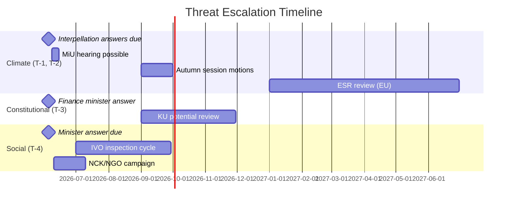

# Threat Analysis — Interpellation Debates, 2026-05-25

**Author**: James Pether Sörling | **Date**: 2026-05-25
**Framework**: Political Threat Framework — STRIDE-Political adaptation
**WEP Confidence**: HIGH | **Admiralty**: B2

---

## Threat Landscape

The four interpellations identify and activate threats against the government's political legitimacy, coalition cohesion, and policy credibility. This analysis uses the political threat framework to map institutional and procedural vulnerabilities.

---

## Threat Matrix

| Threat | Actor | Vector | Target | Likelihood | Severity |
|--------|-------|--------|--------|------------|---------|
| T-1: Climate inaction narrative | MP, S, civil society, media | Parliamentary debate + press | Government climate credibility | HIGH | HIGH |
| T-2: EU non-compliance | European Commission | Compliance review (post-2026) | Sweden's ESR obligations | LOW-MEDIUM | HIGH |
| T-3: Constitutional challenge | S (HD10511) | Interpellation + media | Government tax policy legitimacy | MEDIUM | MEDIUM |
| T-4: Women's shelter harm | S, civil society, IVO, media | Interpellation + IVO oversight | Social services minister | MEDIUM-HIGH | HIGH |
| T-5: L-party defection on climate | Internal L faction | Party debate | Coalition stability | LOW | MEDIUM-HIGH |
| T-6: Municipal-central conflict escalation | Stockholm stad, other municipalities | Legal action, political mobilisation | Intergovernmental relations | LOW-MEDIUM | MEDIUM |

---

## Detailed Threat Analysis

### T-1: Climate Inaction Narrative

**Mechanism**: MP and S have constructed a documented factual record of government climate policy choices and their measurable consequences: (a) reduced reduktionsplikt → fossil fuel consumption rises → transport emissions spike in Stockholm; (b) climate adaptation inquiry held without proposition since October 2025. This narrative is not merely ideological — it rests on verifiable emission data from Naturvårdsverket and Stockholm Stad's own reporting.

**Attack surface**: The acting climate minister Johan Britz (L) is the focus. His dual-portfolio role makes him the political focal point for climate questions while lacking the dedicated expertise and political capital of a full-time climate minister.

**Procedural escalation path**: If Britz gives unsatisfying answers in the interpellation debate:
1. MiU may request a hearing with the minister
2. MP+S may file linked motions in the autumn session
3. NGOs (Naturskyddsföreningen, WWF Sverige) may publish independent emission data to reinforce the narrative

### T-2: EU Non-Compliance Risk

**Mechanism**: Sweden committed under the EU Effort Sharing Regulation (ESR) to reduce non-ETS emissions by 40% by 2030 (vs. 2005 baseline). Road transport is a major ESR sector. If national transport emissions follow Stockholm's pattern (rising in 2024), Sweden's ESR compliance trajectory is at risk. The Commission may eventually open an infringement procedure — this risk is 3–5 years distant but creates a legal sword of Damocles.

**Note**: This threat is latent rather than imminent (2026 election context), but the opposition can leverage it as a forward-facing risk argument.

### T-3: Constitutional Challenge (HD10511)

**Mechanism**: The invocation of RF 1:2 is constitutionally aggressive but strategically clever. While the provision is programmatic (not justiciable), establishing a parliamentary record suggesting the government violates the Constitution's social welfare mandate creates a legitimacy narrative that can be reproduced in campaign materials and media framing. Finance Minister Svantesson must manage the constitutional framing without appearing to dismiss constitutional arguments.

**Limitation**: The Constitutional Committee (KU) could conceivably examine the question under its oversight function, but this is unlikely given the programmatic nature of RF 1:2.

### T-4: Women's Shelter Capacity Threat

**Mechanism**: The threat to women's shelters is both humanitarian and political. If women are unable to access protection and a serious incident occurs in an area where shelter capacity has been eliminated, the chain of causation runs directly to the licensing regime. The minister is personally accountable.

**Procedural escalation**: IVO (Inspektionen för vård och omsorg) has ongoing inspection authority. If IVO publishes a critical assessment of shelter capacity, it creates an independent authoritative source corroborating the opposition's position. Socialstyrelsen annual statistics will quantify the shelter bed deficit.

**Civil society**: NCK (Nationellt centrum för kvinnofrid) and the national women's shelter network (Roks, Unizon) are organised and politically vocal. They have direct access to media and can independently document the harm.

### T-5: L-Party Internal Pressure

**Mechanism**: Liberalerna has a party platform that includes stronger climate commitments than the Tidöavtalet's actual policy output. If Britz gives answers that are perceived as dismissive of climate concerns, L voters who prioritise climate policy (a core L demographic) may shift to C or MP. In an election year, L cannot afford further vote losses given its current polling near the 4% threshold.

---

## Threat Timeline

---

## Conclusion

The dominant near-term threat is T-4 (women's shelter harm) due to its ongoing, documentable nature. T-1 (climate inaction) is the most strategically significant given its election-year amplification potential. T-3 (constitutional framing) is novel but limited in direct legal force. T-5 (L-party pressure) is a secondary coalition risk that should be monitored through L party conference communications.
