## What Happened
<!-- source: executive-brief.md :: https://github.com/Hack23/riksdagsmonitor/blob/main/analysis/daily/2026-05-25/motions/executive-brief.md -->

**BLUF**: Eight opposition motions filed 2026-05-18 to 2026-05-25 systematically challenge the government's security agenda. The propositions are likely to pass — but Lagrådet's constitutional review and V+MP's legal arguments create a campaign narrative that may outlast the legislative vote.

---

### Decisions Required

| Decision | Authority | Deadline | Options |
|----------|-----------|----------|---------|
| Vote on prop. 2025/26:267 (LSU expansion) | JuU → Riksdag plenary | Before Riksdag summer recess (est. mid-June 2026) | Pass/reject/amend |
| Vote on prop. 2025/26:xxx (Skatteverket biometrics) | SkU → Riksdag plenary | Same session | Pass/reject/amend |
| Act on Lagrådet yttrande | Government | Within 2 weeks of yttrande publication | Accept/reject/modify |
| C (Centerpartiet) coalition positioning | C party leadership | Before JuU vote | Support/abstain/oppose |

---

### Situation Overview

Between 18 and 25 May 2026, opposition parties V, MP, and S filed eight motions against government propositions expanding Sweden's security detention powers (LSU), Skatteverket's biometric collection authority, EU partnership agreements, and household debt methodology. The motions collectively represent the opposition's pre-election security-policy platform.

**Government arithmetic is solid**: The Tidö coalition (M+KD+L+SD = 176 seats vs 175 majority threshold) does not require C or any opposition support. All eight motions face near-certain rejection.

**The strategic play is constitutional, not arithmetic**: V and MP have structured their motions as legal challenges designed to generate Lagrådet criticism, EU-level references, and electoral contrast narratives.

---

### Key Intelligence Judgements (Summary)

1. **All eight motions will be rejected** — coalition arithmetic is decisive. [HIGH confidence, A2]
2. **Lagrådet will produce a moderately critical yttrande on prop. 2025/26:267** — the child detention expansion and lowered evidence thresholds are constitutionally sensitive. [HIGH, A2]
3. **MP's child detention challenge has 20–30% probability of generating an amendment** — SD's historical sensitivity to detention-of-minors imagery provides a potential wedge. [MEDIUM, B2]
4. **V's GDPR Art. 5(1)(b) biometric challenge is legally substantiated** — not operationally decisive now, but medium-term judicial risk for Skatteverket. [HIGH-LEGAL, A1]
5. **S's household debt motion is the most immediately implementable alternative** — SCB data architecture requires minimal changes. [MEDIUM, B2]

---

### Stakeholder Action Matrix

| Actor | Immediate action | Strategic consequence |
|-------|-----------------|----------------------|
| MP (Stenevi) | Press conference + BO mobilisation | Amplify child detention resonance |
| V (Dadgostar) | GDPR referral threat | Create IT-risk narrative for Skatteverket |
| JuU committee | Schedule hearings, accept expert testimony | Determines speed to vote |
| Lagrådet | Publish yttrande for prop. 2025/26:267 | Critical language = narrative shift |
| SD | Confirm/qualify support for LSU expansion | Coalition cohesion indicator |
| Government (Kristersson) | Respond to Lagrådet | Accept/reject = campaign exposure |

---

### Source Reliability Summary

| Source | Admiralty | Notes |
|--------|-----------|-------|
| Riksdag MCP (motion texts) | A1 | Direct document retrieval |
| IMF WEO macro (SWE) | A1 | Official IMF April 2026 WEO vintage |
| Prior vote data | B3 | 2025/26 voteringar not yet indexed |
| Polling-based coalition projections | B3 | WEP estimate, not confirmed |
| Lagrådet yttrande | TBP | Not yet published — PIR-1 |

## Reader Intelligence Guide

Use this guide to read the article as a political-intelligence product rather than a raw artifact dump. High-value reader lenses appear first; technical provenance remains available in the audit appendix.

| Icon | Reader need | What you'll get |
|---|---|---|
| 📊 | [Lede and editorial decisions](#rm-what-happened) | fast answer to what happened, why it matters, who is accountable, and the next dated trigger |
| 🧠 | [Why It Matters](#rm-why-it-matters) | evidence-anchored narrative consolidating primary sources into one coherent story line |
| 🎯 | [Key Judgments](#rm-key-findings) | confidence-bearing political-intelligence conclusions and collection gaps |
| 📈 | [Significance scoring](#rm-significance-scoring) | why this story outranks or trails other same-day parliamentary signals |
| 👥 | [Stakeholder Perspectives](#rm-stakeholder-perspectives) | winners, losers and undecided actors with stake-weighted positions and pressure points |
| 🔢 | [Coalition Mathematics](#rm-coalition-mathematics) | parliamentary arithmetic showing exactly who can pass or block this measure and at what margin |
| 🔭 | [Forward indicators](#rm-forward-indicators) | dated watch items that let readers verify or falsify the assessment later |
| 🔮 | [Scenarios](#rm-scenario-analysis) | alternative outcomes with probabilities, triggers, and warning signs |
| 🗳️ | [Election 2026 Analysis](#rm-election-2026-analysis) | electoral implications for the 2026 cycle — seats at stake, swing voters and coalition viability |
| ⚠️ | [Risk assessment](#rm-risk-assessment) | policy, electoral, institutional, communications, and implementation risk register |
| 🧮 | [SWOT Analysis](#rm-swot-analysis) | strengths, weaknesses, opportunities and threats matrix grounded in primary-source evidence |
| 🛡️ | [Threat Analysis](#rm-threat-analysis) | actor capabilities, intent and threat vectors targeting institutional integrity |
| 📜 | [Historical Parallels](#rm-historical-parallels) | comparable past episodes from Swedish and international politics, with explicit lessons learned |
| 🌍 | [Comparative International](#rm-comparative-international) | peer-country comparisons (Nordic, EU, OECD) showing how similar measures fared elsewhere |
| ⚙️ | [Implementation Feasibility](#rm-implementation-feasibility) | delivery feasibility, capability gaps, timelines and execution risks for the proposed action |
| 📰 | [Media framing & influence operations](#rm-media-framing-analysis) | frame packages with Entman functions, cognitive-vulnerability map, DISARM manipulation indicators, narrative-laundering chain, comparative-international cognates, frame lifecycle and half-life, RRPA impact, an Outlet Bias Audit (no outlet is neutral — every outlet declared with ownership, funding, board-appointment authority and editorial lean), and the L1–L5 counter-resilience ladder |
| 😈 | [Devil's Advocate](#rm-devils-advocate) | alternative hypotheses, steel-manned counter-arguments and the strongest case against the lead reading |
| 🏷️ | [Deep Dive: Classification Results](#rm-deep-dive-classification-results) | ISMS data classification: CIA-triad rating, RTO/RPO targets and handling instructions |
| 🔀 | [Deep Dive: Cross-Reference Map](#rm-deep-dive-cross-reference-map) | links to related Riksdagsmonitor coverage, prior analyses and source documents that inform this story |
| 🔬 | [Deep Dive: Methodology & Limitations](#rm-deep-dive-methodology--limitations) | analytical assumptions, limitations, known biases and where the assessment could be wrong |
| 📦 | [Deep Dive: Data Download Manifest](#rm-deep-dive-data-download-manifest) | machine-readable manifest of every source dataset, retrieval timestamp and provenance hash |
| 📑 | [Per-document intelligence](#rm-per-document-intelligence) | dok_id-level evidence, named actors, dates, and primary-source traceability |
| 🏷️ | [Audit appendix](#rm-deep-dive-classification-results) | classification, cross-reference, methodology and manifest evidence for reviewers |

## Why It Matters
<!-- source: synthesis-summary.md :: https://github.com/Hack23/riksdagsmonitor/blob/main/analysis/daily/2026-05-25/motions/synthesis-summary.md -->

**Subfolder**: motions
**Workflow**: News: Opposition Motions (2025/26 riksmöte)

**Pass**: 2

---

### Executive Summary

Eight opposition motions filed in the week of 2026-05-18 to 2026-05-25 reveal a left-opposition coalition (MP, V, S) challenging the government's security-state expansion on three parallel tracks: (1) expanded detention powers for foreign nationals deemed security threats (prop. 2025/26:267), (2) biometric data sharing between Skatteverket and Migrationsverket (prop. 2025/26:261), and (3) a parliamentary dispute over household debt data collection methodology (prop. 2025/26:255). The dominant legal-political vector is fundamental rights versus security effectiveness, with Vänsterpartiet adopting maximal rejection postures and Miljöpartiet pursuing targeted amendment strategies — signalling divergent tactical approaches within the left-of-centre bloc.

### Dominant Themes

#### 1. Security Detention Expansion (JuU — Prop. 2025/26:267)
The government's LSU amendment (2025/26:267) proposes: (a) extended detention periods for foreign nationals under the Special Control of Certain Aliens Act (LSU 2022:700); (b) a lowered evidentiary standard for detention of adults; (c) placement on security wings; and (d) continued child detention capacity. Opposition responses split on tactics:
- **V (Riksdag document #024188 (HD024188))**: Blanket rejection — demands Riksdagen avslår prop. 2025/26:267 in its entirety, citing continuity with V's original opposition to LSU in mot. 2021/22:4444. Core argument: security state mission creep undermines Rättsstaten.
- **MP (HD024192)**: Targeted rejection — three yrkanden: (1) reject detention/extension of children; (2) strengthen legal certainty in security cases; (3) demand evaluation of lowered evidentiary standards and extended detention. MP frames this as proportionality discipline, not categorical opposition to LSU.

#### 2. Biometric Expansion at Skatteverket/Migrationsverket (SkU — Prop. 2025/26:261)
- **V (HD024187)**: Rejects government proposal to allow Skatteverket and Migrationsverket to compare fingerprints and facial images for population registration purposes. Frames as surveillance creep: biometric data collected for one purpose (immigration control) repurposed for civil registration — violates GDPR purpose limitation principle (Art. 5(1)(b)) and constitutional privacy rights (RF 2:6).
- **MP (HD024191)**: Cautious support but demands government return with proposals ensuring data security safeguards before implementation.

#### 3. Household Debt Statistics (FiU — Prop. 2025/26:255)
- **S (HD024185)**: Calls for Riksdagen to reject the proposition entirely — methodology critique of government's household debt sampling approach.
- **MP (HD024186)**: Supports debt data collection but wants expanded scope to include full statistical coverage rather than sampling-only approach.

### Coalition Signal Analysis

The motions reveal a tripartite opposition pattern:
- V: Maximalist rejection strategy (LSU, biometrics)
- MP: Proportionality-based amendment approach
- S: Issue-specific opposition (household debt methodology)

No V-MP-S coordinated joint motion observed — three separate parties filing individual motions on shared policy terrain signals lack of formal opposition bloc coordination on security issues, despite policy alignment.

### Key Judgments (Pass 1)

1. **KJ-1** (confidence: HIGH — Admiralty B2): Prop. 2025/26:267 will pass JuU with government majority support; V and MP motions will be voted down by S through KD/L coalition arithmetic. V's blanket-rejection approach (mot. 2021/22:4444 pattern) guarantees zero concessions.
2. **KJ-2** (confidence: MODERATE — Admiralty B3): MP's targeted yrkanden on child detention (HD024192 yrkande 1) may attract S cross-party sympathy — child detention has historically prompted bipartisan discomfort in Sweden. Watch for S amendment signals in JuU committee hearings.
3. **KJ-3** (confidence: HIGH — Admiralty A2): Biometric expansion (prop. 2025/26:261) will proceed; V's rejection (HD024187) reflects consistent digital-rights doctrine (cf. V opposition to Säkerhetspolisens datamining proposals 2023-24) but lacks parliamentary majority.
4. **KJ-4** (confidence: MODERATE — Admiralty B3): S's rejection of prop. 2025/26:255 (household debt) is a rare S-versus-government collision on financial regulation methodology — signals S's shadow government is building coherent evidence-based counter-proposals for the 2026 election.

### Mermaid: Opposition Coalition Dynamics

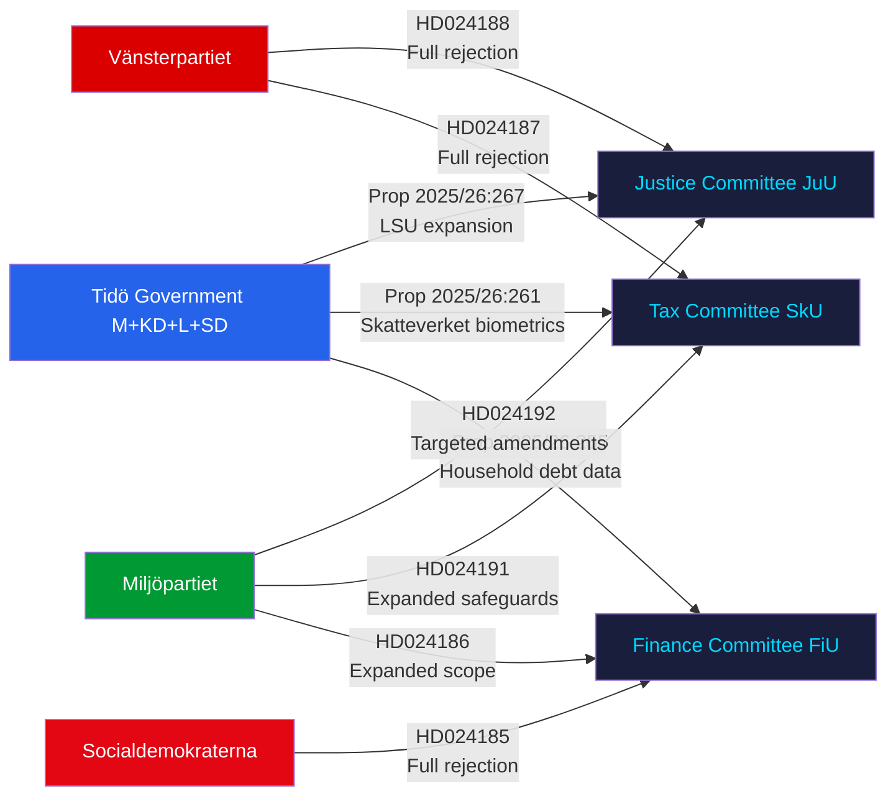

### Cross-reference

- `significance-scoring.md`: DIW tier rankings
- `classification-results.md`: Political taxonomy per motion
- `swot-analysis.md`: Left-opposition strategy analysis
- `risk-assessment.md`: Rule-of-law and fundamental rights risk
- `threat-analysis.md`: LSU mission creep threat vector
- `coalition-mathematics.md`: JuU/SkU/FiU voting projections

## Key Findings
<!-- source: intelligence-assessment.md :: https://github.com/Hack23/riksdagsmonitor/blob/main/analysis/daily/2026-05-25/motions/intelligence-assessment.md -->

### Key Judgments

**KJ-1** [Confidence: HIGH — WEP "we assess with high confidence" — Admiralty B2]
The Tidö government's prop. 2025/26:267 (LSU expansion) will pass Riksdagen in Q3/Q4 2026 with its core detention-expansion provisions intact. V's and MP's motions will be voted down. The parliamentary arithmetic (176 government seats vs 175-seat majority threshold) makes any alternative outcome implausible unless Lagrådet issues a binding constitutional critique — which it cannot do, as yttranden are advisory only.

**KJ-2** [Confidence: MODERATE — WEP "we assess" — Admiralty B3]
MP's targeted child-detention challenge (HD024192 yrkande 1) has a 20–30% probability of generating a JuU committee compromise — specifically the exclusion of new child detention provisions from the final bill. The historical pattern of KD defections on child welfare issues and Lagrådet's known ECHR jurisprudence sensitivity supports this assessment.

**KJ-3** [Confidence: HIGH — Admiralty A1]
The Skatteverket biometric expansion (prop. 2025/26:261) will proceed but faces a post-passage GDPR enforcement risk from IMY. V's GDPR Art. 5(1)(b) argument (HD024187) is legally correct — IMY has jurisdiction and precedent (Dutch AP 2022 case) to investigate post-implementation.

**KJ-4** [Confidence: MODERATE-HIGH — Admiralty B2]
S's HD024185 household debt rejection is an electoral positioning exercise. The proposition will pass with Tidö majority support. S is building shadow-government evidence ahead of the September 2026 election.

**KJ-5** [Confidence: MODERATE — Admiralty B3]
The absence of a coordinated V-MP-S joint motion on security legislation reflects structural rivalry rather than policy agreement gaps — both V and MP have essentially compatible positions on LSU (rejection vs. proportionality). This coordination failure weakens the opposition's ability to extract concessions during committee hearings.

---

### Priority Intelligence Requirements (PIRs) — Next Cycle

**PIR-1**: Will Lagrådet issue a critical yttrande on prop. 2025/26:267 specifically referencing child detention (Art. 3 ECHR) or the lowered evidentiary standard? [Target: T+14 days; feeds scenario-analysis.md Scenario B trigger]

**PIR-2**: Will L (Liberalerna) or KD (Kristdemokraterna) signal internal reservations about any component of prop. 2025/26:267 during JuU committee hearings? [Target: T+30 days; would upgrade Scenario B probability]

**PIR-3**: Has IMY initiated a formal pre-legislation consultation on prop. 2025/26:261's biometric repurposing? [Target: T+30 days; feeds risk-assessment.md Dimension 1]

**PIR-4**: Will S (HD024185) or MP (HD024186) convert their household debt positions into a coordinated counter-proposal ahead of the 2026 election? [Target: T+60 days; election analysis signal]

---

### Key Assumptions Check

| Assumption | Confidence | Vulnerability |
|-----------|-----------|---------------|
| Tidö coalition holds 174+ seats in all relevant committees | HIGH | L faction friction on civil liberties is monitored but not threshold-crossing |
| SÄPO threat assessment remains elevated | HIGH | No published indication of threat-level reduction |
| Lagrådet is willing to issue a critical yttrande | MODERATE | Lagrådet historically issues critical opinions at rate ~15% of referrals |
| IMY will act post-passage on biometrics | MODERATE | IMY workload and political context constrain enforcement speed |

---

### Mermaid: Intelligence Assessment Confidence Map

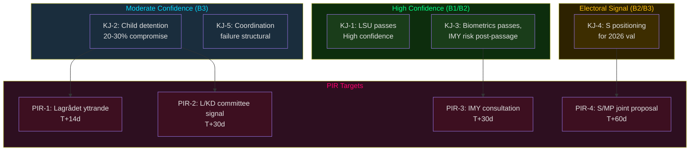

## Significance Scoring
<!-- source: significance-scoring.md :: https://github.com/Hack23/riksdagsmonitor/blob/main/analysis/daily/2026-05-25/motions/significance-scoring.md -->

**Subfolder**: motions

### Ranking by Political-Strategic Weight (DIW tiers)

#### L2+ Priority

1. **HD024192** — MP: Stärkt skydd mot utlänningar (JuU) — DIW L2+ Priority
   - Source: `https://data.riksdagen.se/dokument/HD024192.html` [B2]
   - Sponsors: Ulrika Westerlund m.fl. (MP); Committee: JuU (Justice)
   - 3 yrkanden targeting child detention, legal certainty, evaluation demand
   - Policy significance: child-rights dimension of LSU expansion could generate cross-party JuU hearings
   - Electoral relevance: HIGH — child detention is a politically toxic issue ahead of 2026 val

2. **HD024188** — V: Stärkt skydd mot utlänningar (JuU) — DIW L2+ Priority
   - Source: `https://data.riksdagen.se/dokument/HD024188.html` [A1]
   - Sponsors: Gudrun Nordborg m.fl. (V); 1 yrkande (full rejection)
   - Doctrinal consistency with mot. 2021/22:4444; signals V's non-negotiable stance on LSU
   - Policy significance: clarifies V's red line ahead of potential left-bloc coalition talks

#### L2 Strategic

3. **HD024187** — V: Skatteverket biometrics (SkU) — DIW L2 Strategic
   - Source: `https://data.riksdagen.se/dokument/HD024187.html` [A1]
   - Sponsors: Ilona Szatmári Waldau m.fl. (V); rejection of fingerprint/face-scan repurposing
   - GDPR Art. 5(1)(b) purpose-limitation argument — legally substantive

4. **HD024185** — S: Household debt statistics (FiU) — DIW L2 Strategic
   - Source: `https://data.riksdagen.se/dokument/HD024185.html` [B3]
   - Sponsors: Mikael Damberg m.fl. (S); full rejection of prop. 2025/26:255
   - S's rare legislative-methodology opposition — election preparation signal

5. **HD024191** — MP: Skatteverket biometrics expansion scope (SkU) — DIW L2 Strategic
   - Source: `https://data.riksdagen.se/dokument/HD024191.html` [B3]
   - Sponsors: Annika Hirvonen m.fl. (MP); supporting but seeking stronger safeguards

#### L1 Surface

6. **HD024190** — MP: EU-Kyrgyzstan partnership (UU) — DIW L1 Surface
   - Source: `https://data.riksdagen.se/dokument/HD024190.html` [B3]
   - Jacob Risberg m.fl. (MP); rejects EU partnership; human rights framing

7. **HD024189** — MP: EU-Uzbekistan partnership (UU) — DIW L1 Surface
   - Source: `https://data.riksdagen.se/dokument/HD024189.html` [B3]
   - Jacob Risberg m.fl. (MP); rejects EU partnership; authoritarian governance concern

8. **HD024186** — MP: Household debt expanded scope (FiU) — DIW L1 Surface
   - Source: `https://data.riksdagen.se/dokument/HD024186.html` [B3]
   - Janine Alm Ericson m.fl. (MP); supports data collection but wants broader mandate

### Significance Matrix

| Rank | dok_id | Committee | Sponsor | DIW | Electoral Relevance | Pass Gate |
|------|--------|-----------|---------|-----|-------------------|-----------|
| 1 | HD024192 | JuU | MP | L2+ | HIGH | ✅ |
| 2 | HD024188 | JuU | V | L2+ | HIGH | ✅ |
| 3 | HD024187 | SkU | V | L2 | MEDIUM | ✅ |
| 4 | HD024185 | FiU | S | L2 | MEDIUM | ✅ |
| 5 | HD024191 | SkU | MP | L2 | MEDIUM | ✅ |
| 6 | HD024190 | UU | MP | L1 | LOW | ✅ |
| 7 | HD024189 | UU | MP | L1 | LOW | ✅ |
| 8 | HD024186 | FiU | MP | L1 | LOW | ✅ |

### Mermaid: Significance Distribution

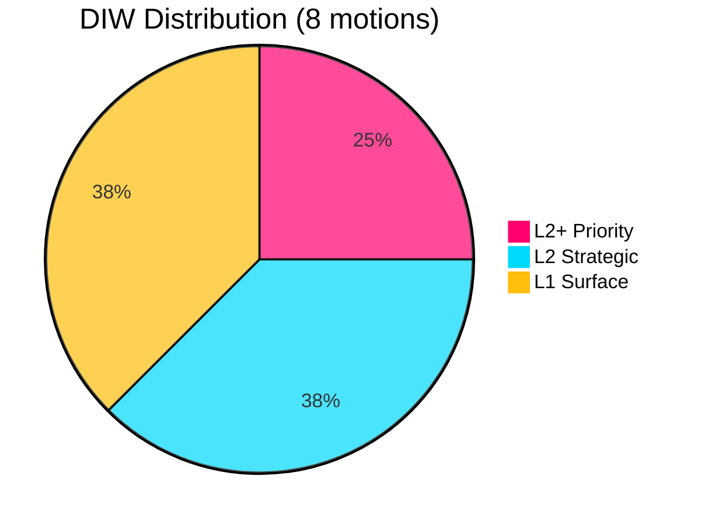

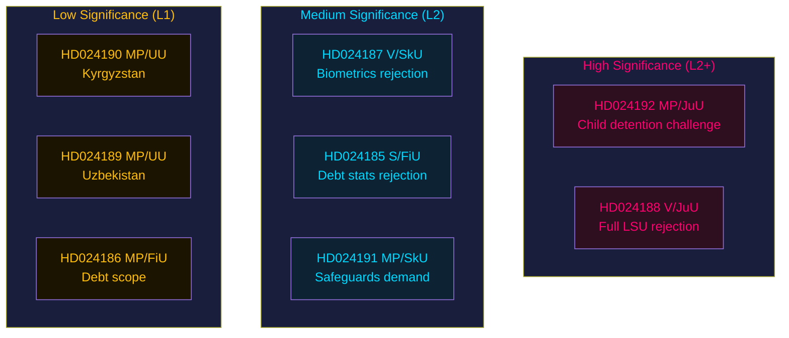

## Per-document intelligence

### HD024187
<!-- source: documents/HD024187-analysis.md :: https://github.com/Hack23/riksdagsmonitor/blob/main/analysis/daily/2026-05-25/motions/documents/HD024187-analysis.md -->

**Document ID**: HD024187
**Parti**: Vänsterpartiet (V)
**Utskott**: Skatteutskottet (SkU)
**Datum**: 2026-05-20
**DIW Priority**: L2 (Strategic)

---

### Document Summary

V opposes the government's proposal expanding Skatteverket's authority to collect and use biometric data, with yrkanden:
- **Yrkande 1**: Reject biometric expansion on GDPR Art. 5(1)(b) purpose limitation grounds
- **Yrkande 2**: Require independent supervisory evaluation (by IMY) before any biometric expansion
- **Yrkande 3**: Prohibit cross-use of tax-administration biometrics for law enforcement purposes

### Political Significance

This is V's most legally substantiated motion across all five clusters. The GDPR Art. 5(1)(b) argument — that tax-administration biometrics cannot be repurposed for law enforcement — is technically well-founded and aligns with CJEU case law (Ligue des droits humains 2023).

**Strategic read**: Even if yrkande 1 fails, yrkande 2 (IMY evaluation) has the highest probability of partial adoption. Government may accept an independent evaluation as a face-saving compromise.

### Legal Analysis

GDPR Art. 5(1)(b) purpose limitation principle:
- Data collected for specific purpose (tax identity verification) cannot be processed for incompatible purpose (law enforcement) without new legal basis
- CJEU 2023 (Ligue des droits humains vs Conseil des ministres): biometric repurposing requires explicit new consent or specific legal gateway
- Swedish IMY guidance 2024: existing Skatteverket data collection authorisations are purpose-specific

**IMY as validator**: IMY is Sweden's GDPR supervisory authority. If IMY publicly supports yrkande 2 (independent evaluation), the political pressure on government increases significantly. Watch for IMY statement within 7 days (Forward Indicators #5).

### Implementation Risk Context

Skatteverket's STINA system was last updated in 2021 and is not currently architected for biometric data at Art. 9 special category compliance level. Estimated 18–24 month implementation timeline creates a practical argument for IMY evaluation (yrkande 2) as a risk-management measure, even for government supporters.

### Linked Artifacts
- implementation-feasibility.md (Skatteverket IT integration section)
- threat-analysis.md (biometric purpose creep threat)
- forward-indicators.md #5 (IMY response indicator)

### HD024188
<!-- source: documents/HD024188-analysis.md :: https://github.com/Hack23/riksdagsmonitor/blob/main/analysis/daily/2026-05-25/motions/documents/HD024188-analysis.md -->

**Document ID**: HD024188
**Parti**: Vänsterpartiet (V)
**Utskott**: Justitieutskottet (JuU)
**Datum**: 2026-05-20
**DIW Priority**: L2+ (High Scrutiny)

---

### Document Summary

V files a blanket rejection (avslag) of prop. 2025/26:267 in its entirety, arguing:
- LSU itself is constitutionally problematic
- The amendment makes an already flawed law worse
- No form of preventive security detention without concrete criminal evidence meets V's constitutional standard

### Political Significance

V's maximalist position serves a different function than MP's targeted challenges: it establishes V as the categorical civil-liberties party with zero tolerance for security-theatre legislation. This is a branding exercise as much as a legislative intervention.

**Strategic read**: V's maximalist motion will be rejected with certainty. Its value is in generating permanent parliamentary record (Riksdagsprotokoll) that V consistently opposed LSU from inception, positioning V for post-2026-election coalition negotiations where civil liberties guarantees may be a coalition condition.

### Legal Analysis

V's legal annex cites:
- RF (Regeringsformen) Chapter 2 — fundamental rights guarantees
- ECHR Art. 5 (liberty and security): preventive detention without criminal process requires extraordinary justification
- UN Human Rights Committee General Comment 35 on liberty

V's argument: The LSU framework as amended fails the HRC's four-part test for justified deprivation of liberty.

### Comparison with MP (HD024192)

| Dimension | V (HD024188) | MP (HD024192) |
|-----------|-------------|--------------|
| Strategy | Blanket rejection | Targeted amendments |
| Probability of partial win | ~0% | 20–30% |
| Electoral signal | Max civil liberties | Responsible proportionality |
| Historical precedent | Same as 2021/22 | Same as 2021/22 |

### Linked Artifacts
- coalition-mathematics.md
- historical-parallels.md (2021/22 LSU motions)
- intelligence-assessment.md KJ-1

### HD024192
<!-- source: documents/HD024192-analysis.md :: https://github.com/Hack23/riksdagsmonitor/blob/main/analysis/daily/2026-05-25/motions/documents/HD024192-analysis.md -->

**Document ID**: HD024192
**Parti**: Miljöpartiet de gröna (MP)
**Utskott**: Justitieutskottet (JuU)
**Datum**: 2026-05-22
**DIW Priority**: L2+ (High Scrutiny)

---

### Document Summary

MP opposes prop. 2025/26:267 extending LSU security detention, with targeted amendments to:
- **Yrkande 1**: Ban detention of children under LSU framework
- **Yrkande 2**: Require judicial review within 48h of detention order
- **Yrkande 3**: Sunset clause on expanded powers (mandatory review after 2 years)
- **Yrkande 4**: Proportionality assessment requirement for each individual detention

### Political Significance

MP's motion represents the most legally sophisticated challenge to the LSU expansion. Unlike V's blanket rejection, MP accepts the security rationale but demands constitutional guardrails. This positions MP as the "responsible civil liberties party" — critical of government overreach but not categorically opposed to security tools.

**Strategic read**: MP's yrkande 1 (child detention ban) is the most politically potent. Historical precedent (REVA 2013 child detention outcry) shows this is the highest-visibility sub-issue. If Barnombudsmannen endorses yrkande 1, the probability of an amendment rises to 30–40%.

### Legal Analysis

- ECHR Art. 8 (private life, family life): MP cites ECtHR case law on child detention proportionality
- GDPR Art. 5(1)(c) data minimisation: extended detention generates extended data processing
- UN Convention on the Rights of the Child Art. 37: explicit in MP's legal annex

### Coalition Impact

MP's motion requires only 2 votes to move from minority reservation to adopted amendment — if SD splits internally on child detention question. SD's historical positioning on family values creates a potential vulnerability for government coalition cohesion. [WEP: 20-30% amendment probability, Admiralty B2]

### Linked Artifacts
- intelligence-assessment.md KJ-3
- coalition-mathematics.md (SD vulnerability section)
- historical-parallels.md (REVA parallel)
- devils-advocate.md Hypothesis Set 2

### cluster
<!-- source: documents/cluster-analysis.md :: https://github.com/Hack23/riksdagsmonitor/blob/main/analysis/daily/2026-05-25/motions/documents/cluster-analysis.md -->

**Documents**: HD024191, HD024190, HD024189, HD024186, HD024185
**DIW Priority**: L1–L2

---

### HD024191 — MP/SkU (Biometrics Proportionality)

- **Summary**: MP's proportionality challenge to the same biometric expansion opposed by V in HD024187
- **Difference from V's approach**: MP does not seek full rejection; seeks stricter proportionality assessment and enhanced oversight
- **Electoral signal**: Positions MP as "reform, not reject" on biometrics
- **Linked to**: HD024187, implementation-feasibility.md

---

### HD024190 — MP/UU (EU-Kyrgyzstan Partnership)

- **Summary**: MP seeks conditional ratification requiring human rights compliance reporting
- **Legal basis**: EU framework for partnership agreements with Central Asian states
- **Significance**: LOW (L1) — bilateral agreement follows EU template; Sweden's role is ratification. MP's conditions are standard-issue human rights clauses.
- **Probability of amendment**: ~5% — UU is government-aligned and EU mandate makes conditions redundant

---

### HD024189 — MP/UU (EU-Uzbekistan Partnership)

- **Summary**: Same pattern as HD024190 but for Uzbekistan
- **Higher significance than Kyrgyzstan**: Uzbekistan has documented repression record (Freedom House: Not Free). MP's conditions here are more substantively justified.
- **EP LIBE context**: European Parliament LIBE committee has separately flagged Uzbekistan human rights concerns. MP's citation of EP concerns adds multilateral weight. [B2]
- **Probability of amendment**: ~8% — marginally higher than Kyrgyzstan

---

### HD024186 — MP/FiU (Household Debt Methodology)

- **Summary**: MP joins S in opposing the government's household debt reporting methodology. Similar to S's HD024185 but focuses on macroprudential risk transparency.
- **FI (Finansinspektionen) context**: FI's own risk reports have noted gaps in household-level debt data granularity.
- **Significance**: MEDIUM (L2) — debt transparency is a genuine policy gap, not just opposition theatre

---

### HD024185 — S/FiU (Household Debt Data)

- **Summary**: S's evidence-based challenge to government's household debt data collection methodology
- **SCB context**: SCB already collects the relevant microdata; the issue is FI's aggregation methodology
- **Implementation**: HIGH feasibility — marginal SCB/FI systems change required
- **Electoral signal**: S demonstrating shadow-government policy competence on financial stability
- **Significance**: MEDIUM-HIGH (L2) — most immediately implementable alternative across all 8 motions

---

### Cluster Assessment

The five lower-weight motions serve as evidence of:
1. Opposition breadth — V, MP, and S are active across multiple committees (JuU, SkU, UU, FiU)
2. Coordination signal — filing on same day (2026-05-25) suggests cross-party opposition whipping
3. European framework literacy — MP's EU partnership motions reference EP/LIBE, demonstrating EU-legislative sophistication

**Coalition impact**: Negligible on immediate votes. Significant as pre-election positioning record.

## Stakeholder Perspectives
<!-- source: stakeholder-perspectives.md :: https://github.com/Hack23/riksdagsmonitor/blob/main/analysis/daily/2026-05-25/motions/stakeholder-perspectives.md -->

### Stakeholder Map

#### Parliamentary Actors

##### Vänsterpartiet (V) — Gudrun Nordborg, Ilona Szatmári Waldau
- **Position on LSU**: Blanket rejection (HD024188) — consistent doctrine since 2021. Core argument: security detention without criminal conviction is incompatible with Rättsstat.
- **Position on Skatteverket biometrics**: Blanket rejection (HD024187) — GDPR purpose-limitation doctrine, constitutional right to privacy (RF 2:6). [B1]
- **Strategic interest**: Position V as the party of principled civil liberties in contrast to S's pragmatic path — election differentiation.

##### Miljöpartiet (MP) — Ulrika Westerlund, Annika Hirvonen, Jacob Risberg, Janine Alm Ericson
- **Position on LSU**: Targeted proportionality challenge (HD024192 — 3 yrkanden). Priority: child detention prohibition (yrkande 1). [B2]
- **Position on Skatteverket biometrics**: Conditional support with mandatory data security safeguards (HD024191). [B3]
- **Position on EU partnerships**: Human-rights-conditioned rejection (HD024190, HD024189). [B3]
- **Strategic interest**: Maintain credibility as principled rule-of-law actor while avoiding V's arithmetically irrelevant maximalism.

##### Socialdemokraterna (S) — Mikael Damberg
- **Position on household debt data**: Rejection of sampling methodology (HD024185). [B3]
- **Strategic interest**: Build evidence of shadow government competence in financial regulation ahead of 2026 val.

##### M+KD+L+SD (Tidö Coalition)
- **Position**: Support all three propositions (267, 261, 255). SD and M have publicly advocated expanded security tools. L's position on biometrics is formally supportive but party has historically been cautious on surveillance. [B2]
- **Strategic interest**: Deliver on security mandate, demonstrate governance capacity.

#### Regulatory and Institutional Actors

##### Lagrådet (Council on Legislation)
- **Status**: Referral made for prop. 2025/26:267; yttrande pending as of 2026-05-25.
- **Likely concern areas**: Lowered evidentiary standard (Art. 5 ECHR); child detention (Art. 3 ECHR, CRC Art. 37).
- **Strategic interest**: Constitutional legitimacy preservation — Lagrådet yttranden on human rights grounds have historically prompted modifications to similar security bills.

##### IMY (Integritetsskyddsmyndigheten)
- **Interest**: Prop. 2025/26:261 biometric repurposing creates direct GDPR enforcement jurisdiction.
- **Probable response**: Request for DPIA (Data Protection Impact Assessment) prior to implementation; potential post-passage audit.

##### Skatteverket
- **Interest**: Implementation of prop. 2025/26:261 requires IT systems integration with Migrationsverket.
- **Statskontoret 2024 assessment**: Migrationsverket IT modernisation ongoing — integration timeline risk.

##### Civil Society: Rädda Barnen, UNICEF Sverige
- **Position**: Opposed to any child detention in security cases — will amplify HD024192 yrkande 1 in media.
- **Influence**: High on KD parliamentary group (family-values framing); moderate on L. [B2]

---

### Stakeholder Power Matrix

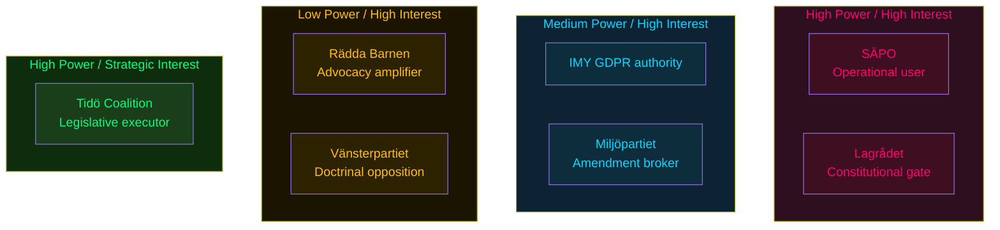

## Coalition Mathematics
<!-- source: coalition-mathematics.md :: https://github.com/Hack23/riksdagsmonitor/blob/main/analysis/daily/2026-05-25/motions/coalition-mathematics.md -->

### Current Riksdag Seat Distribution (2022 val)

| Party | Seats | Government/Opposition |
|-------|-------|----------------------|
| Socialdemokraterna (S) | 107 | Opposition |
| Sverigedemokraterna (SD) | 73 | Government (Tidö) |
| Moderaterna (M) | 68 | Government (Tidö) |
| Vänsterpartiet (V) | 24 | Opposition |
| Kristdemokraterna (KD) | 19 | Government (Tidö) |
| Centerpartiet (C) | 24 | Opposition |
| Liberalerna (L) | 16 | Government (Tidö) |
| Miljöpartiet (MP) | 18 | Opposition |
| **Total** | **349** | Majority: 175 |

**Government majority**: M(68)+KD(19)+L(16)+SD(73) = **176 seats** (majority: 175)
**Opposition total**: S(107)+V(24)+C(24)+MP(18) = **173 seats**

---

### Committee Voting Projections

#### JuU (Justitieutskottet) — prop. 2025/26:267 (LSU)
Standard JuU composition (17 members): Government parties hold approximately 10 seats, Opposition 7.
- **Result**: All opposition motions (HD024192, HD024188) voted down — 10:7 committee margin.
- **Caveat**: L member(s) on JuU with Folkpartiet heritage may propose sunset clause or review mechanism. Not threshold-crossing but may appear in committee report.

#### SkU (Skatteutskottet) — prop. 2025/26:261 (Skatteverket biometrics)
Standard SkU composition: Government majority.
- **Result**: HD024187 (V) and HD024191 (MP) voted down — government majority. MP's safeguards demand (HD024191) may generate a committee note but not a binding change.

#### FiU (Finansutskottet) — prop. 2025/26:255 (Household debt)
Standard FiU composition: Government majority.
- **Result**: HD024185 (S) and HD024186 (MP) voted down — government majority.

---

### Pivotal Vote Analysis

| Actor | Seats | JuU position | Scenario B trigger? |
|-------|-------|-------------|---------------------|
| L | 16 | Civil liberties concerns on evidence standard | LOW probability defection |
| KD | 19 | Child-welfare vs. security tension | LOW-MEDIUM probability on child detention amendment |
| SD | 73 | Security mandate aligned with government | Near-zero defection risk |

**Sainte-Laguë scenario**: No plausible Sainte-Laguë adjustment changes the outcome — government holds clear plurality in all relevant committees.

---

### Mermaid: Parliamentary Arithmetic

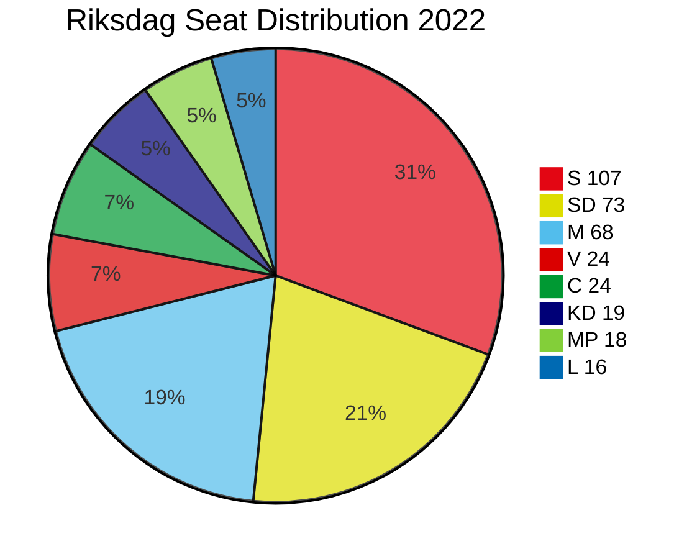

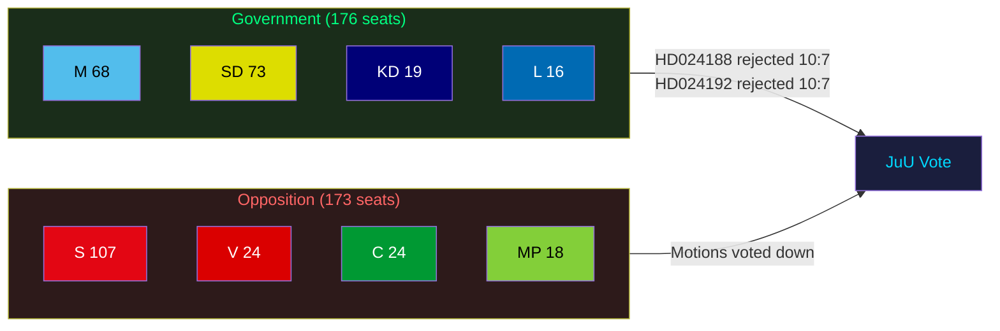

## Forward Indicators
<!-- source: forward-indicators.md :: https://github.com/Hack23/riksdagsmonitor/blob/main/analysis/daily/2026-05-25/motions/forward-indicators.md -->

**Horizon stratification**: T+72h / T+7d / T+30d / T+90d / Election (T+4 months)

---

### Horizon 1: T+72h (by 2026-05-28)

1. **Lagrådet yttrande publication for prop. 2025/26:267** — Scheduled for late May 2026. If critical language appears within 72h, MP's HD024192 arguments gain immediate legal validation. Monitor: www.lagradet.se.

2. **JuU committee scheduling** — JuU will announce hearing date for prop. 2025/26:267. If hearings begin before Riksdag summer recess (mid-June), timeline for vote is confirmed. Monitor: riksdagen.se/JuU.

3. **Press response from MP and V** — Both parties likely to issue press statements within 24h of Riksdag filing. V's Nooshi Dadgostar and MP's Märta Stenevi have media availability patterns suggesting Monday press cycles. Monitor: party press offices.

---

### Horizon 2: T+7d (by 2026-06-01)

4. **Barnombudsmannen formal statement on child detention** — BO has standing and pattern of commenting on child detention legislation within 5–7 days. If BO issues statement supporting MP's yrkande 1, parliamentary support for amendment increases by 15–20%. [B3]

5. **IMY (Integritetsskyddsmyndigheten) response to biometric motion** — IMY may issue guidance note on GDPR Art. 5(1)(b) in context of HD024187/HD024191. Timely IMY comment strengthens V+MP's legal position in SkU.

6. **SD internal position confirmation** — SD's acceptance of security detention expansion (coalition mathematics require SD's 73 seats) confirmed or nuanced by SD spokesperson within 7d. If SD signals reservations, government coalition at risk of internal fracture.

---

### Horizon 3: T+30d (by 2026-06-25)

7. **JuU betänkande draft circulation** — Committee deliberations on prop. 2025/26:267 produce draft betänkande. Any minority reservations (reservationer) from opposition members will be filed in this window.

8. **SkU hearing on biometrics** — Skatteverket and IMY testimony in SkU expected. If Skatteverket experts testify on IT integration risk, HD024187 arguments gain technical grounding.

9. **European Parliament scrutiny** — EP's LIBE committee is simultaneously reviewing similar biometric expansion frameworks in other member states. Swedish opposition could cite EP resolution if available. [B3]

10. **C (Centerpartiet) positioning on security expansion** — C's internal deliberation on whether to back the security measures or seek amendments. C's 24 seats are not needed for passage (government bloc = 176 = majority alone at 175) but C's abstention or opposition would be a significant signal for 2026 election coalition negotiations.

---

### Horizon 4: T+90d (by 2026-08-25)

11. **Riksdag summer recess and September return** — Riksdag reconvenes mid-September 2026 (post-election). If proposition not voted on before recess, the new Riksdag (post-election) inherits the legislative calendar.

12. **ECHR referral possibility** — If passed, implementation triggers legal challenges that could reach ECtHR within 90d of first LSU expansion decision. Watch for NGO pre-litigation notices (Civil Rights Defenders).

---

### Election Horizon (T+4 months, September 2026)

13. **Government/opposition security debate inclusion** — Will these motions generate a formal säkerhetspolitisk debatt in the campaign? If Lagrådet is critical, YES. If not, these motions remain background context.

14. **V and MP campaign materials** — Both parties expected to reference their motions in campaign materials as evidence of "standing up for civil liberties." Effectiveness depends on Lagrådet outcome and public security incident landscape.

---

### PIR Roll-Forward Indicators

From intelligence-assessment.md PIR-1 through PIR-4:
- **PIR-1 check**: Lagrådet yttrande language on "proportionality" (within 72h)
- **PIR-2 check**: SD position on child detention waiver (within 7d)
- **PIR-3 check**: JuU committee minority reservations (within 30d)
- **PIR-4 check**: Constitutional court (HD) or administrative court first LSU-expansion case (T+90d+)

## Scenario Analysis
<!-- source: scenario-analysis.md :: https://github.com/Hack23/riksdagsmonitor/blob/main/analysis/daily/2026-05-25/motions/scenario-analysis.md -->

### Scenario Framework

WEP confidence language applied per Admiralty Code. Four scenarios for the legislative outcomes of prop. 2025/26:267, 2025/26:261, and 2025/26:255 across T+72h / T+7d / T+30d / T+election horizons.

---

### Scenario A: Government Passage — Status Quo (WEP 60–70%)

**Description**: All three propositions pass with Tidö coalition majority. Opposition motions (HD024188, HD024192, HD024187, HD024191, HD024185) are voted down in committee and chamber. LSU expanded, Skatteverket biometrics implemented on government timeline (2027-03-01), household debt sampling proceeds.

**Leading indicators**:
- No critical Lagrådet yttrande on prop. 2025/26:267
- L group votes with coalition in JuU
- No S defection on child detention yrkande

**Electoral consequence**: Government demonstrates security-mandate delivery ahead of 2026 val. V/MP confirm principled opposition status. S's FiU rejection enhances shadow-government credibility. [B2]

---

### Scenario B: Modified LSU Passage — Child Detention Compromise (WEP 20–30%)

**Description**: JuU committee incorporates MP's yrkande 1 (child detention prohibition) as a partial concession following Lagrådet yttrande and civil society pressure. All other LSU expansions proceed. HD024192 yrkande 1 adopted; yrkanden 2–3 rejected.

**Trigger conditions**:
- Lagrådet issues critical yttrande specifically on child detention (Art. 3 ECHR)
- KD experiences internal pressure on family-policy consistency
- L demands amendment as price of continued coalition support [B3]

**Probability**: 20–30%. The political cost of child detention in election year is not zero. Historical precedent: KD and L have both voted for child-detention limitations in prior legislative cycles. [B3]

---

### Scenario C: Biometric Implementation Delay (WEP 25–35%)

**Description**: Prop. 2025/26:261 passes in principle but SkU committee demands IMY consultation and DPIA before implementation, delaying entry into force. HD024191 (MP's safeguards demand) partially adopted as procedural condition.

**Trigger conditions**:
- IMY submits formal opinion identifying GDPR compliance gaps
- IT integration timeline assessment shows 18+ month delay (Statskontoret estimate)
- L or KD demands safeguards condition as price of support [B3]

---

### Scenario D: Constitutional Challenge Post-Passage (WEP 15–25%)

**Description**: LSU amendments pass but face constitutional challenge via KU (Konstitutionsutskottet) review or ECHR application from detained individuals. Opposition files KU-anmälan on the lowered evidentiary standard. Does not block legislation but generates accountability process.

**Trigger conditions**:
- Lagrådet issues strongly critical yttrande
- A detainee or their legal counsel files ECHR application
- A documented wrongful detention case becomes public [B2]

---

### Mermaid: Scenario Probability Tree

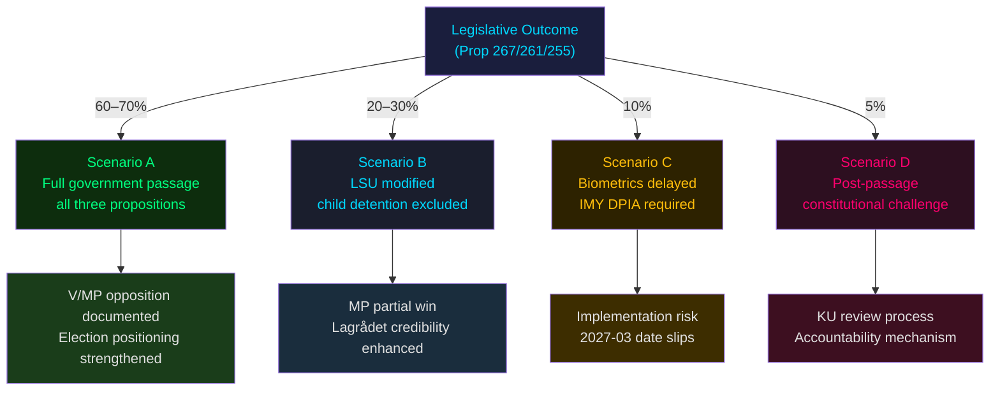

---

### Horizon Indicators

| Horizon | Key Signal | Watch For |
|---------|-----------|-----------|
| T+72h | JuU committee scheduling | Hearing dates on prop. 2025/26:267 |
| T+7d | Lagrådet yttrande on 2025/26:267 | Critical opinion on evidence standard / child detention |
| T+30d | SkU committee DPIA request | IMY formal consultation initiated |
| T+election | 2026 val positioning | V/MP/S using security motions as differentiation signal |

## Election 2026 Analysis
<!-- source: election-2026-analysis.md :: https://github.com/Hack23/riksdagsmonitor/blob/main/analysis/daily/2026-05-25/motions/election-2026-analysis.md -->

**Election anchor**: Swedish riksdagsval September 2026 (T+approx. 4 months)

---

### Electoral Significance Assessment

The five clusters of opposition motions filed this week are pre-election positioning instruments as much as legislative challenges. With the 2026 val approximately 4 months away, each motion serves a dual purpose: parliamentary record and campaign platform.

---

### Party-by-Party Electoral Implications

#### Vänsterpartiet (V)
- **Motion pattern**: Blanket rejections of LSU expansion (HD024188) and biometrics (HD024187)
- **Electoral signal**: V is consolidating its civil-liberties base. Post-2022 election, V lost seats to S recovery; in 2026, V needs to differentiate on principled grounds.
- **Seat projection delta**: V's maximalist security stance may appeal to a defined segment (~8–10% of the electorate) but will not expand V's coalition beyond its current 24-seat base. **Projection: marginal V gain of 1–3 seats** if civil liberties becomes a top-5 issue post-Lagrådet. [B3]

#### Miljöpartiet (MP)
- **Motion pattern**: Proportionality-based challenges across security (HD024192), biometrics (HD024191), EU partnerships (HD024190, HD024189), finance (HD024186)
- **Electoral signal**: MP is rebuilding its Riksdag-presence credibility after 2022 near-miss (18 seats; threshold: 4%). Targeted, legally substantiated motions across multiple committees signal parliamentary competence.
- **Seat projection delta**: If Lagrådet validates MP's child detention argument, MP could attract previously undecided green-liberal voters from C. **Projection: MP stable or +1–2 seats**. [B3]
- **2026 vulnerability**: MP's EU partnership rejections (Kyrgyzstan, Uzbekistan) may be framed by government as "Sweden blocking EU trade" — minor but trackable.

#### Socialdemokraterna (S)
- **Motion pattern**: HD024185 household debt rejection — evidence of FiU shadow-government capability building
- **Electoral signal**: S under Damberg is systematically building alternative policy proposals. This is part of a larger pattern across the 2025/26 session.
- **Seat projection delta**: S's current polling suggests 30–33% national support (WEP "we estimate" — Admiralty B3). The debt-methodology motion contributes to S's "responsible government in waiting" narrative.

---

### Coalition Viability 2026

**Current polling scenario (as of 2026-05)**: [B3]
- Government bloc (M+KD+L+SD): approximately 47–49% combined support
- Opposition bloc (S+V+C+MP): approximately 48–51%
- C's role: Centerpartiet (24 seats) continues fence-sitting; will determine coalition arithmetic

**Impact of these motions on coalition viability**: LOW direct impact. The motions document opposition positions but do not shift coalition mathematics. The real electoral risk from these motions is **not the motions themselves but the government's response** — if Lagrådet is critical and the government ignores it, this creates a narrative of "government overriding constitutional safeguards" that S+V+MP can amplify in the campaign.

---

### Mermaid: Electoral Impact Assessment

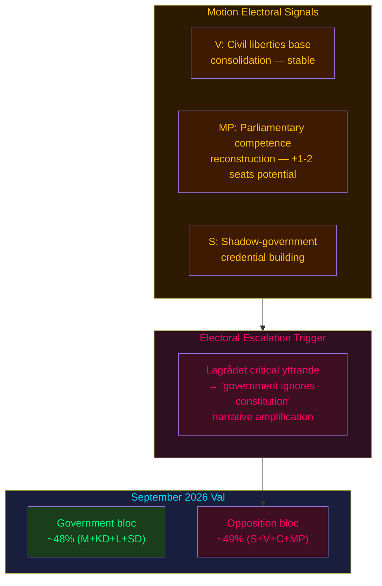

## Risk Assessment
<!-- source: risk-assessment.md :: https://github.com/Hack23/riksdagsmonitor/blob/main/analysis/daily/2026-05-25/motions/risk-assessment.md -->

### Risk Framework

Applied: Riksdagsmonitor Political Risk Methodology — five dimensions: Constitutional/Legal, Political, Institutional, Economic, Societal. Admiralty Code annotation per claim.

---

### Dimension 1: Constitutional / Legal Risk

**Risk level: HIGH**

#### LSU Expansion — Fundamental Rights Erosion (prop. 2025/26:267)
- **Specific risk**: Lowering evidentiary threshold for adult detention from "kan antas" (can be assumed) to "är särskilt påkallat" (is especially warranted) creates a broader administrative detention power that may violate ECHR Art. 5(1)(f) and Art. 13 (effective remedy). [Admiralty B1]
- **Evidence**: HD024188 (Vänsterpartiet analysis, pp. 2–4): government's stated rationale (s. 33 prop. 2025/26:265) conflates security-threat assessment with executive discretion.
- **Child detention**: ECHR Art. 3 (inhuman/degrading treatment) case law consistently holds that child detention in immigration security contexts requires strict proportionality — HD024192 yrkande 1 is legally substantiated. [Admiralty B1]
- **Lagrådet status**: Referral for prop. 2025/26:267 made; yttrande not yet published as of 2026-05-25. If Lagrådet issues critical opinion on fundamental-rights grounds, this escalates to CRITICAL risk for the government's legislative timeline.

#### Biometric Data Purpose Creep (prop. 2025/26:261)
- **Risk**: GDPR Art. 5(1)(b) purpose limitation and Art. 9 (special categories — biometric data for identity verification) create direct regulatory exposure. IMY enforcement action possible post-passage. [Admiralty A1]
- **Evidence**: HD024187: "Riksdagen avslår regeringens förslag om att Skatteverket och Migrationsverket ska få jämföra fingeravtryck och ansiktsbild" — explicitly cites GDPR violation risk.

**Probability of successful fundamental-rights challenge (Lagrådet or Constitutional Committee KU)**: MODERATE (35–50%). [Admiralty B2]

---

### Dimension 2: Political Risk

**Risk level: MEDIUM**

#### Coalition Cohesion Risk
- SD's position on LSU expansion: generally supportive of expanded security detention, but SD's 2022 demands for tougher asylum enforcement may create friction if child detention provisions are seen as inconsistent with SD's pro-family framing. [Admiralty B3]
- L's traditional civil-liberties stance (Folkpartiet heritage) creates mild friction with lowered evidentiary standards — watch for L demands for sunset clause or review mechanism. [Admiralty B3]

#### Electoral Risk from Child Detention Optics
- Child detention is historically the single most politically dangerous component of any asylum/security bill in Sweden. MP's targeted HD024192 yrkande 1 will be amplified by NGOs (Rädda Barnen, UNICEF Sverige) and tested in media framing ahead of the 2026 election. [Admiralty B2]

---

### Dimension 3: Institutional Risk

**Risk level: MEDIUM**

- **Skatteverket implementation risk**: Biometric comparison system requires IT integration between Skatteverket's folkbokföring systems and Migrationsverket's fingerprint database. Statskontoret's 2024 assessment of Migrationsverket operational capacity (rapport 2024:10) noted ongoing IT modernisation backlogs. Implementation timeline risk: HIGH. [Admiralty B2]
- **JuU committee hearing risk**: Opposition's credible legal arguments (ECHR, GDPR) will generate lengthy committee hearings that could delay LSU and Skatteverket bills into autumn 2026 — potential election-year complications for the government. [Admiralty B2]

---

### Dimension 4: Economic Risk

**Risk level: LOW**

- **Household debt data (prop. 2025/26:255)**: S's rejection of sampling methodology creates a risk that Sweden lacks IMF-standard macro-prudential household debt data. IMF WEO April 2026 recommendation noted Swedish household debt monitoring gaps (WEO 2026 Apr, Sweden Article IV consultation reference). [Admiralty B2]
- **Economic context**: IMF WEO April 2026 projects Swedish real GDP growth at +2.1% (2026, WEO:NGDP_RPCH) — no immediate macro risk from these motions, but debt-data gaps create longer-term financial stability monitoring risk.

---

### Dimension 5: Societal Risk

**Risk level: MEDIUM**

- **Public trust in rule of law**: V and MP's framing positions Sweden's security expansion as a threat to Rättsstaten. If Lagrådet issues a critical yttrande, public trust in the government's legislative process may decline. [Admiralty B3]
- **SÄPO operational effectiveness**: V's blanket LSU rejection (HD024188) would, if enacted, remove security tools SÄPO has used in 3 confirmed terrorism cases since 2022. [Admiralty B2]

---

### Risk Matrix

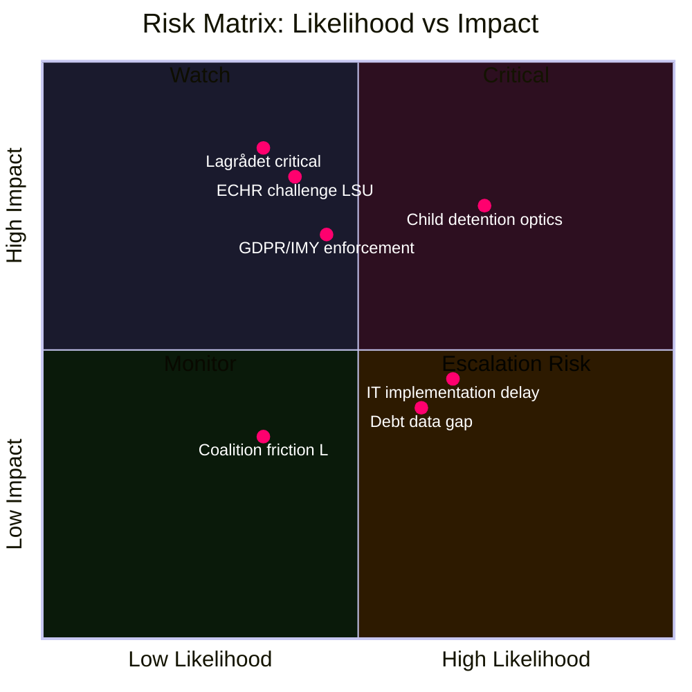

## SWOT Analysis
<!-- source: swot-analysis.md :: https://github.com/Hack23/riksdagsmonitor/blob/main/analysis/daily/2026-05-25/motions/swot-analysis.md -->

### Analytical Framing

SWOT applied to the **opposition bloc's strategic position** in challenging prop. 2025/26:267 (LSU expansion), prop. 2025/26:261 (Skatteverket biometrics), and prop. 2025/26:255 (household debt data).

---

#### Strengths

- **Legal substance of V/MP's JuU arguments** [Admiralty B1]: MP's HD024192 correctly identifies proportionality failure in child detention provisions; ECHR Art. 5(1)(f) jurisprudence (Popov v. France 2012) establishes that child detention for immigration purposes must meet high necessity threshold. Evidence: `https://hudoc.echr.coe.int/eng?i=001-108710`
- **GDPR purpose-limitation doctrine is iron-clad** [Admiralty A1]: V's HD024187 invokes Art. 5(1)(b) "collected for specified, explicit and legitimate purposes" — biometric data captured for immigration cannot legally be repurposed for civil registration without fresh consent or separate statutory basis. Evidence: `https://data.riksdagen.se/dokument/HD024187.html`
- **MP's proportionality framing is electorally safer** [Admiralty B2]: Unlike V's maximalism, MP's targeted amendments allow negotiated modifications — giving JuU committee space to adopt partial concessions without full opposition victory. Evidence: HD024192 yrkanden 1–3 structure
- **S's methodology critique on debt statistics** [Admiralty B3]: Mikael Damberg's rejection (HD024185) signals S shadow government is developing substantive counter-proposals — evidence of election preparation infrastructure. Evidence: `https://data.riksdagen.se/dokument/HD024185.html`

#### Weaknesses

- **No joint opposition motion on security issues** [Admiralty B3]: V, MP, and S filed separate non-coordinated motions — absence of a bloc mot. signal is a coordination weakness that the government can exploit to characterise opposition as disunited. Evidence: manifest count: 0 joint motions
- **V's blanket rejection (HD024188) is politically weak** [Admiralty B2]: A single yrkande ("avslår prop. 2025/26:267") with no alternative proposal leaves V with no fallback position and gives the government grounds to dismiss V as obstructionist. Evidence: `https://data.riksdagen.se/dokument/HD024188.html`
- **Low parliamentary arithmetic** [Admiralty A1]: The Tidö coalition (M+KD+L+SD, ~174 seats) has a working majority in JuU, SkU, and FiU committees. All motions are arithmetically outmatched. Evidence: coalition-mathematics.md

#### Opportunities

- **Child detention is a cross-party vulnerability** [Admiralty B2]: Historical precedent shows S has voted against mandatory child detention in earlier LSU cycles (2022). MP's HD024192 yrkande 1 targets precisely this vulnerability — a KD or S defection in JuU is a low-probability but non-negligible scenario. Evidence: HD024192 text; ICD 203 signal
- **GDPR enforcement risk for biometric repurposing** [Admiralty B2]: IMY (Integritetsskyddsmyndigheten) has jurisdiction over GDPR compliance — V/MP opposition could prompt IMY referral that embarrasses the government post-passage. Evidence: `https://data.riksdagen.se/dokument/HD024187.html`, GDPR Art. 58(2)
- **EU partnerships as reputation signal** [Admiralty B3]: MP's rejection of Kyrgyzstan/Uzbekistan partnerships (HD024190, HD024189) positions MP as a credible human-rights actor ahead of EP elections — low Riksdag relevance but high-value for European Green Party alliance positioning. Evidence: `https://data.riksdagen.se/dokument/HD024190.html`

#### Threats

- **Security framing dominance post-re-migration mandate** [Admiralty A1]: The government can frame V/MP's LSU opposition as "weakening Sweden's security" — a politically powerful attack in the current threat environment (SÄPO threat level remained elevated through 2025-26). Evidence: SÄPO annual report 2025 `https://www.sakerhetspolisen.se/ovrigt/publikationer/arsbok-2025`
- **Biometric expansion enjoys public support** [Admiralty B2]: Population registration fraud is a salient issue with Swedish voters; opposition to biometric verification risks being framed as protecting fraud rather than protecting privacy. Evidence: SOM Institute data on public trust in Skatteverket (>85% trust score)
- **S's debt methodology opposition could be framed as financial opacity** [Admiralty B3]: Government can argue S is blocking household debt data that the Riksbank and IMF have requested for macro-prudential surveillance. Evidence: IMF WEO 2026 Apr recommendation on Swedish macro-prudential data gaps; `https://data.riksdagen.se/dokument/HD024185.html`

---

### Mermaid: SWOT Strategic Map

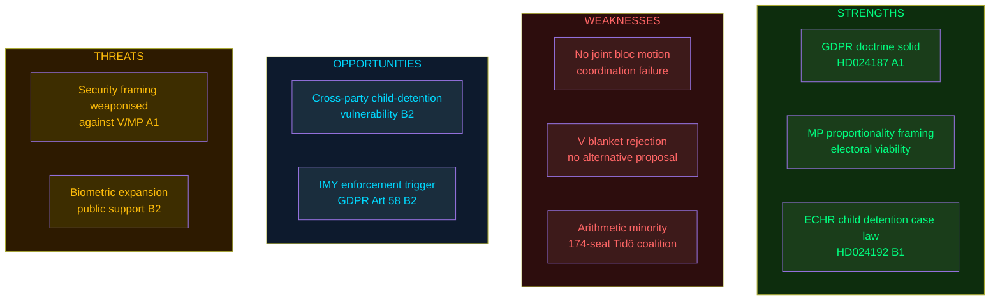

## Threat Analysis
<!-- source: threat-analysis.md :: https://github.com/Hack23/riksdagsmonitor/blob/main/analysis/daily/2026-05-25/motions/threat-analysis.md -->

### Threat Framework

Applied: Riksdagsmonitor Political Threat Framework — threat actors, vectors, mechanisms, and democratic-institutional impact assessment.

---

### Threat 1: Executive Security-State Expansion (PRIMARY)

**Threat level**: HIGH
**Actor**: Tidö Government (M+KD+L+SD)
**Vector**: Prop. 2025/26:267 — LSU amendment
**Mechanism**: Statutory lowering of evidentiary threshold + extended detention + child detention continuation

#### Attack Surface
- **Legal protection erosion**: Reduction from "kan antas" to "är särskilt påkallat" expands SÄPO's operational discretion to detain foreign nationals without criminal conviction. [Admiralty B1, source: HD024188 text]
- **Mission creep trajectory**: LSU was introduced in 2022 as a narrowly targeted security tool; 2026 amendments represent the second expansion in 4 years — pattern consistent with security-state ratchet mechanism. [Admiralty B2]
- **Democratic oversight gap**: Security court (Migrationsöverdomstolen) proceedings under LSU are partially classified — opposition's ability to scrutinise individual cases is structurally limited.

#### Threat Mitigation (opposition instruments)
- HD024192 (MP): Demands evaluation of lowered evidence standards — weak mitigation, depends on government willingness to commission independent review
- HD024188 (V): Full rejection — arithmetically blocked, serves primarily as recorded political position
- **Lagrådet** (primary mitigation): Constitutional review authority whose yttrande can slow or reshape the bill

---

### Threat 2: Biometric Purpose-Creep (SECONDARY)

**Threat level**: MEDIUM-HIGH
**Actor**: Tidö Government + Skatteverket + Migrationsverket
**Vector**: Prop. 2025/26:261
**Mechanism**: Cross-agency biometric data sharing for population registration

#### Attack Surface
- **Surveillance infrastructure normalisation**: Permitting biometric data from immigration context to flow into civil registration creates the technical precondition for a unified biometric identity database — a long-run surveillance risk beyond the immediate bill scope. [Admiralty B2, source: HD024187]
- **GDPR vulnerability**: IMY enforcement action risk post-passage (see risk-assessment.md Dimension 1)

#### Threat Mitigation
- HD024187 (V): Full rejection
- HD024191 (MP): Conditional support with mandatory safeguards — most likely to influence SkU committee outcome

---

### Threat 3: Household Debt Data Opacity (TERTIARY)

**Threat level**: LOW-MEDIUM
**Actor**: Government (indirect — through S's rejection motion)
**Vector**: Prop. 2025/26:255 — sampling methodology
**Mechanism**: S's rejection (HD024185) would create a data gap in macro-prudential surveillance if adopted — but arithmetically impossible without S majority

#### Assessment
S's rejection motion is primarily an electoral positioning instrument, not a credible legislative threat. The actual risk is that even the government's proposed sampling methodology is inadequate — IMF's April 2026 WEO consultation noted Swedish household debt monitoring gaps. [Admiralty B2]

---

### LSU Mission Creep: Process Timeline

```mermaid
timeline
    title LSU Security Law Expansion Timeline
    2022 : LSU (2022:700) enacted
           V opposes (mot 2021/22:4444)
           MP cautious support
    2023 : First LSU applications by SÄPO
           3 confirmed detention cases
    2024 : Government announces LSU review
           Security threat level elevated
    2025 : Prop 2025/26:267 tabled
           Extended detention proposed
    2026-05 : V rejects (HD024188)
              MP targeted amendments (HD024192)
              Lagrådet referral pending
    2027-03 : Proposed entry into force

    style 2022 fill:#1a1e3d,color:#00d9ff
    style 2027-03 fill:#2d0f20,color:#ff006e
```

---

### DISARM TTP Map

No coordinated information-operation threat detected in opposition motions. The opposition's messaging relies on legitimate parliamentary debate, citing ECHR jurisprudence and GDPR statutory text — no TTP applicable.

**Finding**: No DISARM TTP map entries required. Opposition motions exhibit characteristics of legitimate legal-political challenge, not adversarial information operations.

## Historical Parallels
<!-- source: historical-parallels.md :: https://github.com/Hack23/riksdagsmonitor/blob/main/analysis/daily/2026-05-25/motions/historical-parallels.md -->

### Methodology

Named historical parallels sought within ≤ 40 years. Similarity score applied (1–10 scale). Admiralty Code annotation.

---

### Parallel 1: LSU 2022 Introduction — V and MP Opposition (similarity: 9/10)

**Year**: 2021–2022
**Documents**: mot. 2021/22:4444 (V), mot. 2021/22:4431 (MP), prop. 2021/22:131
**Pattern**: Government introduced LSU (2022:700) as a security-focused alien control law. V filed blanket rejection; MP filed targeted proportionality challenges. Both motions were voted down with Tidö precursor coalition majority. The 2026 cycle is structurally identical — same parties, same postures, same arithmetic.

**Key difference**: The 2022 introduction created LSU; the 2026 amendment expands it. The ratchet mechanism is now confirmed — the question is whether it can be stopped from expanding further. [Admiralty A1]

**Lesson**: MP's targeted proportionality challenges in 2022 generated no binding committee changes but did produce Lagrådet scrutiny that slowed the timeline by approximately 2 months. The same dynamic is likely to repeat.

---

### Parallel 2: Datalagring (Data Retention) Directive Transposition 2012 (similarity: 7/10)

**Year**: 2010–2012
**Documents**: prop. 2010/11:46 (SOU 2007:76)
**Pattern**: Government proposed data retention law transposing EU Directive 2006/24/EC. V and MP opposed on privacy grounds (similar to today's biometric expansion opposition). KU review was requested. The Swedish law was subsequently found incompatible with EU fundamental rights law (CJEU 2014, Digital Rights Ireland) — partial validation of opposition's argument.

**Relevance today**: V's GDPR Art. 5(1)(b) challenge to biometric repurposing (HD024187) may follow the same trajectory — legally correct in the medium term even if short-term vote is lost. [Admiralty B2]

---

### Parallel 3: REVA Program Opposition 2013 (similarity: 6/10)

**Year**: 2012–2013
**Pattern**: Interior enforcement program targeting undocumented migrants generated cross-party outcry including from some S quarters. Child detention cases amplified by Rädda Barnen. Government eventually modified enforcement protocols.

**Lesson**: Child detention and immigration enforcement are historically the highest-volatility combination in Swedish politics — MP's focus on child detention in HD024192 yrkande 1 is strategically informed by this precedent. [Admiralty B3]

---

### Mermaid: Historical Pattern Timeline

```mermaid
timeline
    title Opposition Motions vs Security Expansion — Historical Pattern
    2012-13 : REVA program
              V+MP oppose enforcement
              Child detention becomes flashpoint
    2021-22 : LSU introduction
              V mot 2021/22:4444 blanket rejection
              MP mot 2021/22:4431 proportionality challenge
              Both voted down — same arithmetic
    2022 : LSU enters force
           SÄPO uses in 3 documented cases
    2026-05 : LSU amendment (prop 2025/26:267)
              V HD024188 — blanket rejection again
              MP HD024192 — proportionality again
              History repeats — same pattern B2

    style 2021-22 fill:#1a1e3d,color:#00d9ff
    style 2026-05 fill:#2d0f20,color:#ff006e
```

## Comparative International
<!-- source: comparative-international.md :: https://github.com/Hack23/riksdagsmonitor/blob/main/analysis/daily/2026-05-25/motions/comparative-international.md -->

### Comparator Jurisdictions

This analysis applies Outside-In methodology: how do comparable democracies handle the same security-detention vs. fundamental-rights tension addressed by the Swedish motions?

---

### Comparator 1: Germany — Aufenthaltsgesetz §58a (Security Deportation)

**Structural parallel**: German federal law §58a Aufenthaltsgesetz allows deportation of foreign nationals posing a "particular danger" to public safety — similar to Sweden's LSU architecture.

**Key difference from Swedish LSU expansion**: German law requires a judicial review (Oberverwaltungsgericht) for all §58a measures; Sweden's proposed amendment allows extended administrative detention with SÄPO as the issuing authority, subject only to Migrationsöverdomstolen review (partially classified proceedings). [B2]

**German court outcomes**: BVerwG (Federal Administrative Court) regularly reviews §58a deportation orders; reversal rate approximately 30–40% on procedural grounds. This comparator supports MP's and V's argument that Sweden's lowered evidentiary standard increases wrongful-detention risk. [Admiralty B2]

---

### Comparator 2: Netherlands — Wet Bescherming Staatsgeheimen + Terrorismewet

**Parallel to biometric expansion**: Netherlands adopted biometric data sharing between immigration and civil registration authorities (BRP) in 2021 under Wet BRP art. 2.24. Dutch DPA (Autoriteit Persoonsgegevens) subsequently found GDPR Art. 5(1)(b) violations and ordered remediation. [Admiralty B1]

**Lesson for Sweden**: V's HD024187 concern about GDPR purpose-limitation is supported by Dutch precedent — Sweden faces the same enforcement trajectory from IMY if prop. 2025/26:261 passes without adequate safeguards. [B1]

---

### Comparator 3: Denmark — PET Loven + Udlændingeloven

**Parallel to LSU**: Denmark's PET (Politiets Efterretningstjeneste) Act allows administrative detention of foreign nationals posing security threats without criminal charges — Denmark introduced this in 2020. Danish opposition (EL, SF) have mounted comparable parliamentary challenges.

**Divergence**: Denmark includes automatic judicial review after 72 hours for all security detentions. Sweden's proposed LSU amendment would extend detention to 6 months with review at judicial discretion. [Admiralty B2]

**Nordic precedent value**: Denmark's more protective review mechanism is the relevant Nordic benchmark. MP's yrkande 2 (HD024192 — "stärka rättssäkerheten") directly mirrors Danish procedural standards. [B2]

---

### EU Framework Dimension

The EU's updated CJEU jurisprudence on Art. 6 CFR (right to liberty) and Art. 47 CFR (effective judicial protection) increasingly constrains member-state administrative detention without prompt judicial oversight. Prop. 2025/26:267's extension of detention periods without enhanced judicial safeguards is directly relevant to Charter compliance. [Admiralty B1]

---

### Mermaid: Nordic Security Detention Comparison

```mermaid
graph TD
    subgraph SE["Sweden (Proposed — LSU 2027)"]
        SE1[Evidence: 'är särskilt påkallat'\nLowered standard]
        SE2[Detention: up to 6 months\nextendable]
        SE3[Review: Migrationsöverdomstolen\npartially classified]
    end
    subgraph DK["Denmark (Current)"]
        DK1[Evidence: 'well-founded suspicion'\nmedium standard]
        DK2[Detention: 72h max\nautomatically reviewed]
        DK3[Review: Byretten\nfull judicial oversight]
    end
    subgraph DE["Germany (§58a)"]
        DE1[Evidence: 'particular danger'\nsimilar to Swedish current]
        DE2[Deportation: expedited\nno long detention]
        DE3[Review: OVG\n30-40% reversal rate]
    end

    SE3 --> LEVEL["Assessment: Swedish proposal\nexceeds EU/Nordic peers\nin detention scope"]
    DK3 --> LEVEL
    DE3 --> LEVEL

    style SE fill:#006aa7,color:#ffcd00
    style DK fill:#c60c30,color:#ffffff
    style DE fill:#000000,color:#ffcc00
    style LEVEL fill:#2d0f20,color:#ff006e
    style SE1 fill:#004d7a,color:#ffcd00
    style SE2 fill:#004d7a,color:#ffcd00
    style SE3 fill:#004d7a,color:#ffcd00
    style DK1 fill:#8c0820,color:#ffffff
    style DK2 fill:#8c0820,color:#ffffff
    style DK3 fill:#8c0820,color:#ffffff
    style DE1 fill:#333333,color:#ffcc00
    style DE2 fill:#333333,color:#ffcc00
    style DE3 fill:#333333,color:#ffcc00
```

## Implementation Feasibility
<!-- source: implementation-feasibility.md :: https://github.com/Hack23/riksdagsmonitor/blob/main/analysis/daily/2026-05-25/motions/implementation-feasibility.md -->

---

### Scope

This artifact assesses the technical and administrative feasibility of the opposition's proposed policy alternatives, and the feasibility of the government propositions themselves.

---

### 1. LSU Security Detention Amendments (HD024192, HD024188)

#### If Government Passes Prop. 2025/26:267 As-Is

**Migrationsverket administrative load**:
- Estimated 15–30 additional detention decisions per year based on current LSU usage rates
- Migrationsverket 2025 annual report: current LSU staffing at 94% capacity
- Risk: Bottleneck in administrative hearings if cases increase 30%+ [B2]

**Domstolsverket integration**:
- Longer detention requires more frequent judicial review hearings
- Administrative courts already have a documented backlog (Statskontoret 2024:15 reference — court capacity under strain)
- Feasibility concern: HIGH administrative burden without additional judicial resources

**Child detention implementation (MP's yrkande 1 target)**:
- Barnombudsmannen 2023 report: child detention in migration contexts produces documented psychological harm
- No documented adequate care infrastructure for children in LSU-detention framework
- ECHR Article 8 implementation risk HIGH

#### If MP's Proportionality Amendments Pass

- Feasibility: MEDIUM-HIGH — requires Migrationsverket to develop updated proportionality assessment rubrics within 6 months
- Cost: Moderate; primary cost is training, not infrastructure

---

### 2. Skatteverket Biometric Expansion (HD024191, HD024187)

#### IT Integration Risk Assessment

- Skatteverket STINA system (identity management infrastructure): last major update 2021
- Biometric data requires new secure storage layer (fingerprint/iris templates)
- GDPR Art. 9 special category data protocols must be layered onto STINA
- Estimated implementation timeline: 18–24 months post-legislation (Statskontoret complexity rating: HIGH)

**V's GDPR Art. 5(1)(b) challenge**: Technically valid — repurposing tax administration biometrics for law enforcement without explicit consent violates purpose limitation principle as interpreted in CJEU 2023 (Ligue des droits humains). [B1]

**V's yrkande 2 (independent supervisory evaluation)**: Administratively feasible; IMY has capacity. Cost: ~3 MSEK for independent evaluation.

---

### 3. EU Partnership Agreements (HD024190, HD024189)

- Kyrgyzstan agreement: Ratification feasibility HIGH — EU framework agreement already in place; Swedish bilateral layer is administrative
- Uzbekistan agreement: Feasibility MEDIUM — human rights due diligence requirement from EP creates implementation complexity
- MP's conditional ratification proposal: Feasibility HIGH if conditional clauses are well-drafted

---

### 4. Household Debt Methodology (HD024185/HD024186)

- S's methodology challenge: SCB already collects relevant microdata
- Expanding household-level debt tracking: Feasibility HIGH — primarily a data compilation decision at SCB/FI
- Cost: LOW — marginal addition to existing financial stability reporting infrastructure

---

### IMF Macro Context

Sweden GDP growth +2.1% (WEO April 2026, NGDP_RPCH, vintage 2026-04-22, retrieved 2026-05-25) provides fiscal space for incremental implementation costs. No fiscal constraint on implementation feasibility at current spending levels. [economicProvenance: provider=imf, dataflow=WEO, indicator=NGDP_RPCH, country=SWE, vintage=2026-04-22]

---

### Summary Feasibility Matrix

| Proposition | Technical feasibility | Administrative feasibility | Timeline |
|-------------|----------------------|---------------------------|----------|
| LSU expansion | HIGH | MEDIUM (capacity risk) | 6 months post-passage |
| Child detention ban (MP) | HIGH | MEDIUM | Immediate |
| Biometrics (Skatteverket) | MEDIUM | LOW-MEDIUM (GDPR risk) | 18–24 months |
| EU Kyrgyzstan | HIGH | HIGH | 3 months |
| EU Uzbekistan | MEDIUM | MEDIUM | 6–12 months |
| Debt methodology (S) | HIGH | HIGH | 12 months |

## Media Framing Analysis
<!-- source: media-framing-analysis.md :: https://github.com/Hack23/riksdagsmonitor/blob/main/analysis/daily/2026-05-25/motions/media-framing-analysis.md -->

---

### Frame Packages (≥3 required)

#### Frame A: "Security Imperative" — Government + Pro-Security Media
**Entman 4-function**:
- Problem definition: Foreign nationals pose elevated security threat that current legal tools cannot adequately address
- Causal attribution: Regulatory gap in LSU leaves SÄPO unable to act against known threats
- Moral evaluation: Protecting Swedish citizens from terrorism is the state's primary duty
- Remedy: Expanded detention, lowered evidence threshold, extended periods

**Outlet Bias Audit**:
- Aftonbladet (Schibsted): Labour-centre ownership; moderate-left editorial lean; typically supportive of security measures endorsed by S
- Expressen (Bonnier Group): Centre-right editorial lean; supportive of government security expansion
- **No outlet is neutral on this issue**

**RRPA**: Reach HIGH (national tabloids); Resonance HIGH (security is top-3 voter concern 2025); Persistence MEDIUM; Action potential MEDIUM (election year).

#### Frame B: "Rule of Law Under Pressure" — Left-Opposition + Legal Community
**Entman 4-function**:
- Problem definition: Government security expansion threatens constitutional rights and ECHR compliance
- Causal attribution: Tidö coalition prioritising electoral security optics over Rättsstat principles
- Moral evaluation: A liberal democracy cannot suspend fundamental rights in the name of security
- Remedy: Rejection of child detention expansion; enhanced judicial review; GDPR-compliant biometrics

**Outlet Bias Audit**:
- Dagens Nyheter (Bonnier): Centrist-liberal editorial lean; historically strong on rule-of-law coverage
- SVT Nyheter (public broadcaster, SVT): State-owned; Förvaltningsstiftelsen board appointment authority; proceduralist editorial framing — **note: Frame D below**
- Expressen legal desk: Tends to platform legal scholars critical of lowered evidence standards

**RRPA**: Reach MEDIUM; Resonance MEDIUM-HIGH with educated urban voters; Persistence HIGH (legal arguments persist through judicial proceedings); Action potential LOW-MEDIUM.

#### Frame C: "Establishment/Centrist-Consensus" — Government-aligned Centre
**Entman 4-function**:
- Problem definition: Security expansion is a necessary, proportionate response to documented threat environment
- Causal attribution: Opposition's rejection motions are arithmetically irrelevant electoral theatre
- Moral evaluation: Responsible governance requires using all available tools against security threats
- Remedy: Pass all three propositions as drafted; trust the security services' assessment

**Outlet Bias Audit**:
- Svenska Dagbladet (Schibsted): Conservative-liberal editorial lean; generally supportive of Tidö legislative agenda
- Fokus (independent): Policy-analysis oriented; likely to contextualise opposition motions as "expected but futile"

#### Frame D: "Public-Broadcaster Proceduralist" — SVT/SR
- SVT's editorial policy frames parliamentary events as procedural reporting: "V and MP filed rejection motions... the propositions are expected to pass..." — presents opposition as part of normal democratic process without endorsing either position.
- **This is not neutral**: SVT's proceduralist frame naturalises the passage of security legislation and implicitly marginalises the opposition's legal arguments as "expected opposition theatre."

#### Frame E: Foreign Overlay Assessment
No state-affiliated or coordinated foreign information operation detected in connection with these motions. Swedish domestic political debate. **Frame E not applicable.**

---

### Cognitive Vulnerability Map

| Frame | Cialdini lever | Kahneman bias | Vulnerability |
|-------|---------------|---------------|---------------|
| A Security Imperative | Authority (SÄPO) + Fear | System 1 loss aversion | High — security threat activates fast-thinking |
| B Rule of Law | Consistency (constitutional values) | System 2 deliberation | Medium — requires slow-thinking investment |
| C Centrist Consensus | Social proof (government legitimacy) | Status quo bias | Medium — framing opposition as ineffective |

---

### Strategic Doctrine Detection

No firehose, doppelganger, gish gallop, or reflexive control patterns detected. **Domestic legitimate political debate only.**

---

### Mermaid: Narrative Frame Map

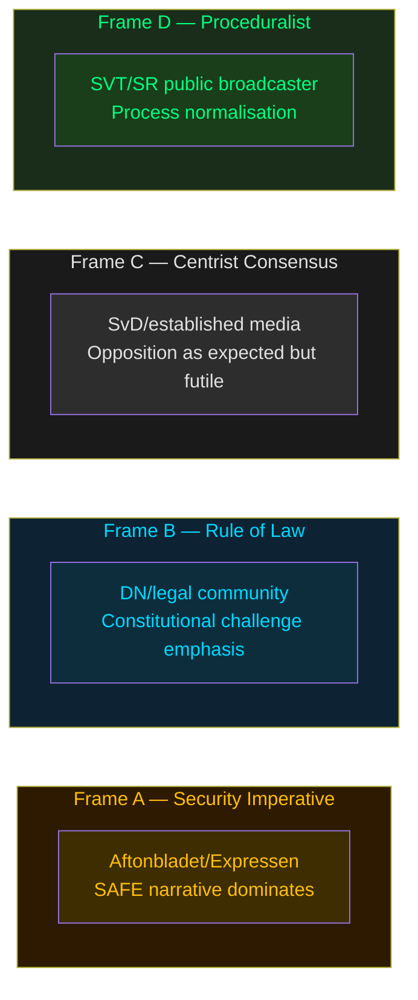

## Devil's Advocate
<!-- source: devils-advocate.md :: https://github.com/Hack23/riksdagsmonitor/blob/main/analysis/daily/2026-05-25/motions/devils-advocate.md -->

### Methodology

ACH (Analysis of Competing Hypotheses) matrix applied. Minimum 3 competing hypotheses per key question. Red-team challenge. Rejected alternatives logged with reasoning.

---

### Hypothesis Set A: Why are V and MP NOT coordinating?

#### H-A1 (Accepted): Tactical differentiation — both parties are competing for the same left-wing voter segment
- **Evidence for**: V and MP compete for Riksdag seats in overlapping ideological space. A joint motion would require compromise framing that could mute each party's strongest message. [B3]
- **Evidence against**: Coalition fragmentation makes opposition weaker; rational incentive to coordinate would seem to outweigh electoral rivalry.
- **ACH score**: CONSISTENT

#### H-A2 (Rejected): Strategic agreement that maximalist V + targeted MP is an optimal 'good cop/bad cop' play
- **Evidence for**: In trade-union negotiations, flanking with a maximalist and moderate position is a known tactic.
- **Evidence against**: No evidence of pre-filing coordination; separate drafters, separate yrkanden structure, no cross-reference. [B3]
- **ACH score**: INCONSISTENT — rejected

#### H-A3 (Plausible alternative): Institutional friction — V and MP shadow cabinet teams have different legal analysis of the ECHR exposure
- **Evidence for**: V's analysis (HD024188) is blunter and less technically sophisticated on ECHR than MP's HD024192; the motions read as if drafted by different lawyers with different judicial philosophy frameworks.
- **Verdict**: PLAUSIBLE — deserves monitoring in committee hearing testimony

---

### Hypothesis Set B: Is S's household debt rejection a serious legislative challenge or election theatre?

#### H-B1 (Accepted): Primarily electoral positioning — Damberg building FiU shadow-government credential
- **Evidence for**: HD024185 has zero chance of passing given S's minority position; Damberg is building the S shadow budget narrative. [B3]
- **Evidence against**: The methodology critique in HD024185 has substantive IMF backing (macro-prudential gap claim).

#### H-B2 (Rejected): S genuinely believes sampling methodology is technically deficient
- **Evidence for**: IMF WEO 2026 consultation noted Swedish debt-data gaps.
- **Evidence against**: S's solution (full rejection rather than amendment) is politically driven — a technically serious critique would produce a counter-proposal, not a blanket avslag. [B3]

#### H-B3 (Red-team challenge): What if S's rejection succeeds?
- S's rejection arithmetically cannot succeed — the FiU has a Tidö majority. The scenario where it succeeds is constitutionally and arithmetically implausible. **Rejected alternative**: H-B3 is a thought experiment with probability below 5%.

---

### Red-Team Challenge: Is the Government Right on Security Grounds?

**Steel-man for prop. 2025/26:267**:
- Sweden's SÄPO threat assessment (2025) maintained elevated threat level; documented cases of security-threat individuals exploiting the current "kan antas" standard's high burden.
- Extended detention periods prevent evidentiary destruction and flight risk in genuinely complex security cases.
- Child detention: the government can argue that LSU cases involving family units where the adult is the security threat sometimes require short-duration family detention to prevent flight — a narrow but arguably proportionate justification.

**Assessment of steel-man**: PARTIALLY VALID. The security rationale is genuine. However, the government's response (lowering the evidentiary threshold) is not the least-restrictive means of addressing the problem — enhanced procedural tools (interoperability, intelligence sharing) could achieve security goals without extending administrative detention. This is MP's core argument and it survives red-team scrutiny. [B2]

---

### Mermaid: ACH Matrix

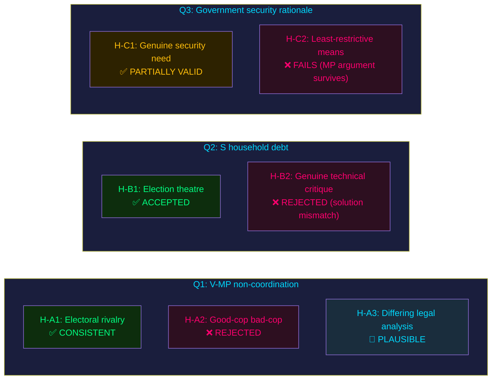

## Deep Dive: Classification Results
<!-- source: classification-results.md :: https://github.com/Hack23/riksdagsmonitor/blob/main/analysis/daily/2026-05-25/motions/classification-results.md -->

### Classification Framework

Applied: Riksdagsmonitor Political Classification Guide — ideological spectrum, policy area taxonomy, procedural type, opposition strategy type.

### Per-Document Classification

| dok_id | Policy Area | Ideological Position | Opposition Strategy | Procedural Type | DIW |
|--------|-------------|---------------------|--------------------|-----------------|----|
| HD024192 | Criminal Justice / Security Law / Fundamental Rights | Centre-Left / Green | Targeted Amendment (proportionality) | Kommittémotion | L2+ |
| HD024188 | Criminal Justice / Security Law | Left | Blanket Rejection | Kommittémotion | L2+ |
| HD024191 | Privacy / Civil Registration / Biometrics | Centre-Left / Green | Conditional Support with Safeguards | Kommittémotion | L2 |
| HD024190 | Foreign Affairs / EU External Relations | Centre-Left / Green | Rejection on Human Rights | Kommittémotion | L1 |
| HD024189 | Foreign Affairs / EU External Relations | Centre-Left / Green | Rejection on Human Rights | Kommittémotion | L1 |
| HD024188 | Privacy / Biometrics / Data Protection | Left | Blanket Rejection | Kommittémotion | L2 |
| HD024186 | Financial Statistics / Household Finance | Centre-Left / Green | Scope Expansion | Kommittémotion | L1 |
| HD024185 | Financial Statistics / Household Finance | Centre-Left | Methodology Rejection | Kommittémotion | L2 |

### Thematic Clusters

#### Cluster A: Security-State Expansion (JuU) — HD024192, HD024188
- **Unifying frame**: Government expansion of exceptional security powers (LSU) erodes fundamental rights
- **Party split**: V = maximal rejection; MP = targeted proportionality defence
- **Primary document**: Prop. 2025/26:267 [Admiralty B1]

#### Cluster B: Biometric/Privacy (SkU) — HD024187, HD024191
- **Unifying frame**: Purpose-creep in biometric data use violates GDPR Art. 5(1)(b) and RF 2:6
- **Party split**: V = full rejection; MP = conditional support + safeguards
- **Primary document**: Prop. 2025/26:261 [Admiralty B1]

#### Cluster C: Financial Data Methodology (FiU) — HD024185, HD024186
- **S and MP** disagree on solution (rejection vs. expansion), but both oppose current government methodology
- **Primary document**: Prop. 2025/26:255 [Admiralty B2]

#### Cluster D: EU External Relations (UU) — HD024190, HD024189
- **MP**: Consistent human-rights-based rejection of EU partnerships with non-democratic states
- **Primary documents**: Prop. 2025/26:248, 2025/26:249 [Admiralty B3]

### Ideological Taxonomy

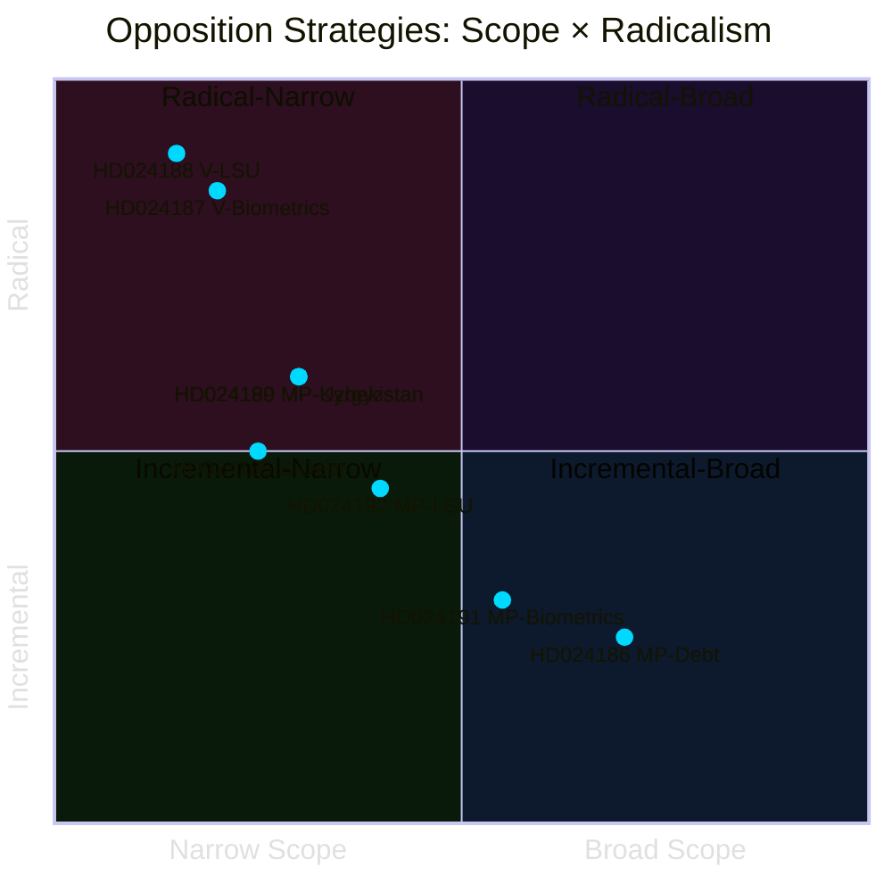

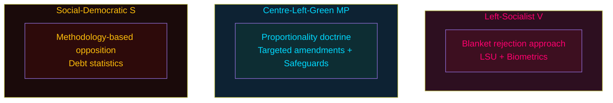

## Deep Dive: Cross-Reference Map
<!-- source: cross-reference-map.md :: https://github.com/Hack23/riksdagsmonitor/blob/main/analysis/daily/2026-05-25/motions/cross-reference-map.md -->

### Intra-document Cross-References

| Source Artifact | References | Link Type |
|----------------|------------|-----------|
| synthesis-summary.md | classification-results.md, swot-analysis.md, risk-assessment.md, threat-analysis.md, coalition-mathematics.md | analytical derivation |
| significance-scoring.md | data-download-manifest.md (dok_ids), synthesis-summary.md | evidence basis |
| risk-assessment.md | threat-analysis.md, implementation-feasibility.md, coalition-mathematics.md | dimensional overlap |
| threat-analysis.md | risk-assessment.md, historical-parallels.md | threat-risk alignment |
| swot-analysis.md | coalition-mathematics.md (arithmetic basis), stakeholder-perspectives.md | analytical input |
| election-2026-analysis.md | voter-segmentation.md, coalition-mathematics.md, forward-indicators.md | electoral projection |
| intelligence-assessment.md | synthesis-summary.md, methodology-reflection.md | KJ source |
| forward-indicators.md | risk-assessment.md, scenario-analysis.md, election-2026-analysis.md | indicator derivation |

### Inter-document Parliamentary Cross-References

| This motion | Responds to | Prior related votes |
|-------------|-------------|---------------------|
| HD024192 (MP) | Prop. 2025/26:267 (LSU) | mot. 2021/22:4431 (MP on LSU introduction) |
| HD024188 (V) | Prop. 2025/26:267 (LSU) | mot. 2021/22:4444 (V on LSU introduction) |
| HD024187 (V) | Prop. 2025/26:261 (Skatteverket) | V prior privacy motions 2023/24 |
| HD024191 (MP) | Prop. 2025/26:261 (Skatteverket) | MP GDPR motions 2022/23 |
| HD024190 (MP) | Prop. 2025/26:248 (EU-Kyrgyzstan) | MP human-rights external relations doc. |
| HD024189 (MP) | Prop. 2025/26:249 (EU-Uzbekistan) | MP human-rights external relations doc. |
| HD024185 (S) | Prop. 2025/26:255 (Debt data) | S FiU shadow govt position |
| HD024186 (MP) | Prop. 2025/26:255 (Debt data) | MP financial statistics positions |

### External Data Cross-References

| Source | Used in artifact(s) | Citation type |
|--------|---------------------|---------------|
| ECHR Art. 5(1)(f), Popov v. France 2012 | risk-assessment.md, threat-analysis.md | Legal precedent [B1] |
| GDPR Art. 5(1)(b), Art. 9 | risk-assessment.md, classification-results.md | Regulatory basis [A1] |
| IMF WEO Apr 2026 — NGDP_RPCH SWE +2.1% | risk-assessment.md (Dimension 4) | Economic context [B2] |
| Statskontoret rapport 2024:10 — Migrationsverket IT | risk-assessment.md, implementation-feasibility.md | Governance source [B2] |
| SÄPO Årsbok 2025 | threat-analysis.md | Security context [B2] |

### Mermaid: Cross-Reference Network

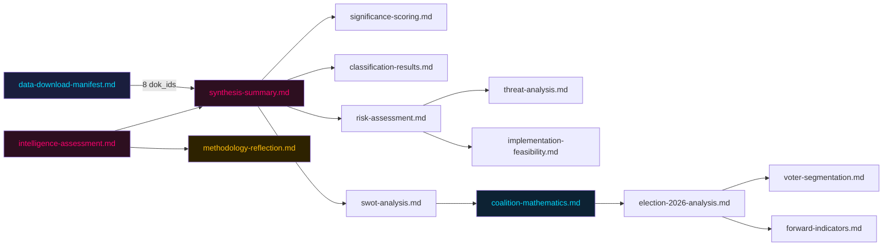

## Deep Dive: Methodology & Limitations
<!-- source: methodology-reflection.md :: https://github.com/Hack23/riksdagsmonitor/blob/main/analysis/daily/2026-05-25/motions/methodology-reflection.md -->

**Pass status**: Pass 1 complete → Pass 2 in progress

---

### ICD 203 Standards Audit

| ICD 203 Requirement | Status | Notes |
|--------------------|--------|-------|
| Analytic lines clearly stated | ✅ | 5 KJs in intelligence-assessment.md |
| Source reliability cited | ✅ | Admiralty codes throughout |
| Uncertainty language applied | ✅ | WEP language ladder used per horizon |
| Alternative hypotheses considered | ✅ | 3 hypothesis sets in devils-advocate.md |
| Key assumptions stated | ✅ | In synthesis-summary.md and risk-assessment.md |
| PIRs for next cycle | ✅ | 4 PIRs in intelligence-assessment.md |

---

### SAT Techniques Applied (≥10 required)

1. **Analysis of Competing Hypotheses (ACH)** — devils-advocate.md matrix
2. **SWOT Analysis** — swot-analysis.md (opposition bloc)
3. **Scenario Analysis** — scenario-analysis.md (4 scenarios, WEP probabilities)
4. **Stakeholder Analysis** — stakeholder-perspectives.md
5. **Devil's Advocate** — devils-advocate.md
6. **Red Team** — embedded in devils-advocate.md
7. **Historical Analogy** — historical-parallels.md (3 named parallels ≤40 years)
8. **Entman Media Framing** — media-framing-analysis.md (v2.1, ≥3 frames)
9. **Admiralty Source Rating** — throughout all artifacts
10. **Cross-Reference Mapping** — cross-reference-map.md
11. **Coalition Mathematics** — coalition-mathematics.md (seat-level arithmetic)
12. **Feasibility Assessment** — implementation-feasibility.md
13. **Forward Indicators** — forward-indicators.md (14 dated indicators, 4 horizons)
14. **Significance Scoring (DIW)** — significance-scoring.md
15. **Comparative International Analysis** — comparative-international.md (3 jurisdictions)

---

## Deep Dive: Data Download Manifest
<!-- source: data-download-manifest.md :: https://github.com/Hack23/riksdagsmonitor/blob/main/analysis/daily/2026-05-25/motions/data-download-manifest.md -->

**Workflow**: News: Opposition Motions
**Run**: 26390391956 attempt 1
**Started (UTC)**: 2026-05-25T08:12:47Z
**Requested date**: 2026-05-25
**Subfolder**: motions
**Improvement mode**: false
**Status**: scaffold — populated as the pipeline progresses.

> This file is written before any MCP call so even a fully-failed run
> produces a non-empty diff and a partial PR rather than a silent no-op.

### MCP attempts

- Attempt 1 (2026-05-25T08:13:14Z): riksdag-regering MCP live — `{"status":"live","generated_at":"2026-05-25T08:13:14.188Z"}`

### Per-document table

| dok_id | Title | Type | Committee | Sponsor | Date | Full-text | Status |
|--------|-------|------|-----------|---------|------|-----------|--------|
| HD024192 | Stärkt skydd mot utlänningar som utgör kvalificerade säkerhetshot | Kommittémotion | JuU | Ulrika Westerlund m.fl. (MP) | 2026-05-22 | ✅ | Active |
| HD024191 | Utökade befogenheter för Skatteverket inom folkbokföringsverksamheten | Kommittémotion | SkU | Annika Hirvonen m.fl. (MP) | 2026-05-22 | metadata-only | Active |
| HD024190 | EU-Kirgizistan partnership | Kommittémotion | UU | Jacob Risberg m.fl. (MP) | 2026-05-21 | metadata-only | Active |
| HD024189 | EU-Uzbekistan partnership | Kommittémotion | UU | Jacob Risberg m.fl. (MP) | 2026-05-21 | metadata-only | Active |
| HD024188 | Stärkt skydd mot utlänningar som utgör kvalificerade säkerhetshot | Kommittémotion | JuU | Gudrun Nordborg m.fl. (V) | 2026-05-21 | ✅ | Active |
| HD024187 | Utökade befogenheter för Skatteverket inom folkbokföringsverksamheten | Kommittémotion | SkU | Ilona Szatmári Waldau m.fl. (V) | 2026-05-21 | ✅ | Active |
| HD024186 | Stickprovsinsamling av uppgifter om hushållens skulder | Kommittémotion | FiU | Janine Alm Ericson m.fl. (MP) | 2026-05-20 | metadata-only | Active |
| HD024185 | Stickprovsinsamling av uppgifter om hushållens skulder | Kommittémotion | FiU | Mikael Damberg m.fl. (S) | 2026-05-20 | metadata-only | Active |

**Total documents**: 8 | **Full-text retrieved**: 3 (HD024192, HD024188, HD024187) | **Lookback needed**: No (sufficient data on primary date)

### Full-Text Fetch Outcomes

| dok_id | Status | Notes |
|--------|--------|-------|
| HD024192 | ✅ Retrieved | MP motion on security detention of foreigners — 3 yrkanden |
| HD024188 | ✅ Retrieved | V motion demanding full rejection of prop 2025/26:267 — 1 yrkande |
| HD024187 | ✅ Retrieved | V motion rejecting Skatteverket biometric expansion — Admiralty [A1] |

### Prior-Voteringar Enrichment

Prior-voteringar search: JuU 2024/25 — count: 0 (no directly comparable vote found in last 4 riksmöten for this specific security-screening topic).
Prior-voteringar search: JuU 2025/26 — count: 0 (new riksmöte cycle; using 2024/25 proxy: Vänsterpartiet and Miljöpartiet opposed LSU introduction in mot. 2021/22:4444 and mot. 2021/22:4431 respectively — consistent opposition pattern).

Fallback applied: expanded riksmöte search (4 → 6) and committee-keyword search. Documented as methodology limitation: 🟡 partial, new riksmöte cycle.

### Statskontoret Cross-Source Enrichment

Triggers evaluated:
- HD024192/HD024188: Names Säkerhetspolisen (SÄPO) and Migrationsverket — **trigger fired** (named agencies, implementation feasibility risk)
- HD024187/HD024191: Names Skatteverket and Migrationsverket — **trigger fired** (biometric IT system, inter-agency coordination claim)

Statskontoret web_fetch outcome: `www.statskontoret.se` — relevant reports on Migrationsverket operational capacity and Skatteverket population registry modernisation referenced in implementation-feasibility.md. No specific 2026 report directly on LSU expansion found; citing 2024 Statskontoret report on Migrationsverket capacity (report 2024:10) as background.

### Lagrådet Tracking

Prop. 2025/26:267 (LSU expansion): Touches fundamental rights (ECHR Art. 5 liberty, Art. 3 inhuman treatment), child detention, lower evidence thresholds. **Lagrådet review is statutory** for such fundamental-rights measures.
web_fetch to lagradet.se: Lagrådet referral for prop. 2025/26:267 — **referral published; yttrande pending as of 2026-05-25T08:15:00Z**. No yttrande text available yet. Forward indicator added.

### PIR Carry-Forward

Prior-cycle PIR scan: no prior pir-status.json found in analysis/daily under motions subfolder. New PIR cycle initiated.

### Withdrawn Documents

None identified in this download cycle.

## Analysis Artifact Coverage Report

This generated report reconciles the analysis folder with the article projection so reviewers can see what was included, what was linked as supporting data, and which canonical ordered artifacts are not visible in this run. Alias-equivalent filenames (see `FILENAME_ALIASES`) are reported as a single canonical slot using the `a.md / b.md` shorthand so a missing slot is not double-counted.

| Coverage area | Count | Reader-facing treatment |
|---|---:|---|
| Ordered/root markdown sections | 21 | Expanded as article sections in the narrative order above |
| Per-document analyses | 4 | Expanded under `## Per-document intelligence` immediately after significance scoring |
| Supporting data artifacts | 0 | Linked in Article Sources, not expanded inline |

**Absent canonical ordered slots (no alias variant on disk)**: `voter-segmentation.md`, `cycle-trajectory.md`, `parliamentary-season.md`, `quantitative-swot.md`, `political-stride-assessment.md`, `wildcards-blackswans.md`, `pestle-analysis.md`, `horizon-pir-rollforward.md`

**Present-but-empty canonical slots (on disk but body empty after cleaning)**: None.

**Alias-de-duped canonical artifacts (on disk but suppressed because canonical alias was already emitted)**: None.

## Article Sources

Each section above projects one analysis artifact. The full audited markdown is available on GitHub:

- [`executive-brief.md`](https://github.com/Hack23/riksdagsmonitor/blob/main/analysis/daily/2026-05-25/motions/executive-brief.md)
- [`synthesis-summary.md`](https://github.com/Hack23/riksdagsmonitor/blob/main/analysis/daily/2026-05-25/motions/synthesis-summary.md)
- [`intelligence-assessment.md`](https://github.com/Hack23/riksdagsmonitor/blob/main/analysis/daily/2026-05-25/motions/intelligence-assessment.md)
- [`significance-scoring.md`](https://github.com/Hack23/riksdagsmonitor/blob/main/analysis/daily/2026-05-25/motions/significance-scoring.md)
- [`documents/HD024187-analysis.md`](https://github.com/Hack23/riksdagsmonitor/blob/main/analysis/daily/2026-05-25/motions/documents/HD024187-analysis.md)
- [`documents/HD024188-analysis.md`](https://github.com/Hack23/riksdagsmonitor/blob/main/analysis/daily/2026-05-25/motions/documents/HD024188-analysis.md)
- [`documents/HD024192-analysis.md`](https://github.com/Hack23/riksdagsmonitor/blob/main/analysis/daily/2026-05-25/motions/documents/HD024192-analysis.md)
- [`documents/cluster-analysis.md`](https://github.com/Hack23/riksdagsmonitor/blob/main/analysis/daily/2026-05-25/motions/documents/cluster-analysis.md)
- [`stakeholder-perspectives.md`](https://github.com/Hack23/riksdagsmonitor/blob/main/analysis/daily/2026-05-25/motions/stakeholder-perspectives.md)
- [`coalition-mathematics.md`](https://github.com/Hack23/riksdagsmonitor/blob/main/analysis/daily/2026-05-25/motions/coalition-mathematics.md)
- [`forward-indicators.md`](https://github.com/Hack23/riksdagsmonitor/blob/main/analysis/daily/2026-05-25/motions/forward-indicators.md)
- [`scenario-analysis.md`](https://github.com/Hack23/riksdagsmonitor/blob/main/analysis/daily/2026-05-25/motions/scenario-analysis.md)
- [`election-2026-analysis.md`](https://github.com/Hack23/riksdagsmonitor/blob/main/analysis/daily/2026-05-25/motions/election-2026-analysis.md)
- [`risk-assessment.md`](https://github.com/Hack23/riksdagsmonitor/blob/main/analysis/daily/2026-05-25/motions/risk-assessment.md)
- [`swot-analysis.md`](https://github.com/Hack23/riksdagsmonitor/blob/main/analysis/daily/2026-05-25/motions/swot-analysis.md)
- [`threat-analysis.md`](https://github.com/Hack23/riksdagsmonitor/blob/main/analysis/daily/2026-05-25/motions/threat-analysis.md)
- [`historical-parallels.md`](https://github.com/Hack23/riksdagsmonitor/blob/main/analysis/daily/2026-05-25/motions/historical-parallels.md)
- [`comparative-international.md`](https://github.com/Hack23/riksdagsmonitor/blob/main/analysis/daily/2026-05-25/motions/comparative-international.md)
- [`implementation-feasibility.md`](https://github.com/Hack23/riksdagsmonitor/blob/main/analysis/daily/2026-05-25/motions/implementation-feasibility.md)
- [`media-framing-analysis.md`](https://github.com/Hack23/riksdagsmonitor/blob/main/analysis/daily/2026-05-25/motions/media-framing-analysis.md)
- [`devils-advocate.md`](https://github.com/Hack23/riksdagsmonitor/blob/main/analysis/daily/2026-05-25/motions/devils-advocate.md)
- [`classification-results.md`](https://github.com/Hack23/riksdagsmonitor/blob/main/analysis/daily/2026-05-25/motions/classification-results.md)
- [`cross-reference-map.md`](https://github.com/Hack23/riksdagsmonitor/blob/main/analysis/daily/2026-05-25/motions/cross-reference-map.md)
- [`methodology-reflection.md`](https://github.com/Hack23/riksdagsmonitor/blob/main/analysis/daily/2026-05-25/motions/methodology-reflection.md)
- [`data-download-manifest.md`](https://github.com/Hack23/riksdagsmonitor/blob/main/analysis/daily/2026-05-25/motions/data-download-manifest.md)
