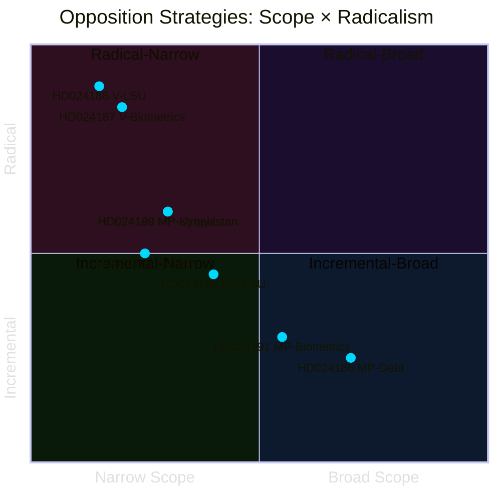
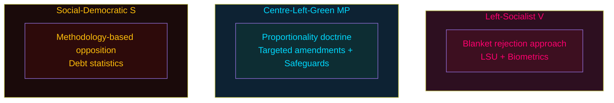

# Political Classification Results — Opposition Motions 2026-05-25

**Analysis date**: 2026-05-25

## Classification Framework

Applied: Riksdagsmonitor Political Classification Guide — ideological spectrum, policy area taxonomy, procedural type, opposition strategy type.

## Per-Document Classification

| dok_id | Policy Area | Ideological Position | Opposition Strategy | Procedural Type | DIW |
|--------|-------------|---------------------|--------------------|-----------------|----|
| HD024192 | Criminal Justice / Security Law / Fundamental Rights | Centre-Left / Green | Targeted Amendment (proportionality) | Kommittémotion | L2+ |
| HD024188 | Criminal Justice / Security Law | Left | Blanket Rejection | Kommittémotion | L2+ |
| HD024191 | Privacy / Civil Registration / Biometrics | Centre-Left / Green | Conditional Support with Safeguards | Kommittémotion | L2 |
| HD024190 | Foreign Affairs / EU External Relations | Centre-Left / Green | Rejection on Human Rights | Kommittémotion | L1 |
| HD024189 | Foreign Affairs / EU External Relations | Centre-Left / Green | Rejection on Human Rights | Kommittémotion | L1 |
| HD024188 | Privacy / Biometrics / Data Protection | Left | Blanket Rejection | Kommittémotion | L2 |
| HD024186 | Financial Statistics / Household Finance | Centre-Left / Green | Scope Expansion | Kommittémotion | L1 |
| HD024185 | Financial Statistics / Household Finance | Centre-Left | Methodology Rejection | Kommittémotion | L2 |

## Thematic Clusters

### Cluster A: Security-State Expansion (JuU) — HD024192, HD024188
- **Unifying frame**: Government expansion of exceptional security powers (LSU) erodes fundamental rights
- **Party split**: V = maximal rejection; MP = targeted proportionality defence
- **Primary document**: Prop. 2025/26:267 [Admiralty B1]

### Cluster B: Biometric/Privacy (SkU) — HD024187, HD024191
- **Unifying frame**: Purpose-creep in biometric data use violates GDPR Art. 5(1)(b) and RF 2:6
- **Party split**: V = full rejection; MP = conditional support + safeguards
- **Primary document**: Prop. 2025/26:261 [Admiralty B1]

### Cluster C: Financial Data Methodology (FiU) — HD024185, HD024186
- **S and MP** disagree on solution (rejection vs. expansion), but both oppose current government methodology
- **Primary document**: Prop. 2025/26:255 [Admiralty B2]

### Cluster D: EU External Relations (UU) — HD024190, HD024189
- **MP**: Consistent human-rights-based rejection of EU partnerships with non-democratic states
- **Primary documents**: Prop. 2025/26:248, 2025/26:249 [Admiralty B3]

## Ideological Taxonomy

