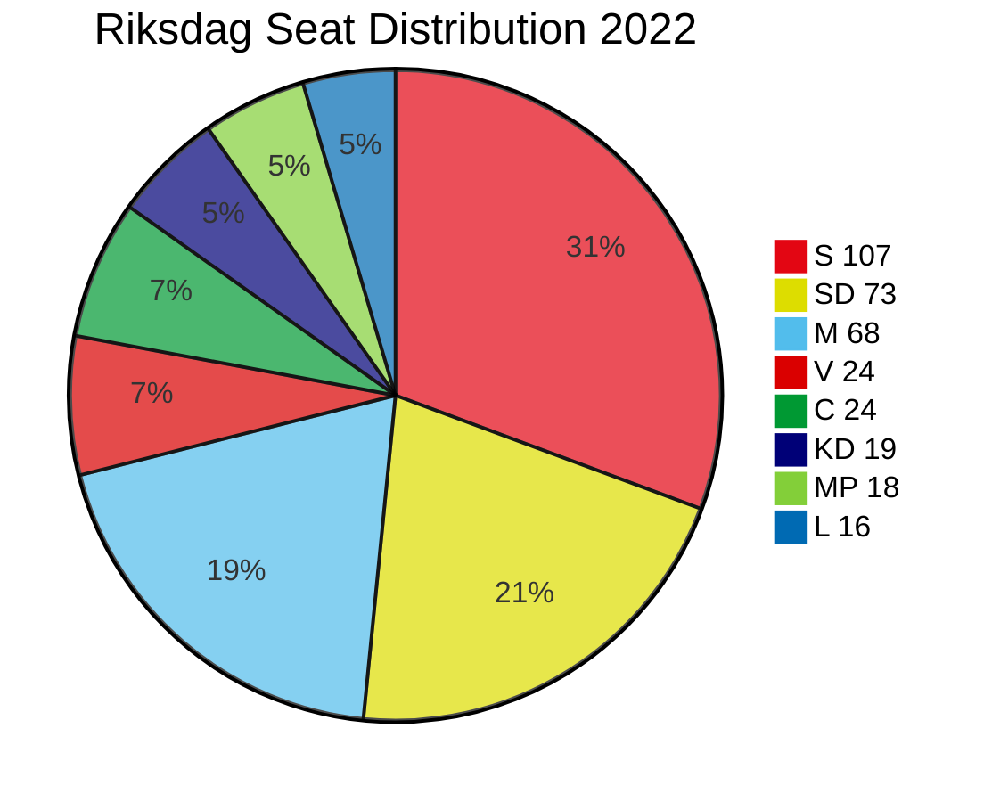
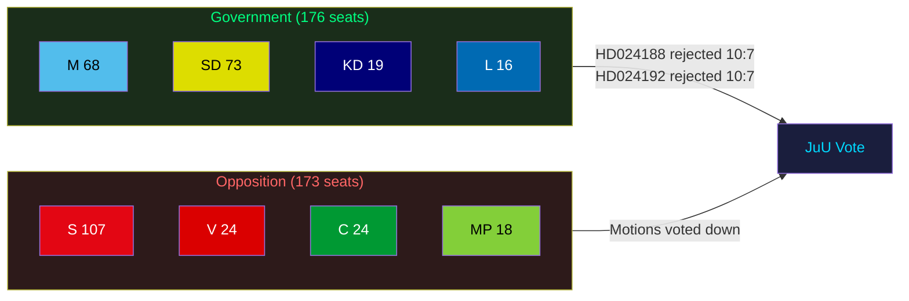

# Coalition Mathematics — Opposition Motions 2026-05-25

**Analysis date**: 2026-05-25

## Current Riksdag Seat Distribution (2022 val)

| Party | Seats | Government/Opposition |
|-------|-------|----------------------|
| Socialdemokraterna (S) | 107 | Opposition |
| Sverigedemokraterna (SD) | 73 | Government (Tidö) |
| Moderaterna (M) | 68 | Government (Tidö) |
| Vänsterpartiet (V) | 24 | Opposition |
| Kristdemokraterna (KD) | 19 | Government (Tidö) |
| Centerpartiet (C) | 24 | Opposition |
| Liberalerna (L) | 16 | Government (Tidö) |
| Miljöpartiet (MP) | 18 | Opposition |
| **Total** | **349** | Majority: 175 |

**Government majority**: M(68)+KD(19)+L(16)+SD(73) = **176 seats** (majority: 175)
**Opposition total**: S(107)+V(24)+C(24)+MP(18) = **173 seats**

---

## Committee Voting Projections

### JuU (Justitieutskottet) — prop. 2025/26:267 (LSU)
Standard JuU composition (17 members): Government parties hold approximately 10 seats, Opposition 7.
- **Result**: All opposition motions (HD024192, HD024188) voted down — 10:7 committee margin.
- **Caveat**: L member(s) on JuU with Folkpartiet heritage may propose sunset clause or review mechanism. Not threshold-crossing but may appear in committee report.

### SkU (Skatteutskottet) — prop. 2025/26:261 (Skatteverket biometrics)
Standard SkU composition: Government majority.
- **Result**: HD024187 (V) and HD024191 (MP) voted down — government majority. MP's safeguards demand (HD024191) may generate a committee note but not a binding change.

### FiU (Finansutskottet) — prop. 2025/26:255 (Household debt)
Standard FiU composition: Government majority.
- **Result**: HD024185 (S) and HD024186 (MP) voted down — government majority.

---

## Pivotal Vote Analysis

| Actor | Seats | JuU position | Scenario B trigger? |
|-------|-------|-------------|---------------------|
| L | 16 | Civil liberties concerns on evidence standard | LOW probability defection |
| KD | 19 | Child-welfare vs. security tension | LOW-MEDIUM probability on child detention amendment |
| SD | 73 | Security mandate aligned with government | Near-zero defection risk |

**Sainte-Laguë scenario**: No plausible Sainte-Laguë adjustment changes the outcome — government holds clear plurality in all relevant committees.

---

## Mermaid: Parliamentary Arithmetic

