# Comparative International Analysis — Opposition Motions 2026-05-25

**Analysis date**: 2026-05-25

## Comparator Jurisdictions

This analysis applies Outside-In methodology: how do comparable democracies handle the same security-detention vs. fundamental-rights tension addressed by the Swedish motions?

---

## Comparator 1: Germany — Aufenthaltsgesetz §58a (Security Deportation)

**Structural parallel**: German federal law §58a Aufenthaltsgesetz allows deportation of foreign nationals posing a "particular danger" to public safety — similar to Sweden's LSU architecture.

**Key difference from Swedish LSU expansion**: German law requires a judicial review (Oberverwaltungsgericht) for all §58a measures; Sweden's proposed amendment allows extended administrative detention with SÄPO as the issuing authority, subject only to Migrationsöverdomstolen review (partially classified proceedings). [B2]

**German court outcomes**: BVerwG (Federal Administrative Court) regularly reviews §58a deportation orders; reversal rate approximately 30–40% on procedural grounds. This comparator supports MP's and V's argument that Sweden's lowered evidentiary standard increases wrongful-detention risk. [Admiralty B2]

**Source**: BVerwG case law database `https://www.bverwg.de/`

---

## Comparator 2: Netherlands — Wet Bescherming Staatsgeheimen + Terrorismewet

**Parallel to biometric expansion**: Netherlands adopted biometric data sharing between immigration and civil registration authorities (BRP) in 2021 under Wet BRP art. 2.24. Dutch DPA (Autoriteit Persoonsgegevens) subsequently found GDPR Art. 5(1)(b) violations and ordered remediation. [Admiralty B1]

**Lesson for Sweden**: V's HD024187 concern about GDPR purpose-limitation is supported by Dutch precedent — Sweden faces the same enforcement trajectory from IMY if prop. 2025/26:261 passes without adequate safeguards. [B1]

**Source**: AP Netherlands 2022 investigation report `https://autoriteitpersoonsgegevens.nl/`

---

## Comparator 3: Denmark — PET Loven + Udlændingeloven

**Parallel to LSU**: Denmark's PET (Politiets Efterretningstjeneste) Act allows administrative detention of foreign nationals posing security threats without criminal charges — Denmark introduced this in 2020. Danish opposition (EL, SF) have mounted comparable parliamentary challenges.

**Divergence**: Denmark includes automatic judicial review after 72 hours for all security detentions. Sweden's proposed LSU amendment would extend detention to 6 months with review at judicial discretion. [Admiralty B2]

**Nordic precedent value**: Denmark's more protective review mechanism is the relevant Nordic benchmark. MP's yrkande 2 (HD024192 — "stärka rättssäkerheten") directly mirrors Danish procedural standards. [B2]

---

## EU Framework Dimension

The EU's updated CJEU jurisprudence on Art. 6 CFR (right to liberty) and Art. 47 CFR (effective judicial protection) increasingly constrains member-state administrative detention without prompt judicial oversight. Prop. 2025/26:267's extension of detention periods without enhanced judicial safeguards is directly relevant to Charter compliance. [Admiralty B1]

---

## Mermaid: Nordic Security Detention Comparison

```mermaid
graph TD
    subgraph SE["Sweden (Proposed — LSU 2027)"]
        SE1[Evidence: 'är särskilt påkallat'\nLowered standard]
        SE2[Detention: up to 6 months\nextendable]
        SE3[Review: Migrationsöverdomstolen\npartially classified]
    end
    subgraph DK["Denmark (Current)"]
        DK1[Evidence: 'well-founded suspicion'\nmedium standard]
        DK2[Detention: 72h max\nautomatically reviewed]
        DK3[Review: Byretten\nfull judicial oversight]
    end
    subgraph DE["Germany (§58a)"]
        DE1[Evidence: 'particular danger'\nsimilar to Swedish current]
        DE2[Deportation: expedited\nno long detention]
        DE3[Review: OVG\n30-40% reversal rate]
    end

    SE3 --> LEVEL["Assessment: Swedish proposal\nexceeds EU/Nordic peers\nin detention scope"]
    DK3 --> LEVEL
    DE3 --> LEVEL

    style SE fill:#006aa7,color:#ffcd00
    style DK fill:#c60c30,color:#ffffff
    style DE fill:#000000,color:#ffcc00
    style LEVEL fill:#2d0f20,color:#ff006e
    style SE1 fill:#004d7a,color:#ffcd00
    style SE2 fill:#004d7a,color:#ffcd00
    style SE3 fill:#004d7a,color:#ffcd00
    style DK1 fill:#8c0820,color:#ffffff
    style DK2 fill:#8c0820,color:#ffffff
    style DK3 fill:#8c0820,color:#ffffff
    style DE1 fill:#333333,color:#ffcc00
    style DE2 fill:#333333,color:#ffcc00
    style DE3 fill:#333333,color:#ffcc00
```

