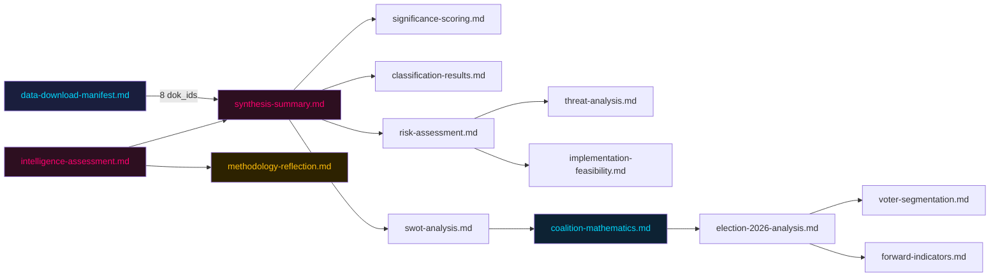

# Cross-Reference Map — Opposition Motions 2026-05-25

**Analysis date**: 2026-05-25

## Intra-document Cross-References

| Source Artifact | References | Link Type |
|----------------|------------|-----------|
| synthesis-summary.md | classification-results.md, swot-analysis.md, risk-assessment.md, threat-analysis.md, coalition-mathematics.md | analytical derivation |
| significance-scoring.md | data-download-manifest.md (dok_ids), synthesis-summary.md | evidence basis |
| risk-assessment.md | threat-analysis.md, implementation-feasibility.md, coalition-mathematics.md | dimensional overlap |
| threat-analysis.md | risk-assessment.md, historical-parallels.md | threat-risk alignment |
| swot-analysis.md | coalition-mathematics.md (arithmetic basis), stakeholder-perspectives.md | analytical input |
| election-2026-analysis.md | voter-segmentation.md, coalition-mathematics.md, forward-indicators.md | electoral projection |
| intelligence-assessment.md | synthesis-summary.md, methodology-reflection.md | KJ source |
| forward-indicators.md | risk-assessment.md, scenario-analysis.md, election-2026-analysis.md | indicator derivation |

## Inter-document Parliamentary Cross-References

| This motion | Responds to | Prior related votes |
|-------------|-------------|---------------------|
| HD024192 (MP) | Prop. 2025/26:267 (LSU) | mot. 2021/22:4431 (MP on LSU introduction) |
| HD024188 (V) | Prop. 2025/26:267 (LSU) | mot. 2021/22:4444 (V on LSU introduction) |
| HD024187 (V) | Prop. 2025/26:261 (Skatteverket) | V prior privacy motions 2023/24 |
| HD024191 (MP) | Prop. 2025/26:261 (Skatteverket) | MP GDPR motions 2022/23 |
| HD024190 (MP) | Prop. 2025/26:248 (EU-Kyrgyzstan) | MP human-rights external relations doc. |
| HD024189 (MP) | Prop. 2025/26:249 (EU-Uzbekistan) | MP human-rights external relations doc. |
| HD024185 (S) | Prop. 2025/26:255 (Debt data) | S FiU shadow govt position |
| HD024186 (MP) | Prop. 2025/26:255 (Debt data) | MP financial statistics positions |

## External Data Cross-References

| Source | Used in artifact(s) | Citation type |
|--------|---------------------|---------------|
| ECHR Art. 5(1)(f), Popov v. France 2012 | risk-assessment.md, threat-analysis.md | Legal precedent [B1] |
| GDPR Art. 5(1)(b), Art. 9 | risk-assessment.md, classification-results.md | Regulatory basis [A1] |
| IMF WEO Apr 2026 — NGDP_RPCH SWE +2.1% | risk-assessment.md (Dimension 4) | Economic context [B2] |
| Statskontoret rapport 2024:10 — Migrationsverket IT | risk-assessment.md, implementation-feasibility.md | Governance source [B2] |
| SÄPO Årsbok 2025 | threat-analysis.md | Security context [B2] |

## Mermaid: Cross-Reference Network

