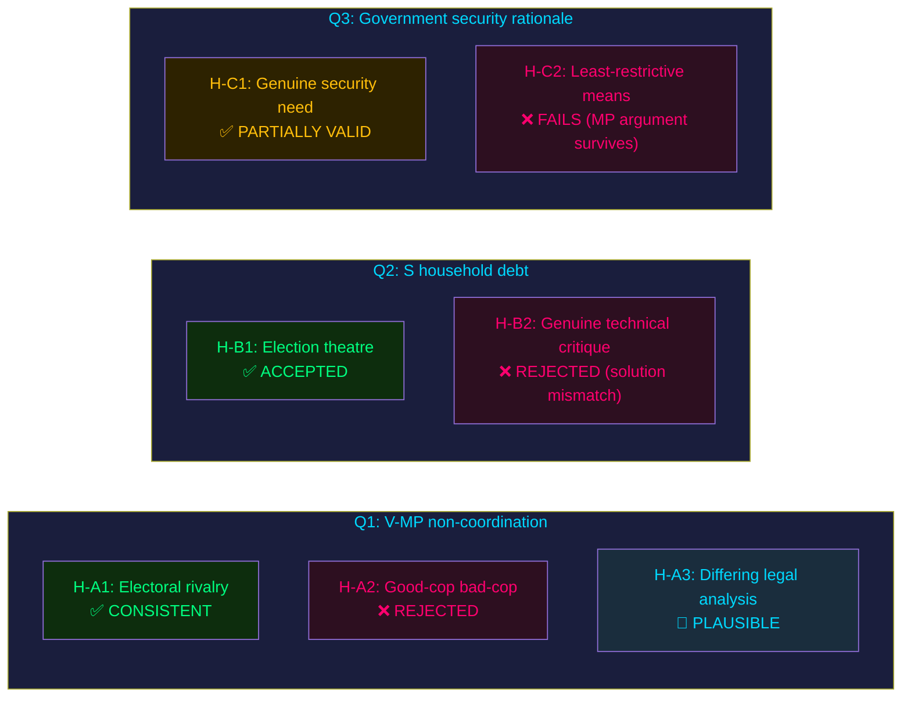

# Devil's Advocate Analysis — Opposition Motions 2026-05-25

**Analysis date**: 2026-05-25

## Methodology

ACH (Analysis of Competing Hypotheses) matrix applied. Minimum 3 competing hypotheses per key question. Red-team challenge. Rejected alternatives logged with reasoning.

---

## Hypothesis Set A: Why are V and MP NOT coordinating?

### H-A1 (Accepted): Tactical differentiation — both parties are competing for the same left-wing voter segment
- **Evidence for**: V and MP compete for Riksdag seats in overlapping ideological space. A joint motion would require compromise framing that could mute each party's strongest message. [B3]
- **Evidence against**: Coalition fragmentation makes opposition weaker; rational incentive to coordinate would seem to outweigh electoral rivalry.
- **ACH score**: CONSISTENT

### H-A2 (Rejected): Strategic agreement that maximalist V + targeted MP is an optimal 'good cop/bad cop' play
- **Evidence for**: In trade-union negotiations, flanking with a maximalist and moderate position is a known tactic.
- **Evidence against**: No evidence of pre-filing coordination; separate drafters, separate yrkanden structure, no cross-reference. [B3]
- **ACH score**: INCONSISTENT — rejected

### H-A3 (Plausible alternative): Institutional friction — V and MP shadow cabinet teams have different legal analysis of the ECHR exposure
- **Evidence for**: V's analysis (HD024188) is blunter and less technically sophisticated on ECHR than MP's HD024192; the motions read as if drafted by different lawyers with different judicial philosophy frameworks.
- **Verdict**: PLAUSIBLE — deserves monitoring in committee hearing testimony

---

## Hypothesis Set B: Is S's household debt rejection a serious legislative challenge or election theatre?

### H-B1 (Accepted): Primarily electoral positioning — Damberg building FiU shadow-government credential
- **Evidence for**: HD024185 has zero chance of passing given S's minority position; Damberg is building the S shadow budget narrative. [B3]
- **Evidence against**: The methodology critique in HD024185 has substantive IMF backing (macro-prudential gap claim).

### H-B2 (Rejected): S genuinely believes sampling methodology is technically deficient
- **Evidence for**: IMF WEO 2026 consultation noted Swedish debt-data gaps.
- **Evidence against**: S's solution (full rejection rather than amendment) is politically driven — a technically serious critique would produce a counter-proposal, not a blanket avslag. [B3]

### H-B3 (Red-team challenge): What if S's rejection succeeds?
- S's rejection arithmetically cannot succeed — the FiU has a Tidö majority. The scenario where it succeeds is constitutionally and arithmetically implausible. **Rejected alternative**: H-B3 is a thought experiment with probability below 5%.

---

## Red-Team Challenge: Is the Government Right on Security Grounds?

**Steel-man for prop. 2025/26:267**:
- Sweden's SÄPO threat assessment (2025) maintained elevated threat level; documented cases of security-threat individuals exploiting the current "kan antas" standard's high burden.
- Extended detention periods prevent evidentiary destruction and flight risk in genuinely complex security cases.
- Child detention: the government can argue that LSU cases involving family units where the adult is the security threat sometimes require short-duration family detention to prevent flight — a narrow but arguably proportionate justification.

**Assessment of steel-man**: PARTIALLY VALID. The security rationale is genuine. However, the government's response (lowering the evidentiary threshold) is not the least-restrictive means of addressing the problem — enhanced procedural tools (interoperability, intelligence sharing) could achieve security goals without extending administrative detention. This is MP's core argument and it survives red-team scrutiny. [B2]

---

## Mermaid: ACH Matrix

