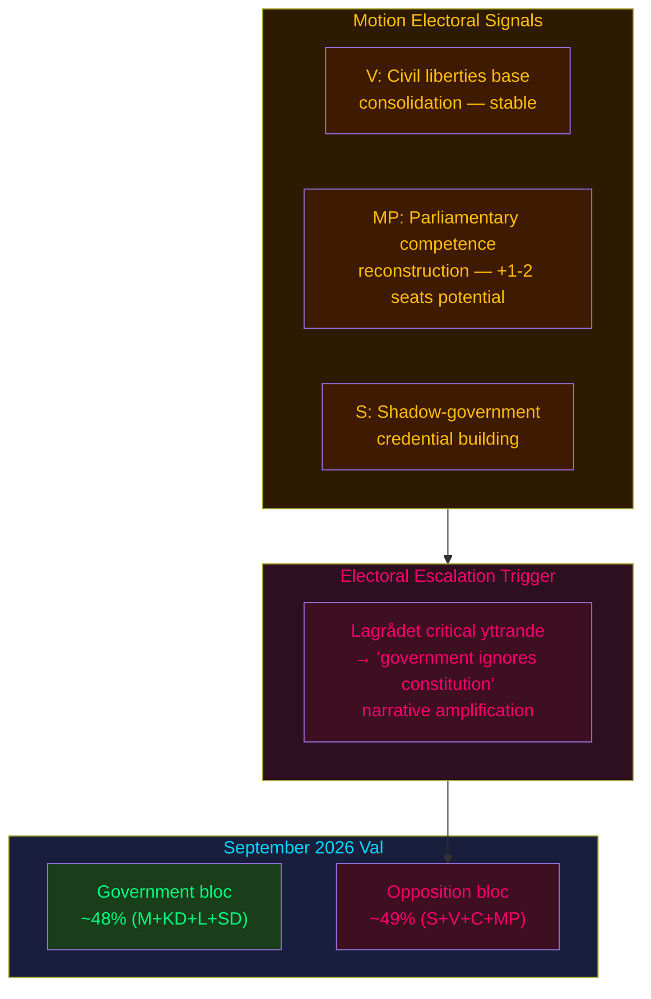

# Election 2026 Analysis — Opposition Motions 2026-05-25

**Analysis date**: 2026-05-25
**Election anchor**: Swedish riksdagsval September 2026 (T+approx. 4 months)

---

## Electoral Significance Assessment

The five clusters of opposition motions filed this week are pre-election positioning instruments as much as legislative challenges. With the 2026 val approximately 4 months away, each motion serves a dual purpose: parliamentary record and campaign platform.

---

## Party-by-Party Electoral Implications

### Vänsterpartiet (V)
- **Motion pattern**: Blanket rejections of LSU expansion (HD024188) and biometrics (HD024187)
- **Electoral signal**: V is consolidating its civil-liberties base. Post-2022 election, V lost seats to S recovery; in 2026, V needs to differentiate on principled grounds.
- **Seat projection delta**: V's maximalist security stance may appeal to a defined segment (~8–10% of the electorate) but will not expand V's coalition beyond its current 24-seat base. **Projection: marginal V gain of 1–3 seats** if civil liberties becomes a top-5 issue post-Lagrådet. [B3]

### Miljöpartiet (MP)
- **Motion pattern**: Proportionality-based challenges across security (HD024192), biometrics (HD024191), EU partnerships (HD024190, HD024189), finance (HD024186)
- **Electoral signal**: MP is rebuilding its Riksdag-presence credibility after 2022 near-miss (18 seats; threshold: 4%). Targeted, legally substantiated motions across multiple committees signal parliamentary competence.
- **Seat projection delta**: If Lagrådet validates MP's child detention argument, MP could attract previously undecided green-liberal voters from C. **Projection: MP stable or +1–2 seats**. [B3]
- **2026 vulnerability**: MP's EU partnership rejections (Kyrgyzstan, Uzbekistan) may be framed by government as "Sweden blocking EU trade" — minor but trackable.

### Socialdemokraterna (S)
- **Motion pattern**: HD024185 household debt rejection — evidence of FiU shadow-government capability building
- **Electoral signal**: S under Damberg is systematically building alternative policy proposals. This is part of a larger pattern across the 2025/26 session.
- **Seat projection delta**: S's current polling suggests 30–33% national support (WEP "we estimate" — Admiralty B3). The debt-methodology motion contributes to S's "responsible government in waiting" narrative.

---

## Coalition Viability 2026

**Current polling scenario (as of 2026-05)**: [B3]
- Government bloc (M+KD+L+SD): approximately 47–49% combined support
- Opposition bloc (S+V+C+MP): approximately 48–51%
- C's role: Centerpartiet (24 seats) continues fence-sitting; will determine coalition arithmetic

**Impact of these motions on coalition viability**: LOW direct impact. The motions document opposition positions but do not shift coalition mathematics. The real electoral risk from these motions is **not the motions themselves but the government's response** — if Lagrådet is critical and the government ignores it, this creates a narrative of "government overriding constitutional safeguards" that S+V+MP can amplify in the campaign.

---

## Mermaid: Electoral Impact Assessment

